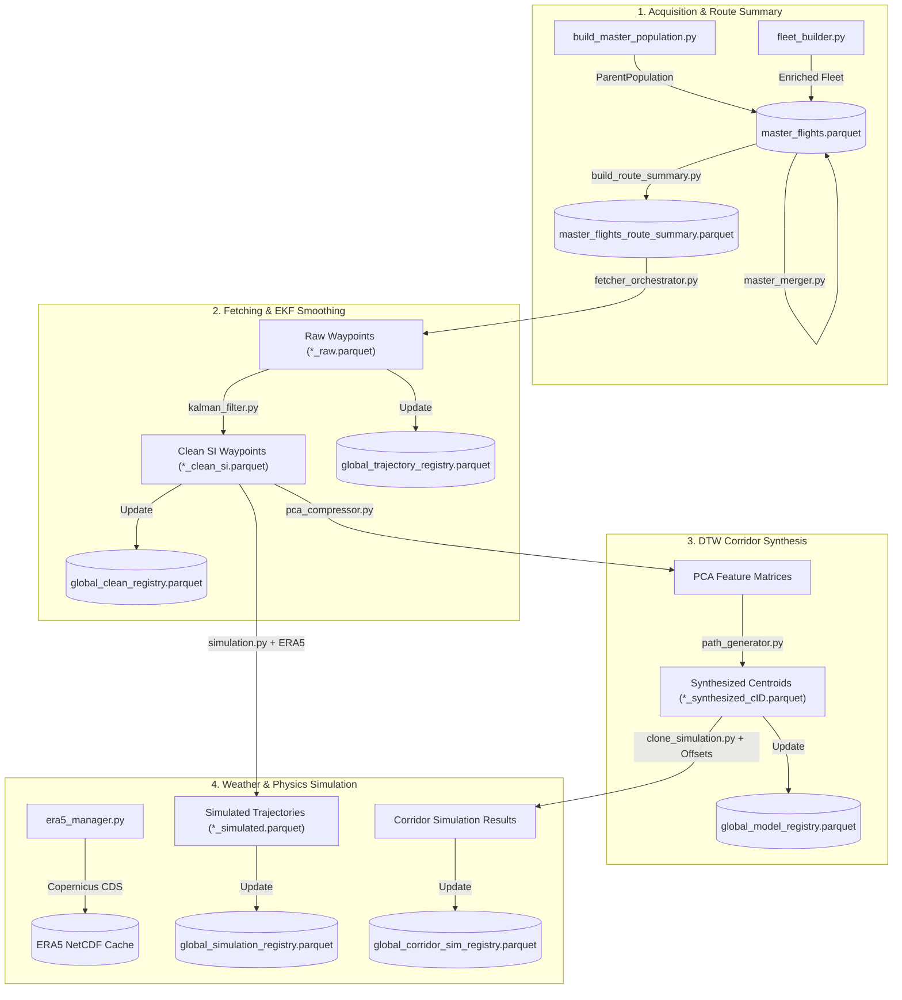

# Flight Physics & Contrail Simulation Pipeline

A high-performance Python framework for acquiring European ADS-B flight trajectories, performing Extended Kalman Filter (EKF) smoothing, executing Dynamic Time Warping (DTW) corridor path synthesis, downloading Copernicus ERA5 weather reanalysis data, and simulating aircraft fuel burn and contrail radiative forcing ($\Delta \text{RF}$) using PSFlight and CoCiP models.

---

## 1. Pipeline Architecture & Data Workflow



---

## 2. Quickstart & Environment Setup

### Prerequisites
- **Python**: 3.10 – 3.12
- **Package Manager**: [`uv`](https://github.com/astral-sh/uv) (recommended) or standard `pip`

### Installation

```bash
# Clone the repository
git clone https://github.com/Bauzement123/flight-physics-pipeline.git
cd flight-physics-pipeline

# Create virtual environment and install dependencies
uv venv .venv
source .venv/bin/activate  # On Windows: .venv\Scripts\activate
uv pip install -r requirements.txt
```

---

## 3. Offline Data Initialization

Seed aircraft database files required for offline fleet enrichment are hosted on the GitHub Release asset repository:

1. Download the seed files from [Release v1.0.0-seed-data](https://github.com/Bauzement123/flight-physics-pipeline/releases/tag/v1.0.0-seed-data):
   - `openairframes_adsb_2024-01-01_2026-02-23.csv.gz` (~1.09 GB)
   - `aircraft-database-complete-2025-08.csv.gz` (~19.1 MB)
   - `doc8643AircraftTypes.csv` (~695 KB)
2. Place the downloaded files under `data/databases/aircraft_db/`.

All downstream databases (`master_flights.parquet`, `master_flights_route_summary.parquet`, `airport_coordinates.json`) are generated dynamically by running the 4-step acquisition pipeline.

---

## 4. Execution Workflow Guide

### Step 1: Master Population & Route Summary Acquisition

```powershell
# 1. Build master flight schedule population from raw OpenSky ADS-B runs
python -m src.core.acquisition.build_master_population

# 2. Build enriched aircraft fleet database
python -m src.core.acquisition.fleet_builder

# 3. Merge flight schedule and fleet databases into master_flights.parquet
python -m src.core.acquisition.master_merger

# 4. Generate geodesic route summary rankings and distance metrics
python -m src.core.acquisition.build_route_summary
```

### Step 2: OpenSky Trajectory Fetching & EKF Smoothing

```powershell
# Fetch raw trajectory waypoints for target route ranks (e.g., top 1-5 popular corridors)
python -m src.core.fetching.fetcher_orchestrator --ranks 1 2 3 4 5 --max-workers 8

# Smooth raw waypoints via Extended Kalman Filter (SI units output)
python -m src.core.processing.kalman_filter --ranks 1 2 3 4 5 --max-workers 8
```

### Step 3: Corridor PCA Compression & DTW Path Synthesis

```powershell
# Compress clean trajectory features using Principal Component Analysis
python -m src.core.corridor.pca_compressor --ranks 1 2 3 4 5

# Generate DTW route centroids and temporal-grid baselines
python -m src.core.corridor.path_generator --ranks 1 2 3 4 5
```

### Step 4: Weather Download & Physics Contrail Simulation

```powershell
# Pre-download ERA5 weather reanalysis NetCDFs for European bounding box
python -m src.core.weather.era5_manager --year 2025 --month 7

# Run PSFlight performance and PyContrails CoCiP contrail simulation
python -m src.core.physics.simulation --ranks 1 2 3 4 5 --max-workers 8

# Clone synthetic corridor centroid paths across temporal flight schedule
python -m src.core.physics.clone_simulation --ranks 1 2 3 4 5
```

---

## 5. Devtools & Utilities

The `src/devtools/` directory contains operational and developer utilities:

- **`trajectory_manager`** (`python -m src.devtools.trajectory_manager`):
  - `pack --type {raw,clean,both}` — Backup loose single-flight Parquets into cohort archives (`*_all_raw.parquet` / `*_all_clean.parquet`).
  - `unpack --type {raw,clean,both}` — Restore single-flight Parquets from batch archives for flights missing on disk.
  - `relabel` — Re-apply OpenAP flight phase labels to raw trajectories.
- **`build_global_manifest`** (`python -m src.common.build_global_manifest`):
  - Rebuilds or syncs global Parquet registries (`global_trajectory_registry.parquet`, `global_clean_registry.parquet`, `global_simulation_registry.parquet`, `global_model_registry.parquet`).
- **`find_dependencies`** (`python -m src.devtools.find_dependencies`):
  - Scans import statements across `src/` and verifies environment package versions.

---

## 6. Domain Conventions & Standards

- **UTC Timezone Standard**: All trajectory timestamps and hourly weather partitions are processed in timezone-naive UTC.
- **Physical Units Standard**: Raw aviation inputs (feet, knots, fpm) are converted to SI units (meters, m/s) during EKF smoothing and saved on disk in SI units.
- **Geographical Bounding & US Airport ICAO Schema**:
  - European airports use standard 4-letter ICAO location indicators (e.g. `EDDF`, `LEBL`, `EGLL`).
  - US airports in raw OpenSky/ADS-B data often use IATA 3-letter codes prefixed with `K` (e.g. `KJFK`, `KLAX`), breaking standard 4-letter ICAO region-prefix schemas. The pipeline enforces explicit geographical bounding boxes (`EUR_LAT_MIN/MAX`, `EUR_LON_MIN/MAX`) and airport whitelists (`DEFAULT_AIRPORT_PREFIXES`) rather than relying on raw 4-letter ICAO schema assumptions.

---

## 7. Open Research Roadmap (GitHub Wiki)

Consult the project Wiki for open research TODOs and extension modules:

- **Hydrogen Propulsion Simulation** (`hydrogen_simulation.py`): Hydrogen fuel mass/volume trade-off & non-$CO_2$ warming profiles.
- **Variational Contrail Avoidance Engine**: Iterative Flight Level step-down (FL380 → FL360 → FL340) to eliminate persistent contrail formation.
- **Fleet Eco-Efficiency Campaign Analysis**: Quantitative trade-off analysis between fuel burn penalty ($\Delta \text{Fuel}$) vs. Radiative Forcing reduction ($\Delta \text{RF}$).
- **Optional GPU DTW Acceleration**: PyTorch/CUDA tensor acceleration for corridor clustering with CPU multiprocessing fallback.
