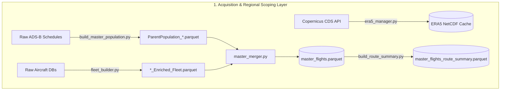
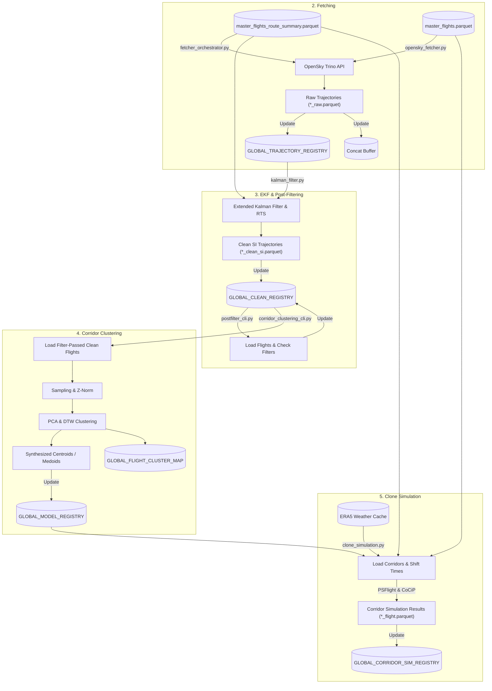

# Flight Physics & Contrail Simulation Pipeline

A high-performance Python framework for acquiring European ADS-B flight trajectories, performing Extended Kalman Filter (EKF) smoothing, executing Dynamic Time Warping (DTW) corridor path synthesis, downloading Copernicus ERA5 weather reanalysis data, and simulating aircraft fuel burn and contrail radiative forcing ($\Delta \text{RF}$) using PSFlight and CoCiP models.

---

## 1. Pipeline Architecture & Data Workflow

### Part 1: Acquisition & Route Summary



**Regional Scoping & Airport Indicators:**
Before any code is executed, one ideally a´has already identified a temporal, geographical scope, and a list of icao aircraft types. 
Depending on the geographical scope appropriate starting letters for the ICAO Loc indicators can be choosen for the generation of the ParentPopulation, from these airports a bounding box can be generated such that any outliers are removed and do not show up in the Master flights parquet.
After this Phase their should be a Master_flights.parquet and a summary, as well as a bounding box in the config. 
It usually makes sense to execute the merge and summary step twice once without a bounding box to populate the airports cache and then execute verify map to find the bounding box and then get the proper master flights and summery with the bounding box

> [!WARNING]
> **Note on Airport Indicators (America):** When querying `flightdata4/trino` for North American regions, many flights are recorded using three- to five-character alphanumeric **FAA location identifiers** (FAA LIDs) instead of standard 4-letter **ICAO identifiers**. The pipeline's departure/arrival prefix filters and downstream location merging logic must account for this discrepancy when scoping non-European simulations.

### Part 2: Calibration & Data Quality Phase
Before actually starting with the simulation pipeline where we simulate all the flown trajectories on a route by extracting K-Clusters from a subset of all flown trajectories. We need to ensure the Data Quality is high enough so that the Clusters are actually a physical representation of the actual route clustering.
Hence a Phase Quality module has been implemented that allows us to identify prefiltering paramters in master_flights_summary, and postfiltering paramters on actual fetched and cleaned trajectories, I tried to implement the post filtering such that new filters can be easily added.

- **Trajectory Overfetching**: A small subset of trajectories where we expect the data quality to be poor are overfetched from the OpenSky Trino API. Data Quality can be poor either from poor OpenSky coverage, or from overcrowding around large airports.
- **Filter Evaluation**: The raw data is passed through the `kalman_filter`
- **Quality analysis**: Execute upon the 2 stages in src\analysis\campaigns\phase_quality module as is explained in src\analysis\campaigns\phase_quality\README.md to identify suitable parameters for the config.py

### Part 3: The Main Waterfall Pipeline (Fetching to Simulation)
This is the actual heart of the code, we fetch routes from trino with the desired prefilters as decided in config, clean them, update the registries with the postfilter checks, generate clusters ,and simulate them. 



---

## 2. Quickstart & Environment Setup

### Prerequisites
- **Python**: 3.10 – 3.12
- **Package Manager**: [`uv`](https://github.com/astral-sh/uv) (recommended) or standard `pip`

### Installation

```bash
# Clone the repository
git clone https://github.com/Bauzement123/flight-physics-pipeline.git
cd flight-physics-pipeline

# Create virtual environment and install dependencies
uv venv .venv
source .venv/bin/activate  # On Windows: .venv\Scripts\activate
uv pip install -r requirements.txt
```

---

## 3. Offline Data Initialization

Seed aircraft database files required for offline fleet enrichment are hosted on the GitHub Release asset repository:

1. Download the seed files from [Release v1.0.0-seed-data](https://github.com/Bauzement123/flight-physics-pipeline/releases/tag/v1.0.0-seed-data):
   - `openairframes_adsb_2024-01-01_2026-02-23.csv.gz` (~1.09 GB)
   - `aircraft-database-complete-2025-08.csv.gz` (~19.1 MB)
   - `doc8643AircraftTypes.csv` (~695 KB)
2. Place the downloaded files under `data/databases/aircraft_db/`.

All downstream databases (`master_flights.parquet`, `master_flights_route_summary.parquet`, `airport_coordinates.json`) are generated dynamically by running the 4-step acquisition pipeline.

---

## 4. Execution Workflow Guide

### Step 1: Master Population & Route Summary Acquisition

```powershell
# 1. Build master flight schedule population from raw OpenSky ADS-B runs
python -m src.core.acquisition.build_master_population --start-date 2025-01-01 --end-date 2025-01-31

# 2. Build enriched aircraft fleet database
python -m src.core.acquisition.fleet_builder

# 3. Merge flight schedule and fleet databases into master_flights.parquet
python -m src.core.acquisition.master_merger

# 4. Generate geodesic route summary rankings and distance metrics
python -m src.core.acquisition.build_route_summary
```

### Step 2: OpenSky Trajectory Fetching, EKF & Post-Filtering

```powershell
# Fetch raw trajectory waypoints for target route ranks (e.g., top 1 to 5 popular routes)
python -m src.core.fetching.fetcher_orchestrator `
  --lower-rank 1 `
  --upper-rank 5 `
  --strategy fixed `
  --value 50 `
  --seed 42

# Smooth raw waypoints via Extended Kalman Filter (SI units output)
python -m src.core.processing.kalman_filter --rank-range 1 5 --max-workers 4

# Run Post-Filter evaluation on cleaned SI trajectories
python -m src.core.processing.postfilter_cli --rank-range 1 5 --max-workers 4
```

### Step 3: Corridor Clustering

```powershell
# Perform Sampling, Z-Norm, PCA and DTW Medoid Clustering
python -m src.core.corridor.corridor_clustering_cli `
  --rank-range 1 5 `
  --require-pass velocity coordinate_velocity acceleration distance `
  --threads-per-worker 2
```

### Step 4.1: Weather Download 
Arbitrarily designated step 4.1, can be executed whenever before step 4.2. Depending on the goals it makes the most sense to execute it once the temporal range is set, which might be something that only becomes clear once the data quality is set. 
It also may be noted that the era5_manager as is currently programed does not take account of the bounding box, hence as is a check has to be made if this data accquisition step is a bottleneck for the desired simulation 

```powershell
# Pre-download ERA5 weather reanalysis NetCDFs for European bounding box
python -m src.core.weather.era5_manager --start 2025-01-01 --end 2025-01-31
```

### Step 4.2: Simulation
resolves the ranks via the summary, clones the medoids to the firstseen timestamp and simulates them
```powershell
# Clone synthetic corridor centroid paths across temporal flight schedule (PSFlight & CoCiP)
python -m src.core.physics.clone_simulation --lower-rank 1 --upper-rank 5 --max-workers 8
```

---

## 5. Devtools & Utilities

The `src/devtools/` directory contains operational and developer utilities:

- **`trajectory_manager`** (`python -m src.devtools.trajectory_manager`):
  - `pack --type {raw,clean,both}` — Backup loose single-flight Parquets into cohort archives (`*_all_raw.parquet` / `*_all_clean.parquet`).
  - `unpack --type {raw,clean,both}` — Restore single-flight Parquets from batch archives for flights missing on disk.
  - `relabel` — Re-apply OpenAP flight phase labels to raw trajectories.
- **`find_dependencies`** (`python -m src.devtools.find_dependencies`):
  - Scans import statements across `src/` and verifies environment package versions.
- **`build_global_manifest`** (`python -m src.common.build_global_manifest`):
  - Rebuilds or syncs global Parquet registries (`global_trajectory_registry.parquet`, `global_clean_registry.parquet`, `global_simulation_registry.parquet`, `global_model_registry.parquet`).
---

## 6. Domain Conventions & Standards

- **UTC Timezone Standard**: All trajectory timestamps and hourly weather partitions are processed in timezone-naive UTC. 
Note: When we call trino trino outputs them as timezone aware with +00 hence the only time they are not timezone naive is in the fetcher, after being written to memory they are however timezone naive.
- **Physical Units Standard**: 
PyOpenSky and Pycontrails work with SI units, however traffic and OpenAP work with Aviation units (feet, knots, fpm), meaning when a traffic function needs to be used utilize the appropriate adapters.
Example for that is the Kallmannfilter
- **Geographical Bounding & US Airport ICAO Schema**:
  - Since ICAO Location Indicators are built in a way where the first letter is for a region first 2 letters for a country the list of `DEFAULT_AIRPORT_PREFIXES` is the key regional identifier. filtering out outliers as described in Part 1, is however essential.
  - The Bounding Box is also essential as it is what allows in memory cropping off the weather data reducing the Memory overhead for the simulation to about 1GB instead of 4GB.
---

## 7. Open Research Roadmap (GitHub Wiki)

Consult the project Wiki for open research TODOs and extension modules:

- **Hydrogen Propulsion Simulation** (`hydrogen_simulation.py`): 
  - Ideally via researching the parameters so we can insert a Engine UID into PSFLight, or via forcing PSFLight and CoCIp to use the Hydrogine fuel and a custom nvpm_i 
- **Variational Contrail Simulation Engine**: 
  -  Reding in flights from either simulation registry with a positive total RF impact. and doing a variational campaign on their Flight Level
  - Since the vectorized simulation run is efficient it might make sense to bulk simulate a suite of FLs imeadatly 
  - alternativly we could first find bounds with a binary search, since we below 6km it is very hard for contrails to form. 
- **Fleet Eco-Efficiency Campaign Analysis**: Quantitative trade-off analysis between fuel burn penalty ($\Delta \text{Fuel}$) vs. Radiative Forcing reduction ($\Delta \text{RF}$).
- **Optional GPU DTW Acceleration** (Low Priority): PyTorch/CUDA tensor acceleration for corridor clustering with CPU multiprocessing fallback.
- **EKF upgrade** It might make sense to have the conversion of lat lon to x y as part of the EKF so that long haul flights dont have conversion artifacts 3d (curvelinear-koordinates)-> 3d Eucliden -> 3d (curvlinear coordinates)
