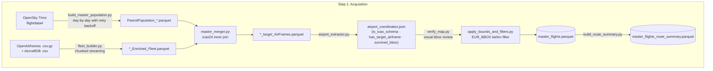
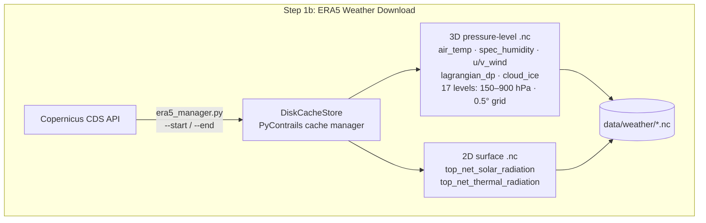
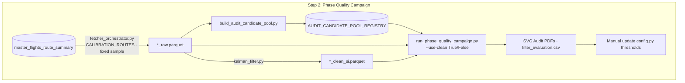
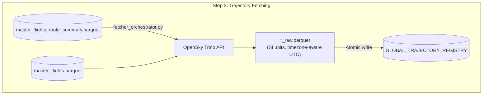
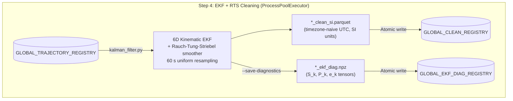
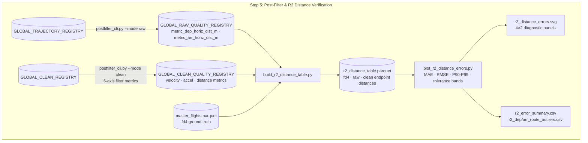
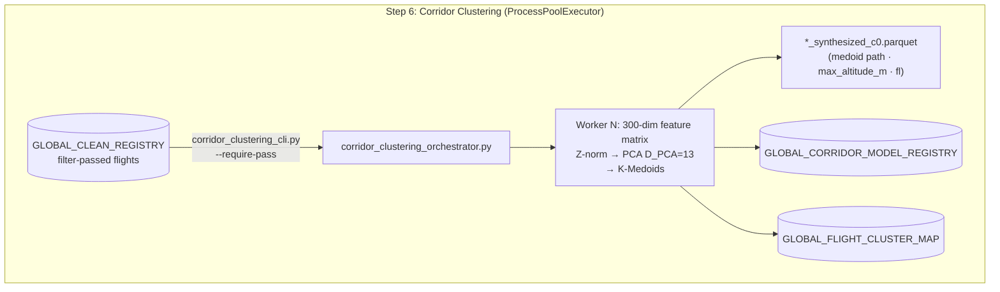
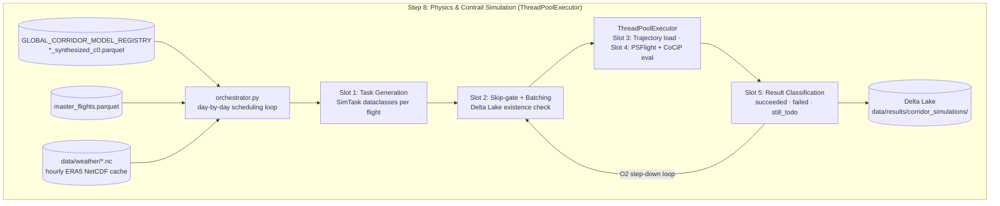

# Flight Physics & Contrail Simulation Pipeline

A high-performance Python framework for acquiring European ADS-B flight trajectories, calibrating data quality thresholds, performing Extended Kalman Filter + Rauch-Tung-Striebel (EKF+RTS) trajectory smoothing, evaluating post-filter quality metrics, synthesizing route corridor medoid paths via K-Medoids clustering, downloading Copernicus ERA5 weather reanalysis data, and simulating aircraft fuel burn and contrail radiative forcing ($\Delta \text{RF}$) using PSFlight and CoCiP models.

---

## 1. Pipeline Architecture & Data Workflow

The pipeline executes as a linear sequence of 8 steps. Step 2 (Overfetching & Phase Quality Calibration) is a prerequisite that must complete before Step 3, as it establishes the pre-filter and post-filter thresholds used throughout the main pipeline. Step 7 (ERA5 Weather Download) is independent and can run from Step 1 onwards.

### Step 1 — Acquisition


```mermaid
flowchart TD
    subgraph Acquisition ["Step 1: Acquisition"]
        A1["OpenSky Trino\nflightdata4"] -->|"build_master_population.py\nday-by-day with retry backoff"| A2["ParentPopulation_*.parquet"]
        B1["OpenAirframes .csv.gz\n+ AircraftDB .csv"] -->|"fleet_builder.py\nchunked streaming"| B2["*_Enriched_Fleet.parquet"]
        A2 --> M["master_merger.py\nicao24 inner join"]
        B2 --> M
        M --> C["*_target_AirFrames.parquet"]
        C -->|airport_extractor.py| AX["airport_coordinates.json\n(is_icao_schema · has_target_airframe · survived_bbox)"]
        AX -->|"verify_map.py\nvisual bbox review"| BF["apply_bounds_and_filters.py\nEUR_BBOX lat/lon filter"]
        BF --> D[("master_flights.parquet")]
        D -->|build_route_summary.py| E[("master_flights_route_summary.parquet")]
    end
```

Before executing this step, identify the target temporal range, geographic scope, and ICAO aircraft typecode families. Set `DEFAULT_AIRPORT_PREFIXES` in `config.py` to scope the region (e.g. `["B", "E", "L"]` for European ICAO prefixes).

`airport_extractor.py` resolves and caches airport coordinates from the merged target airframe dataset, then annotates each airport with three boolean metadata flags (`is_icao_schema`, `has_target_airframe`, `survived_bbox`) used by `apply_bounds_and_filters.py` to enforce the European bounding box.

> [!TIP]
> After running `airport_extractor.py`, use `python -m src.analysis.plotting.verify_map` to visually inspect the airport distribution and confirm or refine your bounding box choice. Once satisfied, update `EUR_LAT_MIN/MAX` and `EUR_LON_MIN/MAX` in `config.py`, then run `apply_bounds_and_filters.py` and `build_route_summary.py` to produce the final scoped outputs.

> [!WARNING]
> **North American Regions:** When querying `flightdata4/trino` for North American corridors, many flights are recorded using three- to five-character alphanumeric **FAA location identifiers** (FAA LIDs) instead of standard 4-letter **ICAO identifiers**. The pipeline's departure/arrival prefix filters must account for this discrepancy.

---

### Step 1b — ERA5 Weather Download *(independent — start any time after dates are known)*


```mermaid
flowchart TD
    subgraph Weather ["Step 1b: ERA5 Weather Download"]
        CDS["Copernicus CDS API"] -->|"era5_manager.py\n--start / --end"| DL["DiskCacheStore\nPyContrails cache manager"]
        DL --> NC3D["3D pressure-level .nc\nair_temp · spec_humidity · u/v_wind\nlagrangian_dp · cloud_ice\n17 levels: 150–900 hPa · 0.5° grid"]
        DL --> NC2D["2D surface .nc\ntop_net_solar_radiation\ntop_net_thermal_radiation"]
        NC3D & NC2D --> WD[("data/weather/*.nc")]
    end
```

`era5_manager.py` downloads hourly ERA5 reanalysis NetCDF files **globally** — no geographic bounding box is passed to the CDS API. The bounding box cropping happens later inside `orchestrator.py` at simulation time, not here. Two datasets are fetched sequentially per time window:

- **3D pressure-level fields**: temperature, specific humidity, u/v wind components, vertical pressure tendency, specific cloud ice water content — at 17 pressure levels from 900 hPa to 150 hPa at 0.5° grid resolution.
- **2D surface fields**: top-of-atmosphere net solar and thermal radiation (used by CoCiP for radiative forcing).

Already-cached files are skipped automatically via `DiskCacheStore`. Corrupted `.nc` files are detected, deleted, and re-downloaded with up to 5 retry attempts before aborting. Must complete before Step 8.

> [!IMPORTANT]
> ERA5 data is cached globally, so the same download covers any corridor in any region. Verify that the temporal range (`--start` / `--end`) fully covers your simulation date range before running Step 8 — there is no partial-fill fallback.

---

### Step 2 — Overfetching & Phase Quality Calibration

This step is a **prerequisite for Steps 3–6** and is fundamentally exploratory — a manual investigation into how the dataset breaks before bulk processing begins. The goal is to emerge with empirically validated threshold constants committed to `config.py`.

Start by selecting your **calibration routes**: 6 representative corridors from `master_flights_route_summary.parquet`, ideally spanning short, medium, and long-haul distances across hub and regional airports. Commit them as `CALIBRATION_ROUTES` in `config.py`. Then **fetch and EKF-clean a small fixed-sample cohort** on those routes (see Steps 3 and 4 for the full procedure — use the same CLI but target only the calibration routes):

```powershell
# Overfetch calibration cohort (small fixed sample on calibration routes only)
python -m src.core.fetching.fetcher_orchestrator `
  --routes EDDF-LIRF EGLL-BIKF ESSA-LEMD ESSA-EHAM LFRS-LFMN LGSA-LGAV `
  --strategy fixed --value 50 --seed 42

# EKF-clean the calibration cohort
python -m src.core.processing.kalman_filter `
  --routes EDDF-LIRF EGLL-BIKF ESSA-LEMD ESSA-EHAM LFRS-LFMN LGSA-LGAV --max-workers 4
```

With a clean calibration cohort in hand, proceed through the two sub-steps below.

#### 2.1 — Prescope: metadata-based threshold sanity check

Run `evaluate_custom_filters.py` against `master_flights.parquet`. This script reads purely from OpenSky metadata columns (`estdepartureairporthorizdistance`, `estarrivalairporthorizdistance`, duration) — **no trajectory data needed** — and prints a formatted retention report showing how many routes and flights survive each pre-filter threshold combination. Use this to narrow `DEFAULT_PREFILTER_THRESHOLDS` to a plausible starting range without spending API quota.

#### 2.2 — Visual inspection and Phase Quality refinement


```mermaid
flowchart TD
    subgraph Calibration ["Step 2: Phase Quality Campaign"]
        E[("master_flights_route_summary")] -->|"fetcher_orchestrator.py\nCALIBRATION_ROUTES · fixed sample"| F["*_raw.parquet"]
        F -->|kalman_filter.py| G["*_clean_si.parquet"]
        F --> H["build_audit_candidate_pool.py"]
        H --> I[("AUDIT_CANDIDATE_POOL_REGISTRY")]
        I & F & G --> J["run_phase_quality_campaign.py\n--use-clean True/False"]
        J --> K["SVG Audit PDFs · filter_evaluation.csv"]
        K --> P["Manual update config.py thresholds"]
    end
```

Run the Phase Quality campaign in two passes:

- **Pass 1 (`--use-clean False`)**: Raw trajectories only. Checks metadata pre-filter survival (departure/arrival distances, duration anomalies). Fast — no EKF data needed.
- **Pass 2 (`--use-clean True`)**: Full 3-row layout comparing raw vs. EKF-cleaned trajectories side-by-side. SVG format allows lossless zoom into individual bad waypoints. Also evaluates the 6-axis post-filter on clean data and writes `filter_evaluation.csv`.

This is primarily a tool to understand **what failure modes actually exist** in the real data — which post-filter axes are relevant for this dataset, and where coverage gaps or hub congestion artifacts dominate. `filter_evaluation.csv` quantifies which axis is the primary rejector when the visual audit is inconclusive.

See [`src/analysis/campaigns/phase_quality/README.md`](src/analysis/campaigns/phase_quality/README.md) and [`src/analysis/verification/README.md`](src/analysis/verification/README.md) for full CLI usage.

---

### Step 3 — Trajectory Fetching


```mermaid
flowchart TD
    subgraph Fetching ["Step 3: Trajectory Fetching"]
        D[("master_flights_route_summary.parquet")] -->|fetcher_orchestrator.py| API[OpenSky Trino API]
        C[("master_flights.parquet")] --> API
        API --> R["*_raw.parquet\n(SI units, timezone-aware UTC)"]
        R -->|Atomic write| REG[("GLOBAL_TRAJECTORY_REGISTRY")]
    end
```

Full-scale batch fetching of raw ADS-B trajectory waypoints for all target corridor ranks. Raw trajectories are stored in SI units (altitude in meters, speed in m/s) with timezone-aware UTC timestamps.

---

### Step 4 — EKF + RTS Cleaning


```mermaid
flowchart TD
    subgraph EKF ["Step 4: EKF + RTS Cleaning (ProcessPoolExecutor)"]
        REG[("GLOBAL_TRAJECTORY_REGISTRY")] -->|kalman_filter.py| W["6D Kinematic EKF\n+ Rauch-Tung-Striebel smoother\n60 s uniform resampling"]
        W --> C["*_clean_si.parquet\n(timezone-naive UTC, SI units)"]
        C -->|Atomic write| CREG[("GLOBAL_CLEAN_REGISTRY")]
        W -->|"--save-diagnostics"| D["*_ekf_diag.npz\n(S_k, P_k, e_k tensors)"]
        D -->|Atomic write| DREG[("GLOBAL_EKF_DIAG_REGISTRY")]
    end
```

Each raw trajectory is processed in an isolated worker process. Coordinates are projected into a per-flight Lambert Azimuthal Equal Area plane, filtered with the 6D EKF, smoothed with the RTS backward pass, resampled to a uniform 60 s grid, inverse-projected back to WGS84, and written as `*_clean_si.parquet`.

---

### Step 5 — Post-Filter & R2 Distance Verification

This step has two parts: first extract quality metrics from both raw and clean trajectories, then sanity-check whether the fetched data actually aligns with the airport locations the OpenSky metadata claims.

#### Part A — Metric extraction & distance verification


```mermaid
flowchart TD
    subgraph PostFilter ["Step 5: Post-Filter & R2 Distance Verification"]
        TREG[("GLOBAL_TRAJECTORY_REGISTRY")] -->|"postfilter_cli.py --mode raw"| RQ[("GLOBAL_RAW_QUALITY_REGISTRY\nmetric_dep_horiz_dist_m · metric_arr_horiz_dist_m")]
        CREG[("GLOBAL_CLEAN_REGISTRY")] -->|"postfilter_cli.py --mode clean\n6-axis filter metrics"| CQ[("GLOBAL_CLEAN_QUALITY_REGISTRY\nvelocity · accel · distance metrics")]
        RQ --> R2["build_r2_distance_table.py"]
        CQ --> R2
        MF[("master_flights.parquet\nfd4 ground truth")] --> R2
        R2 --> RT[("r2_distance_table.parquet\nfd4 · raw · clean endpoint distances")]
        RT --> PLT["plot_r2_distance_errors.py\nMAE · RMSE · P90-P99 · tolerance bands"]
        PLT --> SVG["r2_distance_errors.svg\n4×2 diagnostic panels"]
        PLT --> CSV["r2_error_summary.csv\nr2_dep/arr_route_outliers.csv"]
    end
```

**`postfilter_cli.py --mode raw`** computes endpoint distance metrics — departure and arrival horizontal distances in metres — against the raw `*_raw.parquet` trajectories, writing scalar metric columns to `GLOBAL_RAW_QUALITY_REGISTRY`.

**`--mode clean`** *(default)* runs the full 6-axis filter suite (horizontal velocity, vertical velocity, coordinate velocities, acceleration, airport distance bounds) on `*_clean_si.parquet` files and writes both pass/fail boolean columns and scalar metric columns to `GLOBAL_CLEAN_QUALITY_REGISTRY`.

**`build_r2_distance_table.py`** then performs a 3-way join across three distance sources:
- **`fd4`** — the OpenSky metadata ground truth (`estdepartureairporthorizdistance` / `estarrivalairporthorizdistance` from `master_flights.parquet`)
- **`raw`** — endpoint distances extracted from the raw trajectory waypoints
- **`clean`** — endpoint distances from the EKF-smoothed trajectories

**`plot_r2_distance_errors.py`** computes MAE, RMSE, p90–p99 percentiles, and tolerance band survival rates (within 500 m / 1 km / 2 km / 5 km), and saves a 4×2 SVG diagnostic grid covering absolute distance histograms, signed error distributions, log-scale absolute error boxplots, and raw-vs-clean error correlation scatter plots.

**The key question this step answers:** do the trajectories we actually fetched and cleaned terminate near the airports OpenSky says they do? If raw and clean distances diverge significantly from `fd4`, the fetcher is grabbing wrong flight segments or the EKF cleaning is displacing endpoints — both of which will corrupt clustering and simulation downstream.

#### Part B — What to do if things don't align

If the R2 diagnostic plots reveal systematic endpoint displacement or unusually high rejection rates on specific filter axes, use the **`src/analysis/postfilter_calibration/`** module. The underlying idea is to decompose post-filter rejection patterns into directional and regional components: if a threshold disproportionately rejects flights on a specific origin–destination axis but not its reverse, or correlates with a particular geographic subspace rather than the physical parameter it nominally measures, then the threshold is likely capturing an environmental artifact (GPS multipath, EW spoofing) rather than a genuine trajectory quality failure. Run `python -m src.analysis.postfilter_calibration.run_campaign` to execute the full 8-stage calibration campaign:

- **Stage 0**: Merges and deduplicates quality registries from multiple compute environments into a single `merged_registry.parquet`
- **Stages 1–3**: Directional impact analysis, subspace validation (horizontal vs. vertical failure correlation), and Spearman correlation to isolate GPS/EW spoofing artifacts (e.g. Baltic/Eastern Mediterranean corridors)
- **Stages 4–5**: Sensitivity sweeps — maps how rejection rates decay under tighter/looser thresholds on the clean cohort and on the full 3.2M-flight `master_flights.parquet` baseline
- **Stage 6**: Pre-filter MedAE verification — confirms raw fetcher filters are not inadvertently discarding valid flights before EKF
- **Stage 7**: Validates active `config.py` exclusion thresholds do not over-penalise Western European corridors

See [`src/analysis/postfilter_calibration/README.md`](src/analysis/postfilter_calibration/README.md) for per-stage details.

Flights failing any required filter axis in `GLOBAL_CLEAN_QUALITY_REGISTRY` are excluded from Step 6 clustering.

---

### Step 6 — Corridor Clustering


```mermaid
flowchart TD
    subgraph Clustering ["Step 6: Corridor Clustering (ProcessPoolExecutor)"]
        CREG[("GLOBAL_CLEAN_REGISTRY\nfilter-passed flights")] -->|corridor_clustering_cli.py\n--require-pass| ORC["corridor_clustering_orchestrator.py"]
        ORC --> WK["Worker N: 300-dim feature matrix\nZ-norm → PCA D_PCA=13\n→ K-Medoids"]
        WK --> MP["*_synthesized_c0.parquet\n(medoid path · max_altitude_m · fl)"]
        WK --> MREG[("GLOBAL_CORRIDOR_MODEL_REGISTRY")]
        WK --> FCMAP[("GLOBAL_FLIGHT_CLUSTER_MAP")]
    end
```

Filter-passed clean flights are loaded per corridor. Each cohort is vectorized into a 300-dim feature matrix (`[lat×100, lon×100, alt×100]`), Z-score normalized, reduced via PCA to `D_PCA=13` components, and clustered with K-Medoids (euclidean distance). The medoid trajectory is saved as `*_synthesized_c0.parquet` in `data/corridor_paths/`, with `max_altitude_m` and `fl` (cruise Flight Level) computed and stored in the corridor record.

> [!NOTE]
> **K-Medoids calibration.** The algorithm exposes three independent knobs that must be tuned separately:
> - **`CLUSTERING_MAX_K`** (`--k-max` CLI flag): the upper bound on the number of clusters the silhouette sweep tests. The four route-class labels (1=Single, 2=Binary, 3=Multi-Track, 4=Chaos) are only meaningful when `k_max ≥ 4` — they correspond to the silhouette-optimal k falling in the range [1,4]. With `k_max=1` (the current default), **no sweep occurs**: the single medoid returned is simply the trajectory with the minimum mean pairwise distance to all other flights in the cohort, i.e. the globally representative path. This is the recommended starting mode before there is enough data to calibrate class boundaries.
> - **Chaos threshold (`CLUSTERING_CHAOS_THRESHOLD`)**: the silhouette score below which a corridor is labelled Class 4 (Chaos) regardless of the optimal k. Must be calibrated visually against known chaotic corridors — there is no automated method. Currently not in active use under `k_max=1`.
> - **K-Medoids distance metric**: euclidean distance in the PCA-reduced space. Changing this (e.g. to DTW in raw feature space) requires full re-calibration of `D_PCA`, `CLUSTERING_MAX_K`, and the chaos threshold.

---

### Step 8 — Physics & Contrail Simulation


```mermaid
flowchart TD
    subgraph Simulation ["Step 8: Physics & Contrail Simulation (ThreadPoolExecutor)"]
        MREG[("GLOBAL_CORRIDOR_MODEL_REGISTRY\n*_synthesized_c0.parquet")] --> ORC["orchestrator.py\nday-by-day scheduling loop"]
        MF[("master_flights.parquet")] --> ORC
        ERA5[("data/weather/*.nc\nhourly ERA5 NetCDF cache")] --> ORC
        ORC --> S1["Slot 1: Task Generation\nSimTask dataclasses per flight"]
        S1 --> S2["Slot 2: Skip-gate + Batching\nDelta Lake existence check"]
        S2 --> S34["ThreadPoolExecutor\nSlot 3: Trajectory load · Slot 4: PSFlight + CoCiP eval"]
        S34 --> S5["Slot 5: Result Classification\nsucceeded · failed · still_todo"]
        S5 -->|O2 step-down loop| S2
        S5 --> DL[("Delta Lake\ndata/results/corridor_simulations/")]
    end
```

Synthetic medoid corridor paths are cloned across real historical departure timestamps. The 5-slot pipeline runs day-by-day: Slot 1 generates `SimTask` dataclasses from the daily flight cohort; Slot 2 filters against the Delta Lake skip-gate and chunks remaining tasks into batches; Slots 3–4 run in parallel `ThreadPoolExecutor` threads loading corridor trajectories and evaluating PSFlight (fuel burn, thrust, emissions) and CoCiP (contrail RF); Slot 5 classifies results and returns unfinished tasks for re-queuing.

Two simulation modes are available via `--sim-mode`:
- **`O1` (Standard)**: Simulates flights at their target cruise Flight Level. Default mode for baseline fuel burn and contrail RF assessment.
- **`O2` (Step-Down Variational)** ⚠️ *Work in Progress*: Iteratively steps down the target FL by `--step-size` (default 1000 ft) to `--min-safe-fl` (default FL 280), searching for a cruise altitude that avoids contrail formation. The slot architecture for O2 is in place; result aggregation and automated FL selection strategy are pending. See the Research Roadmap for current status.

ERA5 hourly NetCDF files are managed via a per-hour in-memory cache with lazy eviction — overlapping weather windows across consecutive days are never re-loaded. The `clone_simulation.py` legacy orchestrator is retained for backward compatibility and benchmarking.

---

## 2. Quickstart & Environment Setup

### Prerequisites
- **Python**: 3.10 – 3.12
- **Package Manager**: [`uv`](https://github.com/astral-sh/uv) (recommended) or standard `pip`

### Installation

```bash
# Clone the repository
git clone https://github.com/Bauzement123/flight-physics-pipeline.git
cd flight-physics-pipeline

# Create virtual environment and install dependencies
uv venv .venv
source .venv/bin/activate  # On Windows: .venv\Scripts\activate
uv pip install -r requirements.txt
```

---

## 3. Offline Data Initialization

Seed aircraft database files required for offline fleet enrichment are hosted on the GitHub Release asset repository:

1. Download the seed files from [Release v1.0.0-seed-data](https://github.com/Bauzement123/flight-physics-pipeline/releases/tag/v1.0.0-seed-data):
   - `openairframes_adsb_2024-01-01_2026-02-23.csv.gz` (~1.09 GB)
   - `aircraft-database-complete-2025-08.csv.gz` (~19.1 MB)
   - `doc8643AircraftTypes.csv` (~695 KB)
2. Place the downloaded files under `data/databases/aircraft_db/`.

All downstream databases (`master_flights.parquet`, `master_flights_route_summary.parquet`, `airport_coordinates.json`) are generated dynamically by running the acquisition pipeline.

---

## 4. Execution Workflow Guide

### Step 1: Acquisition

```powershell
# Track A — Query OpenSky Trino day-by-day; writes daily cache + ParentPopulation_*.parquet
python -m src.core.acquisition.build_master_population `
  --start-date 2025-01-01 --end-date 2025-01-31 `
  --dep_prefixes E,L,B --arr_prefixes E,L,B --resume

# Track B — Stream OpenAirframes + AircraftDB, filter target typecodes
python -m src.core.acquisition.fleet_builder

# Merge flight population with fleet metadata on icao24
python -m src.core.acquisition.master_merger

# Extract and label airport coordinates (is_icao_schema / has_target_airframe / survived_bbox)
python -m src.core.acquisition.airport_extractor

# Apply European bounding box filter → master_flights.parquet
python -m src.core.acquisition.apply_bounds_and_filters

# Generate route summary with Haversine distances and volume rankings
python -m src.core.acquisition.build_route_summary
```

### Step 2: Overfetching & Phase Quality Calibration

```powershell
# 1. Overfetch calibration cohort (small fixed sample on 6 CALIBRATION_ROUTES)
python -m src.core.fetching.fetcher_orchestrator `
  --routes EDDF-LIRF EGLL-BIKF ESSA-LEMD ESSA-EHAM LFRS-LFMN LGSA-LGAV `
  --strategy fixed --value 50 --seed 42

# 2. Build audit candidate pool (6 routes × 400 flights, 10 temporal cohorts each)
python -m src.analysis.campaigns.phase_quality.build_audit_candidate_pool

# 3a. PASS 1 — Raw-only: quick metadata pre-filter scan (no EKF needed yet)
#     Useful to get a first read on departure/arrival distance and duration anomalies
python -m src.analysis.campaigns.phase_quality.run_phase_quality_campaign `
  --all --workers 6 --format SVG --use-clean False

# 3b. EKF-clean the calibration cohort (run after raw-only pass if thresholds look reasonable)
python -m src.core.processing.kalman_filter `
  --routes EDDF-LIRF EGLL-BIKF ESSA-LEMD ESSA-EHAM LFRS-LFMN LGSA-LGAV --max-workers 4

# 3c. PASS 2 — Raw + Clean: full 3-row comparison with post-filter evaluation
#     SVG format recommended for lossless zoom on dense route maps
python -m src.analysis.campaigns.phase_quality.run_phase_quality_campaign `
  --all --workers 6 --format SVG --use-clean True

# 4. Open the per-route audit PDFs in data/calibration/phase_quality/runs/<run_folder>/
#    and review filter_evaluation.csv to identify which thresholds to adjust.
#    Then manually update DEFAULT_PREFILTER_THRESHOLDS, DEFAULT_POSTFILTER_THRESHOLDS,
#    D_PCA, N_STANDARD, and DELTA_CV_THRESHOLD in src/common/config.py.
```

### Step 3: Trajectory Fetching

```powershell
# Fetch raw trajectory waypoints for target route ranks (e.g. top 50 popular routes)
python -m src.core.fetching.fetcher_orchestrator `
  --lower-rank 1 `
  --upper-rank 50 `
  --strategy fixed `
  --value 50 `
  --seed 42
```

### Step 4: EKF + RTS Cleaning

```powershell
# Smooth raw waypoints via 6D Kinematic EKF + RTS smoother (SI units output)
python -m src.core.processing.kalman_filter --rank-range 1 50 --max-workers 8
```

### Step 5: Post-Filter & R2 Distance Verification

```powershell
# Extract endpoint distance metrics from raw trajectories → GLOBAL_RAW_QUALITY_REGISTRY
python -m src.core.processing.postfilter_cli --mode raw --rank-range 1 50 --max-workers 8

# Run full 6-axis post-filter on clean trajectories → GLOBAL_CLEAN_QUALITY_REGISTRY
python -m src.core.processing.postfilter_cli --mode clean --rank-range 1 50 --max-workers 8

# If re-tuning thresholds without re-extracting metrics:
python -m src.core.processing.postfilter_cli --mode clean --recheck-flags --rank-range 1 50

# Build 3-way endpoint distance comparison table (fd4 vs raw vs clean)
python -m src.analysis.verification.build_r2_distance_table

# Generate SVG diagnostic plots and error summary CSVs
python -m src.analysis.verification.plot_r2_distance_errors

# Optional: run full postfilter calibration campaign if distributions look off
python -m src.analysis.postfilter_calibration.run_campaign
```

### Step 6: Corridor Clustering

```powershell
# Z-norm, PCA, K-Medoids clustering on filter-passed clean flights
python -m src.core.corridor.corridor_clustering_cli `
  --rank-range 1 50 `
  --require-pass velocity coordinate_velocity acceleration distance `
  --threads-per-worker 2
```

### Step 7: Weather Download *(run any time before Step 8)*

```powershell
# Pre-download ERA5 weather reanalysis NetCDFs for European bounding box
python -m src.core.weather.era5_manager --start 2025-01-01 --end 2025-01-31
```

### Step 8: Simulation

```powershell
# Standard simulation (O1) — baseline cruise FL, fuel burn + contrail RF
python -m src.core.physics.cli `
  --start-date 2025-01-01 --end-date 2025-01-31 `
  --lower-rank 1 --upper-rank 50 `
  --sim-mode O1 --max-workers 8

# Variational step-down simulation (O2) — find optimal FL to minimise contrail RF
python -m src.core.physics.cli `
  --start-date 2025-01-01 --end-date 2025-01-31 `
  --lower-rank 1 --upper-rank 50 `
  --sim-mode O2 --step-size 1000 --min-safe-fl 280 --max-workers 8

# Legacy monolithic orchestrator (retained for benchmarking)
python -m src.core.physics.clone_simulation --lower-rank 1 --upper-rank 50 --max-workers 8
```

---

## 5. Devtools & Utilities

The `src/devtools/` directory contains operational and developer utilities:

- **`trajectory_manager`** (`python -m src.devtools.trajectory_manager`):
  - `pack --type {raw,clean,both}` — Backup loose single-flight Parquets into cohort archives (`*_all_raw.parquet` / `*_all_clean.parquet`).
  - `unpack --type {raw,clean,both}` — Restore single-flight Parquets from batch archives for flights missing on disk.
  - `relabel` — Re-apply OpenAP flight phase labels to raw trajectories.
- **`find_dependencies`** (`python -m src.devtools.find_dependencies`):
  - Scans import statements across `src/` and verifies environment package versions.
- **`build_global_manifest`** (`python -m src.common.build_global_manifest`):
  - Rebuilds or syncs global Parquet registries (`global_trajectory_registry.parquet`, `global_clean_registry.parquet`, `global_raw_quality_registry.parquet`, `global_clean_quality_registry.parquet`, `global_corridor_simulation_registry.parquet`, `global_model_registry.parquet`).

---

## 6. Domain Conventions & Standards

- **UTC Timezone Standard**: All trajectory timestamps and hourly weather partitions are processed in timezone-naive UTC internally. Raw data from OpenSky Trino arrives timezone-aware (`+00:00`); the fetcher normalizes to timezone-naive UTC on write.
- **Physical Units Standard**: Raw OpenSky data and PyOpenSky/PyContrails use SI units (meters, m/s). OpenAP and `traffic` library functions expect aviation units (feet, knots, fpm) — use the adapters in `src/common/adapters.py` at those boundaries.
- **Geographical Bounding & ICAO Schema**:
  - `DEFAULT_AIRPORT_PREFIXES` in `config.py` scopes the regional population (e.g. `["B", "E", "L"]` for Europe). The bounding box in `config.py` provides the critical in-memory crop of ERA5 weather data, reducing simulation RAM overhead from ~4 GB to ~1 GB.
  - The bounding box is also used by `apply_bounds_and_filters.py` to remove geographic outliers from the master flight database.

---

## 7. Open Research Roadmap (GitHub Wiki)

Consult the project Wiki for open research TODOs and extension modules:

- **Hydrogen Propulsion Simulation** (`hydrogen_simulation.py`): Ideally via inserting a custom Engine UID into PSFlight, or forcing PSFlight and CoCiP to use hydrogen fuel with a custom `nvpm_ei`.
- **Variational Contrail Simulation Engine** *(partially implemented via `--sim-mode O2`)*: Reads flights with positive total RF impact from the simulation registry and runs a step-down variational campaign over Flight Level. The `O2` slot architecture is in place; remaining work is automating the FL selection strategy and result aggregation.
- **Fleet Eco-Efficiency Campaign Analysis**: Quantitative trade-off analysis between fuel burn penalty ($\Delta \text{Fuel}$) vs. Radiative Forcing reduction ($\Delta \text{RF}$) per corridor and per aircraft typecode family.
- **Optional GPU K-Medoids Acceleration** (Low Priority): PyTorch/CUDA tensor acceleration for corridor clustering with CPU multiprocessing fallback.
- **EKF Curvilinear Coordinate Upgrade**: Integrating the WGS84 ↔ LAEA coordinate conversion directly into the EKF state vector to eliminate projection artifacts on long-haul flights (3D curvilinear → 3D Euclidean → 3D curvilinear round-trip error).
