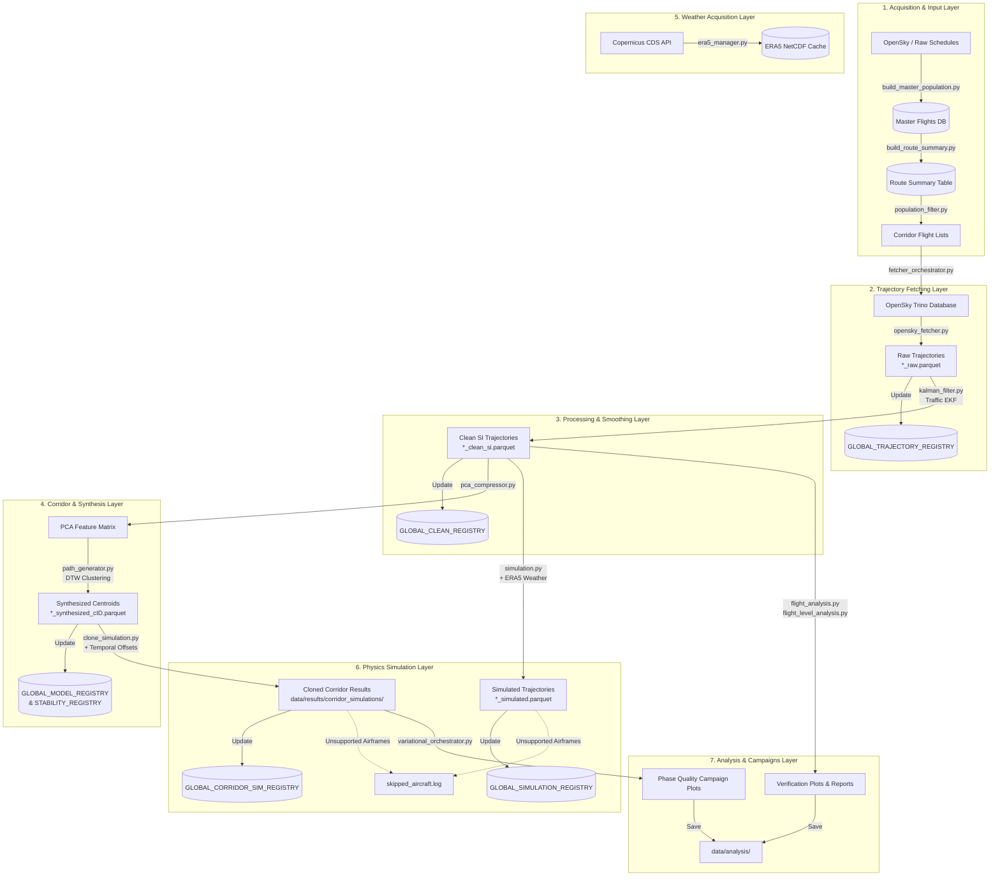

# Architecture Blueprint: Flight Physics Pipeline

This document defines the architecture, data schemas, module objectives, and workflow connections within the Flight Physics Pipeline. It serves as the canonical technical source of truth and aligns precisely with the modern modular state of the codebase.

---

## 1. Pipeline Overview

The Flight Physics Pipeline is an end-to-end, modular, data-driven framework written in Python designed to ingest, process, cluster, and simulate aircraft trajectories. It transitions raw Automatic Dependent Surveillance–Broadcast (ADS-B) waypoints into physical contrail and emissions simulations by executing a sequence of decoupled processing loops:

1. **Acquisition & Population Building**: Constructing master flight schedules, enriching route summaries with geodesic distances, and assembling fleet databases (`src/core/acquisition`).
2. **Fetching (Loops 1 & 2)**: Querying, slicing, and downloading raw ADS-B trajectory waypoints from remote OpenSky Trino database partitions (`src/core/fetching`).
3. **Trajectory Processing (Loop 2b)**: Coordinate smoothing via Extended Kalman Filtering (EKF) in a local Lambert projection plane and uniform 1-minute temporal resampling (`src/core/processing`).
4. **Corridor & Path Synthesis (Loop 2c)**: Dynamic Time Warping (DTW) clustering, PCA compression, stability sweeps, and streaming corridor pipeline orchestration (`src/core/corridor`).
5. **Weather Acquisition (Loop 3a)**: Bulk downloading and managing Copernicus Climate Data Store (CDS) ERA5 NetCDF reanalysis atmospheric data (`src/core/weather`).
6. **Physics Simulation (Loop 3b)**: Simulating flight performance, fuel burn, emissions, and CoCiP contrail formation using `PSFlight` and PyContrails (`src/core/physics`).
7. **Analysis & Campaigns**: Statistical verification of trajectory characteristics, route popularity, flight levels, and phase quality calibration campaigns (`src/analysis/*`).

---

## 2. Directory Structure

All modules interact with a standardized dataset layer stored under the project root (`data/`), derived dynamically from `BASE_DIR` in `src/common/config.py`:

```text
data/
├── registries/              # Global Parquet-based tracking registries (trajectory, clean, simulation, model, etc.)
├── databases/               # Static flight and aircraft databases
│   ├── master_flights/      # Master flight schedules and route summary tables/pickles
│   └── aircraft_db/         # OpenAirframes and aircraft metadata CSV/GZ files
├── flight_lists/            # Sliced corridor flight schedule Parquet files (e.g., EGLL-KJFK.parquet)
├── trajectories/            # Trajectory waypoints partitioned by dataset/run directories
│   ├── raw/                 # Raw waypoints fetched from OpenSky Trino
│   └── clean/               # Resampled and EKF-smoothed trajectory outputs
├── weather/                 # Local cache of Copernicus CDS ERA5 NetCDF files
├── corridor_paths/          # Temporal gridded route centroids and cluster paths
├── calibration/             # Calibration outputs, cluster maps, oracle caches, and phase quality runs
│   ├── cache/               # Cached oracle cohorts
│   ├── phase_quality/       # Phase schema campaign registries and run outputs
│   └── plots/               # Calibration diagnostic plots
├── results/                 # Final simulation results
│   └── corridor_simulations/ # PSFlight + CoCiP simulated trajectories
├── analysis/                # Analysis outputs and statistical evaluation
│   └── reports/             # Aggregated statistical summaries and CSV tables
└── logs/                    # Centralized active pipeline execution logs (legacy logs are moved to the root legacy/logs/ directory)
```

### 2.1 Source Code Directory Structure

The source files under `src/` are structured strictly by functional domain and module:

```text
src/
├── common/                  # Shared configs, serialization adapters, registry managers, and utilities
│   ├── adapters.py          # DataFrame to pycontrails.Flight structures and SI unit conversions
│   ├── build_global_manifest.py # Rebuilds global registries with keep='last' deduplication
│   ├── config.py            # Centralized paths, registries, physical constants, and default parameters
│   ├── exceptions.py        # Custom pipeline exception hierarchy
│   ├── map_cache.py         # Caching layer for geographic map data and airport coordinates
│   ├── registry_utils.py    # Thread-safe atomic parquet reading/writing and registry helpers
│   ├── utils.py             # Centralized logging setup (setup_file_logger) and retry/backoff utilities
│   └── README.md
├── core/                    # Core pipeline processing modules
│   ├── acquisition/         # Master population building, fleet merging, and route summary enrichment
│   ├── corridor/            # DTW clustering, PCA compression, stability sweeps, and streaming pipeline
│   ├── fetching/            # OpenSky Trino querying, caching, and batch download orchestration
│   ├── physics/             # PSFlight performance and CoCiP contrail simulation engine and cloning
│   ├── processing/          # Coordinate EKF smoothing and uniform 1-minute temporal resampling
│   └── weather/             # Copernicus CDS ERA5 NetCDF reanalysis management and downloading
├── analysis/                # Analytical suites, verification, and calibration campaigns
│   ├── campaigns/           # Phase quality filtering, stability sweeps, and variational orchestrators
│   ├── plotting/            # Map verification and plotting utilities
│   └── verification/        # Flight statistics, route popularity, route class, and flight level analysis
├── scratchpad/              # Deprecated historical migration scripts (retained for archive purposes)
├── Architecture Blueprint.md # This canonical architecture overview
└── conventions.md           # Project-wide programming and coding standards
```

> [!NOTE]
> **Deprecated Namespaces**: Historical root-level folders (`src/fetching`, `src/filtering`, `src/physics`, `src/processing`, `src/synthesis`, `src/weather`) have been removed. All active modules reside within `src/core/*` or `src/analysis/*`. The `src/scratchpad/` directory is deprecated per Section 8 of project rules and should not be used for new development.

> **Devtools — Trajectory Manager** (`src/devtools/trajectory_manager.py`): A CLI utility for managing raw and clean trajectory datasets. It is **not** part of the automated pipeline and is invoked manually as needed.
> - `pack --type {raw,clean,both}` — **Backup**: appends loose single-flight Parquets into a cohort batch archive (`*_all_raw.parquet` at cohort root for raw; `*_all_clean.parquet` at cohort root for clean). Only flights not already in the archive are appended. The processing and fetching pipelines **never** auto-create these archives.
> - `unpack --type {raw,clean,both}` — **Restore**: extracts single-flight Parquets from the batch archive for any flight that has no individual file on disk. Triggers `rebuild_raw_registry()` or `rebuild_clean_registry()` after extraction.
> - `relabel` — Re-applies OpenAP fuzzy-logic flight phase labels to raw single files (raw only).
> Both `*_all_raw.parquet` and `*_all_clean.parquet` batch archives are **excluded** from `global_trajectory_registry.parquet` and `global_clean_registry.parquet` indexing.

### 2.2 Run Folder Naming Template

Run directories under `data/trajectories/` are generated dynamically based on CLI configurations:
`ranks_[ranks_spec]_strat_[strategy]_val_[val]_seed_[seed]_format_[format]_start_[start]_end_[end]_[hash_suffix]`
* **Ranks Specification (`[ranks_spec]`)**: Range uses `to` (e.g., `ranks_1to5`), list uses hyphens (e.g., `ranks_1-5`).
* **Hash Suffix**: A deterministic 6-character MD5 checksum of the parameter prefix generated via `src.common.utils` to guarantee unique cohort namespaces.

Simulation results stored under `data/results/` do not use this naming scheme and are instead saved iteratively corridor-by-corridor in route-specific folders inside `data/results/corridor_simulations/`.

---

## 3. Global Conventions & Standards

### 3.1 Datetime Timezone Standard
* **UTC Standard**: Datetime columns can be timezone-aware UTC (e.g., with `+00:00` offset or `'UTC'`) or timezone-naive UTC, consistently used within each module to ensure seamless comparisons. Standard fetched data from Trino/OpenSky outputs timezone-aware UTC. Timezone-naive UTC is enforced for internal simulation engine processing when required by third-party packages (e.g., PyContrails).

### 3.2 File Suffix Conventions
Standard suffixes indicate the processing state of trajectory datasets across the pipeline:

| File Suffix | Description | Format |
|---|---|
| `*_raw.parquet` | Raw waypoints containing coordinates, noise, and gaps. | Parquet |
| `*_all_raw.parquet` | Concatenated raw trajectory waypoints across a cohort (manual backup archive). Never auto-generated by the pipeline. Created by `trajectory_manager pack --type raw`. | Parquet |
| `*_clean_si.parquet` | Resampled and EKF-smoothed coordinates in SI units. | Parquet |
| `*_all_clean.parquet` | Concatenated clean trajectory waypoints across a cohort (manual backup archive). Never auto-generated by the pipeline. Created by `trajectory_manager pack --type clean`. | Parquet |
| `*_synthesized_c[ID].parquet` | Temporal-gridded DTW trajectory route centroids. | Parquet |
| `*_simulated.parquet` | Trajectories containing PSFlight and CoCiP simulation results. | Parquet |
| `*_ekf_diag.npz` | Per-flight EKF diagnostic tensor archive containing covariance (`S_k`, `P_k`) and innovation (`e_k`) arrays and scalar quality metrics. Written by `kalman_filter.py` when `--save-diagnostics` is active. | Compressed NumPy NPZ |

### 3.3 Physical Units Standards
The pipeline converts raw aviation inputs into SI units during EKF smoothing and simulation phases. Conversion factors are centralized in `src/common/config.py`:

| Parameter | Aviation Units (Raw) | SI Units (Internal/Sim) | Centralized Constant |
|---|---|---|---|
| **Altitude** | Feet (ft) | Meters (m) | `M_TO_FT = 3.280839895` |
| **Speed** | Knots (kt) | Meters per second (m/s) | `MPS_TO_KT = 1.9438444924` |
| **Distance** | Kilometers (km) | Meters (m) | \(1 \text{ km} = 1000 \text{ m}\) |
| **ROCD** | Feet per minute (ft/min) | Meters per second (m/s) | `MPS_TO_FPM = 196.8503937` |
| **Coordinates** | Degrees (WGS84) | Meters (LAEA Projection) | Custom Lambert Azimuthal Equal Area |

### 3.4 Centralized Registries
All global state tracking is managed via atomic Parquet registries defined in `src/common/config.py`:

* `GLOBAL_TRAJECTORY_REGISTRY`: Tracks raw trajectory acquisition status (`data/registries/global_trajectory_registry.parquet`).
* `GLOBAL_CLEAN_REGISTRY`: Tracks EKF-cleaned trajectories (`data/registries/global_clean_registry.parquet`). Contains `flight_id` and `file_path` of resampled `*_clean_si.parquet` files.
* `GLOBAL_EKF_DIAG_REGISTRY`: Dedicated diagnostic manifest (`data/registries/global_ekf_diag_registry.parquet`). Maps `flight_id` → `diag_file_path` (relative `*_ekf_diag.npz` path) + scalar columns `ekf_quality_score`, `ekf_mean_nis`, `ekf_max_trace_p`. Written by `kalman_filter.py` when `--save-diagnostics` is active; can be rebuilt/recomputed via `build_global_manifest.py --diag-only`.
* `GLOBAL_SIMULATION_REGISTRY`: Tracks individual flight physics simulation outcomes (`data/registries/global_simulation_registry.parquet`).
* `GLOBAL_CORRIDOR_SIM_REGISTRY`: Tracks corridor-level cloned simulation progress (`data/registries/global_corridor_simulation_registry.parquet`).
* `GLOBAL_MODEL_REGISTRY`: Stores DTW cluster medoid IDs and corridor model metadata (`data/registries/global_model_registry.parquet`).
* `GLOBAL_STABILITY_REGISTRY`: Tracks corridor stability sweep metrics (`data/registries/global_stability_registry.parquet`).
* `GLOBAL_FLIGHT_CLUSTER_MAP`: Maps individual flights to assigned DTW clusters (`data/registries/global_flight_cluster_map.parquet`).
* `CALIBRATION_PLOT_REGISTRY`: Indexes diagnostic calibration plots (`data/registries/calibration_plot_registry.parquet`).
* `AUDIT_CANDIDATE_POOL_REGISTRY`: Tracks candidate flights for phase quality campaigns (`data/calibration/phase_quality/registries/audit_candidate_pool.parquet`).
* `AUDIT_COHORT_MAP_REGISTRY`: Maps cohorts audited during phase quality filtering (`data/calibration/phase_quality/registries/audit_cohort_map.parquet`).

### 3.5 Centralized Logging Policy
All logging is handled via `setup_file_logger()` in `src.common.utils`. Using `logging.basicConfig(...)` is strictly forbidden. Log files are written to fixed filenames in `data/logs/` (`LOGS_DIR`):

* `fetching.log`: OpenSky Trino queries and download progress.
* `acquisition.log`: Master population building and fleet merging.
* `processing.log`: Kalman filtering and coordinate smoothing.
* `corridor.log`: Corridor clustering, PCA compression, and streaming pipeline execution.
* `weather.log`: Copernicus CDS ERA5 NetCDF downloads.
* `simulation.log`: PSFlight and CoCiP simulation runs.
* `clone_simulation.log`: Cloned corridor batch simulation runs (`clone_simulation.py`).
* `stability_orchestrator.log`: Corridor stability sweep runs (`stability_orchestrator.py`).
* `calibration.log`: General phase quality, schema enrichment, and variational calibration campaigns.
* `gt_stability_sweep.log`: Ground Truth stability sweep runs (`gt_stability_sweep.py`).
* `phase_a_calibration.log`: PCA dimension fit iterations (`phase_a_d_pca.py`).
* `variational_orchestrator.log`: Variational calibration campaign runs (`variational_orchestrator.py`).
* `analysis.log`: Statistical evaluation verification runs in `src/analysis/verification/`.
* `manifest.log`: Global registry scan, pruning, and rebuild/update runs (`build_global_manifest.py`).
* `skipped_aircraft.log`: Global append-only log recording skipped airframes across all pipeline stages.

> [!NOTE]
> Legacy logs (such as `filtering.log`, `clustering_orchestrator.log`, `streaming_pipeline.log`, `synthesis.log`, and `enrichment.log`) have been cleaned up and moved to the project's root `legacy/logs/` directory to keep `data/logs/` organized.

### 3.6 Concurrency & Thread-Limiting Policy

To maximize pipeline performance and prevent CPU oversubscription (thrashing) when executing parallel tasks, the pipeline strictly separates process-level task concurrency from low-level thread-level parallelism:

* **Multi-Process Concurrency (CPU-Bound)**: Employs `ProcessPoolExecutor` or `multiprocessing.Pool` initialized with a `spawn` start context. Child workers initialize their own logging handlers and restrict underlying C-libraries (OpenBLAS, MKL, NumExpr, BLIS) to exactly **1 thread** using `limit_numeric_threads(1)` from `src.common.concurrency`.
* **Multi-Threaded Concurrency (I/O-Bound / Shared Memory)**: Employs `ThreadPoolExecutor` for workflows requiring zero-copy access to large shared-memory datasets (e.g., Copernicus ERA5 NetCDF grid objects in physics simulations) or running GIL-releasing C-routines.

| Pipeline Stage / Module | Concurrency Engine | Memory / Resource Behavior | Numeric Thread Limit | Strategy Purpose |
| :--- | :--- | :--- | :--- | :--- |
| **EKF Cleaning (`kalman_filter.py`)** | `ProcessPoolExecutor` (`spawn`) | Isolated memory per worker; processes individual flight files. | `limit_numeric_threads(1)` | Prevents CPU oversubscription across \(N\) parallel workers; small per-flight data arrays do not benefit from C-library thread scaling. |
| **Corridor Medoid / Clustering** | `ProcessPoolExecutor` (`spawn`) | Isolated memory per worker; processes route clusters independently. | `limit_numeric_threads(1)` | Maximizes multi-core throughput when hundreds of routes are processed concurrently. |
| **Weather I/O & Preloading** | `ThreadPoolExecutor` | Shared RAM; concurrent disk reads and NetCDF parsing. | OS / C-library default | NetCDF/HDF5 compression routines release the GIL during file I/O, allowing fast parallel loading. |
| **Flight Simulation (`engine.py` / `clone_simulation.py`)** | `ThreadPoolExecutor` | **Zero-Copy Shared Memory**; threads read from the same `met` & `rad` weather grids in RAM. | `1` per thread | Avoids massive RAM duplication of multi-gigabyte weather data; underlying physics routines release the GIL for safe multi-threaded execution. |

---

## 4. Module Specifications & FAST Mapping

Every module adheres to a Function Analysis Solution Tree (FAST) structure mapping architectural objectives to code implementations, data contracts, and safety/fallback behaviors.

### 4.1 Common Module (`src/common/`)
* **Objective**: Provide centralized configuration, atomic filesystem operations, DataFrame-to-PyContrails serialization, and logging infrastructure.
* **FAST Mapping**:
  ```text
  Common Infrastructure
   ├── Paths & Constants: config.py
   │    ├── Inputs: OS environment / filesystem location
   │    └── Outputs: Resolved pathlib.Path objects and SI conversion constants
   ├── Serialization: adapters.py::dataframe_to_flight()
   │    ├── Inputs: EKF clean DataFrame (SI units, UTC time)
   │    ├── Outputs: pycontrails.Flight container
   │    └── Safety: Validates kinematic consistency and timezone parsing
   ├── Atomic I/O: registry_utils.py::read_registry() / write_registry()
   │    ├── Inputs: Target parquet file and DataFrame
   │    ├── Outputs: Thread-safe atomic file writes via temporary `.tmp.` files
   │    └── Safety: Prevents corrupted Parquet files during concurrent worker execution
   └── Logging & Retries: utils.py::setup_file_logger() / retry_backoff()
        ├── Inputs: Module log filename and retry parameters
        └── Safety: Implements exponential backoff (`BACKOFF_FACTOR=2.0`) up to `BACKOFF_MAX_RETRIES=10`
  ```

### 4.2 Core Acquisition (`src/core/acquisition/`)
* **Objective**: Build master flight schedules, filter by geographic bounding boxes, enrich routes with geodesic distances, and merge aircraft metadata.
* **FAST Mapping**:
  ```text
  Population Acquisition
   ├── Schedule Building: build_master_population.py::main()
   │    ├── Inputs: Raw ADS-B schedule databases and airport prefix filters
   │    ├── Outputs: MASTER_FLIGHTS_FILE (`data/databases/master_flights/master_flights.parquet`)
   │    └── Safety: Logs progress to `acquisition.log`; skips malformed schedule rows
   ├── Route Summary & Enrichment: build_route_summary.py::main()
   │    ├── Inputs: master_flights.parquet dataset and airport coordinates cache
   │    ├── Outputs: ROUTE_SUMMARY_PARQUET / ROUTE_SUMMARY_PKL / ROUTE_SUMMARY_CSV and report files
   │    └── Safety: Vectorized Haversine geodesic distance calculation and spatial quality filters
   └── Fleet Construction: fleet_builder.py / master_merger.py
        ├── Inputs: OpenAirframes database (`openairframes_adsb_2024-01-01_2026-02-23.csv.gz`)
        └── Outputs: Enriched flight schedules with validated ICAO typecodes and engine families
  ```

### 4.3 Core Fetching (`src/core/fetching/`)
* **Objective**: Query OpenSky Trino database partitions for sliced corridor schedules, apply caching, and execute batch downloads.
* **FAST Mapping**:
  ```text
  Trajectory Fetching
   ├── Query Execution: opensky_fetcher.py::fetch_trajectory()
   │    ├── Inputs: Flight icao24, callsign, and time bounds
   │    ├── Outputs: Raw waypoints DataFrame (`*_raw.parquet` in SI units)
   │    └── Safety: Checks local cache before querying; applies `retry_backoff()` on Trino timeouts
   └── Batch Orchestration: fetcher_orchestrator.py::main()
        ├── Inputs: Corridor flight list parquets and rank specifications
        ├── Outputs: Populates `GLOBAL_TRAJECTORY_REGISTRY`; saves raw trajectory files
        └── Safety: Logs to `fetching.log`; validates conflicting `--ranks` vs `--upper-rank` flags; supports `--resume`
  ```

### 4.4 Core Processing (`src/core/processing/`)
* **Objective**: Clean raw ADS-B waypoints by applying a 6D Kinematic Extended Kalman Filter (EKF) in a per-flight LAEA projection plane, resample to a uniform time grid (default 60 s), assign OpenAP aerodynamic flight phases, and optionally export EKF diagnostic tensors for offline mathematical autopsy.
* **FAST Mapping**:
  ```text
  Trajectory Processing (EKF)
   └── Smoothing, Resampling & Diagnostics: kalman_filter.py
        ├── Inputs: Raw trajectory waypoints (`*_raw.parquet`) queried via GLOBAL_TRAJECTORY_REGISTRY
        ├── Outputs:
        │    ├── Clean SI trajectories (`*_clean_si.parquet`) → GLOBAL_CLEAN_REGISTRY updated
        │    └── (optional) Diagnostic archives (`*_ekf_diag.npz`) → GLOBAL_EKF_DIAG_REGISTRY updated
        ├── Core Functions:
        │    ├── run_6d_kinematic_ekf(): Forward EKF pass recording S_hist[i], e_hist[i] per step
        │    ├── compute_ekf_quality_metrics(S_hist, P_hist, e_hist): NIS-based scalar quality score
        │    ├── load_ekf_diag_arrays(diag_path): Reads S_k, P_k, e_k from an NPZ archive
        │    └── compute_ekf_quality_metrics_from_diag(diag_path): Wraps loader + quality metric calculator
        ├── Safety: Rule 11 typecode validation via is_supported_typecode(); logs rejects to skipped_aircraft.log
        └── Exception: Index setting prior to EKF is omitted to prevent time-serialization JSON crashes
  ```

### 4.5 Core Corridor (`src/core/corridor/`)
* **Objective**: Synthesize baseline route paths via Dynamic Time Warping (DTW) clustering, perform PCA dimensionality compression, and evaluate cluster stability across cohorts.
* **FAST Mapping**:
  ```text
  Corridor Synthesis & Clustering
   ├── Path Generation: path_generator.py::generate_corridor_paths()
   │    ├── Inputs: Clean SI trajectories across a route cohort
   │    ├── Outputs: Temporal gridded route centroids (`*_synthesized_c[ID].parquet`)
   │    └── Safety: Drops derivative kinematic columns (`gs`, `heading`, `rocd`) before PyContrails instantiation to force dynamic recalculation; enforces FL250 cruise altitude validations
   ├── PCA Compression: pca_compressor.py::compress_trajectories()
   │    ├── Inputs: Clean trajectory coordinates
   │    ├── Outputs: Reduced feature matrix retaining 95% variance (`D_PCA`)
   │    └── Safety: Fallback to standard features if trajectory count < `MIN_FLIGHTS_FOR_CLUSTERING`
   ├── Stability Sweeps: stability_orchestrator.py / stability_worker.py
   │    ├── Inputs: Resampled cohort flights across clustering rounds
   │    ├── Outputs: Updates `GLOBAL_STABILITY_REGISTRY` and `GLOBAL_MODEL_REGISTRY`
   │    └── Safety: Sequential loop fallback if parallel worker pool fails
   └── Streaming Pipeline: streaming_pipeline.py::main()
        ├── Inputs: End-to-end corridor run parameters
        └── Outputs: Orchestrates fetching, EKF processing, clustering, and simulation
  ```

### 4.6 Core Weather (`src/core/weather/`)
* **Objective**: Bulk download and manage Copernicus Climate Data Store (CDS) ERA5 NetCDF atmospheric reanalysis data on required pressure levels and surface grids.
* **FAST Mapping**:
  ```text
  Weather Acquisition
   └── ERA5 Management: era5_manager.py::download_era5()
        ├── Inputs: Bounding box (`WEATHER_BOUNDS_BBOX`), time range, and required pressure levels
        ├── Outputs: Cached NetCDF files in `data/weather/`
        └── Safety: Background download threads; self-healing corruption checks; logs to `weather.log`
  ```

### 4.7 Core Physics (`src/core/physics/`)
* **Objective**: Execute aircraft performance, fuel burn, emissions, and CoCiP contrail modeling using `PSFlight` and PyContrails.
* **FAST Mapping**:
  ```text
  Physics Simulation
   ├── Individual Simulation: simulation.py::run_simulation()
   │    ├── Inputs: Clean SI trajectories and ERA5 NetCDF weather data
   │    ├── Outputs: Simulated trajectories (`*_simulated.parquet`) and `GLOBAL_SIMULATION_REGISTRY`
   │    └── Safety: Skips unsupported aircraft typecodes, appending details to `skipped_aircraft.log`
   └── Cohort Cloning: clone_simulation.py::clone_corridor()
        ├── Inputs: Synthesized route centroids and temporal departure offsets
        ├── Outputs: Route-specific simulation results in `data/results/corridor_simulations/` and `GLOBAL_CORRIDOR_SIM_REGISTRY`
        └── Safety: Logs execution to `simulation.log`; appends unsupported airframes to `skipped_aircraft.log`
  ```

### 4.8 Analysis & Campaigns (`src/analysis/`)
* **Objective**: Verify flight characteristics, analyze route popularity and flight levels, and execute phase quality calibration campaigns.
* **FAST Mapping**:
  ```text
  Analysis & Verification
   ├── Flight Verification: verification/flight_analysis.py / flight_level_analysis.py
   │    ├── Inputs: Clean trajectories and route summary tables
   │    ├── Outputs: Distance vs height scatter plots, candlestick flight level boxplots, and CSV reports
   │    └── Safety: Aggregates logs cleanly; handles missing optional columns gracefully
   ├── Route Classification: verification/route_popularity_analysis.py / route_class_analysis.py
   │    ├── Inputs: Master flight route summaries
   │    ├── Outputs: Dual Y-axis popularity histograms and 4-class route percentage charts
   │    └── Safety: Exports reproducible summary tables to `data/analysis/reports/`
   └── Phase Quality Campaigns: campaigns/phase_schema_orchestrator.py / variational_orchestrator.py
        ├── Inputs: Calibration routes (`CALIBRATION_ROUTES`), candidate pools, and stability sweeps
        ├── Outputs: Updates `AUDIT_CANDIDATE_POOL_REGISTRY`, `AUDIT_COHORT_MAP_REGISTRY`, and diagnostic plots
        └── Safety: Enforces pre-filter thresholds (`DEFAULT_PREFILTER_THRESHOLDS`); logs to `calibration.log`
  ```

---

## 5. End-to-End Data Workflow



**Step-by-Step Description:**
1. **Schedule Acquisition & Enrichment**: `build_master_population.py` ingests raw ADS-B schedules to build the master flights database (`master_flights.parquet`). `build_route_summary.py` calculates Haversine geodesic distances and populates the route summary tables.
2. **Corridor Slicing**: Corridor schedules are sliced into specific airport pair flight lists (`data/flight_lists/`) based on geographic bounding boxes and route popularity ranks.
3. **Trajectory Fetching**: `fetcher_orchestrator.py` reads the corridor flight lists and queries OpenSky Trino via `opensky_fetcher.py`. Raw waypoint parquets (`*_raw.parquet`) are saved to `data/trajectories/raw/`, and `GLOBAL_TRAJECTORY_REGISTRY` is updated atomically.
4. **EKF Smoothing**: `kalman_filter.py` reads raw waypoints, projects coordinates to a local Lambert azimuthal equal-area plane, applies an Extended Kalman Filter (EKF), and resamples to a uniform 1-minute grid. Clean SI parquets (`*_clean_si.parquet`) are saved to `data/trajectories/clean/`, updating `GLOBAL_CLEAN_REGISTRY`.
5. **PCA Compression & DTW Clustering**: `pca_compressor.py` reduces trajectory feature dimensions to `D_PCA` components. `path_generator.py` executes Dynamic Time Warping (DTW) clustering across flight cohorts, producing temporal-gridded route centroids (`*_synthesized_c[ID].parquet`) in `data/corridor_paths/` and updating `GLOBAL_MODEL_REGISTRY` and `GLOBAL_STABILITY_REGISTRY`.
6. **Weather Retrieval**: `era5_manager.py` downloads atmospheric reanalysis NetCDF files from Copernicus CDS for the European bounding box (`WEATHER_BOUNDS_BBOX`) across required pressure levels, caching them in `data/weather/`.
7. **Physics & Contrail Simulation**: `simulation.py` and `clone_simulation.py` combine clean trajectories (or synthesized centroids) with ERA5 weather data to run PSFlight performance and CoCiP contrail models. Results are saved to `data/results/corridor_simulations/`, updating `GLOBAL_SIMULATION_REGISTRY` and `GLOBAL_CORRIDOR_SIM_REGISTRY`. Unsupported airframes are safely skipped and logged to `skipped_aircraft.log`.
8. **Analysis & Verification**: Analytical suites in `src/analysis/` ingest clean trajectories, simulated outputs, and route summaries to export verification plots, flight level candlestick charts, and phase quality campaign reports into `data/analysis/`.
