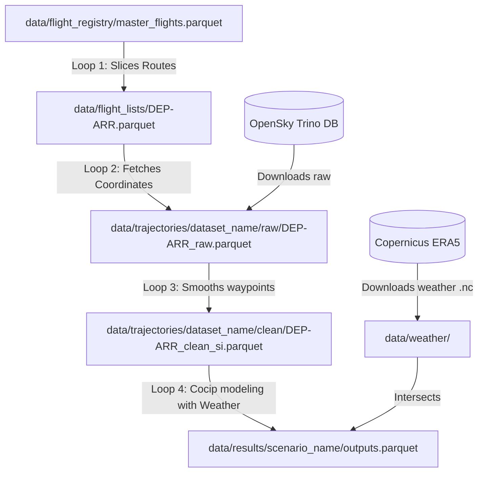

# Flight Physics Pipeline: V3 Architecture Blueprint

This blueprint outlines the restructured data and code organization of the `PythonPipeline` project, supporting cross-validation studies and modular execution.

---

## 1. Directory Structure

```
PythonPipeline/
│
├── src/                                # Core Codebase
│   ├── common/                         # Shared configurations & utilities
│   │   ├── config.py                   # Central path constants
│   │   ├── utils.py                    # Metadata loaders, splitters, & folder name generator
│   │   └── build_global_manifest.py    # Manifest utility indexing raw flights
│   │
│   ├── filtering/                      # Slices master populations
│   │   ├── population_filter.py        # Slices a single corridor
│   │   └── filter_orchestrator.py      # Batch-slices corridors based on traffic ranks
│   │
│   ├── fetching/                       # Interfaces OpenSky API
│   │   ├── opensky_fetcher.py          # Downloader checking local cache before querying Trino
│   │   └── fetcher_orchestrator.py     # Batch corridor fetch orchestrator (exposes random seed)
│   │
│   ├── processing/                     # EKF trajectory smoothing
│   │   ├── kalman_filter.py            # Mathematical EKF smoother & resampler (1-min frequency)
│   │   └── traffic_adapter.py          # Formatter: traffic.Flight -> pycontrails.Flight
│   │
│   ├── weather/                        # Meteorology acquisition
│   │   └── era5_manager.py             # Downloads & caches NetCDF files from Copernicus (ERA5)
│   │
│   └── physics/                        # Environmental modeling
│       └── simulation.py               # Runs PyContrails CoCiP simulation loop
│
├── data/                               # Data Directory
│   ├── flight_registry/                # Global static master databases (flight catalogs)
│   │   ├── master_flights.csv          # Master 3.5M flight catalog
│   │   ├── master_flights.parquet      # Compressed master database
│   │   ├── master_flights_RouteSummary.pkl # Flight count ranks per corridor
│   │   ├── global_trajectory_registry.parquet # Cache index mapping flight_id -> raw_parquet_path
│   │   ├── global_clean_registry.parquet # Cache index mapping flight_id -> clean_parquet_path
│   │   └── global_simulation_registry.parquet # Cache index mapping flight_id -> simulated_parquet_path
│   │
│   ├── flight_lists/                   # Standalone sliced route corridors (e.g. EBBR-LSGG.parquet)
│   │
│   ├── master_flight_paths/            # Base reference & synthetic flight paths (static templates)
│   │
│   ├── trajectories/                   # Dynamic flight runs grouped under isolated cohort namespaces
│   │   └── <dataset_name>/             # Run output folder: prompt_sample_seed_numbering_hash
│   │                                   # e.g., "ranks_1-5_sample_10_seed_42_01_0430fb/"
│   │                                   # Contains raw/ and clean/ subfolders, manifest and log:
│   │                                   # - raw/EGLL-KJFK_a319f2_raw.parquet
│   │                                   # - EGLL-KJFK_a319f2_manifest.json
│   │                                   # - clean/EGLL-KJFK_a319f2_clean_si.parquet
│   │                                   # - extraction.log
│   │
│   ├── weather/                        # Flat, shared repository of Copernicus NetCDF (.nc) files
│   │
│   ├── simulation_profiles/            # Input profiles & stretched runs generated from master paths
│   │   └── <scenario_name>/            # e.g., "LHS_wind_stretching_run"
│   │
│   └── results/                        # Final physical outputs grouped by scenario
│       └── <scenario_name>/            # e.g., "LHS_wind_stretching_run"
```

---

## 2. Naming Conventions

### Sliced Flight Lists (in `data/flight_lists/`)
Named strictly by the origin and destination airport ICAOs:
- Format: `{DEP}-{ARR}.parquet`
- Example: `EGLL-KJFK.parquet`

### Dataset Cohort Folder Name (in `data/trajectories/`)
Dynamically generated from prompt input settings, ensuring uniqueness to prevent collisions during parallel runs:
- Format: `ranks_{lower}-{upper}_sample_{size}_seed_{seed}_{numbering}_{hash}/`
- Example: `ranks_1-5_sample_10_seed_42_01_0430fb/`

### Trajectory Batch Files (inside a dataset run folder)
Batch files use the route name followed by a deterministic cohort-specific hash (calculated from the flight IDs in the batch):
- Raw waypoints: `raw/{DEP}-{ARR}_{cohort_hash}_raw.parquet`
- Batch Manifest: `{DEP}-{ARR}_{cohort_hash}_manifest.json`
- Cleaned EKF waypoints: `clean/{DEP}-{ARR}_{cohort_hash}_clean_si.parquet`
- Extraction log: `extraction.log`

### Weather NetCDFs (in `data/weather/`)
Weather files are saved directly at the root of `data/weather/` in Copernicus format.

---

## 3. Modular Execution Loops

The pipeline is decoupled. Each loop is completely independent and interfaces with other loops solely through defined files in the shared `data/` structure.



### Loop 1: Corridor Slicing (Filtering)
Extracts target route corridor populations from the master flight registry.
- **Command**: `python -m src.filtering.filter_orchestrator --lower-rank 1 --upper-rank 5`
- **Output**: Writes route lists (e.g. `LEPA-LEBL.parquet`) to `data/flight_lists/`.

### Loop 2: Trajectory Acquisition (Fetching)
Acquires raw ADS-B telemetry coordinates (state vectors) for flight cohorts.
- **Command**: `python -m src.fetching.fetcher_orchestrator --lower-rank 1 --upper-rank 5 --strategy fixed --value 10 --seed 42`
- **Workflow**:
  1. Checks `data/flight_registry/global_trajectory_registry.parquet` for each flight.
  2. **Cache Hit**: Waypoints are read locally from existing files, skipping the API.
  3. **Cache Miss**: Connects to the OpenSky Trino database and downloads waypoints.
  4. Saves raw data in `raw/`, a manifest JSON and an `extraction.log` at the root of `data/trajectories/<dataset_name>/`, and appends new listings to the global registry.

### Loop 3: Kinematic Post-Processing (Filtering & Resampling)
Applies the Extended Kalman Filter (EKF) to clean ground noise, smooth out GPS anomalies, and resample coordinates.
- **Command**: `python -m src.processing.kalman_filter --input-file "data/trajectories/ranks_1-5_sample_10_seed_42_01_0430fb/raw/LEPA-LEBL_c53b3a_raw.parquet"`
- **Workflow**:
  1. **Pre-Execution File Check**: Checks if the target `*_clean_si.parquet` file already exists on disk. If yes, it skips the entire raw file batch.
  2. **Flight-Level Cache Check**: For each flight in the raw dataset, the loop checks the clean manifest (`global_clean_registry.parquet`) for a matching `flight_id`. If a cache hit is detected and the clean file exists, the cleaned coordinates are loaded directly from disk, bypassing EKF calculations.
  3. **Airborne Extraction**: Extracts airborne waypoints and filters out tracks with fewer than 10 points.
  4. **Spatial Projection**: Projects coordinates from degrees to a local flat Cartesian plane (LAEA) centered dynamically at the mean position of each individual flight, adding columns `x` and `y`.
  5. **Continuous track unwrapping**: Unwraps track/heading angles to a continuous representation (`track_unwrapped`).
  6. **EKF smoothing**: Applies Extended Kalman Filter backwards smoothing (RTS backward pass).
  7. **Grid resampling**: Resamples coordinates to a uniform 1-minute frequency.
  8. **PyContrails Adaptation**: Drops intermediate EKF projection columns (`x`, `y`, `track_unwrapped`) and converts data to `pycontrails.Flight` objects.
  9. **Export & Registration**: Saves cleaned coordinates as `clean/{DEP}-{ARR}_{cohort_hash}_clean_si.parquet` and registers the cleaned flights in the clean registry.

### Loop 4: Weather & Physical Simulation (Cocip)
Downloads matching Copernicus weather files and runs PyContrails.
- **Command**: `python -m src.physics.simulation --input-file "data/trajectories/<dataset_name>/clean/<route>_clean_si.parquet" --scenario "my_simulation"`
- **Workflow**:
  1. Identifies the space-time bounding box of the clean trajectory.
  2. Checks `data/weather/` for matching Copernicus NetCDF weather files. If missing, downloads them via `era5_manager.py`.
  3. Adapts the data into `pycontrails.Flight` structures.
  4. Intersects weather properties to run CoCiP, writing outputs to `data/results/<scenario_name>/`.