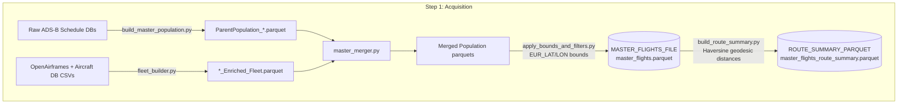
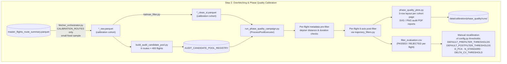
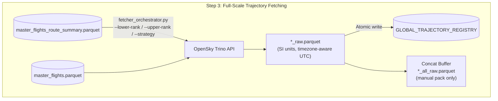
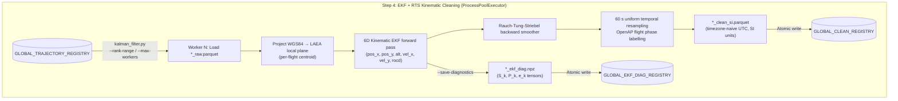
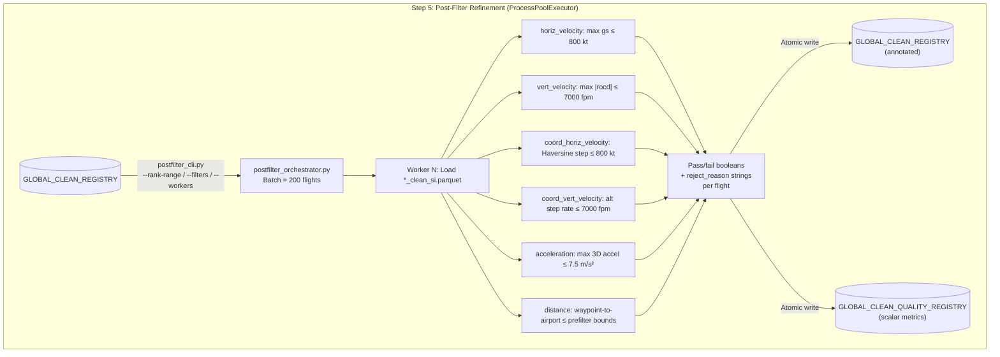
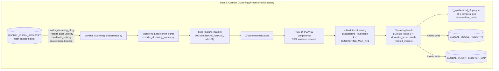
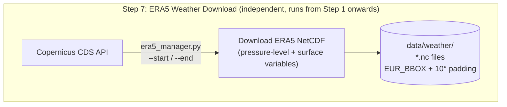
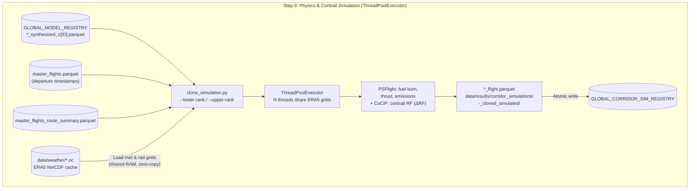

# Architecture Blueprint: Flight Physics Pipeline

This document defines the architecture, data schemas, module objectives, and workflow connections within the Flight Physics Pipeline. It serves as the canonical technical source of truth and aligns precisely with the modern modular state of the codebase.

---

## 1. Pipeline Overview

The Flight Physics Pipeline is an end-to-end, modular, data-driven framework written in Python designed to ingest, process, cluster, and simulate aircraft trajectories. It transitions raw Automatic Dependent Surveillance–Broadcast (ADS-B) waypoints into physical contrail and emissions simulations by executing a structured 8-step sequence:

1. **Step 1 — Acquisition**: Constructing master flight schedules, enriching fleet databases, applying geographic bounding box filters, and generating geodesic route summaries (`src/core/acquisition`).
2. **Step 2 — Overfetching & Phase Quality Calibration**: Fetching a small calibration cohort on known routes, applying EKF cleaning, running the Phase Quality campaign on raw and clean data simultaneously to tune pre-filter and post-filter thresholds in `config.py` (`src/analysis/campaigns/phase_quality`).
3. **Step 3 — Trajectory Fetching**: Full-scale batch fetching of raw ADS-B waypoints for all target corridor ranks (`src/core/fetching`).
4. **Step 4 — EKF + RTS Cleaning**: Coordinate smoothing via a 6D Kinematic Extended Kalman Filter and Rauch-Tung-Striebel smoother, producing SI-unit clean trajectories (`src/core/processing`).
5. **Step 5 — Post-Filter Refinement**: Six independent axis-level filters (horizontal velocity, vertical velocity, coordinate-derived horizontal and vertical velocity, 3D acceleration, airport distance) evaluate each cleaned trajectory and annotate the registry (`src/core/processing`).
6. **Step 6 — Corridor Clustering**: PCA dimensionality reduction and K-Medoids clustering synthesize representative 4D medoid trajectory templates per route corridor (`src/core/corridor`).
7. **Step 7 — Weather Download**: Bulk download and caching of Copernicus ERA5 NetCDF reanalysis files. Independent of Steps 3–6 and may run from Step 1 onwards (`src/core/weather`).
8. **Step 8 — Physics & Contrail Simulation**: Cloning synthetic medoid paths across real departure timestamps and simulating aircraft performance, fuel burn, and CoCiP contrail radiative forcing (`src/core/physics`).

---

## 2. Directory Structure

All modules interact with a standardized dataset layer stored under the project root (`data/`), derived dynamically from `BASE_DIR` in `src/common/config.py`:

```text
data/
├── registries/              # Global Parquet-based tracking registries (trajectory, clean, simulation, model, etc.)
├── databases/               # Static flight and aircraft databases
│   ├── master_flights/      # Master flight schedules and route summary tables/pickles
│   └── aircraft_db/         # OpenAirframes and aircraft metadata CSV/GZ files
├── flight_lists/            # Sliced corridor flight schedule Parquet files (e.g., EGLL-KJFK.parquet)
├── trajectories/            # Trajectory waypoints partitioned by dataset/run directories
│   ├── raw/                 # Raw waypoints fetched from OpenSky Trino
│   └── clean/               # Resampled and EKF-smoothed trajectory outputs
├── weather/                 # Local cache of Copernicus CDS ERA5 NetCDF files
├── corridor_paths/          # Temporal gridded route medoid paths
├── calibration/             # Calibration outputs, cluster maps, oracle caches, and phase quality runs
│   ├── cache/               # Cached oracle cohorts
│   ├── phase_quality/       # Phase Quality campaign registries and run outputs
│   └── plots/               # Calibration diagnostic plots
├── results/                 # Final simulation results
│   └── corridor_simulations/ # PSFlight + CoCiP simulated trajectories
├── analysis/                # Analysis outputs and statistical evaluation
│   └── reports/             # Aggregated statistical summaries and CSV tables
└── logs/                    # Centralized active pipeline execution logs (legacy logs are moved to the root legacy/logs/ directory)
```

### 2.1 Source Code Directory Structure

```text
src/
├── common/                  # Shared configs, serialization adapters, registry managers, and utilities
│   ├── adapters.py          # DataFrame to pycontrails.Flight structures and SI unit conversions
│   ├── build_global_manifest.py # Rebuilds global registries with keep='last' deduplication
│   ├── config.py            # Centralized paths, registries, physical constants, and default parameters
│   ├── exceptions.py        # Custom pipeline exception hierarchy
│   ├── map_cache.py         # Caching layer for geographic map data and airport coordinates
│   ├── registry_utils.py    # Thread-safe atomic parquet reading/writing and registry helpers
│   ├── utils.py             # Centralized logging setup (setup_file_logger) and retry/backoff utilities
│   └── README.md
├── core/                    # Core pipeline processing modules
│   ├── acquisition/         # Master population building, fleet merging, bounding box filtering, and route summary enrichment
│   ├── corridor/            # K-Medoids clustering, PCA compression, and stability sweeps
│   ├── fetching/            # OpenSky Trino querying, caching, and batch download orchestration
│   ├── physics/             # PSFlight performance and CoCiP contrail simulation engine and cloning
│   ├── processing/          # EKF+RTS trajectory smoothing, resampling, and post-filter evaluation
│   └── weather/             # Copernicus CDS ERA5 NetCDF reanalysis management and downloading
├── analysis/                # Analytical suites, verification, and calibration campaigns
│   ├── campaigns/           # Phase quality filtering, stability sweeps, and variational orchestrators
│   ├── plotting/            # Map verification and plotting utilities
│   └── verification/        # Flight statistics, route popularity, route class, and flight level analysis
├── scratchpad/              # Deprecated historical migration scripts (retained for archive purposes)
├── Architecture Blueprint.md # This canonical architecture overview
└── conventions.md           # Project-wide programming and coding standards
```

> [!NOTE]
> **Deprecated Namespaces**: Historical root-level folders (`src/fetching`, `src/filtering`, `src/physics`, `src/processing`, `src/synthesis`, `src/weather`) have been removed. All active modules reside within `src/core/*` or `src/analysis/*`. The `src/scratchpad/` directory is deprecated and must not be used for new development.

> **Devtools — Trajectory Manager** (`src/devtools/trajectory_manager.py`): A CLI utility for managing raw and clean trajectory datasets. It is **not** part of the automated pipeline and is invoked manually as needed.
> - `pack --type {raw,clean,both}` — **Backup**: appends loose single-flight Parquets into a cohort batch archive (`*_all_raw.parquet` / `*_all_clean.parquet`). Only flights not already in the archive are appended.
> - `unpack --type {raw,clean,both}` — **Restore**: extracts single-flight Parquets from the batch archive for any flight that has no individual file on disk.
> - `relabel` — Re-applies OpenAP fuzzy-logic flight phase labels to raw single files (raw only).
> Both `*_all_raw.parquet` and `*_all_clean.parquet` batch archives are **excluded** from `global_trajectory_registry.parquet` and `global_clean_registry.parquet` indexing.

### 2.2 Run Folder Naming Template

Run directories under `data/trajectories/` are generated dynamically based on CLI configurations:
`ranks_[ranks_spec]_strat_[strategy]_val_[val]_seed_[seed]_format_[format]_start_[start]_end_[end]_[hash_suffix]`
* **Ranks Specification (`[ranks_spec]`)**: Range uses `to` (e.g., `ranks_1to5`), list uses hyphens (e.g., `ranks_1-5`).
* **Hash Suffix**: A deterministic 6-character MD5 checksum of the parameter prefix generated via `src.common.utils` to guarantee unique cohort namespaces.

Simulation results stored under `data/results/` do not use this naming scheme and are saved iteratively corridor-by-corridor inside `data/results/corridor_simulations/`.

---

## 3. Global Conventions & Standards

### 3.1 Datetime Timezone Standard
* **UTC Standard**: Datetime columns can be timezone-aware UTC (e.g., with `+00:00` offset or `'UTC'`) or timezone-naive UTC, consistently used within each module to ensure seamless comparisons. Standard fetched data from Trino/OpenSky outputs timezone-aware UTC. Timezone-naive UTC is enforced for internal simulation engine processing when required by third-party packages (e.g., PyContrails).

### 3.2 File Suffix Conventions
Standard suffixes indicate the processing state of trajectory datasets across the pipeline:

| File Suffix | Description | Format |
|---|---|---|
| `*_raw.parquet` | Raw waypoints containing coordinates, noise, and gaps. | Parquet |
| `*_all_raw.parquet` | Concatenated raw trajectory waypoints across a cohort (manual backup archive). Never auto-generated by the pipeline. Created by `trajectory_manager pack --type raw`. | Parquet |
| `*_clean_si.parquet` | Resampled and EKF-smoothed coordinates in SI units. | Parquet |
| `*_all_clean.parquet` | Concatenated clean trajectory waypoints across a cohort (manual backup archive). Never auto-generated by the pipeline. Created by `trajectory_manager pack --type clean`. | Parquet |
| `*_synthesized_c[ID].parquet` | Temporal-gridded K-Medoids route medoid trajectory. | Parquet |
| `*_simulated.parquet` | Trajectories containing PSFlight and CoCiP simulation results. | Parquet |
| `*_ekf_diag.npz` | Per-flight EKF diagnostic tensor archive containing covariance (`S_k`, `P_k`) and innovation (`e_k`) arrays and scalar quality metrics. Written by `kalman_filter.py` when `--save-diagnostics` is active. | Compressed NumPy NPZ |

### 3.3 Physical Units Standards
The pipeline converts raw aviation inputs into SI units during EKF smoothing and simulation phases. Conversion factors are centralized in `src/common/config.py`:

| Parameter | Aviation Units (Raw) | SI Units (Internal/Sim) | Centralized Constant |
|---|---|---|---|
| **Altitude** | Feet (ft) | Meters (m) | `M_TO_FT = 3.280839895` |
| **Speed** | Knots (kt) | Meters per second (m/s) | `MPS_TO_KT = 1.9438444924` |
| **Distance** | Kilometers (km) | Meters (m) | \(1 \text{ km} = 1000 \text{ m}\) |
| **ROCD** | Feet per minute (ft/min) | Meters per second (m/s) | `MPS_TO_FPM = 196.8503937` |
| **Coordinates** | Degrees (WGS84) | Meters (LAEA Projection) | Custom Lambert Azimuthal Equal Area |

### 3.4 Centralized Registries
All global state tracking is managed via atomic Parquet registries defined in `src/common/config.py`:

* `GLOBAL_TRAJECTORY_REGISTRY`: Tracks raw trajectory acquisition status (`data/registries/global_trajectory_registry.parquet`).
* `GLOBAL_CLEAN_REGISTRY`: Tracks EKF-cleaned trajectories and post-filter pass/fail columns (`data/registries/global_clean_registry.parquet`).
* `GLOBAL_CLEAN_QUALITY_REGISTRY`: Stores scalar metric feature columns per flight (e.g. `metric_max_horiz_speed_kt`, `metric_max_accel_mps2`) written by the post-filter stage (`data/registries/global_clean_quality_registry.parquet`).
* `GLOBAL_EKF_DIAG_REGISTRY`: Dedicated diagnostic manifest (`data/registries/global_ekf_diag_registry.parquet`). Maps `flight_id` → `diag_file_path` (`*_ekf_diag.npz`) + scalar columns `ekf_quality_score`, `ekf_mean_nis`, `ekf_max_trace_p`. Written by `kalman_filter.py` when `--save-diagnostics` is active.
* `GLOBAL_SIMULATION_REGISTRY`: Tracks individual flight physics simulation outcomes (`data/registries/global_simulation_registry.parquet`).
* `GLOBAL_CORRIDOR_SIM_REGISTRY`: Tracks corridor-level cloned simulation progress (`data/registries/global_corridor_simulation_registry.parquet`).
* `GLOBAL_MODEL_REGISTRY`: Stores K-Medoids cluster medoid IDs and corridor model metadata (`data/registries/global_model_registry.parquet`).
* `GLOBAL_STABILITY_REGISTRY`: Tracks corridor stability sweep metrics (`data/registries/global_stability_registry.parquet`).
* `GLOBAL_FLIGHT_CLUSTER_MAP`: Maps individual flights to assigned cluster labels (`data/registries/global_flight_cluster_map.parquet`).
* `CALIBRATION_PLOT_REGISTRY`: Indexes diagnostic calibration plots (`data/registries/calibration_plot_registry.parquet`).
* `AUDIT_CANDIDATE_POOL_REGISTRY`: Tracks candidate flights for phase quality campaigns (`data/calibration/phase_quality/registries/audit_candidate_pool.parquet`).
* `AUDIT_COHORT_MAP_REGISTRY`: Maps cohorts audited during phase quality filtering (`data/calibration/phase_quality/registries/audit_cohort_map.parquet`).

### 3.5 Centralized Logging Policy
All logging is handled via `setup_file_logger()` in `src.common.utils`. Using `logging.basicConfig(...)` is strictly forbidden. Log files are written to fixed filenames in `data/logs/` (`LOGS_DIR`):

* `fetching.log`: OpenSky Trino queries and download progress.
* `acquisition.log`: Master population building and fleet merging.
* `processing.log`: Kalman filtering, coordinate smoothing, and post-filter evaluation.
* `corridor.log`: Corridor clustering and K-Medoids medoid path generation.
* `weather.log`: Copernicus CDS ERA5 NetCDF downloads.
* `simulation.log`: PSFlight and CoCiP simulation runs.
* `clone_simulation.log`: Cloned corridor batch simulation runs (`clone_simulation.py`).
* `stability_orchestrator.log`: Corridor stability sweep runs (`stability_orchestrator.py`).
* `calibration.log`: Phase quality campaigns, schema enrichment, and variational calibration.
* `gt_stability_sweep.log`: Ground Truth stability sweep runs (`gt_stability_sweep.py`).
* `phase_a_calibration.log`: PCA dimension fit iterations (`phase_a_d_pca.py`).
* `variational_orchestrator.log`: Variational calibration campaign runs (`variational_orchestrator.py`).
* `analysis.log`: Statistical evaluation verification runs in `src/analysis/verification/`.
* `manifest.log`: Global registry scan, pruning, and rebuild/update runs (`build_global_manifest.py`).
* `skipped_aircraft.log`: Global append-only log recording skipped airframes across all pipeline stages.

> [!NOTE]
> Legacy logs (such as `filtering.log`, `clustering_orchestrator.log`, `streaming_pipeline.log`, `synthesis.log`, and `enrichment.log`) have been cleaned up and moved to the project's root `legacy/logs/` directory.

### 3.6 Concurrency & Thread-Limiting Policy

The pipeline strictly separates process-level task concurrency from low-level thread-level parallelism to prevent CPU oversubscription:

* **Multi-Process Concurrency (CPU-Bound)**: Employs `ProcessPoolExecutor` with a `spawn` start context. Child workers initialize their own logging handlers and restrict C-libraries (OpenBLAS, MKL, NumExpr, BLIS) to exactly **1 thread** via `limit_numeric_threads(1)`.
* **Multi-Threaded Concurrency (I/O-Bound / Shared Memory)**: Employs `ThreadPoolExecutor` for zero-copy access to large shared-memory datasets or GIL-releasing C-routines.

| Pipeline Stage | Concurrency Engine | Memory Behavior | Numeric Thread Limit | Rationale |
| :--- | :--- | :--- | :--- | :--- |
| **EKF Cleaning (`kalman_filter.py`)** | `ProcessPoolExecutor` (`spawn`) | Isolated memory per worker | `limit_numeric_threads(1)` | Prevents oversubscription; per-flight arrays are small |
| **Post-Filtering (`postfilter_orchestrator.py`)** | `ProcessPoolExecutor` (`spawn`) | Isolated memory per worker | `limit_numeric_threads(1)` | 6 independent axis checks run per flight in isolation |
| **Corridor Clustering (`corridor_clustering_orchestrator.py`)** | `ProcessPoolExecutor` (`spawn`) | Isolated memory per worker | `limit_numeric_threads(1)` | Maximizes throughput across hundreds of routes |
| **Phase Quality Campaign (`run_phase_quality_campaign.py`)** | `ProcessPoolExecutor` (`spawn`) | Isolated memory per worker | OS default | Multi-page PDF/SVG report compilation per route |
| **Weather I/O & Preloading** | `ThreadPoolExecutor` | Shared RAM | OS default | NetCDF/HDF5 routines release GIL during file I/O |
| **Flight Simulation (`clone_simulation.py`)** | `ThreadPoolExecutor` | Zero-copy shared `met` & `rad` ERA5 grids | 1 per thread | Avoids RAM duplication of multi-GB weather data |

---

## 4. Module Specifications & FAST Mapping

Every module adheres to a Function Analysis Solution Tree (FAST) structure mapping architectural objectives to code implementations, data contracts, and safety/fallback behaviors.

### 4.1 Common Module (`src/common/`)
* **Objective**: Provide centralized configuration, atomic filesystem operations, DataFrame-to-PyContrails serialization, and logging infrastructure.
* **FAST Mapping**:
  ```text
  Common Infrastructure
   ├── Paths & Constants: config.py
   │    ├── Inputs: OS environment / filesystem location (FLIGHT_PIPELINE_BASE_DIR or config.py location)
   │    └── Outputs: Resolved pathlib.Path objects, SI conversion constants, filter thresholds
   ├── Serialization: adapters.py::dataframe_to_flight()
   │    ├── Inputs: EKF clean DataFrame (SI units, UTC time)
   │    ├── Outputs: pycontrails.Flight container
   │    └── Safety: Validates kinematic consistency and timezone parsing
   ├── Atomic I/O: registry_utils.py::read_registry() / write_registry()
   │    ├── Inputs: Target parquet file and DataFrame
   │    ├── Outputs: Thread-safe atomic file writes via temporary `.tmp.` files
   │    └── Safety: Prevents corrupted Parquet files during concurrent worker execution
   └── Logging & Retries: utils.py::setup_file_logger() / retry_backoff()
        ├── Inputs: Module log filename and retry parameters
        └── Safety: Exponential backoff (BACKOFF_FACTOR=2.0) up to BACKOFF_MAX_RETRIES=10
  ```

### 4.2 Core Acquisition (`src/core/acquisition/`)
* **Objective**: Build master flight schedules, apply strict geographic bounding box filters, enrich routes with geodesic distances, and merge aircraft metadata.
* **FAST Mapping**:
  ```text
  Population Acquisition
   ├── Schedule Building: build_master_population.py::main()
   │    ├── Inputs: Raw ADS-B schedule databases and airport prefix filters (DEFAULT_AIRPORT_PREFIXES)
   │    └── Outputs: ParentPopulation_*.parquet intermediate files
   ├── Fleet Construction: fleet_builder.py / master_merger.py
   │    ├── Inputs: OpenAirframes database, aircraft metadata CSV
   │    └── Outputs: Enriched flight schedules with validated ICAO typecodes and engine families
   ├── Bounding Box Filtering: apply_bounds_and_filters.py::main()
   │    ├── Inputs: Merged population parquets, EUR_LAT/LON bounds from config.py
   │    └── Outputs: MASTER_FLIGHTS_FILE (data/databases/master_flights/master_flights.parquet)
   └── Route Summary Enrichment: build_route_summary.py::main()
        ├── Inputs: master_flights.parquet, airport coordinates cache
        └── Outputs: ROUTE_SUMMARY_PARQUET / ROUTE_SUMMARY_PKL / ROUTE_SUMMARY_CSV
  ```

### 4.3 Core Fetching (`src/core/fetching/`)
* **Objective**: Query OpenSky Trino database partitions for sliced corridor schedules, apply caching, and execute batch downloads.
* **FAST Mapping**:
  ```text
  Trajectory Fetching
   ├── Query Execution: opensky_fetcher.py::fetch_trajectory()
   │    ├── Inputs: Flight icao24, callsign, and time bounds
   │    ├── Outputs: Raw waypoints DataFrame (*_raw.parquet in SI units)
   │    └── Safety: Checks local cache before querying; applies retry_backoff() on Trino timeouts
   └── Batch Orchestration: fetcher_orchestrator.py::main()
        ├── Inputs: Corridor flight list parquets and rank specifications
        ├── Outputs: Populates GLOBAL_TRAJECTORY_REGISTRY; saves *_raw.parquet files
        └── Safety: Logs to fetching.log; supports --resume; validates conflicting --ranks vs --upper-rank
  ```

### 4.4 Core Processing (`src/core/processing/`)
* **Objective**: Clean raw ADS-B waypoints via a 6D Kinematic Extended Kalman Filter (EKF) and Rauch-Tung-Striebel (RTS) smoother, resample to a uniform 60 s grid, assign OpenAP flight phases, evaluate six independent post-filter axis checks, and annotate the clean registry with pass/fail outcomes and scalar quality metrics.
* **FAST Mapping**:
  ```text
  Trajectory Processing & Post-Filtering
   ├── EKF + RTS Smoothing: kalman_filter.py
   │    ├── Inputs: Raw trajectory waypoints (*_raw.parquet) queried via GLOBAL_TRAJECTORY_REGISTRY
   │    ├── Outputs:
   │    │    ├── *_clean_si.parquet → GLOBAL_CLEAN_REGISTRY updated
   │    │    └── (optional) *_ekf_diag.npz → GLOBAL_EKF_DIAG_REGISTRY updated
   │    ├── Core: run_6d_kinematic_ekf() forward pass; RTS backward smoother; 60 s uniform resampling
   │    ├── Safety: Rule 11 typecode validation via is_supported_typecode(); logs rejects to skipped_aircraft.log
   │    └── Exception: Index setting prior to EKF is intentionally omitted to prevent JSON serialization crashes
   └── Post-Filter Evaluation: postfilter_cli.py / postfilter_orchestrator.py / trajectory_filters.py
        ├── Inputs: GLOBAL_CLEAN_REGISTRY; DEFAULT_POSTFILTER_THRESHOLDS from config.py
        ├── Six independent axis filters (all must pass for a flight to be included in clustering):
        │    ├── horiz_velocity       — max gs ≤ max_horiz_velocity_kt (800.0 kt)
        │    ├── vert_velocity        — max |rocd| ≤ max_vert_velocity_fpm (7000.0 fpm)
        │    ├── coord_horiz_velocity — Haversine step speed ≤ max_coord_horiz_velocity_kt (800.0 kt)
        │    ├── coord_vert_velocity  — altitude step rate ≤ max_coord_vert_velocity_fpm (7000.0 fpm)
        │    ├── acceleration         — max 3D accel ≤ max_acceleration_mps2 (7.5 m/s²)
        │    └── distance             — waypoint-to-airport distance ≤ prefilter distance thresholds
        ├── Outputs:
        │    ├── GLOBAL_CLEAN_REGISTRY annotated with 8 boolean pass/fail columns
        │    └── GLOBAL_CLEAN_QUALITY_REGISTRY with 5 scalar metric columns per flight
        └── Concurrency: ProcessPoolExecutor (spawn); batch size = POSTFILTER_BATCH_SIZE_DEFAULT (200)
  ```

### 4.5 Core Corridor (`src/core/corridor/`)
* **Objective**: Synthesize representative 4D medoid trajectory templates per route corridor using PCA dimensionality reduction and K-Medoids clustering, and evaluate cohort stability.
* **FAST Mapping**:
  ```text
  Corridor Clustering & Medoid Synthesis
   ├── CLI & Config: corridor_clustering_cli.py::main()
   │    ├── Inputs: CLI flags (--ranks/--rank-range/--routes, --require-pass, --threads-per-worker, --metric)
   │    └── Outputs: Configures logging (corridor.log) and invokes run_corridor_clustering()
   ├── Route Resolution & Batch Registry Flushing: corridor_clustering_orchestrator.py
   │    ├── Inputs: Target corridors, GLOBAL_CLEAN_REGISTRY (filter-passed flights via --require-pass)
   │    └── Outputs: Batch updates to GLOBAL_MODEL_REGISTRY and GLOBAL_FLIGHT_CLUSTER_MAP
   ├── Worker Task Coordination & Medoid Saving: corridor_clustering_worker.py
   │    ├── Inputs: Cohort row metadata list; baseline time (2025-01-01 00:00:00 UTC)
   │    └── Outputs: *_synthesized_c[ID].parquet in data/corridor_paths/; skipped_aircraft.log entries
   ├── Feature Matrix & K-Medoids Engine: corridor_clustering_engine.py
   │    ├── Feature matrix: 300-dim vector [lat×100, lon×100, alt×100] per flight
   │    ├── Processing: Z-score normalization → PCA (D_PCA=13 components, 95% variance retained)
   │    ├── Clustering: pyclustering kmedoids with euclidean distance; k optimized up to CLUSTERING_MAX_K=1
   │    ├── Outputs: ClusteringResult(k, route_class 1–4, silhouette_score, labels, medoid_indices, X_raw, X_scaled, X_pca)
   │    └── Safety: Falls back to k=1 if cohort < MIN_FLIGHTS_FOR_CLUSTERING=3 or silhouette < SILHOUETTE_THRESHOLD=0.35
   └── Stability Sampling: stability_orchestrator.py / stability_worker.py
        ├── Inputs: Target ranks, GLOBAL_TRAJECTORY_REGISTRY, N_STANDARD=65, DELTA_CV_THRESHOLD=0.01
        └── Outputs: GLOBAL_STABILITY_REGISTRY updated with ΔCV convergence metrics
  ```

### 4.6 Core Weather (`src/core/weather/`)
* **Objective**: Bulk download and manage Copernicus CDS ERA5 NetCDF atmospheric reanalysis data on required pressure levels and surface grids.
* **FAST Mapping**:
  ```text
  Weather Acquisition
   └── ERA5 Management: era5_manager.py::download_era5()
        ├── Inputs: WEATHER_BOUNDS_BBOX (EUR_BBOX + WEATHER_PADDING=10°), time range, pressure levels
        ├── Outputs: Cached NetCDF files in data/weather/
        └── Safety: Background download threads; self-healing corruption checks; logs to weather.log
  ```

### 4.7 Core Physics (`src/core/physics/`)
* **Objective**: Execute aircraft performance, fuel burn, emissions, and CoCiP contrail modeling using `PSFlight` and PyContrails.
* **FAST Mapping**:
  ```text
  Physics Simulation
   ├── Individual Simulation: simulation.py::run_simulation()
   │    ├── Inputs: Clean SI trajectories and ERA5 NetCDF weather data
   │    ├── Outputs: *_simulated.parquet → GLOBAL_SIMULATION_REGISTRY updated
   │    └── Safety: Skips unsupported typecodes; appends to skipped_aircraft.log
   └── Cohort Cloning: clone_simulation.py::clone_corridor()
        ├── Inputs: *_synthesized_c[ID].parquet medoid paths from GLOBAL_MODEL_REGISTRY; departure timestamps from master_flights.parquet
        ├── Outputs: *_flight.parquet in data/results/corridor_simulations/<origin>-<dest>/ → GLOBAL_CORRIDOR_SIM_REGISTRY updated
        ├── Concurrency: ThreadPoolExecutor (zero-copy shared met & rad ERA5 grids in RAM)
        └── Safety: Logs to simulation.log; unsupported airframes appended to skipped_aircraft.log
  ```

### 4.8 Analysis & Campaigns (`src/analysis/`)
* **Objective**: Evaluate data quality via Phase Quality calibration campaigns, verify flight characteristics, and analyze route popularity and flight levels.
* **FAST Mapping**:
  ```text
  Analysis & Calibration
   ├── Phase Quality Campaign: src/analysis/campaigns/phase_quality/
   │    ├── Candidate Pool Extraction: build_audit_candidate_pool.py
   │    │    ├── Inputs: master_flights.parquet; 6 CALIBRATION_ROUTES from config.py
   │    │    ├── Stratification: 10 temporal cohorts × 40 flights = 400 flights per route (2,400 total)
   │    │    └── Outputs: AUDIT_CANDIDATE_POOL_REGISTRY, AUDIT_COHORT_MAP_REGISTRY
   │    ├── Campaign Orchestration: run_phase_quality_campaign.py
   │    │    ├── Inputs: Candidate pool; raw *_raw.parquet; clean *_clean_si.parquet via GLOBAL_CLEAN_REGISTRY
   │    │    ├── Evaluates: Metadata pre-filters (departure/arrival distances, duration anomalies) AND
   │    │    │              6-axis trajectory post-filters (delegating to src.core.processing.trajectory_filters)
   │    │    ├── Outputs: filter_evaluation.csv per run; recalibrated thresholds applied to config.py manually
   │    │    └── Concurrency: ProcessPoolExecutor; one worker per calibration route
   │    └── Visual Audit Reports: phase_quality_plots.py
   │         ├── 3-row layout per cohort page: Raw+Prefilter / Raw-But-Clean / Clean+Postfilter
   │         ├── Rejection coloring: light red (pre-filter) / deep red (post-filter)
   │         └── Output formats: multi-page PDF with vector SVG lines or rasterized PNG (300 DPI)
   ├── EKF Tensor Autopsy: analyze_ekf_diagnostics.py
   │    ├── Inputs: GLOBAL_EKF_DIAG_REGISTRY, *_ekf_diag.npz tensor archives
   │    ├── Math: Phase 1 NIS vs Chi²₆; Phase 2 Residual ACF; Phase 3 Condition & Drift
   │    └── Outputs: ekf_autopsy_flight_metrics.parquet, ekf_autopsy_route_summary.csv, 4-page corridor PDF
   └── Statistical Verification: verification/flight_analysis.py / flight_level_analysis.py / route_popularity_analysis.py
        ├── Inputs: Clean trajectories, route summaries
        └── Outputs: Distance vs height scatter plots, candlestick FL charts, popularity histograms, CSV tables
  ```

---

## 5. End-to-End Data Workflow

### Step 1 — Acquisition


```mermaid
flowchart TD
    subgraph Acquisition ["Step 1: Acquisition"]
        A1[Raw ADS-B Schedule DBs] -->|build_master_population.py| A2["ParentPopulation_*.parquet"]
        B1[OpenAirframes + Aircraft DB CSVs] -->|fleet_builder.py| B2["*_Enriched_Fleet.parquet"]
        A2 --> M[master_merger.py]
        B2 --> M
        M --> C["Merged Population parquets"]
        C -->|apply_bounds_and_filters.py\nEUR_LAT/LON bounds| D[("MASTER_FLIGHTS_FILE\nmaster_flights.parquet")]
        D -->|build_route_summary.py\nHaversine geodesic distances| E[("ROUTE_SUMMARY_PARQUET\nmaster_flights_route_summary.parquet")]
    end
```

**Step-by-step:**
1. `build_master_population.py` ingests raw ADS-B schedule databases filtered by `DEFAULT_AIRPORT_PREFIXES` (e.g. `["B", "E", "L"]` for European ICAO regions) and produces intermediate `ParentPopulation_*.parquet` files.
2. `fleet_builder.py` processes the OpenAirframes CSV and aircraft metadata databases to produce `*_Enriched_Fleet.parquet` files with validated ICAO typecodes and engine families.
3. `master_merger.py` joins the population and fleet tables on `icao24` / `callsign`, producing a merged population parquet.
4. `apply_bounds_and_filters.py` applies the strict European bounding box filter (`EUR_LAT_MIN/MAX`, `EUR_LON_MIN/MAX` from `config.py`) and any additional pre-filter thresholds, writing the final `master_flights.parquet`.
5. `build_route_summary.py` computes Haversine geodesic distances, popularity ranks, and route metadata, writing `master_flights_route_summary.parquet` and its pickle/CSV counterparts.

> [!NOTE]
> It often makes sense to run Steps 1–4 without the bounding box first, then use `verify_map` to visually identify the correct bounding box, and re-run `apply_bounds_and_filters.py` with the confirmed bounds.

---

### Step 2 — Overfetching & Phase Quality Calibration


```mermaid
flowchart TD
    subgraph Calibration ["Step 2: Overfetching & Phase Quality Calibration"]
        E[("master_flights_route_summary.parquet")] -->|fetcher_orchestrator.py\nCALIBRATION_ROUTES only\nsmall fixed sample| F["*_raw.parquet\n(calibration cohort)"]
        F -->|kalman_filter.py| G["*_clean_si.parquet\n(calibration cohort)"]
        F --> H["build_audit_candidate_pool.py\n6 routes × 400 flights"]
        H --> I[("AUDIT_CANDIDATE_POOL_REGISTRY")]
        G --> J["run_phase_quality_campaign.py\n(ProcessPoolExecutor)"]
        I --> J
        J --> K["Per-flight metadata pre-filter\ndep/arr distance & duration checks"]
        K --> L["Per-flight 6-axis post-filter\nvia trajectory_filters.py"]
        L --> M["phase_quality_plots.py\n3-row layout per cohort page\nSVG / PNG audit PDF reports"]
        L --> N["filter_evaluation.csv\n(PASSED / REJECTED per flight)"]
        M --> O[("data/calibration/phase_quality/runs/")]
        N --> P["Manual recalibration\nof config.py thresholds:\nDEFAULT_PREFILTER_THRESHOLDS\nDEFAULT_POSTFILTER_THRESHOLDS\nD_PCA · N_STANDARD · DELTA_CV_THRESHOLD"]
    end
```

**Step-by-step:**
1. `fetcher_orchestrator.py` is invoked with a small fixed sample targeting only the 6 `CALIBRATION_ROUTES` from `config.py` (e.g. `EDDF-LIRF`, `EGLL-BIKF`, `ESSA-LEMD`), producing a calibration-specific cohort of `*_raw.parquet` files.
2. `kalman_filter.py` EKF-cleans the calibration cohort, producing `*_clean_si.parquet` files and (optionally) `*_ekf_diag.npz` diagnostic archives.
3. `build_audit_candidate_pool.py` stratifies 400 candidate flights per calibration route into 10 temporal cohorts (40 flights per cohort), writing `AUDIT_CANDIDATE_POOL_REGISTRY` and `AUDIT_COHORT_MAP_REGISTRY`.
4. `run_phase_quality_campaign.py` dispatches one worker process per route. Each worker loads both raw and clean trajectory files, evaluates metadata pre-filters (departure/arrival horizontal and vertical distance thresholds, duration anomaly checks) and then applies all 6 axis post-filters via `src.core.processing.trajectory_filters`. Results are aggregated into `filter_evaluation.csv`.
5. `phase_quality_plots.py` compiles a multi-page visual audit PDF per route. Each cohort page renders a 3-row layout: Raw+Prefilter (rejected flights in light red), Those-but-clean (same filter status on clean data), and Clean+Postfilter (additional post-filter rejections in deep red). Output format is either vector SVG (for lossless inspection) or rasterized PNG (300 DPI, for fast PDF rendering on laptops).
6. The engineer reviews `filter_evaluation.csv` and the audit PDFs, then manually updates `DEFAULT_PREFILTER_THRESHOLDS`, `DEFAULT_POSTFILTER_THRESHOLDS`, `D_PCA`, `N_STANDARD`, and `DELTA_CV_THRESHOLD` in `config.py` before proceeding to Step 3.

---

### Step 3 — Trajectory Fetching


```mermaid
flowchart TD
    subgraph Fetching ["Step 3: Full-Scale Trajectory Fetching"]
        E[("master_flights_route_summary.parquet")] -->|fetcher_orchestrator.py\n--lower-rank / --upper-rank / --strategy| API[OpenSky Trino API]
        F2[("master_flights.parquet")] --> API
        API --> R["*_raw.parquet\n(SI units, timezone-aware UTC)"]
        R -->|Atomic write| REG[("GLOBAL_TRAJECTORY_REGISTRY")]
        R --> BUF["Concat Buffer\n*_all_raw.parquet\n(manual pack only)"]
    end
```

**Step-by-step:**
1. `fetcher_orchestrator.py` reads `master_flights_route_summary.parquet` to resolve target corridors by rank, strategy (`fixed`, `percent`, `all`), and date range.
2. For each corridor, `opensky_fetcher.py` queries the OpenSky Trino database. Results are already in SI units (altitude in meters, speed in m/s). Timezone-aware UTC timestamps are preserved at this stage.
3. Each fetched trajectory is written atomically as `*_raw.parquet` into a hashed run directory under `data/trajectories/raw/`.
4. `GLOBAL_TRAJECTORY_REGISTRY` is updated atomically after each successful fetch.
5. `--resume` mode skips corridors already present in the registry.

---

### Step 4 — EKF + RTS Cleaning


```mermaid
flowchart TD
    subgraph EKF ["Step 4: EKF + RTS Kinematic Cleaning (ProcessPoolExecutor)"]
        REG[("GLOBAL_TRAJECTORY_REGISTRY")] -->|kalman_filter.py\n--rank-range / --max-workers| W1["Worker N: Load *_raw.parquet"]
        W1 --> W2["Project WGS84 → LAEA local plane\n(per-flight centroid)"]
        W2 --> W3["6D Kinematic EKF forward pass\n(pos_x, pos_y, alt, vel_x, vel_y, rocd)"]
        W3 --> W4["Rauch-Tung-Striebel backward smoother"]
        W4 --> W5["60 s uniform temporal resampling\nOpenAP flight phase labelling"]
        W5 --> W6["*_clean_si.parquet\n(timezone-naive UTC, SI units)"]
        W6 -->|Atomic write| CREG[("GLOBAL_CLEAN_REGISTRY")]
        W3 -->|"--save-diagnostics"| D1["*_ekf_diag.npz\n(S_k, P_k, e_k tensors)"]
        D1 -->|Atomic write| DREG[("GLOBAL_EKF_DIAG_REGISTRY")]
    end
```

**Step-by-step:**
1. `kalman_filter.py` reads `GLOBAL_TRAJECTORY_REGISTRY` to resolve unprocessed raw trajectory files.
2. Each flight is dispatched to a worker process (via `ProcessPoolExecutor` with `spawn` context). The worker projects WGS84 lat/lon coordinates into a per-flight Lambert Azimuthal Equal Area (LAEA) plane centered at the flight's geographic midpoint.
3. The 6D Kinematic EKF forward pass filters the [pos_x, pos_y, alt, vel_x, vel_y, rocd] state vector, recording innovation sequences `e_k` and covariance matrices `S_k`, `P_k`.
4. The Rauch-Tung-Striebel backward smoother refines the forward estimates.
5. The smoother output is resampled to a uniform 60 s temporal grid and inverse-projected back to WGS84. OpenAP assigns flight phase labels.
6. The clean trajectory is written as `*_clean_si.parquet` (timezone-naive UTC, all columns in SI units). `GLOBAL_CLEAN_REGISTRY` is updated atomically.
7. If `--save-diagnostics` is active, raw tensor arrays are compressed into `*_ekf_diag.npz` and indexed in `GLOBAL_EKF_DIAG_REGISTRY`.

---

### Step 5 — Post-Filter Refinement


```mermaid
flowchart TD
    subgraph PostFilter ["Step 5: Post-Filter Refinement (ProcessPoolExecutor)"]
        CREG[("GLOBAL_CLEAN_REGISTRY")] -->|postfilter_cli.py\n--rank-range / --filters / --workers| PO["postfilter_orchestrator.py\nBatch = 200 flights"]
        PO --> PW["Worker N: Load *_clean_si.parquet"]
        PW --> F1["horiz_velocity: max gs ≤ 800 kt"]
        PW --> F2["vert_velocity: max |rocd| ≤ 7000 fpm"]
        PW --> F3["coord_horiz_velocity: Haversine step ≤ 800 kt"]
        PW --> F4["coord_vert_velocity: alt step rate ≤ 7000 fpm"]
        PW --> F5["acceleration: max 3D accel ≤ 7.5 m/s²"]
        PW --> F6["distance: waypoint-to-airport ≤ prefilter bounds"]
        F1 & F2 & F3 & F4 & F5 & F6 --> OUT["Pass/fail booleans\n+ reject_reason strings\nper flight"]
        OUT -->|Atomic write| CREG2[("GLOBAL_CLEAN_REGISTRY\n(annotated)")]
        OUT -->|Atomic write| QREG[("GLOBAL_CLEAN_QUALITY_REGISTRY\n(scalar metrics)")]
    end
```

**Step-by-step:**
1. `postfilter_cli.py` resolves the target flight scope from `--rank-range`, `--ranks`, `--routes`, or `--source-dir`. If `--overwrite` is not set, already-evaluated flights are skipped.
2. `postfilter_orchestrator.py` batches flights into groups of `POSTFILTER_BATCH_SIZE_DEFAULT` (200) and dispatches each batch to a worker process.
3. Each worker loads `*_clean_si.parquet` and independently runs all 6 axis filters via `trajectory_filters.py`. Filters are stateless and short-circuit on first failure per axis.
4. Results are written back to `GLOBAL_CLEAN_REGISTRY` as 8 boolean columns (`horiz_velocity_pass`, `horiz_velocity_reject_reason`, ...) and to `GLOBAL_CLEAN_QUALITY_REGISTRY` as 5 scalar metric columns (`metric_max_horiz_speed_kt`, `metric_max_vert_speed_fpm`, `metric_max_coord_horiz_speed_kt`, `metric_max_coord_vert_speed_fpm`, `metric_max_accel_mps2`).

---

### Step 6 — Corridor Clustering


```mermaid
flowchart TD
    subgraph Clustering ["Step 6: Corridor Clustering (ProcessPoolExecutor)"]
        CREG[("GLOBAL_CLEAN_REGISTRY\n(filter-passed flights)")] -->|corridor_clustering_cli.py\n--require-pass velocity\ncoordinate_velocity\nacceleration distance| ORC["corridor_clustering_orchestrator.py"]
        ORC --> WK["Worker N: Load cohort flights\ncorridor_clustering_worker.py"]
        WK --> FM["build_feature_matrix()\n300-dim [lat×100, lon×100, alt×100]"]
        FM --> ZN["Z-score normalization"]
        ZN --> PCA["PCA: D_PCA=13 components\n95% variance retained"]
        PCA --> KM["K-Medoids clustering\npyclustering · euclidean\nk ≤ CLUSTERING_MAX_K=1"]
        KM --> CR["ClusteringResult\n(k, route_class 1–4,\nsilhouette_score, labels,\nmedoid_indices)"]
        CR --> MP["*_synthesized_c0.parquet\n60 s temporal grid\ndata/corridor_paths/"]
        CR -->|Atomic write| MREG[("GLOBAL_MODEL_REGISTRY")]
        CR -->|Atomic write| FCMAP[("GLOBAL_FLIGHT_CLUSTER_MAP")]
    end
```

**Step-by-step:**
1. `corridor_clustering_cli.py` resolves target corridors from `--ranks`, `--rank-range`, or `--routes`. The `--require-pass` argument (default: all four groups — `velocity`, `coordinate_velocity`, `acceleration`, `distance`) filters the clean registry to include only flights that passed all required post-filter axes in Step 5.
2. `corridor_clustering_orchestrator.py` dispatches one worker per corridor using `ProcessPoolExecutor` with `spawn` context and `limit_numeric_threads(1)`.
3. Each worker calls `build_feature_matrix()` in `corridor_clustering_engine.py`, constructing a 300-dimensional feature vector per flight by resampling [latitude, longitude, altitude] to 100 uniform time points each.
4. Feature vectors are Z-score normalized. PCA reduces the feature space to `D_PCA=13` components (retaining ≥95% variance), computed fresh per-route cohort (no stored PCA model).
5. K-Medoids clustering (`pyclustering`) is run with euclidean distance. The optimal `k` is determined up to `CLUSTERING_MAX_K=1`. If `k > 1` would require silhouette ≥ `SILHOUETTE_THRESHOLD=0.35`, otherwise `k=1` is forced.
6. The medoid flight's clean trajectory is resampled to a uniform 60 s grid and saved as `*_synthesized_c[ID].parquet` in `data/corridor_paths/`.
7. `GLOBAL_MODEL_REGISTRY` is updated with medoid `flight_id`, route class, cluster count, and silhouette score. `GLOBAL_FLIGHT_CLUSTER_MAP` records each flight's cluster assignment.

---

### Step 7 — Weather Download


```mermaid
flowchart TD
    subgraph Weather ["Step 7: ERA5 Weather Download (independent, runs from Step 1 onwards)"]
        CDS[Copernicus CDS API] -->|era5_manager.py\n--start / --end| DL["Download ERA5 NetCDF\n(pressure-level + surface variables)"]
        DL --> NC[("data/weather/\n*.nc files\nEUR_BBOX + 10° padding")]
    end
```

**Step-by-step:**
1. `era5_manager.py` downloads hourly ERA5 reanalysis NetCDF files from the Copernicus Climate Data Store.
2. Downloads cover the European bounding box expanded by `WEATHER_PADDING=10°` (`EUR_BBOX + 10°`), required pressure levels (`ERA5_REQUIRED_PRESSURE_LEVELS`), pressure-level variables (temperature, humidity, wind, ice water content), and surface variables (top-net solar and thermal radiation).
3. Files are cached in `data/weather/`. Already-downloaded files are skipped. A self-healing check detects and re-downloads corrupted NetCDF files.
4. This step is fully independent and can be triggered any time from Step 1 onwards, as long as it completes before Step 8.

---

### Step 8 — Physics & Contrail Simulation


```mermaid
flowchart TD
    subgraph Simulation ["Step 8: Physics & Contrail Simulation (ThreadPoolExecutor)"]
        MREG[("GLOBAL_MODEL_REGISTRY\n*_synthesized_c[ID].parquet")] --> CS["clone_simulation.py\n--lower-rank / --upper-rank"]
        MF[("master_flights.parquet\n(departure timestamps)")] --> CS
        RS[("master_flights_route_summary.parquet")] --> CS
        ERA5[("data/weather/*.nc\nERA5 NetCDF cache")] -->|"Load met & rad grids\n(shared RAM, zero-copy)"| CS
        CS --> TW["ThreadPoolExecutor\nN threads share ERA5 grids"]
        TW --> SIM["PSFlight: fuel burn,\nthrust, emissions\n+ CoCiP: contrail RF (ΔRF)"]
        SIM --> FP["*_flight.parquet\ndata/results/corridor_simulations/\n<origin>-<dest>_cloned_simulated/"]
        FP -->|Atomic write| CSREG[("GLOBAL_CORRIDOR_SIM_REGISTRY")]
    end
```

**Step-by-step:**
1. `clone_simulation.py` reads `GLOBAL_MODEL_REGISTRY` to resolve medoid parquet paths for target corridor ranks. For each corridor, it loads departure timestamps from `master_flights.parquet` via the route summary.
2. The medoid synthetic trajectory is cloned across all real historical departure times by shifting the baseline timestamp (2025-01-01 00:00:00 UTC) to each actual departure.
3. ERA5 NetCDF files covering the required time window and geographic extent are loaded into memory as shared `met` (meteorology) and `rad` (radiation) grid objects. These are shared across all simulation threads without copying (`ThreadPoolExecutor`, zero-copy shared RAM).
4. Each thread simulates one cloned trajectory using `PSFlight` (aircraft performance: thrust, fuel flow, emissions) and `CoCiP` (contrail formation and radiative forcing `ΔRF`).
5. Simulation results are saved as `*_flight.parquet` in `data/results/corridor_simulations/<origin>-<dest>_cloned_simulated/`.
6. `GLOBAL_CORRIDOR_SIM_REGISTRY` is updated atomically after each corridor completes. Unsupported aircraft typecodes are skipped and appended to `skipped_aircraft.log`.
