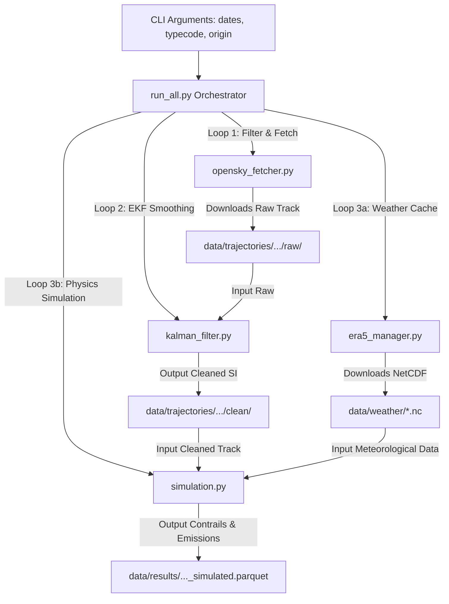

# Flight Physics Kinematic & Weather Pipeline Orchestrator

A high-performance, functionally-composed Python pipeline designed to transform raw ADS-B data into 6D kinematic states, enrich them with high-fidelity ERA5 atmospheric data, and run predictive aircraft performance and contrail modeling (PSFlight & Cocip).

This module operates as the **Main Orchestrator** of the Flight Physics Pipeline.

---

## 1. Module Structure

```text
src/
├── conventions.md           # Central naming, unit, and coding standards
├── run_all.py               # End-to-End Orchestrator script
├── README.md                # This file (Orchestrator documentation)
├── common/                  # Configuration, utilities, and adapters
├── filtering/               # Loop 1a: Population slicing & filtering
├── fetching/                # Loop 1b: OpenSky Trino trajectory downloader
├── processing/              # Loop 2: Kalman EKF smoothing & resampling
├── weather/                 # Loop 3a: ERA5 NetCDF cache downloader
├── synthesis/               # Dynamic corridor synthesis & K-Means clustering
└── physics/                 # Loop 3b: CoCiP & PSFlight physics simulation
```

---

## 2. Function Analysis Solution Tree (FAST)

```text
Module Objectives
 └── Orchestrate the execution of the decoupled Flight Physics Pipeline (End-to-End)
      │
      ├── Sub-objective 1: Calculate future advection temporal padding
      │    └── Solution: Compute weather extended end date (+48h) in run_all.py to cover advection
      │
      ├── Sub-objective 2: Slice and download raw OpenSky trajectories (Loop 1)
      │    └── Solution: Invoke population_filter.py and opensky_fetcher.py using subprocess execution
      │
      ├── Sub-objective 3: Apply Extended Kalman Filtering (Loop 2)
      │    └── Solution: Invoke kalman_filter.py on raw trajectories via subprocess execution
      │
      ├── Sub-objective 4: Update global weather reanalysis cache (Loop 3a)
      │    └── Solution: Invoke era5_manager.py for temporal bounds via subprocess execution
      │
      └── Sub-objective 5: Run PSFlight and CoCiP simulation engine (Loop 3b)
           └── Solution: Invoke simulation.py for performance and contrail predictions
```

---

## 3. Data Workflow

> [!NOTE]
> **Mermaid Render Support**: The workflow diagram below uses Mermaid syntax. If you are viewing this markdown file in VS Code and it does not render visually, you will need to install a Mermaid preview extension, such as **Markdown Preview Mermaid Support** (by Matt Bierner) or view it in an environment that supports it natively (like GitHub or Obsidian).



1. **Advection Padding**: When executed, the orchestrator extends the `--end-date` by exactly 48 hours to account for future contrail advection drift required by the CoCiP model.
2. **Loop 1 (Acquisition)**: Invokes `population_filter.py` and `opensky_fetcher.py` via subprocesses to isolate targeted corridors and download raw coordinate waypoints into isolated raw directories (`data/trajectories/.../raw/`).
3. **Loop 2 (Processing)**: Triggers EKF smoothing and 1-minute resampling via `kalman_filter.py` to strip coordinates noise and save smoothed trajectories to sibling `clean/` directories.
4. **Loop 3a (Weather Cache)**: Invokes `era5_manager.py` to download global reanalysis atmospheric NetCDF datasets to `data/weather/` cache for the requested date window.
5. **Loop 3b (Simulation)**: Runs `simulation.py` to map cleaned tracks over the weather cache, calculating fuel flow, emissions, and contrail radiative forcing, writing the simulated outputs to Parquet.

---

## 4. CLI Usage Guide

### Bash
```bash
# 1. Standard End-to-End Execution
python src/run_all.py \
    --start-date "2025-01-01" \
    --end-date "2025-01-02" \
    --typecode "B738" \
    --origin "EGLL" \
    --sample-size 10 \
    --min-distance 800.0

# 2. Fast-Track Simulation (Bypass Trino download using local raw checkpoint)
python src/run_all.py \
    --start-date "2025-01-01" \
    --end-date "2025-01-02" \
    --typecode "B738" \
    --origin "EGLL" \
    --start-from-raw "data/trajectories/ranks_1_strat_fixed_val_2.0_seed_42_format_oneway_ee7a02/raw/LEPA-LEBL_ab1081_raw.parquet"
```

### PowerShell
```powershell
# 1. Standard End-to-End Execution
python src/run_all.py `
    --start-date "2025-01-01" `
    --end-date "2025-01-02" `
    --typecode "B738" `
    --origin "EGLL" `
    --sample-size 10 `
    --min-distance 800.0

# 2. Fast-Track Simulation (Bypass Trino download using local raw checkpoint)
python src/run_all.py `
    --start-date "2025-01-01" `
    --end-date "2025-01-02" `
    --typecode "B738" `
    --origin "EGLL" `
    --start-from-raw "data/trajectories/ranks_1_strat_fixed_val_2.0_seed_42_format_oneway_ee7a02/raw/LEPA-LEBL_ab1081_raw.parquet"
```

**Parameters**:
* `--csv`: Sliced list CSV/Parquet path.
* `--start-date` / `--end-date`: Query target boundaries (format: `YYYY-MM-DD`).
* `--typecode`: Filter by specific aircraft designator (e.g. `B738`).
* `--origin` / `--dest`: Origin/destination airport ICAO codes.
* `--sample-size`: Number of flights to randomly sample.
* `--start-from-raw`: Resume execution from local raw parquet, skipping Loop 1.
* `--min-distance`: Minimum route distance in kilometers (default: `800.0` km). Bypasses corridors shorter than this threshold.

---

## 5. Prerequisites & Dependencies

### Python Libraries
* `pandas` & `pyarrow` (for data registries and Parquet I/O)
* `pyopensky` (for OpenSky database queries)
* `traffic` (for EKF smoothing)
* `pycontrails` (for PSFlight/Cocip physics simulation)

### Credentials & Keys
* Active Trino login credentials for OpenSky Network.
* Copernicus Climate Data Store (CDSAPI) credentials configured in environment variables or `~/.cdsapirc`.

For naming standards and coordinate reference systems, refer to the centralized **[conventions.md](file:///g:/Meine%20Ablage/UNI/SS26/PythonPipeline%20-%20Kopie/src/conventions.md)** standards.