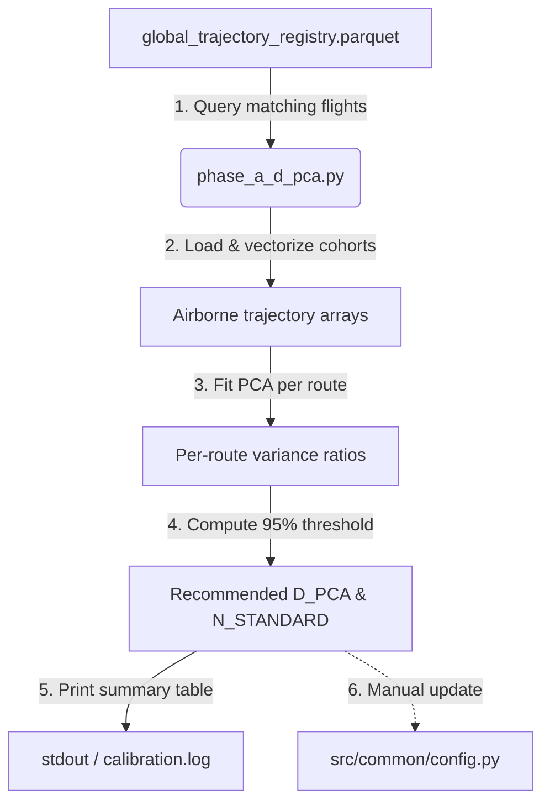
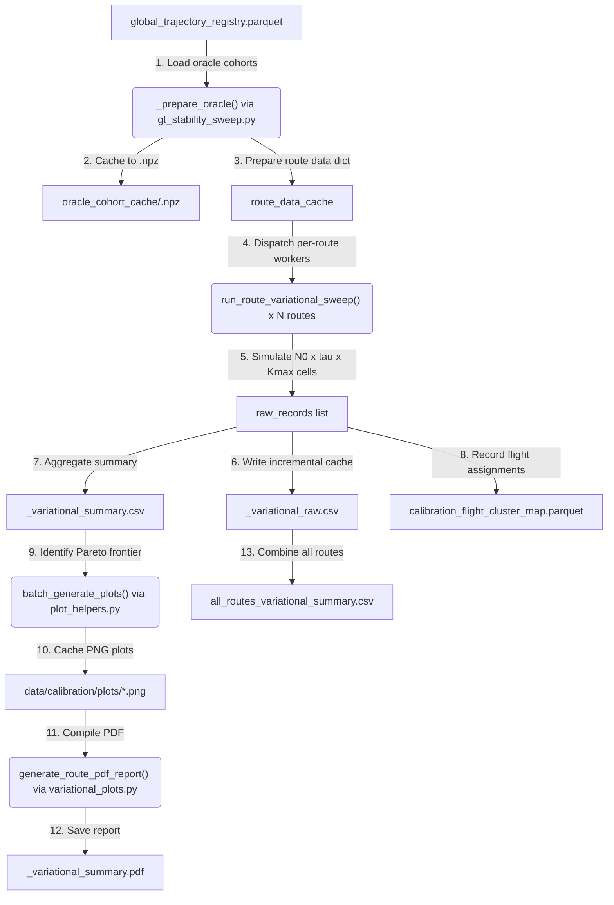
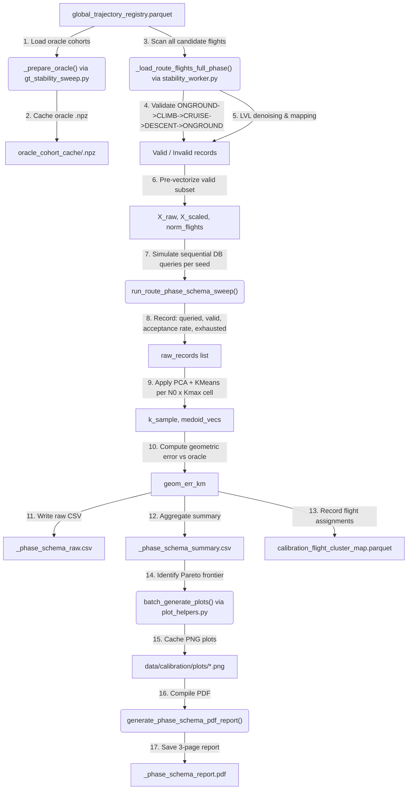
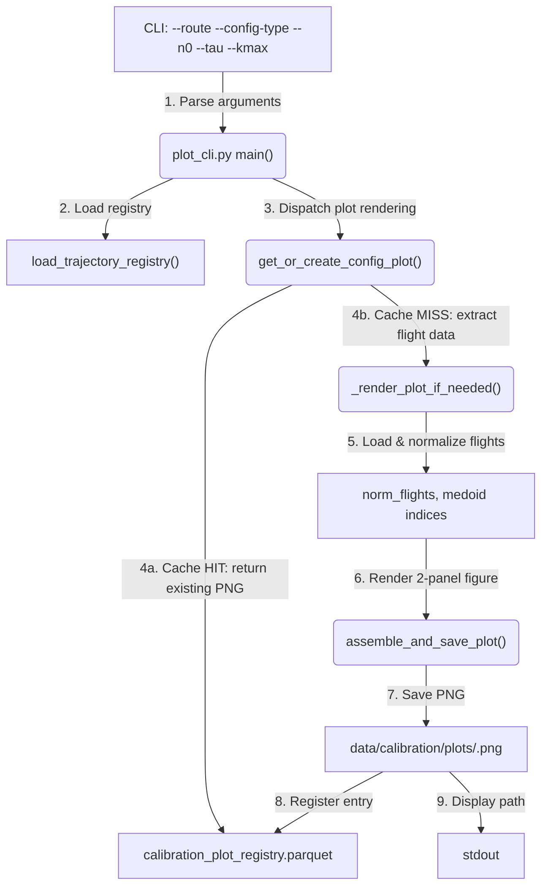
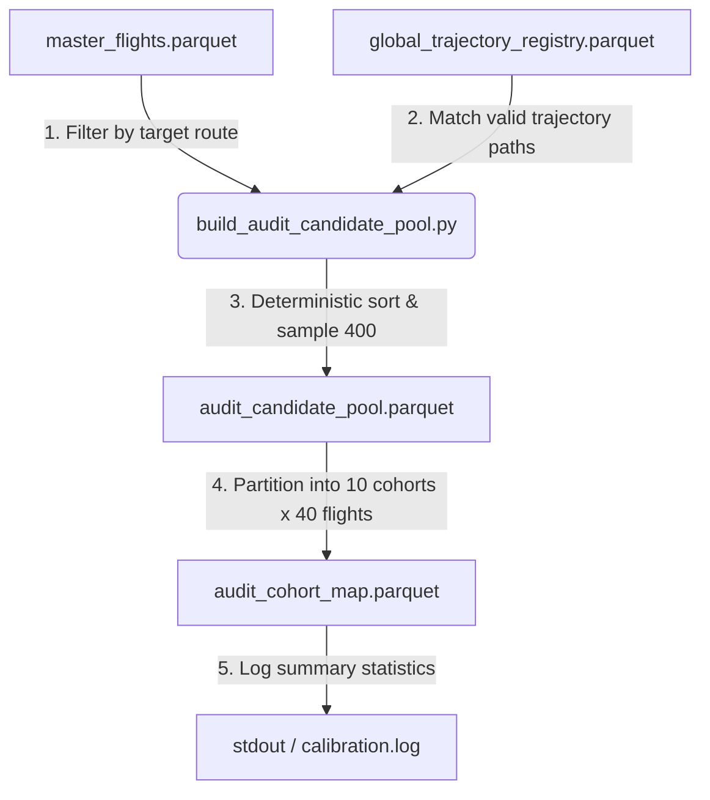
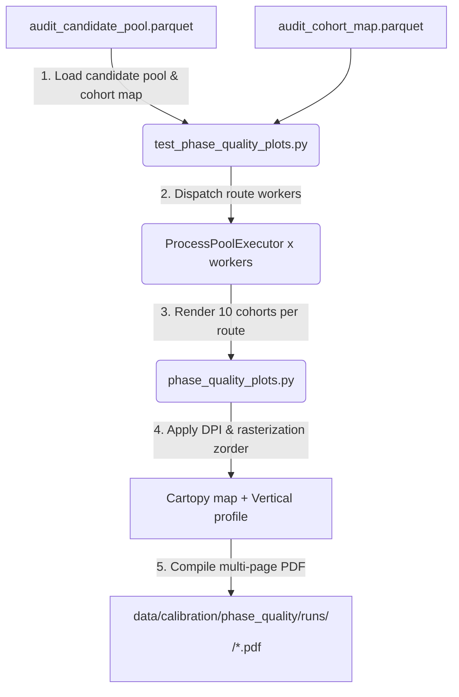

# Hyperparameter Calibration Module

This module handles the calibration of key hyperparameters ($D_{PCA}$, $N_0$, $\tau$, and $K_{max}$) for spatial compression, trajectory stability checking, and corridor clustering. It runs statistical simulations, bootstrap sweeps, and benchmarks against Oracle Ground Truth parameters to optimize query costs while maintaining high-fidelity flight path extraction.

The calibration workflow consists of three main campaigns:

1. **Phase A Calibration (`phase_a_d_pca.py`)**: Evaluates fully-fetched cohorts across calibration routes to determine the minimum number of PCA components ($D_{PCA}$) required to capture at least 95% of spatial coordinate variance.
2. **Phase B / 3D Variational Calibration (`variational_orchestrator.py`)**: Runs grid sweeps across initial query size ($N_0$), stability threshold ($\tau$), and maximum clusters ($K_{max}$) to locate the Pareto frontier of expected query costs versus geometric error.
3. **Phase C / Phase Schema Calibration (`phase_schema_orchestrator.py`)**: Measures the database query cost and acceptance rate required to obtain $N_0$ *structurally valid* trajectories — those whose flight phase sequence strictly follows the pattern `ONGROUND → CLIMB → CRUISE → DESCENT → ONGROUND`.

All outcomes, including summary tables, scatter plots, Pareto frontiers, heatmaps, and multi-page PDF reports, are written to the centralized `data/calibration/` folder (or a custom directory specified via the CLI).

---

## 1. Module Structure

```text
src/analysis/campaigns/
├── __init__.py                    # Standard Python package initialization
├── README.md                      # This documentation file (highly precise technical guide)
├── phase_a_d_pca.py               # Phase A: PCA dimension determination (D_PCA)
├── gt_stability_sweep.py          # Ground Truth geometric error vs. stability metric sweep
├── variational_orchestrator.py    # Phase B: 3D variational parameter sweep (N0 x tau x Kmax grid)
├── variational_plots.py           # Visualization & PDF report compiler for variational sweeps
├── phase_schema_orchestrator.py   # Phase C: Phase schema query cost & acceptance rate calibration
├── build_audit_candidate_pool.py  # Extracts 6x400 candidate flights & builds fixed cohort map
├── phase_quality_plots.py         # Plotting & PDF compilation engine supporting SVG and PNG
├── test_phase_quality_plots.py    # Test runner & multi-worker PDF audit report generator
├── plot_helpers.py                # Cohort trajectory visualization & cache registry helper
└── plot_cli.py                    # Standalone CLI tool to manually render cohort plots
```

---

## 2. Function Analysis Solution Tree (FAST)

```text
Module Objectives
 └── Calibrate spatial compression and stability hyperparameters against Ground Truth
      │
      ├── Sub-objective 1: Determine optimal PCA dimensions (D_PCA)
      │    └── Solution: run_phase_a() in phase_a_d_pca.py
      │         ├── Inputs: raw trajectory registry, calibration routes list (CALIBRATION_ROUTES)
      │         └── Outputs: recommended D_PCA (95% variance) and baseline N_STANDARD
      │
      ├── Sub-objective 2: Benchmark split-half stability metrics against physical deviation
      │    └── Solution: run_gt_sweep() in gt_stability_sweep.py
      │         ├── Inputs: trajectory registry, N values, bootstrap replicates (k-replicates)
      │         └── Outputs: raw/summary error CSV files, error-vs-N line plots, scatter plots
      │
      ├── Sub-objective 3: Orchestrate multi-dimensional grid sweeps (N_0 x tau x K_max)
      │    └── Solution: main() in variational_orchestrator.py
      │         ├── Inputs: route oracle data, parameter grids (N0, tau, Kmax), replicates
      │         ├── Outputs: raw/summary variational CSVs, combined all-route summary, PDF reports
      │         └── Concurrency: Oracle baselines prepared sequentially; route sweeps dispatched
      │                          concurrently via an OOM-resilient ProcessPoolExecutor
      │
      ├── Sub-objective 4: Measure phase schema query cost and acceptance rates
      │    └── Solution: main() in phase_schema_orchestrator.py
      │         ├── Inputs: route oracle data, parameter grids (N0, Kmax), replicates, registry
      │         ├── Safety: LVL-to-CRUISE mapping (--level-as-cruise) and noise run denoising
      │         │           (--min-phase-run-points) prevent over-rejection of near-valid flights
      │         └── Outputs: raw/summary phase schema CSVs, 3-page PDF report, flight cluster map
      │
      ├── Sub-objective 5: Compile visual report dashboards
      │    └── Solution: generate_route_pdf_report() in variational_plots.py
      │         │         generate_phase_schema_pdf_report() in phase_schema_orchestrator.py
      │         ├── Inputs: route summary DataFrame, oracle parameters, out_dir
      │         └── Outputs: multi-page PDF with Pareto table, scatter plot, visualizations, heatmaps
      │
      ├── Sub-objective 6: Compute physical 3D deviation metrics
      │    └── Solution: _compute_geometric_error() in gt_stability_sweep.py
      │         ├── Inputs: sample_medoid_vecs (np.ndarray), oracle_medoid_vecs (np.ndarray)
      │         ├── Formula: Bidirectional Chamfer Distance
      │         │   Error = 0.5 * (Mean(Sample→Oracle) + Mean(Oracle→Sample))
      │         └── Outputs: symmetric mean 3D spatial waypoint deviation in kilometers (float)
      │
      ├── Sub-objective 7: Render clustered cohort plots & manage image registry caching
      │    └── Solution: get_or_create_config_plot() in plot_helpers.py & plot_cli.py
      │         ├── Inputs: route_id, config_type (ORACLE/PARETO), n0, tau, kmax, replicate
      │         ├── Caching: reads/writes metadata to CALIBRATION_PLOT_REGISTRY; PNGs to CALIBRATION_PLOTS_DIR
      │         └── Outputs: 2-panel trajectory plot (Ground Track & Vertical Profile with bold medoids)
      │
      └── Sub-objective 8: Extract candidate pools & generate visual audit reports
           └── Solution: build_audit_candidate_pool.py & test_phase_quality_plots.py
                ├── Inputs: master flights parquet, trajectory registry, cohort map
                ├── Safety: rasterization zorder (--format PNG) prevents laptop PDF rendering lag
                └── Outputs: audit_candidate_pool.parquet, audit_cohort_map.parquet, 6 PDF reports
```

---

## 3. Data Workflow

> [!NOTE]
> **Visual Rendering Warning**: Flowcharts are generated using Mermaid. If your markdown viewer does not natively support Mermaid rendering, please refer to the step-by-step text description provided directly below each diagram.

> [!NOTE]
> **Shared Infrastructure**: All three workflow campaigns share the following infrastructure:
> - **Oracle baseline preparation**: `_prepare_oracle()` from `gt_stability_sweep.py` loads the full flight cohort for a route, computes oracle medoids, and caches the result in `.npz` tensor format at `data/calibration/oracle_cohort_cache/<route_id>.npz` to avoid redundant computation.
> - **Flight cluster mappings**: Written atomically to `CALIBRATION_FLIGHT_CLUSTER_MAP` (`data/calibration/calibration_flight_cluster_map.parquet`) by all sweep orchestrators.
> - **Plot registry & rendering**: `batch_generate_plots()` from `plot_helpers.py` extracts plot data concurrently then renders sequentially on the main thread, caching results in `CALIBRATION_PLOT_REGISTRY`.

---

### 3.1 Workflow A — Phase A PCA Calibration (`phase_a_d_pca.py`)



**Step-by-step:**
1. **Registry query**: `phase_a_d_pca.py` calls `load_trajectory_registry()` to obtain the `global_trajectory_registry.parquet` index, then filters to flights belonging to each route in `CALIBRATION_ROUTES`.
2. **Cohort loading**: Calls `_load_route_flights()` from `stability_worker.py` with `n_target=9999` to load all available trajectories for each route.
3. **Normalization & vectorization**: Calls `classify_and_normalize_cohort()` and `vectorize_cohort()` from `pca_compressor.py` to produce a trajectory matrix `X_raw`.
4. **PCA fitting**: Fits `sklearn.decomposition.PCA` and computes the minimum number of components required to explain ≥95% of cumulative variance.
5. **Output**: Prints a per-route table and the median recommended `D_PCA` to stdout and `data/logs/calibration.log`.
6. **Manual update**: The operator manually updates `D_PCA` and `N_STANDARD = 5 * D_PCA` in `src/common/config.py`.

---

### 3.2 Workflow B — 3D Variational Parameter Sweep (`variational_orchestrator.py`)



**Step-by-step:**
1. **Oracle baseline preparation** (sequential, main process): For each route requiring computation, `_prepare_oracle()` loads its entire flight cohort, runs PCA/clustering to determine the oracle medoid vectors and `k_oracle`, and serializes results to `.npz` cache.
2. **Worker dispatch** (OOM-resilient `ProcessPoolExecutor`): Routes are dispatched in batches of `current_workers`. Each worker receives a pre-built `route_data_cache[route_id]` dict containing pre-computed `X_raw`, `X_scaled`, and `oracle_medoid_vecs`.
3. **Grid cell simulation**: Each cell `(N_0, tau, K_max)` across `replicates` seeds simulates the production Stage 2 stability loop: draw a random subset of size `N_0`, compute `Δ_CV(X_PCA)`, double `N` if `Δ_CV ≥ τ` (up to 2 reruns), then apply KMeans clustering.
4. **Geometric error**: `_compute_geometric_error()` computes symmetric Chamfer distance in km between sample medoids and oracle medoids, penalizing both under- and over-segmentation.
5. **Incremental CSV cache**: Raw records are written to `<route>_variational_raw.csv` per-route, enabling resume across interrupted runs.
6. **Flight cluster mapping**: All flight-to-cluster assignments for every sweep cell are appended to `calibration_flight_cluster_map.parquet` (atomic write pattern).
7. **Pareto plot generation**: After simulation, the Pareto-optimal configurations (non-dominated in avg_queries vs. median_geom_err_km) are identified and their cluster maps are rendered by `batch_generate_plots()`.
8. **PDF report**: `generate_route_pdf_report()` assembles a multi-page PDF: Page 1 (Pareto table), Page 2 (Pareto scatter), Pages 3+ (stacked cohort visualizations), Remaining pages (error heatmaps per K_max with overlaid query cost contours).
9. **Combined summary**: After all routes complete, raw and summary DataFrames are concatenated and written to `all_routes_variational_raw.csv` and `all_routes_variational_summary.csv`.

#### Performance Profile: OOM-Resilient Concurrency

The `ProcessPoolExecutor` uses a dynamic worker count:
$$\text{initial\_workers} = \min\!\left(N_{\text{routes}},\ \text{CPU count},\ \left\lfloor\frac{\text{Free RAM (GB)}}{0.6}\right\rfloor\right)$$

On `MemoryError` or `BrokenProcessPool`, the failed route is re-queued and `current_workers` is decremented by 1 (minimum 1). A `limit_reached` flag locks the count from scaling back up.

---

### 3.3 Workflow C — Phase Schema Calibration (`phase_schema_orchestrator.py`)



**Step-by-step:**
1. **Oracle baseline preparation** (sequential, main process): Identical to Workflow B — `_prepare_oracle()` loads and caches oracle medoid vectors for each calibration route.
2. **Full candidate scan** (`_load_route_flights_full_phase()`): All flights for the route are located in the registry and loaded from their parquet files concurrently via `ThreadPoolExecutor`. Each flight is passed to `validate_and_clean_phase_sequence()`.
3. **Phase schema validation**: The validator normalizes raw phase labels (e.g. `GND`, `CLB`, `DES`) to a canonical set and compresses consecutive identical phases. It then compares the compressed sequence against the expected pattern `[ONGROUND, CLIMB, CRUISE, DESCENT, ONGROUND]`. A mismatch produces a typed rejection reason (e.g. `INVALID_SCHEMA_ONGROUND_CLIMB_DESCENT_ONGROUND`).
4. **LVL denoising & mapping**: With `--level-as-cruise True` (Practical Mode), `LVL` phases sandwiched between climb and descent are remapped to `CRUISE` before pattern matching. With `--min-phase-run-points N`, contiguous phase runs shorter than `N` rows are denoised into their surrounding phase to absorb single-row barometric noise blips.
5. **Pre-vectorization** (once per route, not per replicate): Valid flights are passed through `classify_and_normalize_cohort()` and `vectorize_cohort()` to build `X_raw` and `X_scaled` arrays.
6. **Sequential query simulation** (per replicate seed): The full candidate flight list is shuffled using the replicate seed. The simulator walks through this shuffled list as if issuing sequential database queries, stopping when either `N_0` valid flights are found (success) or the list is exhausted (exhaustion event).
7. **Per-cell metrics recording**: For each `(N_0, K_max)` cell, the replicate records: `queried_flights` (total queries issued), `valid_flights` (valid trajectories found), `acceptance_rate` = `valid_flights / queried_flights`, and `exhausted` (boolean flag).
8. **PCA + clustering**: The valid subset of size `n_eff` is projected with PCA (`d_comp = min(D_PCA, n_eff - 1)`) and `_evaluate_custom_k()` selects the optimal `k_sample ≤ K_max` using Silhouette score.
9. **Geometric error calculation**: Identical to Workflow B — symmetric Chamfer distance between sample medoid vectors and oracle medoid vectors.
10. **CSV output**: Raw records and aggregate summary rows are written per route; `exhaustion_rate` = fraction of replicates where the database was exhausted before reaching `N_0` valid flights.
11. **Flight cluster mapping**: Atomic write to `CALIBRATION_FLIGHT_CLUSTER_MAP` with `tau = -1.0` (sentinel distinguishing Phase C entries from Phase B entries).
12. **Plot & PDF generation**: Same plot pipeline as Workflow B, but the PDF contains: Page 1 (metrics table), Page 2 (2×2 dashboard of query cost / geometric error / acceptance+exhaustion rates / optimal K curves), Pages 3+ (cluster map visualizations).

#### Rejection Reason Taxonomy

| `reject_reason` value | Cause |
| :--- | :--- |
| `NO_PHASE_COLUMN` | `flight_phase` column absent from the DataFrame |
| `ALL_NULL_PHASES` | All phase values are `None` or `NaN` |
| `REJECTED_LVL_STRICT_MODE` | LVL segments present with `--level-as-cruise False` |
| `INVALID_SCHEMA_<SEQ>` | Phase sequence does not match the expected 5-element pattern |
| `TOO_FEW_AIRBORNE_ROWS` | Valid schema but insufficient airborne rows for PCA |
| `MISSING_FILE` | Parquet file absent from disk |
| `CORRUPTED_PARQUET` | File exists but cannot be read |
| `EXCEPTION_IN_VALIDATION` | Unexpected exception during flight object construction |

---

### 3.4 Workflow D — Standalone Plot CLI (`plot_cli.py`)



**Step-by-step:**
1. **Argument parsing**: `plot_cli.py` parses `--route`, `--config-type`, `--n0`, `--tau`, `--kmax`, `--replicate`, `--crop-airports`, and `--crop-padding`.
2. **Registry load**: `load_trajectory_registry()` provides the trajectory index; `load_model_registry()` provides the calibration cluster map.
3. **Cache lookup**: `_render_plot_if_needed()` checks `CALIBRATION_PLOT_REGISTRY` for an existing record matching the exact configuration. Returns the cached PNG path on HIT.
4. **Data extraction** (cache MISS): Loads the flight cluster map from `CALIBRATION_FLIGHT_CLUSTER_MAP`, locates the mapped flight IDs for the given configuration, loads the trajectory files, and normalizes the flights.
5. **Rendering** (main thread only): `assemble_and_save_plot()` creates a 2-panel Cartopy/Matplotlib figure: Left panel = ground track with medoids highlighted; Right panel = altitude profile. Optional map cropping is applied when `crop_airports=True` using airport coordinates + `crop_padding` degrees.
6. **Registry update**: New entries are atomically appended to `CALIBRATION_PLOT_REGISTRY`.

---

### 3.5 Workflow E — Candidate Pool Extraction (`build_audit_candidate_pool.py`)



**Step-by-step:**
1. **Master flights filtering**: `build_audit_candidate_pool.py` loads `master_flights.parquet` and filters rows corresponding to the 6 target European routes (`EDDF-LIRF`, `EGLL-BIKF`, `ESSA-EHAM`, `ESSA-LEMD`, `LFRS-LFMN`, `LGSA-LGAV`).
2. **Trajectory verification**: Matches flight IDs against `global_trajectory_registry.parquet` to ensure physical parquet file availability and computes flight duration in seconds (`duration_s`).
3. **Deterministic sampling**: Sorts candidate flights deterministically by `duration_s` and `flight_id`, taking exactly 400 flights per route and saving them to `audit_candidate_pool.parquet`.
4. **Cohort partitioning**: Partitions each route's 400 flights into 10 fixed cohorts of 40 flights (`cohort_idx` 1 to 10), saving the mapping to `audit_cohort_map.parquet`.
5. **Logging**: Writes progress and cohort totals to `calibration.log`.

---

### 3.6 Workflow F — Phase Quality Plotting & Verification (`test_phase_quality_plots.py`)



**Step-by-step:**
1. **Load tables**: `test_phase_quality_plots.py` loads `audit_candidate_pool.parquet` and `audit_cohort_map.parquet`.
2. **Worker dispatch**: Uses `ProcessPoolExecutor` (calling `setup_file_logger` in each spawned child process on Windows) to evaluate routes concurrently.
3. **Plot rendering**: For each route, iterates through cohorts 1 to 10. `phase_quality_plots.py` renders side-by-side Cartopy ground tracks and time-normalized $[0,1]$ vertical altitude profiles color-coded by `flight_phase` (`GND`, `CL`, `CR`, `DE`, `LVL`).
4. **Rasterization & DPI**: Applies `DEFAULT_DPI = 150`. If `--format PNG` is specified, sets `ax.set_rasterization_zorder(10)` so trajectory line collections are rasterized into lightweight bitmaps while preserving vector text and axes.
5. **PDF compilation**: Assembles a 10-page audit report per route and saves it to the target output directory (defaulting to `data/calibration/phase_quality/runs/baseline_no_filter_<format>/`).

---

## 4. CLI Usage Guide

### 4.1 Bash

```bash
# Phase A: PCA dimension calibration
python -m src.analysis.campaigns.phase_a_d_pca

# Phase B: 3D Variational sweep (30 replicates, all calibration routes)
python -m src.analysis.campaigns.variational_orchestrator \
    --replicates 30

# Phase B: Variational sweep with custom output directory and worker limit
python -m src.analysis.campaigns.variational_orchestrator \
    --replicates 5 \
    --out-dir "data/calibration/run_v2" \
    --max-workers 4

# Phase B: Dry-run variational sweep (1 route, 2 replicates, no PDF output)
python -m src.analysis.campaigns.variational_orchestrator \
    --dry-run

# Phase C: Phase schema calibration (30 replicates, all routes)
python -m src.analysis.campaigns.phase_schema_orchestrator \
    --replicates 30

# Phase C: Phase schema — strict LVL mode, custom output directory
python -m src.analysis.campaigns.phase_schema_orchestrator \
    --replicates 30 \
    --level-as-cruise False \
    --min-phase-run-points 5 \
    --out-dir "data/calibration/phase_schema_strict"

# Phase C: Dry-run (1 route, 2 replicates, no PDF output)
python -m src.analysis.campaigns.phase_schema_orchestrator \
    --dry-run

# Plot CLI: Generate Oracle cohort visualization
python -m src.analysis.campaigns.plot_cli \
    --route "LOWW-EHAM" \
    --config-type "oracle"

# Plot CLI: Generate Pareto config visualization with airport crop
python -m src.analysis.campaigns.plot_cli \
    --route "LOWW-EHAM" \
    --config-type "pareto" \
    --n0 64 \
    --tau 0.10 \
    --kmax 4 \
    --crop-airports \
    --crop-padding 1.5

# GT Sweep: Ground Truth geometric error vs. stability
python -m src.analysis.campaigns.gt_stability_sweep \
    --k-replicates 30

# Candidate Pool: Extract 6x400 candidate flights & build cohort map
python -m src.analysis.campaigns.build_audit_candidate_pool

# Phase Quality Audit: Generate 6 baseline audit PDFs (SVG format)
python -m src.analysis.campaigns.test_phase_quality_plots \
    --all \
    --workers 4 \
    --format SVG

# Phase Quality Audit: Generate lightweight PNG rasterized audit PDFs in custom folder
python -m src.analysis.campaigns.test_phase_quality_plots \
    --all \
    --workers 4 \
    --format PNG \
    --out-dir "data/calibration/phase_quality/runs/my_test_run"
```

### 4.2 PowerShell

```powershell
# Phase A: PCA dimension calibration
python -m src.analysis.campaigns.phase_a_d_pca

# Phase B: 3D Variational sweep (30 replicates, all calibration routes)
python -m src.analysis.campaigns.variational_orchestrator `
    --replicates 30

# Phase B: Variational sweep with custom output directory and worker limit
python -m src.analysis.campaigns.variational_orchestrator `
    --replicates 5 `
    --out-dir "data/calibration/run_v2" `
    --max-workers 4

# Phase B: Dry-run variational sweep (1 route, 2 replicates, no PDF output)
python -m src.analysis.campaigns.variational_orchestrator `
    --dry-run

# Phase C: Phase schema calibration (30 replicates, all routes)
python -m src.analysis.campaigns.phase_schema_orchestrator `
    --replicates 30

# Phase C: Phase schema — strict LVL mode, custom output directory
python -m src.analysis.campaigns.phase_schema_orchestrator `
    --replicates 30 `
    --level-as-cruise False `
    --min-phase-run-points 5 `
    --out-dir "data/calibration/phase_schema_strict"

# Phase C: Dry-run (1 route, 2 replicates, no PDF output)
python -m src.analysis.campaigns.phase_schema_orchestrator `
    --dry-run

# Plot CLI: Generate Oracle cohort visualization
python -m src.analysis.campaigns.plot_cli `
    --route "LOWW-EHAM" `
    --config-type "oracle"

# Plot CLI: Generate Pareto config visualization with airport crop
python -m src.analysis.campaigns.plot_cli `
    --route "LOWW-EHAM" `
    --config-type "pareto" `
    --n0 64 `
    --tau 0.10 `
    --kmax 4 `
    --crop-airports `
    --crop-padding 1.5

# GT Sweep: Ground Truth geometric error vs. stability
python -m src.analysis.campaigns.gt_stability_sweep `
    --k-replicates 30

# Candidate Pool: Extract 6x400 candidate flights & build cohort map
python -m src.analysis.campaigns.build_audit_candidate_pool

# Phase Quality Audit: Generate 6 baseline audit PDFs (SVG format)
python -m src.analysis.campaigns.test_phase_quality_plots `
    --all `
    --workers 4 `
    --format SVG

# Phase Quality Audit: Generate lightweight PNG rasterized audit PDFs in custom folder
python -m src.analysis.campaigns.test_phase_quality_plots `
    --all `
    --workers 4 `
    --format PNG `
    --out-dir "data/calibration/phase_quality/runs/my_test_run"
```

---

### 4.3 Parameter Reference Tables

#### `gt_stability_sweep.py`

| CLI Option | Type | Default | Description |
| :--- | :--- | :--- | :--- |
| `--k-replicates` | `int` | `30` | Number of bootstrap replicate selections to run per sample size. |
| `--table-only` | `flag` | `False` | If set, generates and saves only summary CSV files, bypassing Matplotlib plot rendering. |

#### `variational_orchestrator.py`

| CLI Option | Type | Default | Description |
| :--- | :--- | :--- | :--- |
| `--replicates` | `int` | `30` | Number of bootstrap replicate simulations to run per parameter grid cell. |
| `--dry-run` | `flag` | `False` | Limits the sweep to 1 route, 2 replicates; disables PDF report rendering. |
| `--max-workers` | `int` | `None` | Upper bound on starting process concurrency. Defaults to dynamic RAM/CPU estimate. |
| `--out-dir` | `str` | `None` | Custom destination directory for CSVs and PDFs. Defaults to `data/calibration/`. |
| `--disable-scale-up` | `flag` | `False` | If set, prevents dynamic worker count escalation after successful batches. |

#### `phase_schema_orchestrator.py`

| CLI Option | Type | Default | Description |
| :--- | :--- | :--- | :--- |
| `--replicates` | `int` | `30` | Number of bootstrap replicate simulations (shuffled query sequences) per cell. |
| `--dry-run` | `flag` | `False` | Limits the sweep to 1 route, 2 replicates; disables PDF report rendering. |
| `--max-workers` | `int` | `None` | Upper bound on starting process concurrency. Defaults to dynamic RAM/CPU estimate. |
| `--out-dir` | `str` | `None` | Custom destination directory for CSVs and PDFs. Defaults to `data/calibration/phase_schema/`. |
| `--level-as-cruise` | `bool` | `True` | **Practical Mode**: maps `LVL` phase segments to `CRUISE` before schema validation. Set `False` for strict rejection of any `LVL` segment. |
| `--min-phase-run-points` | `int` | `3` | Minimum number of rows in a contiguous phase run. Shorter runs are denoised into adjacent phases to prevent rejection due to single-row barometric artifacts. |
| `--crop-airports` | `flag` | `False` | If set, crops generated cluster map PNGs to the airport bounding box. |
| `--crop-padding` | `float` | `1.5` | Padding in degrees added around airport coordinates when `--crop-airports` is active. |

#### `plot_cli.py`

| CLI Option | Type | Default | Description |
| :--- | :--- | :--- | :--- |
| `--route` | `str` | *(required)* | Route ID to visualize (e.g. `LOWW-EHAM`). |
| `--config-type` | `str` | `oracle` | Configuration type: `oracle` or `pareto`. |
| `--n0` | `int` | `64` | Initial sample size $N_0$ (only used when `--config-type pareto`). |
| `--tau` | `float` | `0.10` | Stability threshold $\tau$ (only used when `--config-type pareto`). |
| `--kmax` | `int` | `4` | Maximum clusters $K_{max}$ (only used when `--config-type pareto`). |
| `--replicate` | `int` | `0` | Replicate seed index to plot (only used when `--config-type pareto`). |
| `--crop-airports` | `flag` | `False` | If set, crops the ground track map panel to the route's airport bounding box. |
| `--crop-padding` | `float` | `1.5` | Padding in degrees applied around airport coordinates when cropping. |

#### `test_phase_quality_plots.py`

| CLI Option | Type | Default | Description |
| :--- | :--- | :--- | :--- |
| `--route` | `str` | `EDDF-LIRF` | Route ID to test (when `--all` is not specified). |
| `--all` | `flag` | `False` | Evaluate all 6 target calibration routes. |
| `--workers` | `int` | `1` | Number of parallel worker processes for PDF generation. |
| `--format` | `str` | `SVG` | Plot rendering format (`SVG` vector or `PNG` rasterized bitmap). |
| `--out-dir` | `str` | `None` | Custom output folder for PDF reports. Defaults to `data/calibration/phase_quality/runs/baseline_no_filter_<format>/`. |

---

## 5. Prerequisites & Dependencies

### Python Libraries

| Library | Purpose |
| :--- | :--- |
| `pandas` & `pyarrow` | Parquet and CSV table I/O |
| `numpy` | Matrix math, distance calculations, vectorized scaling |
| `scikit-learn` | PCA decomposition and KMeans clustering |
| `matplotlib` | Heatmaps, scatter plots, and multi-page PDF generation |
| `psutil` | CPU and RAM monitoring for dynamic worker allocation |
| `cartopy` | Geographic map rendering in cohort visualization plots |

### Registry Files Referenced

| Registry File (via `config.py`) | Description |
| :--- | :--- |
| `GLOBAL_TRAJECTORY_REGISTRY` | Master index of all processed trajectory parquet files |
| `GLOBAL_MODEL_REGISTRY` | Corridor model registry used by Oracle tier-2 cache lookup |
| `CALIBRATION_FLIGHT_CLUSTER_MAP` | Parquet table of flight-to-cluster assignments for all sweep replicates |
| `CALIBRATION_PLOT_REGISTRY` | Parquet metadata table caching rendered cohort plot PNG paths |
| `AUDIT_CANDIDATE_POOL` | Parquet table containing fixed 2,400 candidate flights across 6 routes |
| `AUDIT_COHORT_MAP` | Parquet mapping assigning flights to fixed cohort slots 1 to 10 |

### Config Constants Referenced

| Constant | Usage |
| :--- | :--- |
| `BASE_DIR` | Root path for all relative path construction |
| `CALIBRATION_ROUTES` | Canonical list of calibration route IDs (e.g. `EDDF-LIRF`) |
| `D_PCA` | Target PCA dimensionality (set by Phase A campaign) |
| `SILHOUETTE_THRESHOLD` | Minimum silhouette score for accepting a KMeans split |
| `CALIBRATION_PLOTS_DIR` | Output directory for cohort PNG files |

### Log File

All calibration campaigns write to **`data/logs/calibration.log`** (constant `LOGS_DIR / "calibration.log"` as defined in `src/common/utils.py`). The `setup_file_logger("calibration")` call at the top of each `main()` block initializes a rotating file handler appending to this log across multiple runs.

For physical units, coordinate transformations, and directory structure conventions, refer to the centralized **[conventions.md](file:///g:/Meine%20Ablage/UNI/SS26/PythonPipeline%20-%20Kopie/src/conventions.md)** standards.
