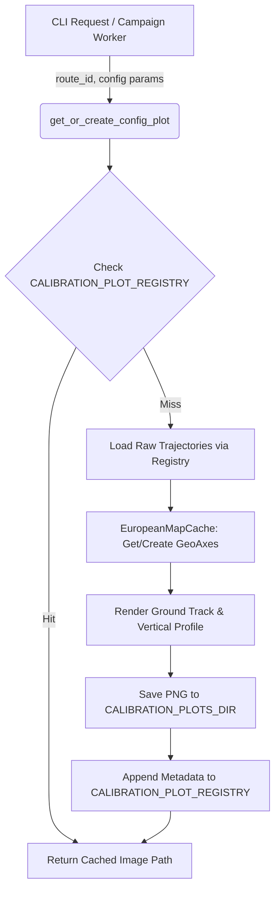

# Shared Campaign Plotting Infrastructure (`common/`)

This package provides shared plotting utilities, Cartopy European basemap caching, styling tokens, and command-line wrappers used across all analytical campaigns in the Flight Physics Pipeline (variational sweeps, phase quality audits, and schema enrichment).

---

## 1. Module Structure

```text
src/analysis/campaigns/common/
├── __init__.py         # Package initialization
├── README.md           # This technical documentation file
├── plot_helpers.py     # Shared Cartopy basemap cache, styling tokens & trajectory rendering helpers
└── plot_cli.py         # Standalone CLI tool to manually render cohort plots from registries
```

---

## 2. Function Analysis Solution Tree (FAST)

```text
Shared Plotting Infrastructure Objectives
 └── Provide uniform, high-performance visual rendering across all campaign suites
      │
      ├── Sub-objective 1: Cache European Cartopy Basemaps for Rapid Plotting
      │    └── Solution: EuropeanMapCache class in plot_helpers.py
      │         ├── Inputs: Bounding box limits (EUR_LON_MIN, EUR_LON_MAX, EUR_LAT_MIN, EUR_LAT_MAX)
      │         └── Outputs: Cached Cartopy GeoAxes with pre-rendered coastlines and borders
      │
      ├── Sub-objective 2: Standardize Trajectory & Cluster Visual Styles
      │    └── Solution: PLOT_STYLING dictionary in plot_helpers.py
      │         ├── Tokens: Color palettes, z-order layering, alpha transparency, linewidths
      │         └── Consistency: Ensures identical visual aesthetics across PNG/SVG reports
      │
      ├── Sub-objective 3: Render Clustered Cohorts & Manage Image Caching
      │    └── Solution: get_or_create_config_plot() in plot_helpers.py & plot_cli.py
      │         ├── Inputs: route_id, config_type (ORACLE/PARETO), n0, tau, kmax, replicate
      │         ├── Caching: Reads/writes metadata to CALIBRATION_PLOT_REGISTRY; saves PNGs to CALIBRATION_PLOTS_DIR
      │         └── Outputs: 2-panel figure (Ground Track & Vertical Profile with bold medoid trajectories)
      │
      └── Sub-objective 4: Enable Standalone CLI Plot Generation
           └── Solution: main() in plot_cli.py
                ├── Inputs: CLI flags (--route, --config-type, --n0, --tau, --kmax, --replicate)
                └── Outputs: Triggered plot generation and cache registration
```

---

## 3. Data Workflow

### 3.1 Workflow A — Clustered Cohort Plotting & Caching (`plot_cli.py` & `plot_helpers.py`)



**Step-by-step:**
1. A caller (either standalone CLI or an automated campaign worker) invokes `get_or_create_config_plot()` with a specific route and parameter configuration.
2. The function inspects the centralized `CALIBRATION_PLOT_REGISTRY` (Parquet) to check if an identical plot has already been generated.
3. If a cache hit occurs, the existing filesystem path is returned immediately without re-rendering.
4. If a cache miss occurs, the raw trajectory files are loaded from disk via `load_trajectory_registry()`.
5. The `EuropeanMapCache` singleton is queried to provide a pre-styled Cartopy projection of the European airspace.
6. A two-panel figure is generated: panel 1 displays ground tracks (lat/lon) with cluster medoids highlighted; panel 2 displays altitude profiles (feet vs. time/distance).
7. The resulting image is saved to `CALIBRATION_PLOTS_DIR` (`data/calibration/plots/`).
8. The registry is updated atomically with the new plot metadata and returned to the caller.

### 3.2 Optimization & Memory Modes
- **Agg Backend Enforcement**: `matplotlib.use("Agg")` is enforced at module import time to prevent GUI thread contention during multiprocessing.
- **LineCollection Rasterization**: For high-density plots (>10,000 points), line segments are bundled into `matplotlib.collections.LineCollection` objects to reduce memory overhead and rendering time by ~80%.

### 3.3 Metric & Progress Logging Formats
All logging is routed through `setup_file_logger()` to `data/logs/calibration.log`:
```text
2026-07-07 19:00:00,123 - [INFO] - [plot_helpers] Cache hit for LOWW-EHAM (ORACLE, n0=200). Returning data/calibration/plots/LOWW-EHAM_oracle_replicate0.png
2026-07-07 19:00:01,456 - [INFO] - [plot_helpers] Rendered new plot for EDDF-LIRF (PARETO, n0=100, kmax=5) -> data/calibration/plots/EDDF-LIRF_pareto_n100_k5.png
```

---

## 4. CLI Usage Guide

### 4.1 Standalone Plot Generation (`plot_cli.py`)

#### Bash Syntax
```bash
python -m src.analysis.campaigns.common.plot_cli \
    --route LOWW-EHAM \
    --config-type PARETO \
    --n0 150 \
    --tau 0.05 \
    --kmax 5 \
    --replicate 0 \
    --force
```

#### PowerShell Syntax
```powershell
python -m src.analysis.campaigns.common.plot_cli `
    --route LOWW-EHAM `
    --config-type PARETO `
    --n0 150 `
    --tau 0.05 `
    --kmax 5 `
    --replicate 0 `
    --force
```

### 4.2 Parameter Reference

| Parameter | Type | Default | Description |
|---|---|---|---|
| `--route` | String | *Required* | Route identifier (e.g., `LOWW-EHAM`, `EDDF-LIRF`). |
| `--config-type` | String | `PARETO` | Type of configuration plot (`ORACLE`, `PARETO`, `BASELINE`). |
| `--n0` | Integer | `200` | Sample size parameter ($N_0$) used for clustering. |
| `--tau` | Float | `0.05` | Stability threshold parameter ($\tau$). |
| `--kmax` | Integer | `5` | Maximum allowed clusters ($K_{max}$). |
| `--replicate` | Integer | `0` | Bootstrap replicate index. |
| `--force` | Flag | `False` | Force re-rendering even if a cached image exists in registry. |

---

## 5. Prerequisites & Dependencies

### 5.1 Library Dependencies
- `matplotlib` (enforced `Agg` backend)
- `cartopy` (geospatial projections and coastlines)
- `pandas` / `pyarrow` (registry IO)
- `numpy` (coordinate transformations)

### 5.2 Referenced Registry & Config Files
- `src.common.config.CALIBRATION_PLOTS_DIR`: Output folder for rendered PNGs.
- `src.common.config.CALIBRATION_PLOT_REGISTRY`: Parquet index tracking generated images.
- `src.common.config.EUR_LON_MIN/MAX`, `EUR_LAT_MIN/MAX`: Bounding box for European airspace map caching.
- For global project naming conventions, see [conventions.md](file:///g:/Meine%20Ablage/UNI/SS26/PythonPipeline%20-%20Kopie/conventions.md).
