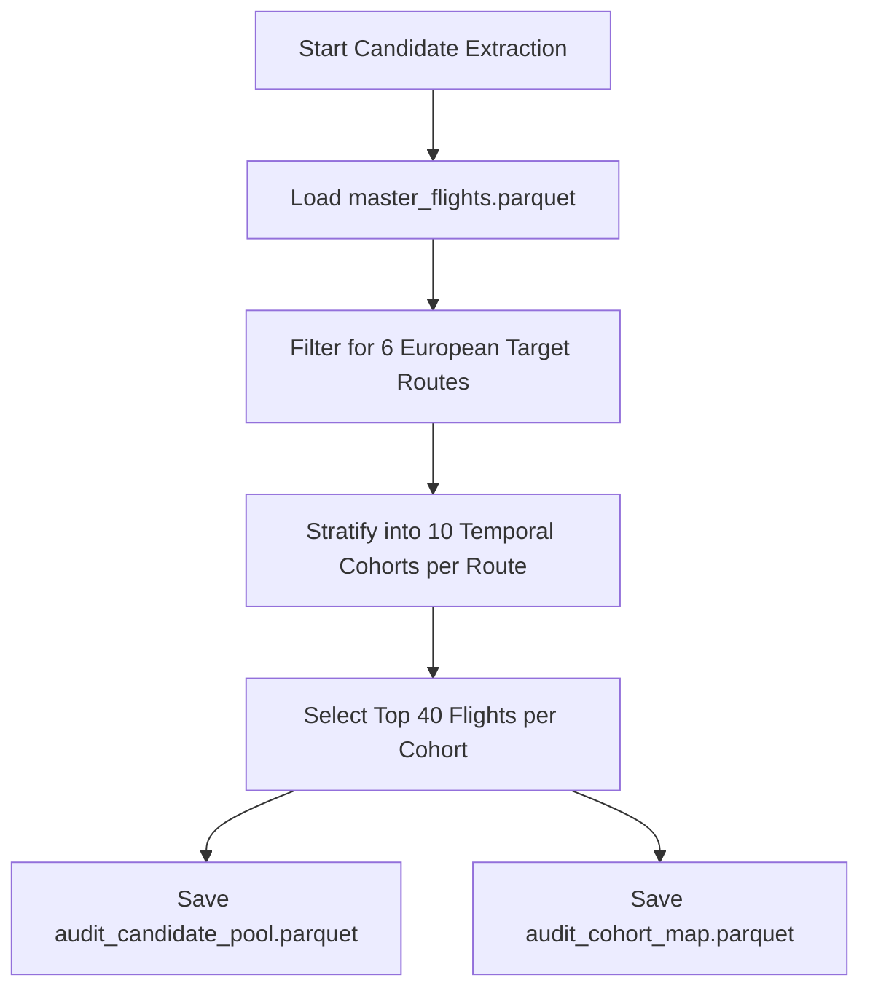
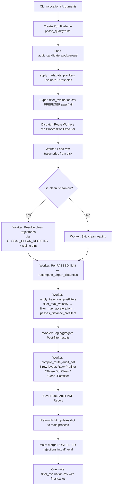
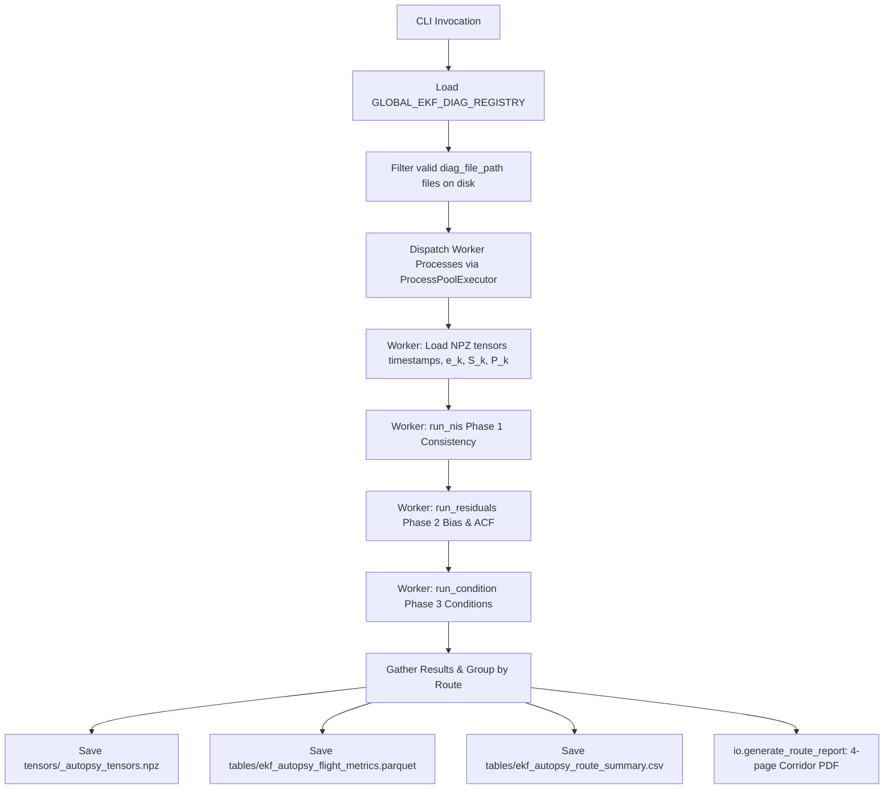

# Flight Phase Quality & Audit Campaign Suite (`phase_quality/`)

This package extracts standardized flight audit candidate pools across European target corridors and evaluates them against configurable metadata pre-filters and trajectory post-filters. It generates comprehensive evaluation tables (`filter_evaluation.csv`) and compiles multi-page visual audit PDF reports (supporting both vector SVG and rasterized PNG modes).

---

## 1. Module Structure

```text
src/analysis/campaigns/phase_quality/
├── __init__.py                    # Package initialization
├── README.md                      # This technical documentation file
├── analyze_ekf_diagnostics.py     # Script 3: EKF diagnostics offline mathematical autopsy CLI bootstrap
├── diagnostics.py                 # Pure mathematics module (All 3 phases + sym_cond)
├── io.py                          # All filesystem interactions + PDF/PNG reporting
├── orchestration.py               # Process pool master driver & worker
├── build_audit_candidate_pool.py  # Script 1: Candidate pool extraction (6x400 flights) & cohort map
├── phase_quality_filters.py       # Script 2 Part B: Pre-filtering & post-filtering rules engine
├── run_phase_quality_campaign.py  # Script 2 Part C: Campaign orchestrator & evaluation table export
├── phase_quality_plots.py         # Script 2 Part A: PDF plotting engine (Cartopy basemaps + profiles)
└── test_phase_quality_plots.py    # Script 2 Test runner & multi-worker report compilation
```

---

## 2. Function Analysis Solution Tree (FAST)

```text
Phase Quality Campaign Objectives
 └── Audit flight data quality across European corridors and generate visual inspection reports
      │
      ├── Sub-objective 1: Extract Representative Candidate Pool (6 routes x 400 flights)
      │    └── Solution: main() in build_audit_candidate_pool.py
      │         ├── Inputs: master_flights parquet, trajectory registry
      │         ├── Stratification: 10 temporal cohorts per route (40 flights per cohort)
      │         └── Outputs: audit_candidate_pool.parquet, audit_cohort_map.parquet
      │
      ├── Sub-objective 2: Evaluate Metadata Pre-Filters (Script 2 Part B)
      │    └── Solution: apply_metadata_prefilters() in phase_quality_filters.py
      │         ├── Inputs: Candidate DataFrame, threshold parameters (max horiz/vert dist, min duration)
      │         ├── Unit Conversion: Route median duration converted from minutes to seconds (* 60.0)
      │         └── Outputs: Annotated DataFrame with status, fail_stage, and reject_reason
      │
      ├── Sub-objective 3: Evaluate Trajectory Post-Filters (Script 2 Part B)
      │    └── Solution: apply_trajectory_postfilters() in phase_quality_filters.py
      │         ├── Helper: calculate_coordinate_velocity_3d(df_clean) → pd.Series of 3D m/s step-to-step via Haversine + altitude diff
      │         ├── Helper: calculate_acceleration(df_clean) → pd.Series of 3D m/s² step-to-step
      │         ├── Helper: get_airport_coords(origin_icao, dest_icao) → dict via airportsdata
      │         ├── Helper: recompute_airport_distances(df_clean, airport_coords) → df with dist_hor_nm, dist_vert_ft, dist_total_nm
      │         ├── filter_max_coordinate_velocity(df_clean, thresholds): coordinate-derived 3D speed = √(v_horiz_kt² + v_vert_kt²) via Haversine; rejects if max_speed_3d_kt > max_velocity_kt (650 kt); metric: max_speed_3d_kt
      │         ├── filter_max_velocity(df_clean, thresholds): kinematic-column 3D speed = √(gs_kt² + rocd_kt²); reject if > max_velocity_kt (650 kt)
      │         ├── filter_max_acceleration(df_clean, thresholds): step-to-step 3D acceleration; reject if > max_acceleration_mps2 (340.29 m/s² ≈ Mach 1)
      │         ├── passes_distance_prefilters(df_clean, thresholds): haversine distance from first/last waypoint to origin/dest airport; reject on configured horiz/vert limits
      │         ├── Short-circuit: filter chain stops at first rejection (coord velocity → kinematic velocity → acceleration → distance)
      │         └── Outputs: (rejected: bool, reason: str, metrics: dict) per flight; aggregated POSTFILTER status written to filter_evaluation.csv
      │
      ├── Sub-objective 4: Orchestrate Multi-Route Campaign Runs (Script 2 Part C)
      │    └── Solution: main() in run_phase_quality_campaign.py
      │         ├── Concurrency: Multi-process execution across routes via ProcessPoolExecutor
      │         └── Outputs: Run-specific folder with filter_evaluation.csv and 6 PDF reports
      │
      ├── Sub-objective 5: Compile Multi-Page Visual Audit PDF Reports (Script 2 Part A)
      │    └── Solution: compile_route_audit_pdf() in phase_quality_plots.py
      │         ├── Inputs: Route trajectories, evaluation status records, output format (PNG/SVG)
      │         ├── Safety: Rasterized PNG mode (--format PNG) prevents laptop PDF rendering lag
      │         └── Outputs: 10-page audit PDF report per route (40 flights rendered per page)
      │
      └── Sub-objective 6: Perform Offline Deep EKF Tensor Diagnostic Autopsy (Script 3)
           └── Solution: main() in analyze_ekf_diagnostics.py (delegating to diagnostics.py, io.py, orchestration.py)
                ├── Inputs: GLOBAL_EKF_DIAG_REGISTRY, 3D tensor NPZ files (e_k, S_k, P_k)
                ├── Math Phases: Phase 1 (NIS vs Chi2_6), Phase 2 (Residuals ACF), Phase 3 (Condition & Drift)
                └── Outputs: Flight metrics parquet, route summary CSV, compressed route tensors npz, 4-page corridor PDF reports
```

---

## 3. Data Workflow

### 3.1 Workflow A — Candidate Pool Extraction (`build_audit_candidate_pool.py`)



**Step-by-step:**
1. Load the centralized master flights dataset (`master_flights.parquet`).
2. Filter records for the six canonical European corridors (`EDDF-LIRF`, `ESSA-EHAM`, `EGLL-BIKF`, `LGSA-LGAV`, `LFRS-LFMN`, `ESSA-LEMD`).
3. Partition each route's flights into 10 chronological cohorts based on departure timestamps.
4. Select up to 40 candidate flights per cohort (totaling 400 flights per route, 2,400 flights overall).
5. Save the candidate pool metadata to `data/calibration/phase_quality/audit_candidate_pool.parquet`.
6. Save the relational mapping table to `data/calibration/phase_quality/audit_cohort_map.parquet`.

---

### 3.2 Workflow B — Phase Quality Campaign Orchestration (`run_phase_quality_campaign.py`)



**Step-by-step:**
1. Parse CLI arguments specifying filter thresholds, output format (`PNG` vs `SVG`), and target routes.
2. Generate a descriptive run directory inside `data/calibration/phase_quality/runs/` (e.g., `run_depvert1000_arrvert1000_durabove20_durbelow20_svg`).
3. Load the candidate pool DataFrame from `audit_candidate_pool.parquet`.
4. Execute `apply_metadata_prefilters()` row-by-row to evaluate departure/arrival horizontal and vertical distances, candidate counts, and route duration anomalies.
5. Annotate each flight with `status` (`PASSED` vs `REJECTED`), `fail_stage`, and `reject_reason`; export the initial summary table to `filter_evaluation.csv`.
6. Dispatch multi-page PDF compilation tasks across parallel worker processes using `ProcessPoolExecutor`.
7. Each worker loads raw parquet trajectory files for its assigned route. If `--use-clean` or `--clean-dir` is specified, it resolves clean EKF trajectory files by searching `GLOBAL_CLEAN_REGISTRY`, the explicitly provided `clean_dir`, and standard sibling `clean/` directories in that order.
8. For each flight that passed pre-filtering and has a clean trajectory, the worker optionally calls `recompute_airport_distances()` (when `RECOMPUTE_AIRPORT_DISTANCES = True`) to augment the clean DataFrame with freshly computed `dist_hor_nm`, `dist_vert_ft`, and `dist_total_nm` columns using the `airportsdata` library.
9. `apply_trajectory_postfilters()` is invoked per flight with short-circuit semantics:
   - **Step 1.0 — Coordinate-derived 3-D velocity**: `filter_max_coordinate_velocity()` computes `max_speed_3d_kt` using `calculate_coordinate_velocity_3d()` — the Haversine horizontal distance between consecutive GPS waypoints plus altitude delta — converted to knots. Rejects if `max_speed_3d_kt` exceeds `DEFAULT_POSTFILTER_THRESHOLDS["max_velocity_kt"]` (650 kt).
   - **Step 1.5 — Kinematic-column velocity**: `filter_max_velocity()` checks the same velocity limit using reported `gs` and `rocd` columns instead of GPS-derived values.
   - **Step 2 — Acceleration**: `filter_max_acceleration()` rejects if max step-to-step 3D acceleration exceeds `max_acceleration_mps2` (≈ Mach 1).
   - **Step 3 — Distance prefilters**: `passes_distance_prefilters()` checks re-computed waypoint-to-airport distances. The chain stops at the first rejection.
10. A per-route aggregate log is emitted: `[ROUTE] Post-filter results: N PASSED, M REJECTED (reasons: ...)`.
11. The worker compiles a 10-page visual audit PDF. When clean trajectories are loaded, each cohort page renders a **3-row 3×2 grid**: Row 1 (Raw + Prefilter), Row 2 (Those But Clean — ignoring POSTFILTER rejections), Row 3 (Clean + Postfilter — full combined rejection view).
12. Each worker returns a `flight_updates` dict mapping `flight_id → {status, fail_stage, reject_reason}` for all POSTFILTER rejections back to the main process.
13. The main process merges all worker updates into the global `df_eval`, overwrites `filter_evaluation.csv` with the final post-filtered statuses, and logs the total count of POSTFILTER rejections applied.

---

### 3.3 Workflow C — Deep EKF Tensor Diagnostic Autopsy (`analyze_ekf_diagnostics.py`)



**Step-by-step:**
1. Load `GLOBAL_EKF_DIAG_REGISTRY` to find EKF diagnostic NPZ file paths.
2. Filter registry rows for flights whose `diag_file_path` actually exists in the workspace.
3. Spawn subprocesses using `ProcessPoolExecutor` with max workers.
4. Each worker loads a flight's EKF arrays (`timestamps`, `e_k`, `S_k`, `P_k`) into memory.
5. If Phase 1 NIS is enabled, solve $S_k x = e_k$ to compute $\epsilon_k = e_k^T S_k^{-1} e_k$ and check against Chi-Square confidence bounds $[1.237, 14.449]$.
6. If Phase 2 Residuals is enabled, compute mean residuals across the 6 axes and Lags 1–10 sample autocorrelation.
7. If Phase 3 Condition is enabled, compute State and Innovation covariance condition numbers using symmetric eigenvalue decompositions, identifying mid-flight condition spikes and state diagonals variance drift.
8. Consolidate results across all workers and group them by route.
9. Export route time-series tensors to a consolidated `.npz` archive.
10. Write flat flight-level autopsy tables (`ekf_autopsy_flight_metrics.parquet`) and corridor route summaries (`ekf_autopsy_route_summary.csv`).
11. Compile a 4-page Corridor Autopsy PDF report displaying scatter dashboards, pooled NIS density vs. theoretical $\chi^2_6$, 6-axis residual violins, and ACF whiteness bands.

---

### 3.4 Optimization & Memory Modes
- **Rasterized PNG Mode**: When `--format PNG` is selected in Script 2, trajectory lines are rasterized at 150 DPI while text and axes remain vector graphics. This prevents severe PDF rendering lag on standard laptops when viewing 2,400 dense flight paths.
- **Row-by-Row Pre-Filtering**: Metadata pre-filters are evaluated directly on the summary DataFrame before any trajectory parquet files are loaded from disk, saving significant memory and I/O bandwidth.
- **Clean Registry Indexing**: When `--use-clean` is passed, `run_phase_quality_campaign.py` pre-loads `GLOBAL_CLEAN_REGISTRY` into a hash map ($O(1)$ lookup) to resolve clean trajectory file paths without crawling directories.
- **EKF Telemetry Subsampling**: For storage efficiency, time-series arrays such as Normalized Innovation Squared ($\epsilon_k$) and covariance condition numbers are subsampled to 150 points for archiving inside the `.npz` files.
- **In-Memory Tensor Handlers**: Zip file handles from numpy NPZ archives are closed immediately inside `with` context blocks to prevent permission lock issues on Windows platforms.

### 3.5 Metric & Progress Logging Formats
All campaign orchestration logging is routed to `data/logs/calibration.log` (both `run_phase_quality_campaign.py` and `analyze_ekf_diagnostics.py` call `setup_file_logger("calibration.log")`):
```text
2026-07-10 18:40:31,592 - [INFO] - === Starting Phase Quality Campaign -> Output dir: .../runs/run_depvert1000_arrvert1000_durabove20_durbelow20_svg ===
2026-07-10 18:40:33,136 - [INFO] - Metadata pre-filter results: 2182 PASSED, 218 REJECTED.
2026-07-10 18:40:33,316 - [INFO] - Saved evaluation summary table (2400 flights) to .../filter_evaluation.csv
2026-07-10 18:40:33,366 - [INFO] - [EDDF-LIRF] Loaded clean registry index with 4,338 entries.
2026-07-10 18:40:33,367 - [INFO] - [EDDF-LIRF] Loading 400 raw trajectory files from disk...
2026-07-10 18:48:42,100 - [INFO] - [EDDF-LIRF] Post-filter results: 362 PASSED, 17 REJECTED (reasons: max 3D speed 687.2 kt > 650.0 kt)
2026-07-10 18:48:42,357 - [INFO] - [EDDF-LIRF] Successfully generated EDDF-LIRF_audit_report.pdf
2026-07-10 18:48:42,358 - [INFO] - Applying post-filtering rejections to 17 flights...
2026-07-10 18:48:42,540 - [INFO] - Updated final evaluation table (2400 flights) saved to .../filter_evaluation.csv
2026-07-10 17:35:10,005 - [INFO] - [EDDF-LIRF] Saved time-series tensor archive at: data/calibration/phase_quality/ekf_diagnostics/tensors/EDDF-LIRF_autopsy_tensors.npz
2026-07-10 17:35:12,185 - [INFO] - [EDDF-LIRF] Successfully generated report to: data/calibration/phase_quality/ekf_diagnostics/reports/EDDF-LIRF_ekf_autopsy_report.pdf
```

---

## 4. CLI Usage Guide

### 4.1 Candidate Pool Extraction (`build_audit_candidate_pool.py`)

#### Bash & PowerShell Syntax
```bash
python -m src.analysis.campaigns.phase_quality.build_audit_candidate_pool
```

---

### 4.2 Phase Quality Campaign Orchestrator (`run_phase_quality_campaign.py`)

#### Bash Syntax
```bash
python -m src.analysis.campaigns.phase_quality.run_phase_quality_campaign \
    --all \
    --use-clean \
    --workers 4 \
    --format PNG \
    --max-dep-horiz-dist 5000 \
    --min-duration-pct-below-median 30
```

#### PowerShell Syntax
```powershell
python -m src.analysis.campaigns.phase_quality.run_phase_quality_campaign `
    --all `
    --use-clean `
    --workers 4 `
    --format PNG `
    --max-dep-horiz-dist 5000 `
    --min-duration-pct-below-median 30
```

#### Parameter Reference (`run_phase_quality_campaign.py`)

| Parameter | Type | Default | Description |
|---|---|---|---|
| `--route` | String | *Optional* | Specific route ID to process (e.g., `EDDF-LIRF`). |
| `--all` | Flag | `False` | Run campaign across all 6 target European routes. |
| `--workers` | Integer | `4` | Number of parallel worker processes for PDF compilation. |
| `--format` | String | `SVG` | Plot rendering format (`SVG` vector vs `PNG` rasterized). |
| `--out-dir` | String | *Optional* | Custom output directory for evaluation results and PDFs. |
| `--show-rejected` | Flag | `False` | Plot rejected trajectories on audit pages. |
| `--clean-dir` | String | *Optional* | Directory containing cleaned/post-processed trajectory parquet files for 4-plot comparison. |
| `--use-clean` | Flag | `False` | Automatically resolve and load clean trajectories from normal directories and `GLOBAL_CLEAN_REGISTRY` for 4-plot comparison. |
| `--max-dep-horiz-dist` | Float | `None` | Max departure horizontal distance to airport center (meters). |
| `--max-dep-vert-dist` | Float | `None` | Max departure vertical distance to airport altitude (meters). |
| `--max-arr-horiz-dist` | Float | `None` | Max arrival horizontal distance to airport center (meters). |
| `--max-arr-vert-dist` | Float | `None` | Max arrival vertical distance to airport altitude (meters). |
| `--max-dep-candidates` | Integer | `None` | Max allowed alternative departure airport candidates. |
| `--max-arr-candidates` | Integer | `None` | Max allowed alternative arrival airport candidates. |
| `--min-duration-pct-below-median` | Float | `None` | Max allowed percentage below route median duration (e.g., `30` for -30%). |
| `--max-duration-pct-above-median` | Float | `None` | Max allowed percentage above route median duration. |

---

### 4.3 EKF Tensor Autopsy CLI (`analyze_ekf_diagnostics.py`)

#### Bash Syntax
```bash
python -m src.analysis.campaigns.phase_quality.analyze_ekf_diagnostics \
    --route EDDF-LIRF \
    --disable residuals condition \
    --workers 4
```

#### PowerShell Syntax
```powershell
python -m src.analysis.campaigns.phase_quality.analyze_ekf_diagnostics `
    --route EDDF-LIRF `
    --disable residuals condition `
    --workers 4
```

#### Parameter Reference (`analyze_ekf_diagnostics.py`)

| Parameter | Type | Default | Description |
|---|---|---|---|
| `--route` | String | *Optional* | Specific route ID to process (e.g. `EDDF-LIRF`). |
| `--all` | Flag | `False*` | Process all flights across all routes. *Required if `--route` is omitted.* |
| `--workers` | Integer | `CPU count or 4` | Max process workers to spawn. |
| `--out-dir` | String | *Optional* | Override default output root `data/calibration/phase_quality/ekf_diagnostics/`. |
| `--test-limit` | Integer | *Optional* | Limit maximum number of flights to audit (debug purposes). |
| `--disable` | List of Strings | *Optional* | Explicitly disable modular steps: `nis`, `residuals`, `condition`, `report`, `tensor`, `flat` (overrides configuration). |

---

## 5. Prerequisites & Dependencies

### 5.1 Library Dependencies
- `pandas` / `pyarrow` (parquet registry and evaluation table IO)
- `matplotlib` (geospatial plotting and corridor autopsy PDF compilation)
- `numpy` (multidimensional telemetry array representations and matrix products)
- `scipy` (solving linear systems via `scipy.linalg` and computing Chi-Square probability distributions via `scipy.stats`)

### 5.2 Referenced Registry & Config Files
- `src.common.config.AUDIT_CANDIDATE_POOL_REGISTRY`: Parquet file containing candidate flight metadata.
- `src.common.config.AUDIT_COHORT_MAP_REGISTRY`: Parquet file mapping flights to temporal cohorts.
- `src.common.config.GLOBAL_CLEAN_REGISTRY`: Parquet file indexing cleaned EKF trajectories across all routes.
- `src.common.config.GLOBAL_EKF_DIAG_REGISTRY`: Parquet file containing telemetry file paths and triage quality scores.
- `src.common.config.PhaseControl`: Central dataclass controls toggling phases.
- `src.common.config.PHASE_QUALITY_RUNS_DIR`: Base directory for campaign output folders.
- `src.common.config.DEFAULT_PREFILTER_THRESHOLDS`: Dictionary of metadata pre-filter thresholds (max horiz/vert dist, duration pct).
- `src.common.config.DEFAULT_POSTFILTER_THRESHOLDS`: Dictionary of trajectory post-filter thresholds: `max_velocity_kt` (650.0, used by both `filter_max_coordinate_velocity` and `filter_max_velocity`) and `max_acceleration_mps2` (340.29 ≈ Mach 1).
- `src.common.config.RECOMPUTE_AIRPORT_DISTANCES`: Boolean flag. When `True`, worker processes call `recompute_airport_distances()` on each clean trajectory before running post-filters.
- For global project naming conventions, see [conventions.md](file:///g:/Meine%20Ablage/UNI/SS26/PythonPipeline%20-%20Kopie/conventions.md).

### 5.3 Known Issues & TODOs

> [!NOTE]
> **Plotting Bug (tracked)**: `io.generate_route_report()` currently renders only flights that passed all post-filters into the corridor PDF. Filtered-out flights are not plotted alongside passing flights, which limits visual comparison. A future revision should include all flights with rejection annotations so their EKF diagnostic characteristics can be contrasted directly.
