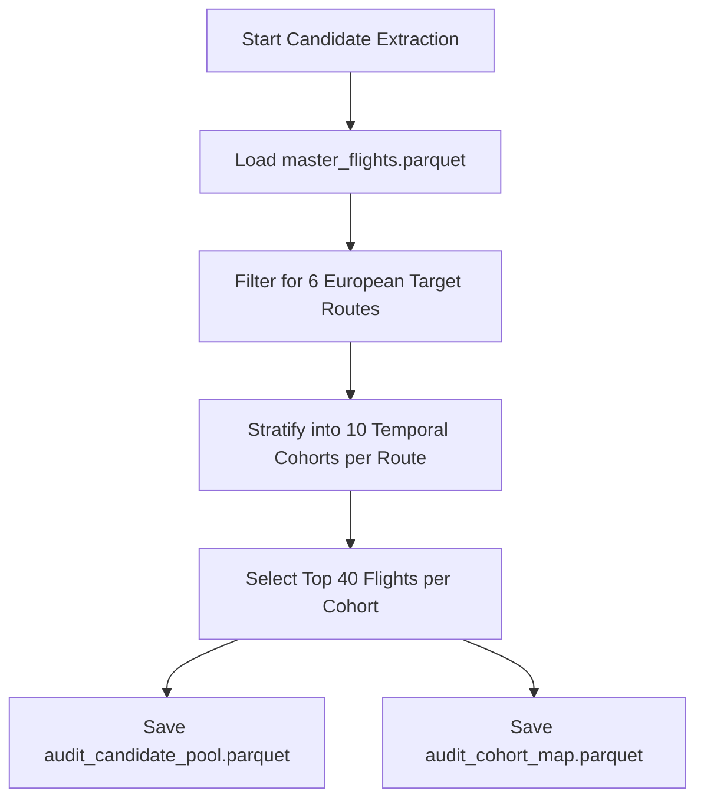
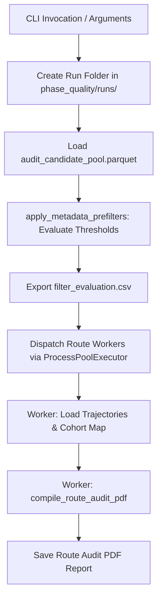

# Flight Phase Quality & Audit Campaign Suite (`phase_quality/`)

This package extracts standardized flight audit candidate pools across European target corridors and evaluates them against configurable metadata pre-filters and trajectory post-filters. It generates comprehensive evaluation tables (`filter_evaluation.csv`) and compiles multi-page visual audit PDF reports (supporting both vector SVG and rasterized PNG modes).

---

## 1. Module Structure

```text
src/analysis/campaigns/phase_quality/
├── __init__.py                    # Package initialization
├── README.md                      # This technical documentation file
├── build_audit_candidate_pool.py  # Script 1: Candidate pool extraction (6x400 flights) & cohort map
├── phase_quality_filters.py       # Script 2 Part B: Pre-filtering & post-filtering rules engine
├── run_phase_quality_campaign.py  # Script 2 Part C: Campaign orchestrator & evaluation table export
├── phase_quality_plots.py         # Script 2 Part A: PDF plotting engine (Cartopy basemaps + profiles)
└── test_phase_quality_plots.py    # Script 2 Test runner & multi-worker report compilation
```

---

## 2. Function Analysis Solution Tree (FAST)

```text
Phase Quality Campaign Objectives
 └── Audit flight data quality across European corridors and generate visual inspection reports
      │
      ├── Sub-objective 1: Extract Representative Candidate Pool (6 routes x 400 flights)
      │    └── Solution: main() in build_audit_candidate_pool.py
      │         ├── Inputs: master_flights parquet, trajectory registry
      │         ├── Stratification: 10 temporal cohorts per route (40 flights per cohort)
      │         └── Outputs: audit_candidate_pool.parquet, audit_cohort_map.parquet
      │
      ├── Sub-objective 2: Evaluate Metadata Pre-Filters (Script 2 Part B)
      │    └── Solution: apply_metadata_prefilters() in phase_quality_filters.py
      │         ├── Inputs: Candidate DataFrame, threshold parameters (max horiz/vert dist, min duration)
      │         ├── Unit Conversion: Route median duration converted from minutes to seconds (* 60.0)
      │         └── Outputs: Annotated DataFrame with status, fail_stage, and reject_reason
      │
      ├── Sub-objective 3: Evaluate Trajectory Post-Filters (Script 2 Part B)
      │    └── Solution: apply_trajectory_postfilters() in phase_quality_filters.py
      │         ├── Checks: Physical waypoint counts, phase progression rules, ROCD anomalies
      │         └── Outputs: Updated status and reject_reason for loaded trajectories
      │
      ├── Sub-objective 4: Orchestrate Multi-Route Campaign Runs (Script 2 Part C)
      │    └── Solution: main() in run_phase_quality_campaign.py
      │         ├── Concurrency: Multi-process execution across routes via ProcessPoolExecutor
      │         └── Outputs: Run-specific folder with filter_evaluation.csv and 6 PDF reports
      │
      └── Sub-objective 5: Compile Multi-Page Visual Audit PDF Reports (Script 2 Part A)
           └── Solution: compile_route_audit_pdf() in phase_quality_plots.py
                ├── Inputs: Route trajectories, evaluation status records, output format (PNG/SVG)
                ├── Safety: Rasterized PNG mode (--format PNG) prevents laptop PDF rendering lag
                └── Outputs: 10-page audit PDF report per route (40 flights rendered per page)
```

---

## 3. Data Workflow

### 3.1 Workflow A — Candidate Pool Extraction (`build_audit_candidate_pool.py`)



**Step-by-step:**
1. Load the centralized master flights dataset (`master_flights.parquet`).
2. Filter records for the six canonical European corridors (`EDDF-LIRF`, `ESSA-EHAM`, `EGLL-BIKF`, `LGSA-LGAV`, `LFRS-LFMN`, `ESSA-LEMD`).
3. Partition each route's flights into 10 chronological cohorts based on departure timestamps.
4. Select up to 40 candidate flights per cohort (totaling 400 flights per route, 2,400 flights overall).
5. Save the candidate pool metadata to `data/calibration/phase_quality/audit_candidate_pool.parquet`.
6. Save the relational mapping table to `data/calibration/phase_quality/audit_cohort_map.parquet`.

---

### 3.2 Workflow B — Phase Quality Campaign Orchestration (`run_phase_quality_campaign.py`)



**Step-by-step:**
1. Parse CLI arguments specifying filter thresholds, output format (`PNG` vs `SVG`), and target routes.
2. Generate a descriptive run directory inside `data/calibration/phase_quality/runs/` (e.g., `run_dephoriz5000_durbelow30_png`).
3. Load the candidate pool DataFrame from `audit_candidate_pool.parquet`.
4. Execute `apply_metadata_prefilters()` row-by-row to evaluate departure/arrival horizontal and vertical distances, candidate counts, and route duration anomalies.
5. Annotate each flight with `status` (`PASSED` vs `REJECTED`), `fail_stage`, and `reject_reason`, exporting the full summary table to `filter_evaluation.csv`.
6. Dispatch multi-page PDF compilation tasks across parallel worker processes using `ProcessPoolExecutor`.
7. Each worker loads raw parquet trajectory files for its assigned route and cross-references evaluation statuses. If `--use-clean` or `--clean-dir` is specified, it automatically queries `GLOBAL_CLEAN_REGISTRY` and standard `clean/` directories to load cleaned EKF trajectory files.
8. Compile a 10-page visual audit PDF report displaying Cartopy ground tracks and altitude profiles, saving to the run directory. When clean trajectories are provided, each cohort page renders a 4-plot 2x2 grid (Raw Top vs. Clean Bottom) with 1-to-1 color-phase alignment.

---

### 3.3 Optimization & Memory Modes
- **Rasterized PNG Mode**: When `--format PNG` is selected, trajectory lines are rasterized at 150 DPI while text and axes remain vector graphics. This prevents severe PDF rendering lag on standard laptops when viewing 2,400 dense flight paths.
- **Row-by-Row Pre-Filtering**: Metadata pre-filters are evaluated directly on the summary DataFrame before any trajectory parquet files are loaded from disk, saving significant memory and I/O bandwidth.
- **Clean Registry Indexing**: When `--use-clean` is passed, `run_phase_quality_campaign.py` pre-loads `GLOBAL_CLEAN_REGISTRY` into a hash map ($O(1)$ lookup) to resolve clean trajectory file paths without crawling directories.

### 3.4 Metric & Progress Logging Formats
All logging is routed through `setup_file_logger()` to `data/logs/corridor.log`:
```text
2026-07-07 19:50:00,123 - [INFO] - [run_phase_quality_campaign] Starting campaign run: run_dephoriz5000_durbelow30_png
2026-07-07 19:50:01,456 - [INFO] - [run_phase_quality_campaign] Pre-filtering complete: 2400 PASSED, 0 REJECTED. Saved filter_evaluation.csv.
2026-07-07 19:50:55,911 - [INFO] - [EDDF-LIRF] Loaded clean registry index with 2,051 entries.
2026-07-07 19:51:15,789 - [INFO] - [phase_quality_plots] [EDDF-LIRF] Successfully generated EDDF-LIRF_audit_report.pdf
```

---

## 4. CLI Usage Guide

### 4.1 Candidate Pool Extraction (`build_audit_candidate_pool.py`)

#### Bash & PowerShell Syntax
```bash
python -m src.analysis.campaigns.phase_quality.build_audit_candidate_pool
```

---

### 4.2 Phase Quality Campaign Orchestrator (`run_phase_quality_campaign.py`)

#### Bash Syntax
```bash
python -m src.analysis.campaigns.phase_quality.run_phase_quality_campaign \
    --all \
    --use-clean \
    --workers 4 \
    --format PNG \
    --max-dep-horiz-dist 5000 \
    --min-duration-pct-below-median 30
```

#### PowerShell Syntax
```powershell
python -m src.analysis.campaigns.phase_quality.run_phase_quality_campaign `
    --all `
    --use-clean `
    --workers 4 `
    --format PNG `
    --max-dep-horiz-dist 5000 `
    --min-duration-pct-below-median 30
```

#### Parameter Reference (`run_phase_quality_campaign.py`)

| Parameter | Type | Default | Description |
|---|---|---|---|
| `--route` | String | *Optional* | Specific route ID to process (e.g., `EDDF-LIRF`). |
| `--all` | Flag | `False` | Run campaign across all 6 target European routes. |
| `--workers` | Integer | `4` | Number of parallel worker processes for PDF compilation. |
| `--format` | String | `SVG` | Plot rendering format (`SVG` vector vs `PNG` rasterized). |
| `--out-dir` | String | *Optional* | Custom output directory for evaluation results and PDFs. |
| `--show-rejected` | Flag | `False` | Plot rejected trajectories on audit pages. |
| `--clean-dir` | String | *Optional* | Directory containing cleaned/post-processed trajectory parquet files for 4-plot comparison. |
| `--use-clean` | Flag | `False` | Automatically resolve and load clean trajectories from normal directories and `GLOBAL_CLEAN_REGISTRY` for 4-plot comparison. |
| `--max-dep-horiz-dist` | Float | `None` | Max departure horizontal distance to airport center (meters). |
| `--max-dep-vert-dist` | Float | `None` | Max departure vertical distance to airport altitude (meters). |
| `--max-arr-horiz-dist` | Float | `None` | Max arrival horizontal distance to airport center (meters). |
| `--max-arr-vert-dist` | Float | `None` | Max arrival vertical distance to airport altitude (meters). |
| `--max-dep-candidates` | Integer | `None` | Max allowed alternative departure airport candidates. |
| `--max-arr-candidates` | Integer | `None` | Max allowed alternative arrival airport candidates. |
| `--min-duration-pct-below-median` | Float | `None` | Max allowed percentage below route median duration (e.g., `30` for -30%). |
| `--max-duration-pct-above-median` | Float | `None` | Max allowed percentage above route median duration. |

---

## 5. Prerequisites & Dependencies

### 5.1 Library Dependencies
- `pandas` / `pyarrow` (parquet registry and evaluation table IO)
- `matplotlib` / `cartopy` (geospatial basemap rendering and PDF compilation)
- `numpy` (duration and distance calculations)

### 5.2 Referenced Registry & Config Files
- `src.common.config.AUDIT_CANDIDATE_POOL_REGISTRY`: Parquet file containing candidate flight metadata.
- `src.common.config.AUDIT_COHORT_MAP_REGISTRY`: Parquet file mapping flights to temporal cohorts.
- `src.common.config.GLOBAL_CLEAN_REGISTRY`: Parquet file indexing cleaned EKF trajectories across all routes.
- `src.common.config.PHASE_QUALITY_RUNS_DIR`: Base directory for campaign output folders.
- `src.common.config.DEFAULT_PREFILTER_THRESHOLDS`: Dictionary holding default filter threshold values.
- For global project naming conventions, see [conventions.md](file:///g:/Meine%20Ablage/UNI/SS26/PythonPipeline%20-%20Kopie/conventions.md).
