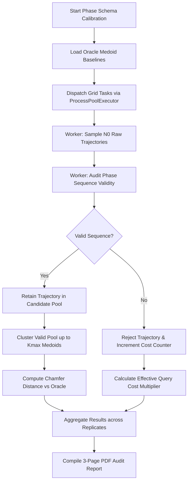

# Phase Schema Enrichment & Calibration Suite (`schema_enrichment/`)

This package calibrates the database query cost and acceptance rate required to obtain structurally valid trajectories whose flight phase labels adhere to canonical aeronautical sequence rules.

---

## 1. Module Structure

```text
src/analysis/campaigns/schema_enrichment/
├── __init__.py                   # Package initialization
├── README.md                     # This technical documentation file
└── phase_schema_orchestrator.py  # Phase C: Phase schema query cost & acceptance rate calibration
```

---

## 2. Function Analysis Solution Tree (FAST)

```text
Phase Schema Calibration Objectives
 └── Calibrate query cost and acceptance rates for structurally valid flight phase sequences
      │
      ├── Sub-objective 1: Audit Trajectory Phase Sequence Validity
      │    └── Solution: _is_valid_phase_sequence() in phase_schema_orchestrator.py
      │         ├── Inputs: Sequence of phase labels (Series/array)
      │         ├── Canonical Pattern: ONGROUND -> CLIMB -> CRUISE -> DESCENT -> ONGROUND
      │         ├── Safety 1 (--level-as-cruise): Treats intermediate LEVEL flight as valid CRUISE
      │         └── Safety 2 (--min-phase-run-points): Filters out short noise spikes in labels
      │
      ├── Sub-objective 2: Orchestrate Query Cost Grid Sweep
      │    └── Solution: main() in phase_schema_orchestrator.py
      │         ├── Inputs: Oracle baseline data, parameter grids (N0, Kmax), replicates
      │         ├── Concurrency: Multi-worker ProcessPoolExecutor with OOM recovery
      │         └── Outputs: Acceptance rate tables, cost multipliers, and summary CSVs
      │
      └── Sub-objective 3: Compile Visual Report Dashboard
           └── Solution: generate_phase_schema_pdf_report() in phase_schema_orchestrator.py
                ├── Inputs: Route summary DataFrame, oracle parameters, out_dir
                └── Outputs: 3-page PDF report with Pareto table, acceptance curves, and cluster maps
```

---

## 3. Data Workflow

### 3.1 Workflow A — Phase Schema Calibration & Auditing (`phase_schema_orchestrator.py`)



**Step-by-step:**
1. Load cached Ground Truth oracle medoid baselines from disk.
2. Generate an evaluation grid across initial query sample sizes ($N_0$) and maximum cluster counts ($K_{max}$).
3. Dispatch evaluation tasks across parallel worker processes using `ProcessPoolExecutor`.
4. Each worker loads $N_0$ raw trajectories and audits their flight phase labels against canonical progression rules.
5. Apply safety filters: `--level-as-cruise` maps intermediate level flight segments to cruise, and `--min-phase-run-points` removes high-frequency labeling noise.
6. Calculate the acceptance rate and the effective query cost multiplier required to obtain $N_0$ valid flights.
7. Perform hierarchical clustering on the retained valid trajectories and compute bidirectional Chamfer distance against oracle baselines.
8. Export summary CSV tables and compile a 3-page visual PDF report.

---

### 3.2 Optimization & Memory Modes
- **Noise Denoising**: High-frequency label flickering is smoothed out in-memory before sequence regex matching, preventing over-rejection of otherwise valid trajectories.
- **Agg Backend Enforcement**: Enforces non-interactive matplotlib backend for stable multiprocessing.

### 3.3 Metric & Progress Logging Formats
All logging is routed through `setup_file_logger()` to `data/logs/calibration.log`:
```text
2026-07-07 19:20:00,000 - [INFO] - [phase_schema_orchestrator] Starting Phase Schema calibration across 6 routes...
2026-07-07 19:20:10,123 - [INFO] - [phase_schema_orchestrator] LOWW-EHAM: Acceptance rate 84.2% (Effective multiplier: 1.19x).
```

---

## 4. CLI Usage Guide

### 4.1 Phase Schema Calibration Orchestrator (`phase_schema_orchestrator.py`)

#### Bash Syntax
```bash
python -m src.analysis.campaigns.schema_enrichment.phase_schema_orchestrator \
    --routes LOWW-EHAM EDDF-LIRF \
    --n0-grid 50 100 150 200 \
    --kmax-grid 3 4 5 \
    --replicates 5 \
    --workers 4 \
    --level-as-cruise \
    --min-phase-run-points 5
```

#### PowerShell Syntax
```powershell
python -m src.analysis.campaigns.schema_enrichment.phase_schema_orchestrator `
    --routes LOWW-EHAM EDDF-LIRF `
    --n0-grid 50 100 150 200 `
    --kmax-grid 3 4 5 `
    --replicates 5 `
    --workers 4 `
    --level-as-cruise `
    --min-phase-run-points 5
```

#### Parameter Reference (`phase_schema_orchestrator.py`)

| Parameter | Type | Default | Description |
|---|---|---|---|
| `--routes` | String List | `CALIBRATION_ROUTES` | Routes to evaluate for phase schema validity. |
| `--n0-grid` | Integer List | `[50, 100, 150, 200]` | Initial sample sizes ($N_0$) to test. |
| `--kmax-grid` | Integer List | `[3, 4, 5]` | Maximum cluster counts ($K_{max}$). |
| `--replicates` | Integer | `5` | Bootstrap replicates per grid point. |
| `--workers` | Integer | `4` | Number of parallel worker processes. |
| `--level-as-cruise` | Flag | `False` | Treat intermediate `LEVEL` flight phase labels as valid `CRUISE`. |
| `--min-phase-run-points` | Integer | `0` | Minimum consecutive points required to form a valid phase run. |
| `--out-dir` | Path | `data/calibration/phase_schema` | Output folder for CSV tables and PDF reports. |

---

## 5. Prerequisites & Dependencies

### 5.1 Library Dependencies
- `scikit-learn` (medoid clustering)
- `numpy` / `scipy` (3D Chamfer distance)
- `pandas` / `pyarrow` (parquet registry and schema auditing)
- `matplotlib` (PDF report compilation)

### 5.2 Referenced Registry & Config Files
- `src.common.config.CALIBRATION_ROUTES`: Canonical European target corridors.
- `src.common.config.ORACLE_COHORT_CACHE_DIR`: Directory storing cached Ground Truth medoid tensors.
- For global project naming conventions, see [conventions.md](file:///g:/Meine%20Ablage/UNI/SS26/PythonPipeline%20-%20Kopie/conventions.md).
