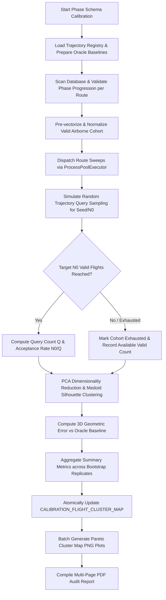

# Phase Schema Enrichment & Calibration Suite (`schema_enrichment/`)

This package calibrates the database query cost, acceptance rate, cluster structure, and geometric error required to obtain structurally valid trajectories whose flight phase labels adhere to canonical aeronautical sequence rules (`ONGROUND -> CLIMB -> CRUISE -> DESCENT -> ONGROUND`).

---

## 1. Module Structure

```text
src/analysis/campaigns/schema_enrichment/
├── __init__.py                   # Package initialization
├── README.md                     # Technical documentation source of truth
└── phase_schema_orchestrator.py  # Orchestration script for phase schema query cost & acceptance rate calibration
```

---

## 2. Function Analysis Solution Tree (FAST)

```text
Phase Schema Calibration Objectives
 └── Calibrate query cost and acceptance rates for structurally valid flight phase sequences
      │
      ├── Sub-objective 1: Audit Trajectory Phase Sequence Validity
      │    └── Solution: _load_route_flights_full_phase() in stability_worker.py (invoked by phase_schema_orchestrator.py)
      │         ├── Inputs: Route ID, trajectory registry DataFrame, level_as_cruise, min_phase_run_points
      │         ├── Canonical Pattern: ONGROUND -> CLIMB -> CRUISE -> DESCENT -> ONGROUND
      │         ├── Safety 1 (--level-as-cruise): Treats intermediate LEVEL flight segments as valid CRUISE
      │         └── Safety 2 (--min-phase-run-points): Smooths high-frequency phase label flickering (default: 3)
      │
      ├── Sub-objective 2: Orchestrate Query Cost Grid Sweep
      │    └── Solution: main() / run_route_phase_schema_sweep() in phase_schema_orchestrator.py
      │         ├── Inputs: Oracle baseline cohorts, sample size grid N0 ([16, 24, 32, 48, 64]), cluster grid Kmax ([1, 2, 3, 4]), replicates (30)
      │         ├── Concurrency: Multi-worker ProcessPoolExecutor with spawn context, numeric thread limiting (1), and dynamic OOM worker scale-down
      │         └── Outputs: Raw CSVs (<route>_phase_schema_raw.csv), summary CSVs (<route>_phase_schema_summary.csv), and atomic cluster parquet map (CALIBRATION_FLIGHT_CLUSTER_MAP)
      │
      └── Sub-objective 3: Compile Visual Report Dashboard
           └── Solution: _save_route_results() / generate_phase_schema_pdf_report() in phase_schema_orchestrator.py
                ├── Inputs: Route summary DataFrame, oracle parameters, Pareto frontier DataFrame, out_dir
                └── Outputs: Multi-page PDF report (<route>_phase_schema_report.pdf) with metrics table, 2x2 dashboard, and Pareto cluster maps
```

---

## 3. Data Workflow

### 3.1 Workflow A — Phase Schema Calibration & Auditing (`phase_schema_orchestrator.py`)


```mermaid
flowchart TD
    A[Start Phase Schema Calibration] --> B[Load Trajectory Registry & Prepare Oracle Baselines]
    B --> C[Scan Database & Validate Phase Progression per Route]
    C --> D[Pre-vectorize & Normalize Valid Airborne Cohort]
    D --> E[Dispatch Route Sweeps via ProcessPoolExecutor]
    E --> F[Simulate Random Trajectory Query Sampling for Seed/N0]
    F --> G{Target N0 Valid Flights Reached?}
    G -->|Yes| H[Compute Query Count Q & Acceptance Rate N0/Q]
    G -->|No / Exhausted| I[Mark Cohort Exhausted & Record Available Valid Count]
    H --> J[PCA Dimensionality Reduction & Medoid Silhouette Clustering]
    I --> J
    J --> K[Compute 3D Geometric Error vs Oracle Baseline]
    K --> L[Aggregate Summary Metrics across Bootstrap Replicates]
    L --> M[Atomically Update CALIBRATION_FLIGHT_CLUSTER_MAP]
    M --> N[Batch Generate Pareto Cluster Map PNG Plots]
    N --> O[Compile Multi-Page PDF Audit Report]
```

**Step-by-step:**
1. **Prepare Oracle Baselines**: Load candidate trajectories from `load_trajectory_registry()` and generate ground truth oracle medoid baselines (`_prepare_oracle()`).
2. **Phase Sequence Auditing**: Scan database records via `_load_route_flights_full_phase()`, filtering flights against the canonical sequence `ONGROUND -> CLIMB -> CRUISE -> DESCENT -> ONGROUND`.
3. **Safety Denoising**: Apply intermediate level mapping (`--level-as-cruise`, default `True`) and minimum run-length filtering (`--min-phase-run-points`, default `3`) to prevent over-rejection due to label flickering.
4. **Cohort Normalization**: Extract airborne segments, vectorize ($D_{PCA}$ dimensions), and z-score normalize the valid flight cohort via `classify_and_normalize_cohort()` and `vectorize_cohort()`.
5. **Database Query Simulation**: For each bootstrap replicate, shuffle candidate flight IDs and simulate random query extraction until $N_0$ valid trajectories are collected or candidate flights are exhausted.
6. **Clustering & Medoid Selection**: Perform PCA dimensionality reduction, select optimal cluster count $k \le K_{max}$ using silhouette scores (`_evaluate_custom_k()`), and extract exemplar medoids (`_select_medoid()`).
7. **Geometric Error Computation**: Compute bidirectional 3D Chamfer distance geometric error between sample medoids and ground truth oracle medoids (`_compute_geometric_error()`).
8. **Atomic Registry Update**: Atomically append flight-to-cluster assignments to `CALIBRATION_FLIGHT_CLUSTER_MAP` (`data/results/calibration_flight_cluster_map.parquet`) using a `.tmp.parquet` temporary file replacement pattern (`_tmp`).
9. **Visual Report Generation**: Identify Pareto frontier configurations (minimizing database queries while minimizing geometric error), batch render PNG cluster maps (`batch_generate_plots()`), and compile a multi-page executive PDF report (`<route>_phase_schema_report.pdf`).

---

### 3.2 Optimization & Memory Modes
- **Atomic Write Pattern**: Flight-to-cluster mappings are saved to `CALIBRATION_FLIGHT_CLUSTER_MAP` using a safe temporary file swap pattern (`_tmp = CALIBRATION_FLIGHT_CLUSTER_MAP.with_suffix(".tmp.parquet")`) to guarantee data integrity on all filesystems.
- **OOM-Resilient Multiprocessing**: Auto-calculates worker pool size based on available system RAM (`psutil.virtual_memory()`) and CPU cores, catching OOM exceptions (`_is_oom_error()`) to dynamically scale down concurrency without aborting the campaign.
- **Thread Control**: `_worker_init()` enforces single-threaded BLAS/LAPACK execution (`limit_numeric_threads(1)`) across all spawned child processes to avoid CPU over-subscription.
- **Label Denoising**: High-frequency phase flickering is smoothed out in-memory before sequence evaluation (`min_phase_run_points=3`), preventing over-rejection of valid flights.

### 3.3 Metric & Progress Logging Formats
All logging is centralized via `setup_file_logger()` writing to `data/logs/calibration.log`:
```text
2026-08-10 01:00:00,000 - [INFO] - [phase_schema_orchestrator] Starting phase schema sweep with max_workers=4.
2026-08-10 01:00:10,123 - [INFO] - [phase_schema_orchestrator] [LOWW-EHAM] Sweeping 20 phase schema parameter cells across 30 replicates...
2026-08-10 01:00:15,456 - [INFO] - [phase_schema_orchestrator] Saved 6000 flight mappings to calibration cluster map.
2026-08-10 01:00:20,789 - [INFO] - [phase_schema_orchestrator] [LOWW-EHAM] Compiling PDF report to data/calibration/phase_schema/LOWW-EHAM_phase_schema_report.pdf...
```

---

## 4. CLI Usage Guide

### 4.1 Phase Schema Calibration Orchestrator (`phase_schema_orchestrator.py`)

#### Bash Syntax
```bash
python -m src.analysis.campaigns.schema_enrichment.phase_schema_orchestrator \
    --replicates 30 \
    --max-workers 4 \
    --level-as-cruise True \
    --min-phase-run-points 3 \
    --out-dir data/calibration/phase_schema
```

#### PowerShell Syntax
```powershell
python -m src.analysis.campaigns.schema_enrichment.phase_schema_orchestrator `
    --replicates 30 `
    --max-workers 4 `
    --level-as-cruise True `
    --min-phase-run-points 3 `
    --out-dir data/calibration/phase_schema
```

#### Parameter Reference (`phase_schema_orchestrator.py`)

| Parameter | Type | Default | Description |
|---|---|---|---|
| `--replicates` | Integer | `30` | Bootstrap replicates per parameter cell. |
| `--dry-run` | Flag | `False` | Run 1 route and 2 replicates with reduced grid sizes for quick sanity testing. |
| `--max-workers` | Integer | `None` | Override the starting number of parallel worker processes (defaults to RAM/CPU auto-tuning). |
| `--out-dir` | Path | `data/calibration/phase_schema` | Output directory for CSV tables and PDF reports. |
| `--level-as-cruise` | Boolean | `True` | Map intermediate `LEVEL` flight phase segments to `CRUISE`. |
| `--min-phase-run-points` | Integer | `3` | Minimum contiguous points required in a phase run to prevent noise flickering. |
| `--crop-airports` | Flag | `False` | Crop generated cluster plot maps to airport bounding box. |
| `--crop-padding` | Float | `1.5` | Padding in degrees around airport bounding box when cropping maps. |

---

## 5. Prerequisites & Dependencies

### 5.1 Library Dependencies
- `scikit-learn` (PCA dimensionality reduction and silhouette score evaluation)
- `numpy` / `scipy` (3D Chamfer distance and geometric error calculations)
- `pandas` / `pyarrow` (Parquet registry management and tabular reporting)
- `matplotlib` (Multi-page PDF report compilation via `PdfPages` and cluster plots)
- `psutil` (System memory monitoring for OOM-resilient worker pool sizing)

### 5.2 Referenced Registry & Config Files
- `src.common.config.BASE_DIR`: Base project directory path.
- `src.common.config.CALIBRATION_ROUTES`: List of standard European evaluation flight corridors.
- `src.common.config.CALIBRATION_FLIGHT_CLUSTER_MAP`: Parquet file (`data/results/calibration_flight_cluster_map.parquet`) storing flight-to-cluster assignments.
- `src.common.config.CALIBRATION_PLOTS_DIR`: Output directory (`data/results/calibration_plots`) for rendered cluster maps.
- `src.common.config.D_PCA`: Dimensionality setting for trajectory vectorization.
- For global project conventions, see [conventions.md](file:///c:/Users/Joshu/Projects/flight-physics-pipeline/conventions.md).
