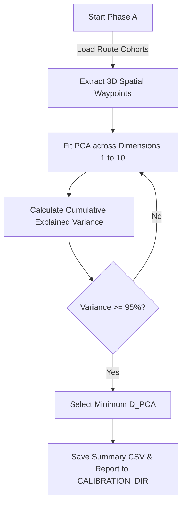
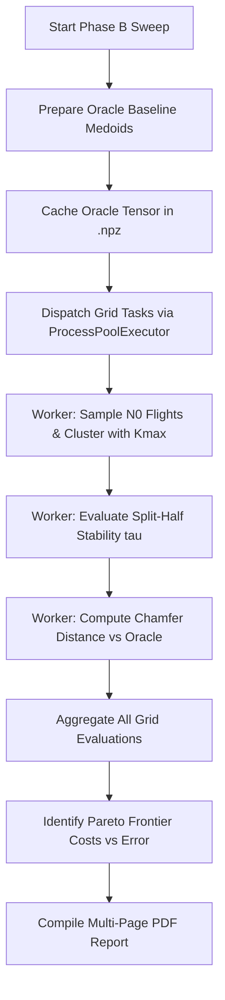

# Variational Calibration Suite (`variational/`)

This package implements hyperparameter calibration for spatial compression and corridor clustering. It optimizes key parameters ($D_{PCA}$, $N_0$, $\tau$, and $K_{max}$) by benchmarking against Oracle Ground Truth flight paths across European target routes.

---

## 1. Module Structure

```text
src/analysis/campaigns/variational/
├── __init__.py                  # Package initialization
├── README.md                    # This technical documentation file
├── phase_a_d_pca.py             # Phase A: PCA dimension determination (D_PCA)
├── gt_stability_sweep.py        # Ground Truth geometric error vs. stability metric sweep
├── variational_orchestrator.py  # Phase B: 3D variational parameter sweep (N0 x tau x Kmax grid)
└── variational_plots.py         # Visualization & PDF report compiler for variational sweeps
```

---

## 2. Function Analysis Solution Tree (FAST)

```text
Variational Calibration Objectives
 └── Calibrate spatial compression and clustering hyperparameters against Ground Truth
      │
      ├── Sub-objective 1: Determine Optimal PCA Dimensions (D_PCA)
      │    └── Solution: run_phase_a() in phase_a_d_pca.py
      │         ├── Inputs: Raw trajectory registry, calibration routes (CALIBRATION_ROUTES)
      │         └── Outputs: Recommended D_PCA capturing >=95% spatial variance
      │
      ├── Sub-objective 2: Benchmark Split-Half Stability Metrics
      │    └── Solution: run_gt_sweep() in gt_stability_sweep.py
      │         ├── Inputs: Trajectory registry, sample sizes N, bootstrap replicates
      │         └── Outputs: Geometric error vs. stability CSVs and line/scatter plots
      │
      ├── Sub-objective 3: Orchestrate 3D Variational Grid Sweeps (N_0 x tau x K_max)
      │    └── Solution: main() in variational_orchestrator.py
      │         ├── Inputs: Oracle baseline data, parameter grids, replicates
      │         ├── Concurrency: Multi-worker ProcessPoolExecutor with OOM recovery
      │         └── Outputs: Pareto frontier tables, heatmaps, and summary CSVs
      │
      ├── Sub-objective 4: Compile Visual Report Dashboards
      │    └── Solution: generate_route_pdf_report() in variational_plots.py
      │         ├── Inputs: Route summary DataFrame, oracle parameters, out_dir
      │         └── Outputs: Multi-page PDF report with Pareto analysis and cluster maps
      │
      └── Sub-objective 5: Compute Physical 3D Deviation Metrics
           └── Solution: _compute_geometric_error() in gt_stability_sweep.py
                ├── Inputs: Sample medoid vectors, oracle medoid vectors
                ├── Formula: Bidirectional Chamfer Distance (mean 3D spatial deviation in km)
                └── Outputs: Symmetric geometric error (float)
```

---

## 3. Data Workflow

### 3.1 Workflow A — Phase A PCA Calibration (`phase_a_d_pca.py`)



**Step-by-step:**
1. Load fully fetched flight cohorts for European calibration routes.
2. Extract standardized 3D spatial coordinates (x, y, z) for each trajectory.
3. Fit Principal Component Analysis (PCA) models incrementally from 1 to 10 components.
4. Compute cumulative explained variance ratio across all trajectories.
5. Identify the minimum dimension $D_{PCA}$ that satisfies the 95% variance preservation threshold.
6. Export the calibration summary table and recommendations to `data/calibration/`.

---

### 3.2 Workflow B — 3D Variational Sweep & Pareto Optimization (`variational_orchestrator.py`)



**Step-by-step:**
1. For each calibration route, execute `_prepare_oracle()` to generate baseline Ground Truth cluster medoids using the entire available flight population.
2. Cache oracle medoid tensors to disk (`data/calibration/oracle_cohort_cache/<route_id>.npz`).
3. Generate a multi-dimensional parameter grid across sample sizes ($N_0$), stability thresholds ($\tau$), and maximum clusters ($K_{max}$).
4. Dispatch grid evaluation tasks across parallel worker processes using `ProcessPoolExecutor`.
5. Each worker samples $N_0$ trajectories, performs hierarchical clustering up to $K_{max}$, and evaluates split-half cluster stability.
6. Calculate bidirectional Chamfer distance between sample medoids and cached oracle medoids.
7. Aggregate results across all replicates and identify the Pareto frontier (minimizing database query cost while restricting geometric error).
8. Invoke `generate_route_pdf_report()` to compile a comprehensive visual PDF dashboard.

---

### 3.3 Optimization & Memory Modes
- **Oracle Caching**: Caching baseline medoids in `.npz` format avoids re-running $O(N^2)$ distance matrix calculations across grid iterations.
- **OOM Recovery**: Workers catch out-of-memory exceptions during large matrix evaluations, logging a warning and falling back to sequential batch processing.

### 3.4 Metric & Progress Logging Formats
All logging is routed through `setup_file_logger()` to `data/logs/calibration.log`:
```text
2026-07-07 19:10:00,000 - [INFO] - [variational_orchestrator] Starting 3D variational sweep across 6 routes...
2026-07-07 19:10:05,123 - [INFO] - [variational_orchestrator] LOWW-EHAM: Oracle baseline cached (K=4 medoids).
2026-07-07 19:11:20,456 - [INFO] - [variational_orchestrator] LOWW-EHAM: Pareto frontier identified at N0=150, tau=0.05, Kmax=5 (Error: 1.24 km).
```

---

## 4. CLI Usage Guide

### 4.1 Phase A PCA Dimension Calibration (`phase_a_d_pca.py`)

#### Bash & PowerShell Syntax
```bash
python -m src.analysis.campaigns.variational.phase_a_d_pca
```

---

### 4.2 Ground Truth Stability Sweep (`gt_stability_sweep.py`)

#### Bash Syntax
```bash
python -m src.analysis.campaigns.variational.gt_stability_sweep \
    --routes LOWW-EHAM EDDF-LIRF \
    --n-values 50 100 200 400 \
    --replicates 10 \
    --out-dir data/calibration/gt_sweep
```

#### PowerShell Syntax
```powershell
python -m src.analysis.campaigns.variational.gt_stability_sweep `
    --routes LOWW-EHAM EDDF-LIRF `
    --n-values 50 100 200 400 `
    --replicates 10 `
    --out-dir data/calibration/gt_sweep
```

#### Parameter Reference (`gt_stability_sweep.py`)

| Parameter | Type | Default | Description |
|---|---|---|---|
| `--routes` | String List | `CALIBRATION_ROUTES` | List of route IDs to evaluate. |
| `--n-values` | Integer List | `[50, 100, 200, 400]` | Sample sizes ($N$) to test against Ground Truth. |
| `--replicates` | Integer | `10` | Number of bootstrap replicates per sample size. |
| `--out-dir` | Path | `data/calibration/gt_sweep` | Output directory for CSV summaries and plots. |

---

### 4.3 3D Variational Grid Sweep (`variational_orchestrator.py`)

#### Bash Syntax
```bash
python -m src.analysis.campaigns.variational.variational_orchestrator \
    --routes LOWW-EHAM \
    --n0-grid 50 100 150 200 \
    --tau-grid 0.02 0.05 0.10 \
    --kmax-grid 3 4 5 6 \
    --replicates 5 \
    --workers 4
```

#### PowerShell Syntax
```powershell
python -m src.analysis.campaigns.variational.variational_orchestrator `
    --routes LOWW-EHAM `
    --n0-grid 50 100 150 200 `
    --tau-grid 0.02 0.05 0.10 `
    --kmax-grid 3 4 5 6 `
    --replicates 5 `
    --workers 4
```

#### Parameter Reference (`variational_orchestrator.py`)

| Parameter | Type | Default | Description |
|---|---|---|---|
| `--routes` | String List | `CALIBRATION_ROUTES` | Routes to include in the variational sweep. |
| `--n0-grid` | Integer List | `[50, 100, 150, 200, 300]` | Grid of initial query sizes ($N_0$). |
| `--tau-grid` | Float List | `[0.02, 0.05, 0.08, 0.10]` | Grid of stability thresholds ($\tau$). |
| `--kmax-grid` | Integer List | `[3, 4, 5, 6]` | Grid of maximum cluster counts ($K_{max}$). |
| `--replicates` | Integer | `5` | Bootstrap replicates per grid point. |
| `--workers` | Integer | `4` | Number of parallel worker processes. |
| `--out-dir` | Path | `data/calibration/variational` | Destination directory for results and PDF reports. |

---

## 5. Prerequisites & Dependencies

### 5.1 Library Dependencies
- `scikit-learn` (PCA and medoid clustering algorithms)
- `numpy` / `scipy` (3D Chamfer distance and spatial mathematics)
- `pandas` / `pyarrow` (data manipulation and parquet registry IO)
- `matplotlib` (enforced `Agg` backend for PDF report compilation)

### 5.2 Referenced Registry & Config Files
- `src.common.config.CALIBRATION_ROUTES`: Default list of European test corridors.
- `src.common.config.D_PCA`: Canonical PCA dimension threshold.
- `src.common.config.SILHOUETTE_THRESHOLD`: Canonical stability score threshold.
- `src.common.config.GLOBAL_MODEL_REGISTRY`: Path to stored medoid models.
- For global project naming conventions, see [conventions.md](file:///g:/Meine%20Ablage/UNI/SS26/PythonPipeline%20-%20Kopie/conventions.md).
