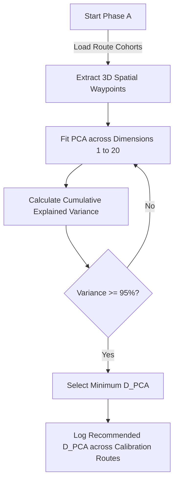
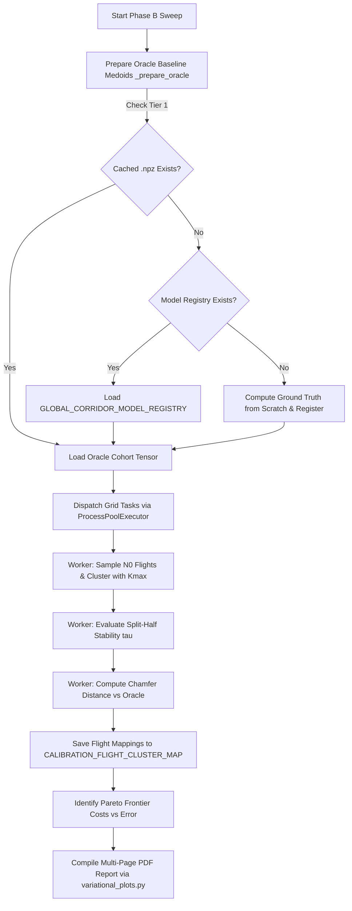

# Variational Calibration Suite (`variational/`)

This package implements hyperparameter calibration for spatial compression and corridor clustering. It optimizes key parameters ($D_{PCA}$, $N_0$, $\tau$, and $K_{max}$) by benchmarking against Oracle Ground Truth flight paths across European target routes.

---

## 1. Module Structure

```text
src/analysis/campaigns/variational/
├── __init__.py                  # Package initialization
├── README.md                    # This technical documentation file
├── phase_a_d_pca.py             # Phase A: PCA dimension determination (D_PCA)
├── gt_stability_sweep.py        # Ground Truth geometric error vs. stability metric sweep
├── variational_orchestrator.py  # Phase B: 3D variational parameter sweep (N0 x tau x Kmax grid)
└── variational_plots.py         # Visualization & PDF report compiler for variational sweeps
```

---

## 2. Function Analysis Solution Tree (FAST)

```text
Variational Calibration Objectives
 └── Calibrate spatial compression and clustering hyperparameters against Ground Truth
      │
      ├── Sub-objective 1: Determine Optimal PCA Dimensions (D_PCA)
      │    └── Solution: run_phase_a() in phase_a_d_pca.py
      │         ├── Inputs: Raw trajectory registry, calibration routes (CALIBRATION_ROUTES)
      │         └── Outputs: Recommended D_PCA capturing >=95% spatial variance
      │
      ├── Sub-objective 2: Benchmark Split-Half Stability Metrics
      │    └── Solution: run_gt_sweep() in gt_stability_sweep.py
      │         ├── Inputs: Trajectory registry (GLOBAL_TRAJECTORY_REGISTRY), sample sizes N, replicates
      │         ├── Oracle Lookup: Tiered search (.npz cache -> GLOBAL_CORRIDOR_MODEL_REGISTRY -> Scratch fit)
      │         └── Outputs: Geometric error vs. stability CSVs and line/scatter plots
      │
      ├── Sub-objective 3: Orchestrate 3D Variational Grid Sweeps (N_0 x tau x K_max)
      │    └── Solution: main() in variational_orchestrator.py
      │         ├── Inputs: Oracle baseline data, parameter grids (N0, tau, Kmax), bootstrap replicates
      │         ├── Concurrency: Multi-worker ProcessPoolExecutor with worker_init and OOM recovery
      │         └── Outputs: Pareto frontier tables, heatmaps, summary CSVs, and cluster map (CALIBRATION_FLIGHT_CLUSTER_MAP)
      │
      ├── Sub-objective 4: Compile Visual Report Dashboards
      │    └── Solution: generate_route_pdf_report() in variational_plots.py
      │         ├── Inputs: Route summary DataFrame, oracle parameters, out_dir, pareto_df
      │         └── Outputs: Multi-page PDF report with Pareto analysis and stacked cluster maps
      │
      └── Sub-objective 5: Compute Physical 3D Deviation Metrics
           └── Solution: _compute_geometric_error() in gt_stability_sweep.py
                ├── Inputs: Sample medoid vectors, oracle medoid vectors
                ├── Formula: Bidirectional Chamfer Distance (mean 3D spatial deviation in km)
                └── Outputs: Symmetric geometric error (float)
```

---

## 3. Data Workflow

### 3.1 Workflow A — Phase A PCA Calibration (`phase_a_d_pca.py`)


```mermaid
flowchart TD
    A[Start Phase A] -->|Load Route Cohorts| B[Extract 3D Spatial Waypoints]
    B --> C[Fit PCA across Dimensions 1 to 20]
    C --> D[Calculate Cumulative Explained Variance]
    D --> E{Variance >= 95%?}
    E -->|Yes| F[Select Minimum D_PCA]
    E -->|No| C
    F --> G[Log Recommended D_PCA across Calibration Routes]
```

**Step-by-step:**
1. Load fully fetched flight cohorts for European calibration routes (`CALIBRATION_ROUTES`).
2. Extract standardized 3D spatial coordinates (x, y, z) for each trajectory cohort via `vectorize_cohort()`.
3. Fit Principal Component Analysis (PCA) models incrementally up to 20 components.
4. Compute cumulative explained variance ratio across all trajectories.
5. Identify the minimum dimension $D_{PCA}$ that satisfies the 95% variance preservation threshold.
6. Calculate the median recommended $D_{PCA}$ across evaluated calibration routes.

---

### 3.2 Workflow B — 3D Variational Sweep & Pareto Optimization (`variational_orchestrator.py`)


```mermaid
flowchart TD
    A[Start Phase B Sweep] --> B[Prepare Oracle Baseline Medoids _prepare_oracle]
    B -->|Check Tier 1| C1{Cached .npz Exists?}
    C1 -->|Yes| D[Load Oracle Cohort Tensor]
    C1 -->|No| C2{Model Registry Exists?}
    C2 -->|Yes| LoadReg[Load GLOBAL_CORRIDOR_MODEL_REGISTRY]
    C2 -->|No| Scratch[Compute Ground Truth from Scratch & Register]
    LoadReg --> D
    Scratch --> D
    D --> E[Dispatch Grid Tasks via ProcessPoolExecutor]
    E --> F[Worker: Sample N0 Flights & Cluster with Kmax]
    F --> G[Worker: Evaluate Split-Half Stability tau]
    G --> H[Worker: Compute Chamfer Distance vs Oracle]
    H --> I[Save Flight Mappings to CALIBRATION_FLIGHT_CLUSTER_MAP]
    I --> J[Identify Pareto Frontier Costs vs Error]
    J --> K[Compile Multi-Page PDF Report via variational_plots.py]
```

**Step-by-step:**
1. For each calibration route, execute `_prepare_oracle()` using a 3-tier resolution strategy:
   - **Tier 1**: Check `.npz` cohort tensor cache (`data/calibration/oracle_cohort_cache/<route_id>.npz`).
   - **Tier 2**: Check `GLOBAL_CORRIDOR_MODEL_REGISTRY` (`global_corridor_simulation_registry.parquet`) and stored corridor Parquet files in `data/results/corridor_paths/`.
   - **Tier 3**: Compute baseline Ground Truth medoids from scratch, export corridor Parquets, register in `GLOBAL_CORRIDOR_MODEL_REGISTRY` and `GLOBAL_FLIGHT_CLUSTER_MAP`, and save `.npz` cache.
2. Generate multi-dimensional parameter grids ($N_0 = [16, 24, 32, 48, 64]$, $\tau = [0.10, 0.15, 0.20, 0.25, 0.30, 0.40]$, $K_{max} = [1, 2, 3, 4]$).
3. Dispatch grid evaluation tasks across parallel worker processes using `ProcessPoolExecutor` with `_worker_init` (initializing logging and locking numeric thread counts).
4. Each worker samples $N_0$ trajectories, fits PCA, evaluates split-half stability $\tau$, clusters up to $K_{max}$, and computes bidirectional Chamfer distance versus Oracle medoids.
5. Save flight cluster assignments to `CALIBRATION_FLIGHT_CLUSTER_MAP` (`data/calibration/calibration_flight_cluster_map.parquet`) using atomic temporary file replacement (`.tmp.parquet`).
6. Aggregate results across replicates, extract Pareto frontier configurations (minimizing query cost while bounding physical geometric error), and invoke `generate_route_pdf_report()` to compile a multi-page PDF dashboard.

---

### 3.3 Optimization & Concurrency Modes
- **Oracle Caching**: Tiered `.npz` caching avoids re-running $O(N^2)$ distance matrix evaluations and PCA fitting across grid iterations.
- **Worker Initialization & Concurrency Safety**: Spawned worker processes call `_worker_init()`, invoking `setup_file_logger("calibration.log")` and `limit_numeric_threads(1)` to ensure idempotent log capture and prevent CPU thread over-subscription.
- **OOM Recovery & Dynamic Scaling**: Multi-process dispatch dynamically adjusts worker counts upon encountering `MemoryError` or `BrokenProcessPool` exceptions, scaling down concurrency and re-queuing uncompleted route sweeps.

### 3.4 Metric & Progress Logging Formats

All logging is routed through `setup_file_logger()` to both the general `data/logs/calibration.log` and script-specific log files:

| Log file written to `data/logs/` | Writer | Purpose |
|---|---|---|
| `calibration.log` | All variational scripts | General consolidated campaign progress and calibration results. |
| `phase_a_calibration.log` | `phase_a_d_pca.py` | Details for PCA dimension fits and cumulative variance iterations. |
| `gt_stability_sweep.log` | `gt_stability_sweep.py` | Logs for the ground truth stability sweep resampling loop. |
| `variational_orchestrator.log` | `variational_orchestrator.py` | Detailed metrics from parallel 3D variational calibration execution. |

---

## 4. CLI Usage Guide

### 4.1 Phase A PCA Dimension Calibration (`phase_a_d_pca.py`)

#### Bash & PowerShell Syntax
```bash
python -m src.analysis.campaigns.variational.phase_a_d_pca
```

---

### 4.2 Ground Truth Stability Sweep (`gt_stability_sweep.py`)

#### Bash Syntax
```bash
python -m src.analysis.campaigns.variational.gt_stability_sweep \
    --k-replicates 30 \
    --table-only
```

#### PowerShell Syntax
```powershell
python -m src.analysis.campaigns.variational.gt_stability_sweep `
    --k-replicates 30 `
    --table-only
```

#### Parameter Reference (`gt_stability_sweep.py`)

| Parameter | Type | Default | Description |
|---|---|---|---|
| `--k-replicates` | Integer | `30` | Number of bootstrap replicates per sample size ($N$). |
| `--table-only` | Flag | `False` | Skip plot generation and print summary table to stdout only. |

---

### 4.3 3D Variational Grid Sweep (`variational_orchestrator.py`)

#### Bash Syntax
```bash
python -m src.analysis.campaigns.variational.variational_orchestrator \
    --replicates 30 \
    --max-workers 4 \
    --out-dir data/calibration
```

#### PowerShell Syntax
```powershell
python -m src.analysis.campaigns.variational.variational_orchestrator `
    --replicates 30 `
    --max-workers 4 `
    --out-dir data/calibration
```

#### Parameter Reference (`variational_orchestrator.py`)

| Parameter | Type | Default | Description |
|---|---|---|---|
| `--replicates` | Integer | `30` | Bootstrap replicates per parameter cell. |
| `--dry-run` | Flag | `False` | Run 1 route with 2 replicates for sanity testing (skips PDF reports). |
| `--max-workers` | Integer | `None` | Override starting number of parallel worker processes. |
| `--disable-scale-up` | Flag | `False` | Disable dynamic worker count scaling after successful batches. |
| `--out-dir` | Path / String | `None` (`data/calibration`) | Destination directory for results, summary CSVs, and PDF reports. |

---

## 5. Prerequisites & Dependencies

### 5.1 Library Dependencies
- `scikit-learn` (PCA and KMeans medoid clustering algorithms)
- `numpy` / `scipy` (3D Chamfer distance and spatial mathematics)
- `pandas` / `pyarrow` (data manipulation and parquet registry IO)
- `matplotlib` (enforced `Agg` backend for PDF report compilation)
- `psutil` (system memory inspection for worker count estimation)

### 5.2 Referenced Registry & Config Files
- `src.common.config.GLOBAL_CORRIDOR_MODEL_REGISTRY`: Path to stored corridor model registry (`data/registries/global_corridor_simulation_registry.parquet`).
- `src.common.config.GLOBAL_FLIGHT_CLUSTER_MAP`: Path to global flight-to-cluster assignment map (`data/registries/global_flight_cluster_map.parquet`).
- `src.common.config.CALIBRATION_FLIGHT_CLUSTER_MAP`: Path to sweep calibration flight cluster map (`data/calibration/calibration_flight_cluster_map.parquet`).
- `src.common.config.ORACLE_COHORT_CACHE_DIR`: Directory for precomputed Oracle tensor caches (`data/calibration/oracle_cohort_cache`).
- `src.common.config.CALIBRATION_ROUTES`: Default list of European test corridors (`["LOWW-EHAM", "EDDF-LIRF", ...]`).
- `src.common.config.D_PCA`: Canonical PCA dimension threshold ($D_{PCA} = 13$).
- `src.common.config.SILHOUETTE_THRESHOLD`: Canonical stability score threshold ($0.45$).
- `src.common.config.CLUSTERING_MAX_K`: Maximum number of clusters allowed during evaluation ($K_{max} = 6$).
- `src.common.config.CHAOS_VARIANCE_THRESHOLD`: Variance threshold for identifying unclusterable/chaotic routes.
- For global project naming conventions, see [conventions.md](file:///g:/Meine%20Ablage/UNI/SS26/PythonPipeline%20-%20Kopie/conventions.md).

