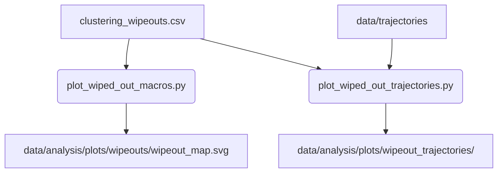

# Analysis Plotting Module

The `src/analysis/plotting` module provides geographic map rendering tools and verification scripts for visualizing cached European basemaps (`EuropeanMapCache`), overlaid airport coordinate registries, and wiped out trajectories during calibration analysis.

---

## 1. Module Structure

```text
src/analysis/plotting/
├── README.md                           # This module documentation
├── verify_map.py                       # Verification CLI script for EuropeanMapCache and airport overlays
├── plot_wiped_out_macros.py            # Plots macro-routes wiped out during clustering thresholds
└── plot_wiped_out_trajectories.py      # Plots physical trajectories of wiped out macro-routes
```

---

## 2. Function Analysis Solution Tree (FAST)
* **Visualize Map Projections & Boundaries**
  * Execute `verify_map.py` to test and ensure that Cartesian bounds and airport geo-coordinates align correctly over the cached NaturalEarth European basemap.
* **Visualize Filter Casualties (Wipeouts)**
  * Execute `plot_wiped_out_macros.py` to identify which macro-routes were entirely deleted by the clustering filters (e.g. `MIN_FLIGHTS_FOR_CLUSTERING`).
  * Execute `plot_wiped_out_trajectories.py` to overlay the actual physical flight paths of those wiped out routes to determine whether they failed due to geographical constraints or legitimate pipeline boundaries.

---

## 3. Data Workflow

### 3.1 Wipeout Analysis Plotting (`plot_wiped_out_macros.py` & `plot_wiped_out_trajectories.py`)



**Step-by-step:**
1. A wipeout CSV (`clustering_wipeouts.csv`) containing failed macro-routes is loaded.
2. `plot_wiped_out_macros.py` iterates over the macro-routes and plots point-to-point connections on the European map to show the broad geography of deletions.
3. `plot_wiped_out_trajectories.py` additionally reads the raw `data/trajectories` files to accurately trace and overlay the exact physical flight paths that were wiped out, outputting one high-res plot per route.

---

## 4. CLI Usage Guide

### PowerShell & Bash
```bash
# Execute map cache verification script
python -m src.analysis.plotting.verify_map

# Plot wiped out macro routes
python -m src.analysis.plotting.plot_wiped_out_macros --csv-path ./clustering_wipeouts.csv

# Plot wiped out actual trajectories
python -m src.analysis.plotting.plot_wiped_out_trajectories --csv-path ./clustering_wipeouts.csv
```

### Parameter Reference

#### `verify_map.py`
| Argument | Type | Default | Description |
| :--- | :--- | :--- | :--- |
| `--output-dir` | `str` | `data/analysis/plots/` | Directory to save generated verification plots |
| `--show-bbox` | `flag` | `False` | Draw the physical rectangular bounding box overlay on the map |
| `--target-airframes-only` | `flag` | `False` | Only render airports that are served by target airframes |
| `--icao-schema-only` | `flag` | `False` | Only render airports following standard 4-letter ICAO schema |
| `--survived-bbox-only` | `flag` | `False` | Only render airports that survived the bounding box filter |

#### `plot_wiped_out_macros.py` & `plot_wiped_out_trajectories.py`
| Argument | Type | Default | Description |
| :--- | :--- | :--- | :--- |
| `--csv-path` | `str` | (Required) | Path to the input CSV containing wiped out flights |
| `--output-dir` | `str` | `data/analysis/plots/...` | Output directory |
| `--trajectories-dir` | `str` | `data/trajectories` | Path to trajectories directory (Trajectories script only) |

---

## 5. Prerequisites & Dependencies
* **Files Read**:
  * `clustering_wipeouts.csv` (or similar failure CSV)
  * Pre-cached NaturalEarth mapping data from `EuropeanMapCache`
* **Constants Referenced** (from `config.py`):
  * `BASE_DIR`
