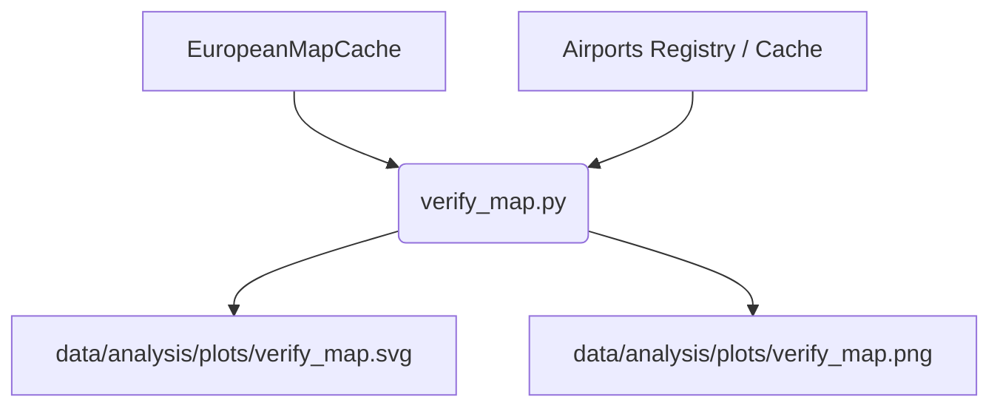
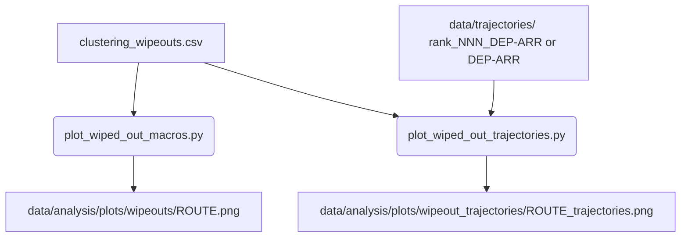

# Analysis Plotting Module

The `src/analysis/plotting` module provides geographic map rendering tools and verification scripts for visualizing cached European basemaps (`EuropeanMapCache`), overlaid airport coordinate registries, and wiped out trajectories during calibration and filter analysis.

---

## 1. Module Structure

```text
src/analysis/plotting/
├── README.md                           # This module documentation
├── __init__.py                         # Module initialization marker
├── plot_wiped_out_macros.py            # Plots macro-routes wiped out during clustering thresholds
├── plot_wiped_out_trajectories.py      # Plots physical trajectories of wiped out macro-routes
└── verify_map.py                       # Verification CLI script for EuropeanMapCache and airport overlays
```

---

## 2. Function Analysis Solution Tree (FAST)

* **Visualize Map Projections & Boundaries**
  * Execute `verify_map.py` to test and ensure that Cartesian bounds and airport geo-coordinates align correctly over the cached NaturalEarth European basemap (`EuropeanMapCache`).
* **Visualize Filter Casualties (Wipeouts)**
  * Execute `plot_wiped_out_macros.py` to identify which macro-routes were entirely deleted by the clustering filters (e.g. `MIN_FLIGHTS_FOR_CLUSTERING`), parsing departure and arrival prefixes via `split_route_string()`.
  * Execute `plot_wiped_out_trajectories.py` to overlay the actual physical flight paths of wiped out macro-routes (handling both legacy `rank_NNN_DEP-ARR` and modern `DEP-ARR` trajectory folder conventions) to determine whether wipeouts were driven by geographical bounds or pipeline filtering rules.

---

## 3. Data Workflow

### 3.1 European Map & Airport Overlay Verification (`verify_map.py`)



**Step-by-step:**
1. Loads cached NaturalEarth mapping data at 10m resolution via `EuropeanMapCache`.
2. Loads airport metadata from `EuropeanMapCache.airports_df` and applies optional filters (`--target-airframes-only`, `--icao-schema-only`, `--survived-bbox-only`).
3. Renders the European basemap axes with physical features, administrative boundaries, and optional bounding box overlays (base European BBox and padded weather BBox).
4. Plots styled airport markers categorized by ICAO schema compliance and target airframe presence.
5. Saves vector (`verify_map.svg`) and raster (`verify_map.png`) plots to `data/analysis/plots/`.

---

### 3.2 Macro Route & Trajectory Wipeout Plotting (`plot_wiped_out_macros.py` & `plot_wiped_out_trajectories.py`)



**Step-by-step:**
1. A wipeout CSV (`clustering_wipeouts.csv`) containing failed macro-routes (`Is_Wiped_Out_Now` and `Was_Viable`) is loaded and sorted by initial count (top 20 highest impact).
2. **Macro Plotting (`plot_wiped_out_macros.py`)**:
   - Parses `Canonical_Route` strings into departure and arrival prefixes using `split_route_string()`. Skips invalid entries returning `"UNK"`.
   - Plots departure (forest green) and arrival (dark red) airport clusters on the European map with faint connecting corridor lines, saving one PNG per route to `data/analysis/plots/wipeouts/`.
3. **Trajectory Plotting (`plot_wiped_out_trajectories.py`)**:
   - Pre-gathers all route directories in `data/trajectories/` (`all_route_folders`).
   - Extracts airport prefixes from folder names via `split_route_string()`, matching both legacy `rank_NNN_DEP-ARR` and modern `DEP-ARR` directory conventions.
   - Collects clean Parquet trajectory files under `<folder>/clean/*.parquet`, subsampling to a maximum of 1,000 trajectories per macro-route (`MAX_TRAJECTORIES_PER_MACRO`).
   - Reads trajectory `longitude` and `latitude` columns and overlays clean flight paths in blue over the European map basemap, saving output images to `data/analysis/plots/wipeout_trajectories/`.

---

## 4. CLI Usage Guide

### Bash & PowerShell

```bash
# Execute map cache verification script
python -m src.analysis.plotting.verify_map --show-bbox

# Plot wiped out macro routes
python -m src.analysis.plotting.plot_wiped_out_macros --csv-path ./data/results/calibration/clustering_wipeouts.csv

# Plot wiped out actual trajectories
python -m src.analysis.plotting.plot_wiped_out_trajectories --csv-path ./data/results/calibration/clustering_wipeouts.csv
```

### Parameter Reference

#### `verify_map.py`
| Argument | Type | Default | Description |
| :--- | :--- | :--- | :--- |
| `--output-dir` | `str` | `data/analysis/plots` | Directory to save generated verification plots |
| `--show-bbox` | `flag` | `False` | Draw physical rectangular bounding box and weather padding overlays |
| `--target-airframes-only` | `flag` | `False` | Only render airports served by target airframes |
| `--icao-schema-only` | `flag` | `False` | Only render airports matching standard 4-letter ICAO schema |
| `--survived-bbox-only` | `flag` | `False` | Only render airports that survived the geographic bounding box filter |
| `--lat-min` | `float` | `EUR_LAT_MIN` (20.0) | Minimum latitude for bounding box overlay |
| `--lat-max` | `float` | `EUR_LAT_MAX` (80.0) | Maximum latitude for bounding box overlay |
| `--lon-min` | `float` | `EUR_LON_MIN` (-50.0) | Minimum longitude for bounding box overlay |
| `--lon-max` | `float` | `EUR_LON_MAX` (60.0) | Maximum longitude for bounding box overlay |

#### `plot_wiped_out_macros.py`
| Argument | Type | Default | Description |
| :--- | :--- | :--- | :--- |
| `--csv-path` | `str` | (Required) | Path to input CSV containing wiped out flights (`clustering_wipeouts.csv`) |
| `--output-dir` | `str` | `data/analysis/plots/wipeouts` | Output directory for macro route map plots |

#### `plot_wiped_out_trajectories.py`
| Argument | Type | Default | Description |
| :--- | :--- | :--- | :--- |
| `--csv-path` | `str` | (Required) | Path to input CSV containing wiped out flights (`clustering_wipeouts.csv`) |
| `--output-dir` | `str` | `data/analysis/plots/wipeout_trajectories` | Output directory for trajectory overlay plots |
| `--trajectories-dir` | `str` | `data/trajectories` | Path to root trajectories directory containing route subfolders |

---

## 5. Prerequisites & Dependencies

* **Logging**:
  * All scripts configure logging via `setup_file_logger(log_filename="analysis.log")`, appending to `data/logs/analysis.log`.
* **Files Read**:
  * Input wipeout CSV (e.g., `clustering_wipeouts.csv`)
  * Clean trajectory Parquet files (`data/trajectories/<route_folder>/clean/*.parquet`)
  * Pre-cached NaturalEarth mapping shapefiles via `EuropeanMapCache`
* **Constants & Utilities Referenced**:
  * From `config.py`: `BASE_DIR`, `EUR_LAT_MIN`, `EUR_LAT_MAX`, `EUR_LON_MIN`, `EUR_LON_MAX`, `WEATHER_PADDING`
  * From `src.common.utils`: `setup_file_logger`, `split_route_string`
  * From `src.common.map_cache`: `EuropeanMapCache`
