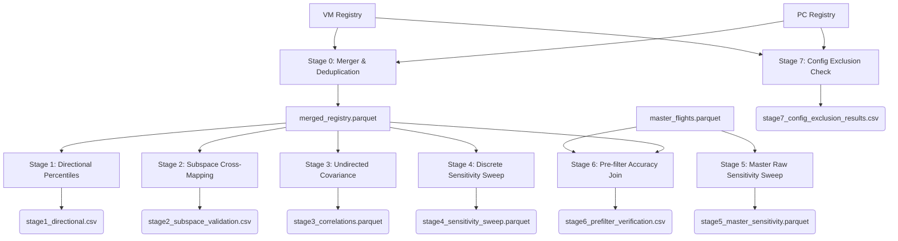

# Post-Filter Calibration (Stage 0-7)

## 1. Title & Introduction
The `postfilter_calibration` module is an analytical testing suite designed to validate the physical accuracy, consistency, and downstream survival rates of the trajectory filtering pipeline (specifically the Kalman filter). It sweeps geographical, spatial, and bounding thresholds against both the clean pipeline registries and the raw OpenSky `master_flights.parquet` database to ensure our pipeline rules accurately represent true flight physics without inadvertently destroying valid routes due to sample variance, terrain masking, or Electronic Warfare (EW) spoofing.

## 2. Module Structure
```text
src/analysis/postfilter_calibration/
├── README.md                           ← This document
├── run_campaign.py                     ← Automated orchestrator for all stages (0-7)
├── stage0_merger.py                    ← Merges PC/VM registries and drops duplicates
├── stage1_directional_impact.py        ← Computes directional fail percentiles
├── stage2_subspace_validation.py       ← Cross-maps directional fail rates
├── stage3_undirected_correlation.py    ← Computes undirected covariance matrices
├── stage4_sensitivity_sweep.py         ← Sweeps config thresholds on clean cohort
├── stage5_master_sensitivity.py        ← Sweeps config thresholds on absolute raw database
├── stage6_prefilter_verification.py    ← Validates fetcher pre-filter estimation accuracy
└── stage7_config_exclusion_check.py    ← Evaluates current config exclusions on Western Europe
```

## 3. Function Analysis Solution Tree (FAST)
* **Validate Pipeline Physical Reality**
  * **Identify Geographic Spoofing (EW)**: Execute Stage 1-3 to mathematically isolate undirected horizontal coordinate spoofing (e.g. Baltics/East Med) vs actual physics violations.
  * **Verify Terminal Thresholds**: Execute Stage 4 and Stage 5 to sweep the 15km/1000m radar limits across both the clean cohort and the massive raw database, proving the strict `config.py` limits are perfectly safe and broadly applicable without deleting entire nations like Switzerland.
  * **Audit Pre-filter Accuracy**: Execute Stage 6 to calculate Median Absolute Error (MedAE) between OpenSky's raw bulk estimates and the Kalman filter's physical reconstruction, ensuring the fetcher's pre-filters do not inadvertently reject valid flights.
  * **Config Exclusion Checks**: Execute Stage 7 to explicitly verify that the active config limits do not excessively penalize Western European corridors.

## 4. Data Workflow

### 4.1 Calibration Sweep Workflow (`run_campaign.py`)



**Step-by-step:**
1. **Stage 0 (Merger & Deduplication)**: Concatenates the PC and VM registries and strictly drops duplicates on `flight_id` to produce `data/calibration/postfilter_calibration/data/merged_registry.parquet`.
2. **Stage 1 (Directional Percentiles)**: Ingests `merged_registry.parquet` to compute percentile distributions of threshold failures directionally (e.g., A->B vs B->A), outputting `data/calibration/postfilter_calibration/stage1_directional.csv`.
3. **Stage 2 (Subspace Cross-Mapping)**: Reads `stage1_directional.csv` to cross-map horizontal failure rates against vertical failure rates, proving failures are geographic rather than altitude-dependent. Saves to `data/calibration/postfilter_calibration/stage2_subspace_validation.csv`.
4. **Stage 3 (Undirected Covariance)**: Analyzes `merged_registry.parquet` to compute Spearman rank correlation matrices (Dir_A, Dir_B, Dir_AUB, Dir_A_minus_B) and Fisher Z-transform global aggregates for macro-routes, isolating extreme directional divergence caused by regional EW spoofing. Saves to `data/calibration/postfilter_calibration/stage3/stage3_correlations.parquet`.
5. **Stage 4 (Discrete Sensitivity Sweep)**: Sweeps physical configuration bounds (e.g., 15km to 50km) over `merged_registry.parquet` to identify how survival rates decay, outputting `data/calibration/postfilter_calibration/stage4/stage4_sensitivity_sweep.parquet`.
6. **Stage 5 (Master Raw Sensitivity Sweep)**: Bypasses the clean registry and loads the raw 3.2 million flight `master_flights.parquet` universe. Sweeps the strict physical limits to mathematically prove that regional "wipeouts" seen in Stage 4 were due to small sample sizes, not pipeline flaws. Saves to `data/calibration/postfilter_calibration/stage5/stage5_master_sensitivity.parquet`.
7. **Stage 6 (Pre-filter Accuracy Join)**: Extracts flight keys from the clean registry and joins them with `master_flights.parquet`. Calculates the Median Absolute Error (MedAE) between raw OpenSky estimates and downstream physical values to prove the fetcher pre-filters do not reject valid flights. Saves to `data/calibration/postfilter_calibration/stage6/stage6_prefilter_verification.csv`.
8. **Stage 7 (Config Exclusion Check)**: Re-evaluates the combined PC and VM registries strictly against the active parameters in `config.py` to identify which routes are penalized and confirm Western European survival. Saves to `data/calibration/postfilter_calibration/stage7/stage7_config_exclusion_results.csv`.

## 5. CLI Usage Guide
Currently, these analytical scripts are executed via the `run_campaign.py` orchestrator without CLI arguments, or as one-off procedural runs.

**Bash**
```bash
# Run the entire campaign (Stages 0-7 automatically)
python -m src.analysis.postfilter_calibration.run_campaign

# Run stages individually
python -m src.analysis.postfilter_calibration.stage0_merger
python -m src.analysis.postfilter_calibration.stage1_directional_impact
python -m src.analysis.postfilter_calibration.stage2_subspace_validation
python -m src.analysis.postfilter_calibration.stage3_undirected_correlation
python -m src.analysis.postfilter_calibration.stage4_sensitivity_sweep
python -m src.analysis.postfilter_calibration.stage5_master_sensitivity
python -m src.analysis.postfilter_calibration.stage6_prefilter_verification
python -m src.analysis.postfilter_calibration.stage7_config_exclusion_check
```

**PowerShell**
```powershell
# Run the entire campaign (Stages 0-7 automatically)
python -m src.analysis.postfilter_calibration.run_campaign

# Run stages individually
python -m src.analysis.postfilter_calibration.stage0_merger
python -m src.analysis.postfilter_calibration.stage1_directional_impact
python -m src.analysis.postfilter_calibration.stage2_subspace_validation
python -m src.analysis.postfilter_calibration.stage3_undirected_correlation
python -m src.analysis.postfilter_calibration.stage4_sensitivity_sweep
python -m src.analysis.postfilter_calibration.stage5_master_sensitivity
python -m src.analysis.postfilter_calibration.stage6_prefilter_verification
python -m src.analysis.postfilter_calibration.stage7_config_exclusion_check
```

### Parameter Reference
| Argument | Type | Default | Description |
| :--- | :--- | :--- | :--- |
| `--input-registry` | `str` | `None` (falls back to clean cohort) | Path to the merged registry parquet (used by Stages 1, 3, 4, 6 when run individually). |

## 6. Prerequisites & Dependencies
* **Files Read**:
  * `data/databases/master_flights/master_flights_route_summary.parquet`
  * `data/databases/master_flights/master_flights.parquet`
  * `data/calibration/postfilter_calibration/data/sources/global_clean_quality_registry_PC.parquet` (or `data/calibration/postfilter_calibration/global_clean_quality_registry_PC.parquet`)
  * `data/calibration/postfilter_calibration/data/sources/global_clean_quality_registry_VM.parquet` (or `data/calibration/postfilter_calibration/global_clean_quality_registry_VM.parquet`)
* **Constants Referenced** (from `config.py`):
  * `BASE_DIR`
  * `DEFAULT_PREFILTER_THRESHOLDS`
  * `DEFAULT_POSTFILTER_THRESHOLDS`
  * `METRIC_COL_MAX_COORD_HORIZ_VEL`
  * `METRIC_COL_MAX_HORIZ_VEL`
  * `METRIC_COL_MAX_VERT_VEL`
  * `METRIC_COL_ARR_HORIZ_DIST`
  * `METRIC_COL_DEP_HORIZ_DIST`
  * `METRIC_COL_MAX_ACCEL`
  * `METRIC_COL_DEP_VERT_DIST`
  * `METRIC_COL_ARR_VERT_DIST`
* **Log File**:
  * Write targets: `data/logs/calibration.log` (via `setup_file_logger`)

## 7. Future Technical Debt (TODO)
* **Massive Evals Integration**: The hardcoded validation limits and procedural checks across Stages 0-7 should be integrated directly into a centralized pipeline "Evaluation Gate" in code. Rather than acting as standalone analysis scripts, they should operate as automated integration tests that run on a subset of the data during future pipeline updates.
* **Code Modularization**: Consolidate repetitive joining, sorting, and ICAO extraction logic (specifically in Stages 5 & 6) into shared utility helpers in `src/analysis/`.
