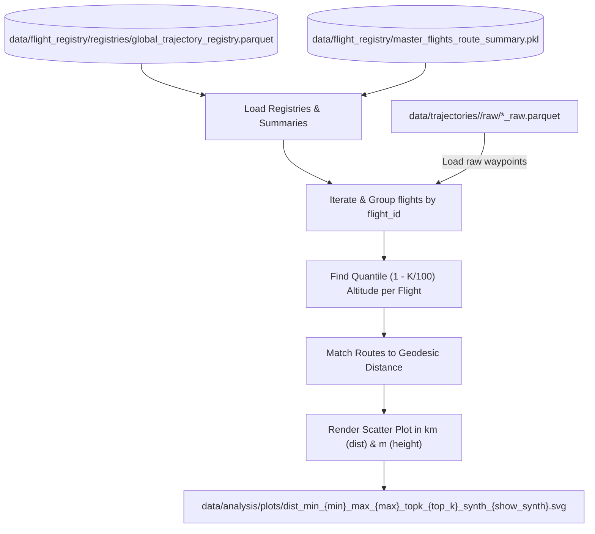

# Analysis Module

The `analysis` module provides tools and scripts to aggregate flight trajectory data, match it with route metadata, perform statistical analysis, and generate visualizations (such as relating the distance between airports to the maximum flight altitude).

---

## 1. Module Structure

```text
src/analysis/verification/
├── flight_analysis.py             # CLI execution script for distance vs altitude analysis
├── flight_level_analysis.py       # CLI execution script for cruise Flight Level distribution boxplots
├── matlab_prepare.py              # CLI script for MATLAB verification data exports
├── plot_corridor_clusters.py      # CLI script for dual-panel cluster, medoid, & altitude visualizations
├── route_class_analysis.py        # CLI execution script for route class distribution histogram
├── route_popularity_analysis.py   # CLI execution script for binned route popularity analysis
├── summarize_population.py        # CLI inspection tool for master_flights route summary tables
└── README.md                      # This module documentation
```

---

## 2. Function Analysis Solution Tree (FAST)

```text
Flight Trajectory Analysis (Goal)
├── Ingest Registries & Data (Objective 1)
│   ├── load_route_summary() [src.common.utils] -> Loads airport pair distances
│   └── pd.read_parquet() [pandas] -> Loads flight trajectories and registries
├── Process & Aggregate Heights (Objective 2)
│   ├── groupby('flight_id') [pandas] -> Groups waypoints by flight
│   └── quantile() [pandas] -> Extracts height threshold at top-K percent per flight
├── Match Routes & Merge Distances (Objective 3)
│   └── Merge route keys ('DEP -> ARR') with Route Summary distances
├── Visualize & Export Outcomes (Objective 4)
│   ├── plt.scatter() [matplotlib] -> Generates the relation scatter plot
│   └── savefig() [matplotlib] -> Exports the plot in SVG format to data/analysis/plots/
```

---

## 3. Data Workflow



> [!NOTE]
> Visual rendering warning: Mermaid flowcharts require a compatible markdown viewer or renderer. If viewing in a raw text environment, refer to the step-by-step description below.
 
### Step-by-Step Data Workflow Description
1. **Ingest Registries**: The orchestrator loads the global trajectory registry (`global_trajectory_registry.parquet`) and the global synthesized baseline registry (`global_model_registry.parquet`) to identify files on disk. Simultaneously, it loads the master route summary pickle (`master_flights_route_summary.pkl`) to obtain geodesic route distances.
2. **Batch Trajectory Processing**: The script loops over all unique parquet files, groups the waypoints by `flight_id`, and calculates the altitude at the top-K percent threshold using the `(1 - K/100)` quantile of the raw barometric pressure altitude column (`baroaltitude` for raw flights, `altitude` for synthesized paths).
3. **Distance Matching**: The flight departure and arrival airport ICAOs are concatenated to form a route key `'DEP -> ARR'`. This key is matched against the route summary dictionary to retrieve the geodesic distance in meters.
4. **Plotting**: Distance is scaled from meters to kilometers (`km`) for plotting, and the height threshold is kept in meters (`m`). Ticks and grid sublines are drawn at every 1 km (1,000 meters) of altitude. A scatter plot is generated with Matplotlib mapping airport distance (X-axis) against altitude (Y-axis), with synthesized baselines overlaid as red dots if enabled.
5. **Export**: The generated figure is saved in SVG vector format under the dynamic filename parameterization to `data/analysis/plots/`.

---

## 4. CLI Usage Guide

### Bash Syntax Example
```bash
python -m src.analysis.verification.flight_analysis \
  --registry data/flight_registry/registries/global_trajectory_registry.parquet \
  --synthesized-registry data/flight_registry/registries/global_model_registry.parquet \
  --summary data/flight_registry/master_flights_route_summary.pkl \
  --output-dir data/analysis/plots \
  --min-distance 500 \
  --max-distance 1500 \
  --no-synthesized
```

### PowerShell Syntax Example
```powershell
python -m src.analysis.verification.flight_analysis `
  --registry data/flight_registry/registries/global_trajectory_registry.parquet `
  --synthesized-registry data/flight_registry/registries/global_model_registry.parquet `
  --summary data/flight_registry/master_flights_route_summary.pkl `
  --output-dir data/analysis/plots `
  --min-distance 500 `
  --max-distance 1500 `
  --no-synthesized `
  --top-k-percent 10
```

### CLI Parameters Reference

#### Flight Distance vs. Height Plot (`flight_analysis.py`)
* `--registry` (string): Path to the global raw trajectory manifest registry. Default: `data/flight_registry/registries/global_trajectory_registry.parquet`.
* `--synthesized-registry` (string): Path to the global synthesized baseline registry. Default: `data/flight_registry/registries/global_model_registry.parquet`.
* `--summary` (string): Path to the route summary database. Default: `data/flight_registry/master_flights_route_summary.pkl`.
* `--output-dir` (string): Destination directory for the exported plot. Default: `data/analysis/plots`.
* `--min-height` (float): Minimum peak height in meters to filter out ground-level or truncated flights. Default: `0.0`.
* `--min-distance` (float): Minimum airport geodesic distance in kilometers to slice flights. Default: `None`.
* `--max-distance` (float): Maximum airport geodesic distance in kilometers to slice flights. Default: `None`.
* `--no-synthesized` (flag): Disables loading and overlaying the synthesized route centroids (red dots) on the plot.
* `--top-k-percent` (float): Percentage threshold to define height metric (e.g. 10.0 for 90th percentile). Default: `0.0`.
* `--plot-type` (string): Visual representation type of raw trajectory distribution. Choices: `scatter`, `hexbin`, `hist2d`. Default: `scatter`.

* **Dynamic Naming Scheme**: `dist_min_{min_val}_max_{max_val}_topk_{top_k}_plot_{plot_type}_synth_{show_synthesized}.svg`
  - Example: `dist_min_500_max_1500_topk_10_plot_hexbin_synth_false.svg`.

#### Route Popularity vs. Distance Plot (`route_popularity_analysis.py`)
* `--summary` (string): Path to the route summary database. Default: `data/flight_registry/master_flights_route_summary.pkl`.
* `--output-dir` (string): Destination directory for the exported plot. Default: `data/analysis/plots`.
* `--bin-size` (float): Width of each distance bin in kilometers. Default: `100.0`.
* `--cumulative` (flag): If set, aggregates data cumulatively from 0 km (e.g. `<100`, `<200`, etc.).
* `--min-frequency` (int): Minimum flight popularity count required for a route to be included. Default: `1`.

* **Dynamic Naming Scheme**: `popularity_dist_bin_{bin_size}_minfreq_{min_frequency}_cum_{cumulative}.svg`
  - Example: `popularity_dist_bin_100_minfreq_5_cum_false.svg`.

### CLI Syntax Examples (Route Popularity)
```bash
# Standard window binning with 100km bins, filtering out routes with < 5 flights
python -m src.analysis.verification.route_popularity_analysis --bin-size 100 --min-frequency 5

# Cumulative binning with 200km bins, including all routes
python -m src.analysis.verification.route_popularity_analysis --bin-size 200 --cumulative --min-frequency 1
```

#### Route Class Distribution Plot (`route_class_analysis.py`)
* `--registry` (string): Path to the global synthesized baseline registry. Default: `data/flight_registry/registries/global_model_registry.parquet`.
* `--output-plot` (string): Destination path for the exported distribution plot. Default: `data/analysis/plots/route_class_distribution.svg`.

### CLI Syntax Examples (Route Class Distribution)
```bash
# Calculate route class distribution percentages and save the distribution histogram
python -m src.analysis.verification.route_class_analysis
```

#### Flight Level Distribution Boxplots (`flight_level_analysis.py`)
* `--registry` (string): Path to the global raw flight registry. Default: `data/flight_registry/registries/global_trajectory_registry.parquet`.
* `--summary` (string): Path to the route summary database. Default: `data/flight_registry/master_flights_route_summary.parquet`.
* `--top-k-percent` (float): Percentile threshold to identify cruise height within each flight (e.g. 10.0 for 90th percentile). Default: `10.0`.
* `--fl-step` (float): Flight Level bucket rounding step (default 10.0 rounds to FL10 increments). Default: `10.0`.
* `--dist-step` (float): Optional airport geodesic distance bin size in km. If omitted, plots route-by-route sorted by distance. Default: `None`.
* `--output-dir` (string): Destination folder for exported SVG plots. Default: `data/analysis/plots`.

### CLI Syntax Examples (Flight Level Distributions)
```bash
# Generate route-by-route sorted boxplot distribution
python -m src.analysis.verification.flight_level_analysis --top-k-percent 10

# Generate 200km binned distance bracket boxplot distribution
python -m src.analysis.verification.flight_level_analysis --dist-step 200 --top-k-percent 10
```

#### Trajectory Cluster & Medoid Visualization (`plot_corridor_clusters.py`)
* `--route-id` (string): Target route ID (e.g. `LEPA-LEBL`). Default: `LEPA-LEBL`.
* `--out-file` (string): Path to save output plot (default: `data/analysis/plots/<route_id>_clusters.svg`).
* `--show` (flag): Display interactive matplotlib plot window.

### CLI Syntax Examples (Cluster & Medoid Visualization)
```bash
# Generate dual-panel GeoMap and Altitude Profile plot for route LEPA-LEBL
python -m src.analysis.verification.plot_corridor_clusters --route-id LEPA-LEBL
```

### Logging

All entrypoint scripts initialize logging via `setup_file_logger()` from `src.common.utils`.

| Log file written to `data/logs/` | Writer | Purpose |
|---|---|---|
| `analysis.log` | `flight_analysis.py`, `flight_level_analysis.py`, `matlap_prepare.py`, `route_class_analysis.py`, `route_popularity_analysis.py` | Logs execution milestones, trajectory processing details, and plot generation metrics. |

## 5. Prerequisites & Dependencies

The module requires the following libraries and configs:
- Python 3.10+
- `pandas` and `pyarrow` (for reading parquet registry databases)
- `matplotlib` (for graphing)
- Project configurations centralized in `src.common.config`
- Project coding conventions outlined in [conventions.md](file:///g:/Meine%20Ablage/UNI/SS26/PythonPipeline%20-%20Kopie/src/conventions.md)
