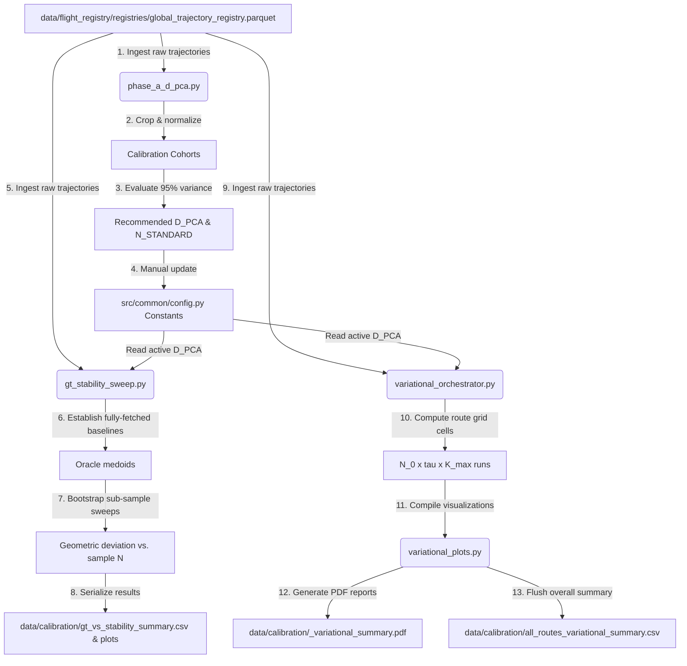

# Hyperparameter Calibration Module

This module handles the calibration of key hyperparameters ($D_{PCA}$, $N_{standard}$, $N_0$, $\tau$, and $K_{max}$) for spatial compression, trajectory stability checking, and corridor clustering. It runs statistical simulations, bootstrap sweeps, and benchmarks against Oracle Ground Truth parameters to optimize query costs while maintaining high-fidelity flight path extraction.

The calibration workflow consists of two main campaigns:
1. **Phase A Calibration (`phase_a_d_pca.py`)**: Evaluates fully-fetched cohorts across calibration routes to determine the minimum number of PCA components ($D_{PCA}$) required to capture at least 95% of spatial coordinate variance.
2. **Phase B / 3D Variational Calibration (`variational_orchestrator.py`)**: Runs grid sweeps across initial query size ($N_0$), stability threshold ($\tau$), and maximum clusters ($K_{max}$) to locate the Pareto frontier of minimum Trino database query costs versus minimum geometric error.

All outcomes, including summary tables, scatter plots, Pareto frontiers, and multi-page PDF reports, are written to the centralized `data/calibration/` folder.

---

## 1. Module Structure

```text
src/calibration/
├── __init__.py                # Standard python package initialization
├── README.md                  # This documentation file
├── phase_a_d_pca.py           # Phase A: PCA dimension determination (D_PCA)
├── gt_stability_sweep.py      # Ground Truth geometric error vs. stability metric sweep
├── variational_orchestrator.py # 3D Variational parameter sweep orchestrator (grid search)
└── variational_plots.py       # Visualization & PDF report compiler for parameter sweeps
```

---

## 2. Function Analysis Solution Tree (FAST)

```text
Module Objectives
 └── Calibrate spatial compression and stability hyperparameters against Ground Truth (Phase A & B)
      │
      ├── Sub-objective 1: Determine optimal PCA dimensions (D_PCA)
      │    └── Solution: run_phase_a() in phase_a_d_pca.py
      │         ├── Inputs: raw trajectory registry, calibration routes list
      │         └── Outputs: recommended D_PCA (95% variance) and baseline N_STANDARD
      │
      ├── Sub-objective 2: Benchmark split-half stability metrics against physical deviation
      │    └── Solution: run_gt_sweep() in gt_stability_sweep.py
      │         ├── Inputs: trajectory registry, N values, bootstrap replicates (k-replicates)
      │         └── Outputs: raw/summary error CSV files, error-vs-N line plots, scatter plots
      │
      ├── Sub-objective 3: Orchestrate multi-dimensional grid sweeps (N_0 x tau x K_max) in parallel
      │    └── Solution: main() in variational_orchestrator.py
      │         ├── Inputs: route data, parameter grids (N0, tau, Kmax), bootstrap replicates
      │         ├── Outputs: raw/summary variational grid CSVs, combined all-route summary
      │         └── Concurrency: Oracle baselines prepared sequentially; route sweeps dispatched concurrently via ProcessPoolExecutor (max_workers = min(n_routes, cpu_count))
      │
      ├── Sub-objective 4: Compile visual report dashboards
      │    └── Solution: generate_route_pdf_report() in variational_plots.py
      │         ├── Inputs: route variational summary, Oracle configuration parameters
      │         └── Outputs: multi-page PDF reports containing Pareto plots, summary tables, and heatmaps
      │
      └── Sub-objective 5: Compute physical 3D deviation metrics
           └── Solution: _trajectory_distance_km() in gt_stability_sweep.py
                ├── Inputs: two 300-dimensional resampled waypoint vectors (lat, lon, alt)
                └── Outputs: mean 3D spatial waypoint deviation in kilometers
```

---

## 3. Data Workflow

> [!NOTE]
> **Visual Rendering Warning**: Flowcharts are generated using Mermaid. If your markdown viewer does not natively support Mermaid rendering, please refer to the step-by-step text description provided directly below each diagram.



#### Step-by-Step Description: Calibration Workflow
1. **Phase A Ingestion & Preprocessing**: The `phase_a_d_pca.py` script queries the trajectory registry and loads the complete cohort of flights for 6 oversampled calibration routes. The flights are filtered to airborne phases and holding-pattern normalized.
2. **Variance Evaluation**: The script vectorizes coordinates, runs PCA, and computes the minimum number of PCA components needed to capture at least 95% variance for each route. The median of these values is printed as the recommended `D_PCA`.
3. **Config Constants Update**: The recommended `D_PCA` and its companion query cost `N_STANDARD = 5 * D_PCA` are manually updated in `src/common/config.py`.
4. **GT Sweep Ingestion & Oracle Baseline**: Using the active configuration parameters, `gt_stability_sweep.py` loads the full flight cohorts to establish the "Oracle Ground Truth" medoids and optimal clusters for the calibration routes.
5. **GT Bootstrap Sweep**: For different sample sizes ($N$), the script draws random subsets and compares their medoid centroids to the Oracle medoids, computing the 3D geometric deviation in kilometers. It also computes split-half stability metrics ($X_{scaled}$ vs. $X_{pca}$ split-half).
6. **GT Outcomes Generation**: The script writes raw and aggregated CSV files and outputs line graphs of error-vs-$N$ and metric scatter plots to `data/calibration/`.
7. **Variational Sweep Orchestration**: The `variational_orchestrator.py` script first prepares Oracle baselines for all routes sequentially (to avoid concurrent parquet I/O contention), then dispatches one `run_route_variational_sweep` task per route concurrently using a `ProcessPoolExecutor` with `max_workers = min(n_routes, cpu_count)`. Results are collected via `as_completed` and saved as individual route CSVs as they finish.
8. **Iterative Pipeline Simulation**: For each parameter cell, the script simulates the Stage 2 stability loop (doubling $N$ if $\Delta$CV $\ge \tau$ up to a maximum of 2 rerun rounds) followed by Stage 3 clustering. The silhouette threshold (`SILHOUETTE_THRESHOLD`) is applied during `_evaluate_custom_k`, allowing $k=1$ to be returned for unimodal routes.
9. **Visual Report Compiling**: The orchestrator invokes `generate_route_pdf_report` in `variational_plots.py` to compile a multi-page PDF report for each route containing:
   * **Page 1**: Executive table listing the top 15 parameter configurations.
   * **Page 2**: Scatter plot displaying the Pareto frontier (expected query cost vs. median geometric error).
   * **Page 3+**: Error heatmaps for each $K_{max}$ value, with overlaid contour lines showing database query costs.
10. **Combined Summary Flush**: Variational files are saved for each route, and combined files are flushed to `all_routes_variational_raw.csv` and `all_routes_variational_summary.csv`.

---

## 4. CLI Usage Guide

### Bash

```bash
# 1. Run Phase A PCA dimension calibration
python -m src.calibration.phase_a_d_pca

# 2. Run Ground Truth geometric error vs. stability sweep (30 replicates)
python -m src.calibration.gt_stability_sweep \
    --k-replicates 30

# 3. Run Ground Truth sweep, printing summary tables without generating images
python -m src.calibration.gt_stability_sweep \
    --k-replicates 30 \
    --table-only

# 4. Run 3D Variational sweep orchestrator over all calibration routes
python -m src.calibration.variational_orchestrator \
    --replicates 30

# 5. Run dry-run variational sweep (1 route, 2 replicates) for verification
python -m src.calibration.variational_orchestrator \
    --replicates 2 \
    --dry-run
```

### PowerShell

```powershell
# Run Phase A PCA dimension calibration
python -m src.calibration.phase_a_d_pca

# Run Ground Truth sweep (30 replicates)
python -m src.calibration.gt_stability_sweep `
    --k-replicates 30

# Run variational sweep orchestrator (30 replicates)
python -m src.calibration.variational_orchestrator `
    --replicates 30
```

---

### 4.1. Parameter References

#### Parameter Reference (`gt_stability_sweep.py`)

| CLI Option | Type | Default | Description |
| :--- | :--- | :--- | :--- |
| `--k-replicates` | `int` | `30` | Number of bootstrap replicate selections to run per sample size. |
| `--table-only` | `flag` | *False* | If set, generates and saves only summary CSV files, bypassing Matplotlib plot rendering. |

#### Parameter Reference (`variational_orchestrator.py`)

| CLI Option | Type | Default | Description |
| :--- | :--- | :--- | :--- |
| `--replicates` | `int` | `30` | Number of bootstrap replicate simulations to run per parameter grid cell. |
| `--dry-run` | `flag` | *False* | Enables dry-run mode: limits the sweep to 1 route, 2 replicates, and disables PDF report rendering. |

---

## 5. Prerequisites & Dependencies

### Python Libraries
* `pandas` & `pyarrow` (for Parquet and CSV table storage)
* `numpy` (for matrix math, distance calculations, and scaling)
* `scikit-learn` (for PCA and K-Means clustering)
* `matplotlib` (for heatmaps, scatter plots, and multi-page PDF generation)

### Input Files
* `data/flight_registry/registries/global_trajectory_registry.parquet` (provides trajectory paths)
* Python modules `src.corridor_modeling.pca_compressor`, `src.corridor_modeling.clustering_worker`, and `src.corridor_modeling.stability_worker`.

For physical units, coordinate transformations, and directory structure conventions, refer to the centralized **[conventions.md](file:///g:/Meine%20Ablage/UNI/SS26/PythonPipeline%20-%20Kopie/src/conventions.md)** standards.
