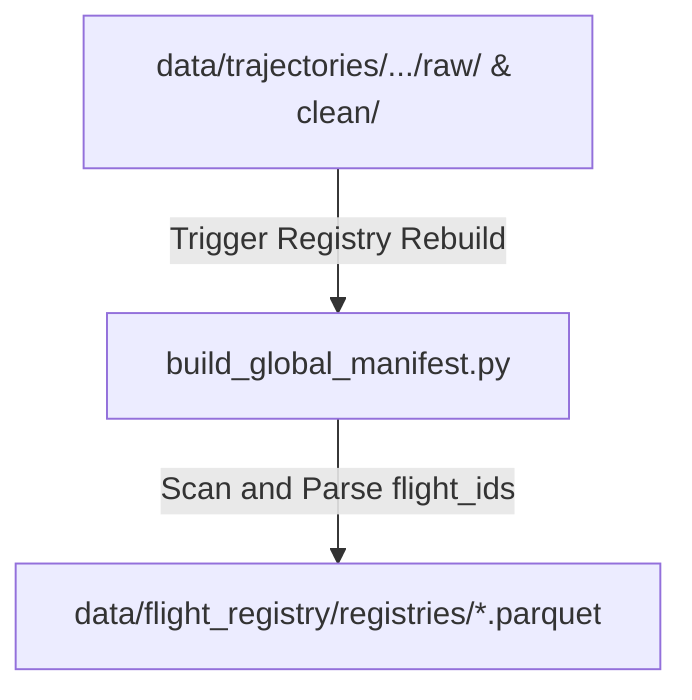

# Common Module

The `common` module provides shared configurations, database and object adapters, global dataset indexing registries, directory migration tools, and general helper functions used across all loops of the Flight Physics Pipeline.

---

## 1. Module Structure

```text
src/common/
├── README.md                     # This documentation file
├── config.py                     # Centralized settings, path definitions, and weather parameters
├── concurrency.py                # CPU-level and C-library thread-limiting utilities
├── adapters.py                   # Data serialization and conversion between Pandas, PyContrails, and Traffic
├── build_global_manifest.py      # Rebuilds and updates registries for raw, clean, and simulated flight files
└── utils.py                      # Centralized helper utilities (file loggers, dataset name generators)
```

---

## 2. Function Analysis Solution Tree (FAST)

```text
Module Objectives
 └── Standardize configuration, data models, logging, and registries across the pipeline
      │
      ├── Sub-objective 1: Centralize path resolution, environmental constants, and concurrency limits
      │    ├── Solution A: config.py
      │    │    ├── Inputs: Environmental variables, relative directory lookups
      │    │    └── Outputs: Base directories, weather variables, grid definitions, and concurrency limits
      │    └── Solution B: concurrency.py
      │         ├── limit_numeric_threads(): Sets CPU/C-library thread bounds via environment variables and threadpoolctl
      │         └── set_numeric_thread_env(): Directly restricts BLAS/OpenMP/NumExpr C-library thread counts
      │
      ├── Sub-objective 2: Convert trajectories between third-party library objects and handle Parquet I/O
      │    └── Solution: adapters.py
      │         ├── dataframe_to_pycontrails(): Maps DataFrame columns to pycontrails.Flight schema
      │         ├── write_flights_to_parquet(): Serializes pycontrails.Flight list to flat Parquet
      │         ├── parquet_to_pycontrails(): Reads Parquet, normalizes raw OpenSky columns, and constructs pycontrails.Flight instances grouped by flight_id
      │         ├── pycontrails_to_traffic(): Translates pycontrails.Flight to traffic.core.Flight (converting SI units → aviation units: m→ft, m/s→kt, m/s→ft/min)
      │         └── traffic_to_pycontrails(): Translates traffic.core.Flight or DataFrame back to pycontrails.Flight (converting aviation units → SI units), with optional drop_kinematics flag to strip kinematic columns for corridor templates
      │
      └── Sub-objective 3: Index trajectory files and query target corridor metadata
           └── Solution: build_global_manifest.py & utils.py
                ├── build_global_manifest.py: Rebuilds global Parquet registries mapping flight_ids to paths
                ├── update_global_registry(): Atomically inserts new trajectory records into Parquet registries
                └── extract_target_routes(): Queries `ROUTE_SUMMARY_PARQUET` to resolve RouteSummary ranks into target `(dep, arr)` airport codes
```

---

## 3. Data Workflow

> [!NOTE]
> **Mermaid Render Support**: The workflow diagram below uses Mermaid syntax. If you are viewing this markdown file in VS Code and it does not render visually, you will need to install a Mermaid preview extension, such as **Markdown Preview Mermaid Support** (by Matt Bierner) or view it in an environment that supports it natively.



1. **Registry Rebuilding**: After directories are restructured or new runs are completed, `build_global_manifest.py` scans the subfolders to map `flight_id`s to their file locations, generating global Parquet registry files under `data/flight_registry/registries/`.

---

## 4. CLI Usage Guide

Scripts within this module can be executed from the project root using Python's module format:

### Bash
```bash
# Rebuild all global trajectory and simulation registries
python -m src.common.build_global_manifest
```

### PowerShell
```powershell
# Rebuild all global trajectory and simulation registries
python -m src.common.build_global_manifest
```

---

## 5. Prerequisites & Dependencies

### Python Libraries
* `pandas` & `pyarrow` (for Parquet reading, writing, and DataFrame manipulation)
* `numpy` (for vectorized mathematical equations)
* `pycontrails` (for Flight data models)
* `traffic` (for airport coordinate lookups and traffic Flight models)

For global coordinate standards and directory standards, refer to the project's centralized **[conventions.md](../conventions.md)**.
