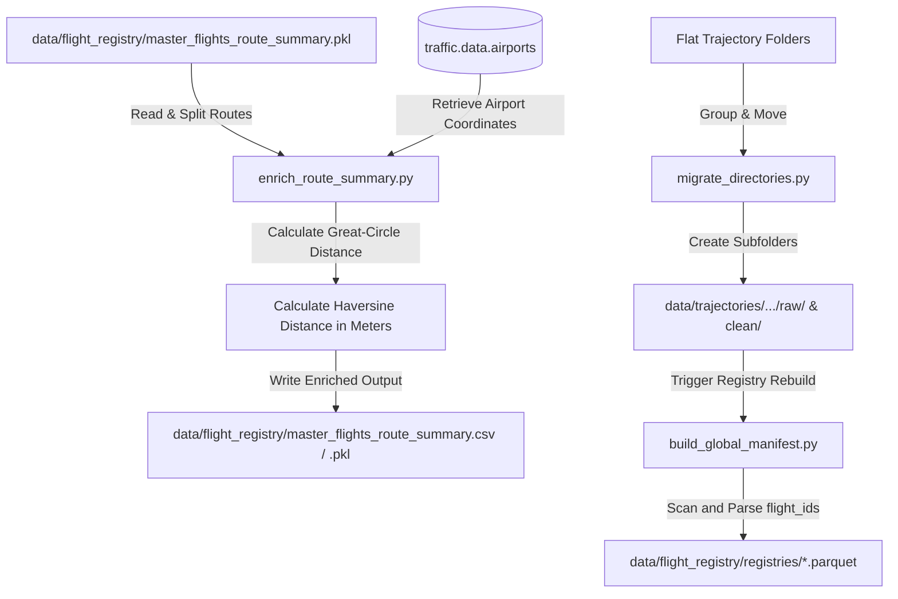

# Common Module

The `common` module provides shared configurations, database and object adapters, global dataset indexing registries, directory migration tools, and general helper functions used across all loops of the Flight Physics Pipeline.

---

## 1. Module Structure

```text
src/common/
├── README.md                     # This documentation file
├── config.py                     # Centralized settings, path definitions, and weather parameters
├── adapters.py                   # Data serialization and conversion between Pandas, PyContrails, and Traffic
├── build_global_manifest.py      # Rebuilds and updates registries for raw, clean, and simulated flight files
├── enrich_route_summary.py       # Enriches route summaries with vectorized great-circle distances
├── migrate_directories.py        # Organizes flat run outputs into structured raw/ and clean/ subdirectories
└── utils.py                      # Centralized helper utilities (file loggers, dataset name generators)
```

---

## 2. Function Analysis Solution Tree (FAST)

```text
Module Objectives
 └── Standardize configuration, data models, logging, and registries across the pipeline
      │
      ├── Sub-objective 1: Centralize path resolution and environmental constants
      │    └── Solution: config.py
      │         ├── Inputs: Environmental variables, relative directory lookups
      │         └── Outputs: Base directories, weather variables, and grid definitions
      │
      ├── Sub-objective 2: Convert trajectories between third-party library objects and handle Parquet I/O
      │    └── Solution: adapters.py
      │         ├── dataframe_to_pycontrails(): Maps DataFrame columns to pycontrails.Flight schema
      │         ├── write_flights_to_parquet(): Serializes pycontrails.Flight list to flat Parquet
      │         ├── parquet_to_pycontrails(): Reads Parquet, normalizes raw OpenSky columns, and constructs pycontrails.Flight instances grouped by flight_id
      │         ├── pycontrails_to_traffic(): Translates pycontrails.Flight to traffic.core.Flight (converting SI units → aviation units: m→ft, m/s→kt, m/s→ft/min)
      │         └── traffic_to_pycontrails(): Translates traffic.core.Flight or DataFrame back to pycontrails.Flight (converting aviation units → SI units), with optional drop_kinematics flag to strip kinematic columns for corridor templates
      │
      ├── Sub-objective 3: Index trajectory files to accelerate local caching
      │    └── Solution: build_global_manifest.py & utils.py (update_global_registry)
      │         ├── Inputs: Raw, clean, and simulated parquet outputs on disk
      │         └── Outputs: Parquet registries mapping flight_ids to relative file paths
      │
      ├── Sub-objective 4: Enrich route records with geodetic distances
      │    └── Solution: enrich_route_summary.py
      │         ├── Inputs: master_flights_route_summary.pkl (or .csv)
      │         └── Outputs: Distance-enriched summary files containing 'distance_m' (meters)
      │
      └── Sub-objective 5: Migrate flat run folders to partitioned directories
           └── Solution: migrate_directories.py
                ├── Inputs: Cohort folders with flat files
                └── Outputs: Partitioned subfolders (raw/ and clean/) and rebuilt manifests
```

---

## 3. Data Workflow

> [!NOTE]
> **Mermaid Render Support**: The workflow diagram below uses Mermaid syntax. If you are viewing this markdown file in VS Code and it does not render visually, you will need to install a Mermaid preview extension, such as **Markdown Preview Mermaid Support** (by Matt Bierner) or view it in an environment that supports it natively.



1. **Route Summary Enrichment**: `enrich_route_summary.py` loads the aggregated flight summary. It splits route descriptions (e.g., `LIRF -> LFMN`), retrieves latitude/longitude coordinates via the `traffic` airport library, applies a vectorized Haversine formula to compute great-circle distances in meters, and overwrites the master summary files with the new `distance_m` column.
2. **Directory Partitioning**: `migrate_directories.py` scans directories inside `data/trajectories/`. Any flatly dumped trajectory files are sorted: `*_raw.parquet` files are moved into a `raw/` subdirectory, and `*_clean_si.parquet` files are moved into a `clean/` subdirectory.
3. **Registry Rebuilding**: After directories are restructured or new runs are completed, `build_global_manifest.py` scans the subfolders to map `flight_id`s to their file locations, generating global Parquet registry files under `data/flight_registry/registries/`.

---

## 4. CLI Usage Guide

Scripts within this module can be executed from the project root using Python's module format:

### Bash
```bash
# Rebuild all global trajectory and simulation registries
python -m src.common.build_global_manifest

# Enrich the default route summary file with great-circle distances
python -m src.common.enrich_route_summary

# Restructure cohort directories and partition raw/clean Parquet files
python -m src.common.migrate_directories
```

### PowerShell
```powershell
# Rebuild all global trajectory and simulation registries
python -m src.common.build_global_manifest

# Enrich the default route summary file with great-circle distances
python -m src.common.enrich_route_summary

# Restructure cohort directories and partition raw/clean Parquet files
python -m src.common.migrate_directories
```

---

## 5. Prerequisites & Dependencies

### Python Libraries
* `pandas` & `pyarrow` (for Parquet reading, writing, and DataFrame manipulation)
* `numpy` (for vectorized mathematical equations)
* `pycontrails` (for Flight data models)
* `traffic` (for airport coordinate lookups and traffic Flight models)

For global coordinate standards and directory standards, refer to the project's centralized **[conventions.md](../conventions.md)**.
