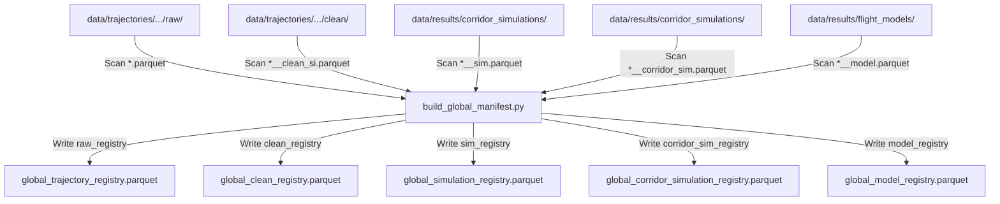
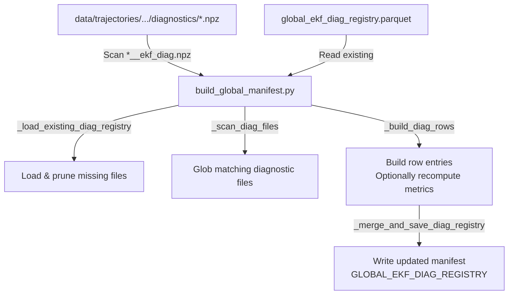

# Common Module

The `common` module provides shared configurations, database and object adapters, global dataset indexing registries, directory migration tools, and general helper functions used across all loops of the Flight Physics Pipeline.

---

## 1. Module Structure

```text
src/common/
├── README.md                     # This documentation file
├── config.py                     # Centralized settings, path definitions, and weather parameters
├── concurrency.py                # CPU-level and C-library thread-limiting utilities
├── adapters.py                   # Data serialization and conversion between Pandas, PyContrails, and Traffic
├── build_global_manifest.py      # Rebuilds and updates registries for raw, clean, and simulated flight files
└── utils.py                      # Centralized helper utilities (file loggers, dataset name generators)
```

---

## 2. Function Analysis Solution Tree (FAST)

```text
Module Objectives
 └── Standardize configuration, data models, logging, and registries across the pipeline
      │
            ├── Sub-objective 1: Centralize path resolution, environmental constants, and filtering/concurrency limits
      │    ├── Solution A: config.py
      │    │    ├── Inputs: Environmental variables, relative directory lookups, calibrated defaults
      │    │    ├── Outputs: Base directories, weather variables, grid definitions, metadata filter thresholds, and concurrency limits
      │    │    └── Shared thresholds: DEFAULT_PREFILTER_THRESHOLDS and DEFAULT_POSTFILTER_THRESHOLDS centralize pre/post trajectory quality gates
      │    └── Solution B: concurrency.py
      │         ├── limit_numeric_threads(): Sets CPU/C-library thread bounds via environment variables and threadpoolctl
      │         └── set_numeric_thread_env(): Directly restricts BLAS/OpenMP/NumExpr C-library thread counts
      │
      ├── Sub-objective 2: Convert trajectories between third-party library objects and handle Parquet I/O
      │    └── Solution: adapters.py
      │         ├── dataframe_to_pycontrails(): Maps DataFrame columns to pycontrails.Flight schema
      │         ├── write_flights_to_parquet(): Serializes pycontrails.Flight list to flat Parquet
      │         ├── parquet_to_pycontrails(): Reads Parquet, normalizes raw OpenSky columns, and constructs pycontrails.Flight instances grouped by flight_id
      │         ├── pycontrails_to_traffic(): Translates pycontrails.Flight to traffic.core.Flight (converting SI units → aviation units: m→ft, m/s→kt, m/s→ft/min)
      │         └── traffic_to_pycontrails(): Translates traffic.core.Flight or DataFrame back to pycontrails.Flight (converting aviation units → SI units), with optional drop_kinematics flag to strip kinematic columns for corridor templates
      │
      └── Sub-objective 3: Index trajectory files and compile global manifests
           └── Solution: build_global_manifest.py & utils.py
                ├── rebuild_raw_registry(force: bool): Rebuilds raw trajectory manifest (`GLOBAL_TRAJECTORY_REGISTRY`)
                ├── rebuild_clean_registry(force: bool): Rebuilds clean SI trajectory manifest (`GLOBAL_CLEAN_REGISTRY`)
                ├── rebuild_simulation_registry(force: bool): Rebuilds simulated flight manifest (`GLOBAL_SIMULATION_REGISTRY`)
                ├── rebuild_corridor_sim_registry(force: bool): Rebuilds corridor simulation manifest (`GLOBAL_CORRIDOR_SIM_REGISTRY`)
                ├── rebuild_model_registry(force: bool): Rebuilds synthesized flight manifest (`GLOBAL_MODEL_REGISTRY`), supporting incremental runs when force=False
                ├── rebuild_ekf_diag_registry(force: bool, recompute_metrics: bool): Compiles the EKF diagnostic registry (`GLOBAL_EKF_DIAG_REGISTRY`), recomputing metrics from NPZ files if specified
                ├── update_global_registry(): Atomically inserts new trajectory records into Parquet registries
                └── extract_target_routes(): Queries `ROUTE_SUMMARY_PARQUET` to resolve RouteSummary ranks into target `(dep, arr)` airport codes
```

---

## 3. Data Workflow

### 3.1 Standard Registry Generation (`build_global_manifest.py`)

This workflow indexes the standard flight trajectories and simulation output files across the workspace.



**Step-by-step:**
1. **Directories Scan**: The manifest builder scans designated data directories for files matching specific wildcard patterns (e.g. `*_raw.parquet`, `*_clean_si.parquet`, `*_sim.parquet`, `*_model.parquet`, etc.).
2. **File Reading & Extraction**: For each found file, it reads only the `flight_id` column to identify all unique flight trajectories contained within.
3. **Registry Update & Write**: It reads the existing registry file to skip already-indexed paths (unless `--force` is used). New rows mapping `flight_id` to its relative `file_path` are appended, deduplicated by keeping the latest entry, and written atomically.
4. **Pruning & Cleanup**: If `force=False`, it prunes entries pointing to files that have been deleted from the filesystem before saving.

---

### 3.2 EKF Diagnostic Registry Generation (`build_global_manifest.py` --diag-only)

This workflow indexes EKF diagnostic NPZ files and compiles EKF quality scores and metrics.



**Step-by-step:**
1. **Load Existing Registry**: `_load_existing_diag_registry()` loads the existing diagnostic manifest (`GLOBAL_EKF_DIAG_REGISTRY`) and prunes entries whose diagnostic files no longer exist on disk.
2. **Scan NPZ Files**: `_scan_diag_files()` globs all files matching `*_ekf_diag.npz` inside the workspace trajectories directory.
3. **Build Manifest Entries**: `_build_diag_rows()` parses each diagnostic file:
   - If the file is already indexed in the registry and `recompute_metrics` is `False`, it loads the cached metrics array directly from the registry.
   - If `recompute_metrics` is `True` or the file is new, it invokes the EKF recomputation wrapper to read the raw covariance and innovation matrices (`S_k`, `P_k`, `e_k`) and calculate `ekf_quality_score`, `ekf_mean_nis`, and `ekf_max_trace_p`.
4. **Merge and Save**: `_merge_and_save_diag_registry()` concatenates the existing registry rows with the new ones, deduplicates them by `flight_id`, and writes the compiled manifest to `GLOBAL_EKF_DIAG_REGISTRY` atomically.

---

## 4. CLI Usage Guide

The global manifest builder is executed from the project root using Python's module syntax.

### Bash
```bash
# Rebuild all registries from scratch (overwrites existing manifests)
python -m src.common.build_global_manifest --all --force

# Incrementally update only the synthesized model registry
python -m src.common.build_global_manifest --only model

# Rebuild only the EKF diagnostic registry and recompute all metrics from NPZ files
python -m src.common.build_global_manifest --diag-only --recompute-ekf-metrics --force
```

### PowerShell
```powershell
# Rebuild all registries from scratch (overwrites existing manifests)
python -m src.common.build_global_manifest --all --force

# Incrementally update only the synthesized model registry
python -m src.common.build_global_manifest --only model

# Rebuild only the EKF diagnostic registry and recompute all metrics from NPZ files
python -m src.common.build_global_manifest --diag-only --recompute-ekf-metrics --force
```

### Parameter Reference

| Option | Type | Default | Required | Description |
| :--- | :--- | :--- | :--- | :--- |
| `--only` | `nargs="+"` list of choices | `None` | No | Rebuild only the selected registries. Choices: `raw`, `clean`, `simulation`, `corridor-sim`, `model`, `ekf-diag`. |
| `--all` | `store_true` flag | `False` | No | Rebuild all registries. |
| `--force` | `store_true` flag | `False` | No | Force a complete rebuild from scratch, ignoring existing registry rows. |
| `--recompute-ekf-metrics` | `store_true` flag | `False` | No | Recompute EKF quality scores by reading raw innovation and covariance matrices from diagnostic NPZ files. |
| `--diag-only` | `store_true` flag | `False` | No | Convenience alias to rebuild/update only the EKF diagnostic registry. |

### Logging

`build_global_manifest.py` calls `setup_file_logger(log_filename="manifest.log")` and writes the global manifest rebuild log to `data/logs/manifest.log`.

| Log file written to `data/logs/` | Writer | Purpose |
|---|---|---|
| `manifest.log` | `src.common.build_global_manifest` | Registry scan, pruning, and rebuild/update progress for raw, clean, simulation, corridor-simulation, model, and EKF diagnostic manifests. |


---

## 5. Prerequisites & Dependencies

### Config constants and registries referenced:
- `DEFAULT_PREFILTER_THRESHOLDS`: Centralized metadata prefilter thresholds used by fetching helpers before sampling/quota computation.
- `DEFAULT_POSTFILTER_THRESHOLDS`: Centralized post-filter thresholds used by downstream quality filtering.
- `GLOBAL_TRAJECTORY_REGISTRY` (`data/registries/global_trajectory_registry.parquet`)
- `GLOBAL_CLEAN_REGISTRY` (`data/registries/global_clean_registry.parquet`)
- `GLOBAL_SIMULATION_REGISTRY` (`data/registries/global_simulation_registry.parquet`)
- `GLOBAL_CORRIDOR_SIM_REGISTRY` (`data/registries/global_corridor_simulation_registry.parquet`)
- `GLOBAL_MODEL_REGISTRY` (`data/registries/global_model_registry.parquet`)
- `GLOBAL_EKF_DIAG_REGISTRY` (`data/registries/global_ekf_diag_registry.parquet`)

### Python Libraries
* `pandas` & `pyarrow` (for Parquet reading, writing, and DataFrame manipulation)
* `numpy` (for vectorized mathematical equations)
* `pycontrails` (for Flight data models)
* `traffic` (for airport coordinate lookups and traffic Flight models)

For global coordinate standards and directory standards, refer to the project's centralized **[conventions.md](../conventions.md)**.

