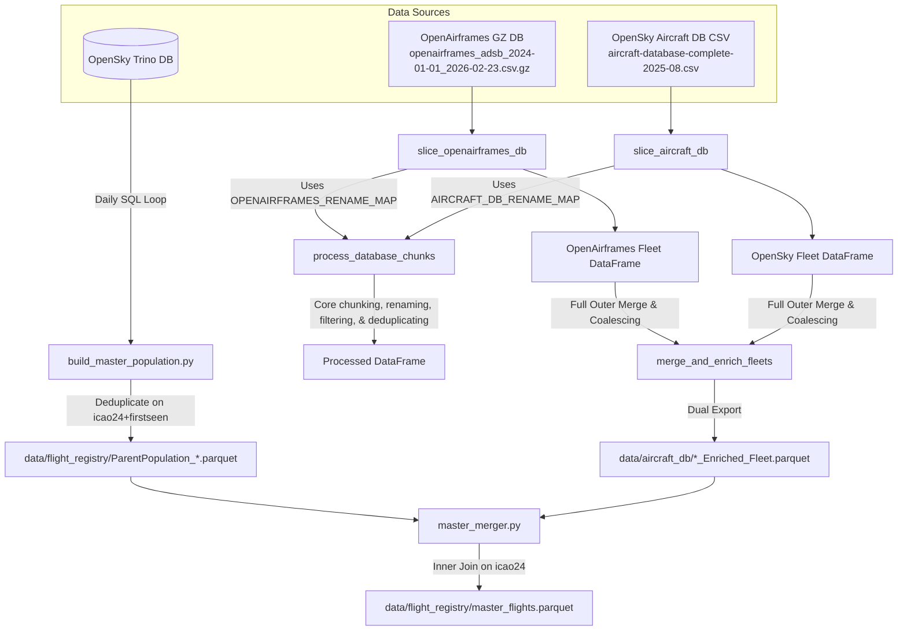
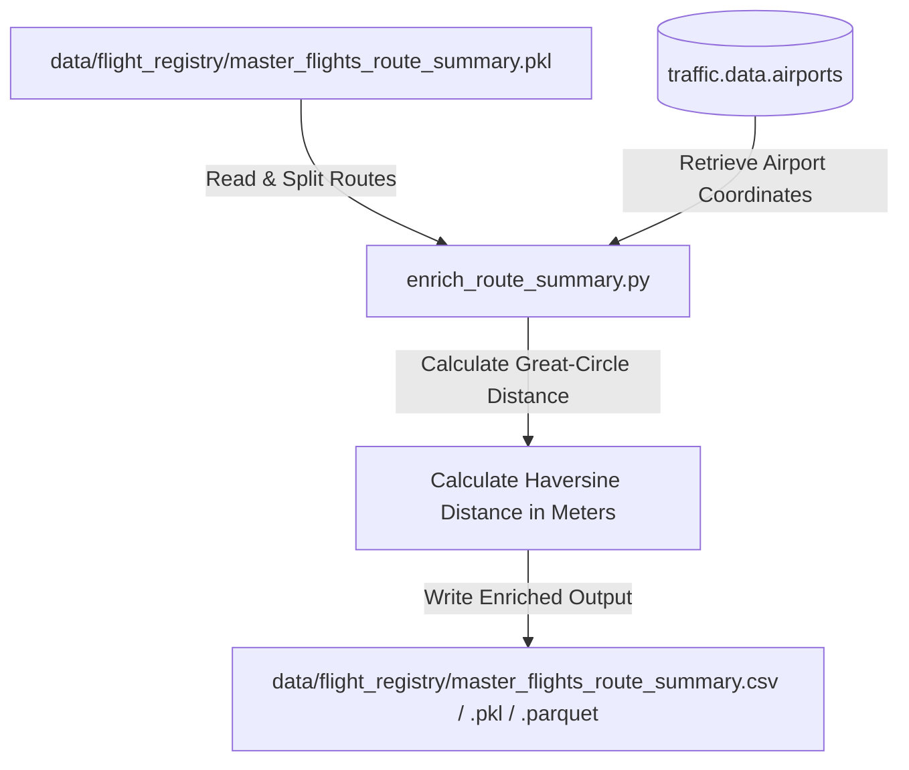

# Acquisition Module

The `acquisition` module handles Track A (fetching flights from Trino) and Track B (slicing and enriching fleet databases from OpenAirframes and AircraftDB).

## 1. Module Structure

```text
src/core/acquisition/
├── build_master_population.py  # Queries Trino FlightsData4 (Track A)
├── enrich_route_summary.py     # Enriches route summaries with vectorized great-circle distances
├── fleet_builder.py            # Slices OpenAirframes & AircraftDB (Track B)
└── master_merger.py            # Merges flights population and fleet registry
```

## 2. Functional Analysis Solution Tree (FAST)

```text
Acquisition Module
├── Ingest Flight logs from Trino (build_master_population.py)
│   ├── Loop day-by-day to respect partition indexing
│   ├── Apply geographical filters (dep-/arr-airport startswith initials B, E, L)
│   └── Deduplicate flight entries on (icao24, firstseen)
└── Build Enriched Fleet Registry (fleet_builder.py)
    ├── Parse command-line arguments and configure logging
    ├── Extract and filter aircraft from OpenAirframes (slice_openairframes_db)
    │   ├── Stream compressed gzip file in chunks to limit memory usage
    │   ├── Clean typecode strings and filter for target aircraft families
    │   ├── Deduplicate on-the-fly (within chunk & against historical set)
    │   └── Rename columns to standard conventions (icao -> icao24, t -> typecode)
    ├── Extract and filter aircraft from OpenSky DB (slice_aircraft_db)
    │   ├── Stream CSV file in chunks using quotechar="'" to handle single-quotes
    │   ├── Clean typecode strings and filter for target aircraft families
    │   ├── Deduplicate on-the-fly (within chunk & against historical set)
    │   └── Rename/keep standard schema columns
    ├── Fallback to traffic library load if local CSV missing (load_aircraft_db_from_traffic)
    │   ├── Import traffic.data.aircraft lazily to avoid startup download triggers
    │   └── Filter and align traffic database columns to unified schema
    └── Merge and export combined fleet databases (merge_and_enrich_fleets)
        ├── Full outer merge of both database DataFrames on 'icao24'
        ├── Coalesce columns (preferring OpenAirframes values, falling back to OpenSky when null)
        └── Export final results in both CSV and Parquet formats to the output directory
├── Merge Flights and Fleet Registry (master_merger.py)
│   ├── Auto-resolve or load specific flight population and enriched fleet files
│   ├── Clean/normalize icao24 merge keys
│   ├── Perform Inner Join on 'icao24' to align flights with fleet metadata
│   ├── Validate typecodes against target families (`ALL_TARGET_FAMILIES`); drop and log invalid/NaN typecodes to `data/logs/skipped_aircraft.log`
│   ├── Align and order schema with the target 14 columns
│   └── Export final merged dataset (default: master_flights.parquet)
└── Enrich Route Summary (enrich_route_summary.py)
    ├── Load RouteSummary pickle/csv/parquet file
    ├── Split route descriptions (e.g., LIRF -> LFMN) into origin/dest ICAOs
    ├── Retrieve latitude/longitude coordinates via traffic.data.airports
    ├── Compute geodetic great-circle distances via vectorized Haversine formula
    └── Overwrite summary files with new distance_m column
```

## 3. Data Workflow

### 3.1 Workflow A — Population Ingestion, Fleet Building & Merger (`build_master_population.py`, `fleet_builder.py`, `master_merger.py`)

The acquisition module executes Track A and Track B in parallel, then merges them:



### In-Depth Workflow Steps
1. **Track A (Flight Logs)**:
   * `build_master_population.py` establishes a connection to Trino.
   * It loops day-by-day, constructing a query that filters the `FlightsData4` table for flights starting and landing at European airports (ICAO codes starting with `B`, `E`, or `L`).
   * Fetched records are concatenated and deduplicated on `['icao24', 'firstseen']` before being saved to the registry folder.
2. **Track B (Fleet Preparation - Redesigned)**:
   * `fleet_builder.py` streams both the OpenAirframes gzip database and the local OpenSky database in chunks of `250,000` rows.
   * The core engine `process_database_chunks` filters target typecodes, renames columns to a unified schema, and deduplicates on `icao24` on-the-fly to keep RAM usage to a minimum.
   * The two databases are combined using a full outer merge on `icao24`, with metadata fields combined using a cell-level coalescing process (preferring OpenAirframes but falling back to OpenSky values for missing fields).
   * The final fleet catalog is saved to the output directory in both CSV and Parquet formats.
3. **Merger Stage**:
   * `master_merger.py` loads the latest flight population and enriched fleet files, performs an inner join on `icao24`, filters and orders the columns to the final 14-column layout, and saves the output to `data/flight_registry/master_flights.parquet`.

---

### 3.2 Workflow B — Route Summary Distance Enrichment (`enrich_route_summary.py`)



**Step-by-step:**
1. **Route Summary Loading**: `enrich_route_summary.py` loads the aggregated flight summary file (`master_flights_route_summary.pkl`).
2. **Endpoint Coordinate Parsing**: It splits route strings (e.g., `LIRF -> LFMN`) into origin and destination ICAO codes, then queries the `traffic` airport library (`traffic.data.airports`) to retrieve latitude and longitude coordinates for each unique airport.
3. **Vectorized Haversine Calculation**: Using vectorized NumPy trigonometric math, it calculates the great-circle geodesic distance between origin and destination coordinates in meters.
4. **Export**: The resulting DataFrame, enriched with the `distance_m` column, overwrites the master route summary files in Pickle, Parquet, and CSV formats.

## 4. CLI Usage Guide

### Ingest Flights (Track A)
```bash
python -m src.core.acquisition.build_master_population --start-date "2025-01-01" --end-date "2025-01-31" --dep_prefixes "B,E,L" --arr_prefixes "B,E,L"
```
* **Parameters**:
  * `--start-date` / `--end-date`: Query window bounds (format: `YYYY-MM-DD`).
  * `--dep_prefixes`: Comma-separated list of departure airport starting letters.
  * `--arr_prefixes`: Comma-separated list of arrival airport starting letters.
  * `--output`: Path to write the output parquet/csv.

### Slice Fleet (Track B - Redesigned)
```bash
python -m src.core.acquisition.fleet_builder --chunk-size 1000000 --output-dir "data/aircraft_db"
```
* **Parameters**:
  * `--openairframes`: Path to OpenAirframes `.csv.gz` (defaults to path in `config.py`).
  * `--aircraft-db`: Path to OpenSky database `.csv` (defaults to path in `config.py`).
  * `--typecodes`: Comma-separated typecodes list (defaults to all target A320/B737 families).
  * `--output-dir`: Output directory to save both CSV and Parquet files (default: `data/aircraft_db/`).
  * `--chunk-size`: Parsing chunk size (default: `250000`).

### Merge Flight Population and Fleet Registry
```bash
# Merge using automatic latest file resolution
python -m src.core.acquisition.master_merger

# Merge using specific input and output paths
python -m src.core.acquisition.master_merger --flights "data/flight_registry/ParentPopulation.parquet" --fleet "data/aircraft_db/Enriched_Fleet.parquet" --output "data/flight_registry/master_flights.parquet"
```
* **Parameters**:
  * `--flights`: Path to input flight population file (CSV or Parquet). If omitted, automatically finds the latest file matching `ParentPopulation_*.parquet` or `ParentPopulation_*.csv` in `data/flight_registry/`.
  * `--fleet`: Path to input enriched fleet file (CSV or Parquet). If omitted, automatically finds the latest file matching `*_Enriched_Fleet.parquet` or `*_Enriched_Fleet.csv` in `data/aircraft_db/`.
  * `--output`: Path to write final merged Parquet file (default: `data/flight_registry/master_flights.parquet`).

### Enrich Route Summary
```bash
python -m src.core.acquisition.enrich_route_summary
```
```powershell
python -m src.core.acquisition.enrich_route_summary
```
* **Parameters**: None. Runs directly against configured summary paths in `config.py`.

## 5. Prerequisites & Dependencies

* **Libraries**: `pandas`, `sqlalchemy`, `numpy`, `pyarrow` (required for Parquet export).
* **Database Access**: Trino credentials must be configured (typically in `~/.config/opensky/trino.json` or equivalent) for Track A.
* **Optional Fallback**: `traffic` package (only loaded lazily if the local OpenSky database CSV is missing).
