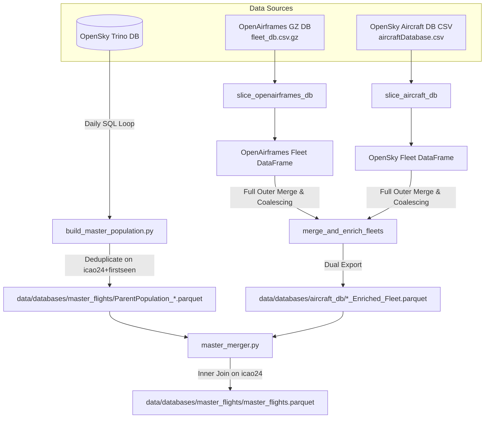
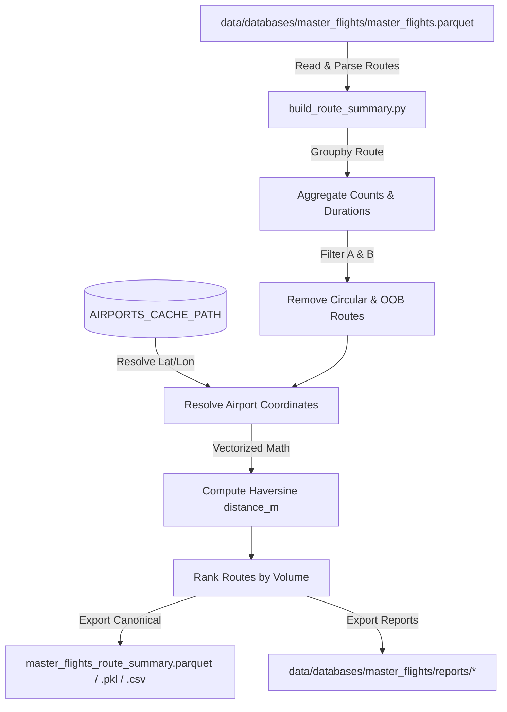

# Acquisition Module

The `acquisition` module handles Track A (fetching flights from Trino), Track B (slicing and enriching fleet databases from OpenAirframes and AircraftDB), merging flights with fleet metadata, and generating the canonical master route summary.

---

## 1. Module Structure

```text
src/core/acquisition/
├── build_master_population.py  # Queries Trino FlightsData4 (Track A)
├── build_route_summary.py     # Generates & enriches master route summary directly from master_flights.parquet
├── fleet_builder.py            # Slices OpenAirframes & AircraftDB (Track B)
├── master_merger.py            # Merges flight population and fleet registry into master_flights.parquet
└── README.md                   # This module documentation
```

---

## 2. Functional Analysis Solution Tree (FAST)

```text
Acquisition Module
├── Ingest Flight logs from Trino (build_master_population.py)
│   ├── Loop day-by-day to respect partition indexing
│   ├── Apply geographical filters (dep-/arr-airport startswith initials B, E, L)
│   └── Deduplicate flight entries on (icao24, firstseen)
├── Build Enriched Fleet Registry (fleet_builder.py)
│   ├── Parse command-line arguments and configure logging
│   ├── Extract and filter aircraft from OpenAirframes (slice_openairframes_db)
│   │   ├── Stream compressed gzip file in chunks to limit memory usage
│   │   ├── Clean typecode strings and filter for target aircraft families
│   │   ├── Deduplicate on-the-fly (within chunk & against historical set)
│   │   └── Rename columns to standard conventions (icao -> icao24, t -> typecode)
│   ├── Extract and filter aircraft from OpenSky DB (slice_aircraft_db)
│   │   ├── Stream CSV file in chunks using quotechar="'" to handle single-quotes
│   │   ├── Clean typecode strings and filter for target aircraft families
│   │   ├── Deduplicate on-the-fly (within chunk & against historical set)
│   │   └── Rename/keep standard schema columns
│   ├── Fallback to traffic library load if local CSV missing (load_aircraft_db_from_traffic)
│   │   ├── Import traffic.data.aircraft lazily to avoid startup download triggers
│   │   └── Filter and align traffic database columns to unified schema
│   └── Merge and export combined fleet databases (merge_and_enrich_fleets)
│       ├── Full outer merge of both database DataFrames on 'icao24'
│       ├── Coalesce columns (preferring OpenAirframes values, falling back to OpenSky when null)
│       └── Export final results in both CSV and Parquet formats to output directory
├── Merge Flights and Fleet Registry (master_merger.py)
│   ├── Auto-resolve or load specific flight population and enriched fleet files
│   ├── Clean/normalize icao24 merge keys
│   ├── Perform Inner Join on 'icao24' to align flights with fleet metadata
│   ├── Validate typecodes against target families (`ALL_TARGET_FAMILIES`); drop and log invalid/NaN typecodes to `data/logs/skipped_aircraft.log`
│   ├── Align and order schema with canonical columns
│   └── Export final merged dataset (default: data/databases/master_flights/master_flights.parquet)
└── Build Route Summary (build_route_summary.py)
    ├── Load master_flights.parquet directly as single source of truth
    ├── Compute duration statistics per route (min, max, median, sum)
    ├── Apply spatial quality filters (remove circular DEP==ARR and out-of-bounds European routes)
    ├── Resolve origin/destination airport coordinates via cache-backed resolver
    ├── Compute geodetic great-circle distances via shared vectorized Haversine formula
    ├── Rank routes by total flight volume
    └── Export canonical summary files (.parquet, .pkl, .csv) and reports (rankings text, distribution CSV)
```

---

## 3. Data Workflow

### 3.1 Workflow A — Population Ingestion, Fleet Building & Merger (`build_master_population.py`, `fleet_builder.py`, `master_merger.py`)

The acquisition module executes Track A and Track B independently, then merges them into `master_flights.parquet`:



**Step-by-step:**
1. **Track A (Flight Logs)**: `build_master_population.py` connects to Trino, iterates daily through `FlightsData4`, applies European airport prefix filters, deduplicates on `['icao24', 'firstseen']`, and saves `ParentPopulation_*.parquet`.
2. **Track B (Fleet Preparation)**: `fleet_builder.py` streams OpenAirframes and OpenSky DBs in chunks, filters target typecodes, renames columns, performs an outer merge with cell-level coalescing, and exports `*_Enriched_Fleet.parquet`.
3. **Merger Stage**: `master_merger.py` joins population and fleet records on `icao24`, drops unsupported airframes logging them to `skipped_aircraft.log`, and saves canonical `master_flights.parquet`.

---

### 3.2 Workflow B — Route Summary Generation & Distance Enrichment (`build_route_summary.py`)



**Step-by-step:**
1. **Source Loading**: `build_route_summary.py` loads `master_flights.parquet` as its single source of truth.
2. **Route Aggregation**: Computes flight counts, duration stats (`min`, `max`, `median`, `sum`), and lists unique typecodes per route (`DEP -> ARR`).
3. **Spatial Filtering**: Drops circular flights (`DEP == ARR`) and routes extending outside the European bounding box (`EUR_LAT_MIN/MAX`, `EUR_LON_MIN/MAX`).
4. **Coordinate Resolution & Distance Math**: Resolves airport coordinates via `resolve_airport_coordinates()` and calculates vectorized Haversine great-circle distances (`distance_m`) using `haversine_distance_m()`.
5. **Canonical & Report Exports**: Assigns route rankings and writes canonical files (`master_flights_route_summary.parquet`, `.pkl`, `.csv`) and report files (`reports/master_flights_route_rankings.txt`, `reports/master_flights_route_distribution.csv`, `reports/master_flights_detailed_counts.csv`).

---

## 4. CLI Usage Guide

### Ingest Flights (Track A)
```bash
python -m src.core.acquisition.build_master_population --start-date "2025-01-01" --end-date "2025-01-31" --dep_prefixes "B,E,L" --arr_prefixes "B,E,L"
```
```powershell
python -m src.core.acquisition.build_master_population --start-date "2025-01-01" --end-date "2025-01-31" --dep_prefixes "B,E,L" --arr_prefixes "B,E,L"
```
* **Parameters**:
  * `--start-date` / `--end-date`: Query window bounds (format: `YYYY-MM-DD`).
  * `--dep_prefixes` / `--arr_prefixes`: Comma-separated list of airport ICAO starting letters.
  * `--apply-bbox-filter`: Flag to apply geographic European bounding box filter after fetch.
  * `--resume`: Resume fetch using daily partition cache files.
  * `--output`: Path to write the output parquet/csv.

### Slice Fleet (Track B)
```bash
python -m src.core.acquisition.fleet_builder --chunk-size 1000000 --output-dir "data/databases/aircraft_db"
```
```powershell
python -m src.core.acquisition.fleet_builder --chunk-size 1000000 --output-dir "data/databases/aircraft_db"
```
* **Parameters**:
  * `--openairframes`: Path to OpenAirframes `.csv.gz`.
  * `--aircraft-db`: Path to OpenSky database `.csv`.
  * `--typecodes`: Comma-separated typecodes list (defaults to all target A320/B737 families).
  * `--output-dir`: Output directory to save CSV and Parquet files (default: `data/databases/aircraft_db/`).
  * `--chunk-size`: Parsing chunk size (default: `250000`).

### Merge Flight Population and Fleet Registry
```bash
python -m src.core.acquisition.master_merger
```
```powershell
python -m src.core.acquisition.master_merger
```
* **Parameters**:
  * `--flights`: Path to input flight population file. Auto-finds latest `ParentPopulation_*.parquet` if omitted.
  * `--fleet`: Path to input enriched fleet file. Auto-finds latest `*_Enriched_Fleet.parquet` if omitted.
  * `--output`: Path to write final merged Parquet file (default: `data/databases/master_flights/master_flights.parquet`).

### Build Route Summary & Distance Enrichment
```bash
python -m src.core.acquisition.build_route_summary
```
```powershell
python -m src.core.acquisition.build_route_summary
```
* **Parameters**:
  * `--input`: Path to input `master_flights.parquet` dataset (defaults to `MASTER_FLIGHTS_FILE` in `config.py`).
  * `--reports-dir`: Output directory for report files (defaults to `MASTER_FLIGHTS_REPORTS_DIR`).
  * `--reports-only`: Regenerate report files only without overwriting canonical summary files.

---

## 5. Logging

All scripts initialize logging via `setup_file_logger()` from `src.common.utils` inside their entrypoint blocks.

| Log file written to `data/logs/` | Writer | Purpose |
|---|---|---|
| `acquisition.log` | `build_master_population.py`, `fleet_builder.py`, `master_merger.py`, `build_route_summary.py` | Logs execution progress, partition hits, database chunking, and route summary generation milestones. |
| `skipped_aircraft.log` | `fleet_builder.py`, `master_merger.py` | Append-only audit record of skipped unsupported aircraft models. |

---

## 6. Prerequisites & Dependencies

* **Libraries**: `pandas`, `sqlalchemy`, `numpy`, `pyarrow` (required for Parquet export).
* **Database Access**: Trino credentials configured (typically in `~/.config/opensky/trino.json`) for Track A.
* **Airport Databases**: `airportsdata` (primary) or `traffic` package (fallback) for coordinate resolution.
