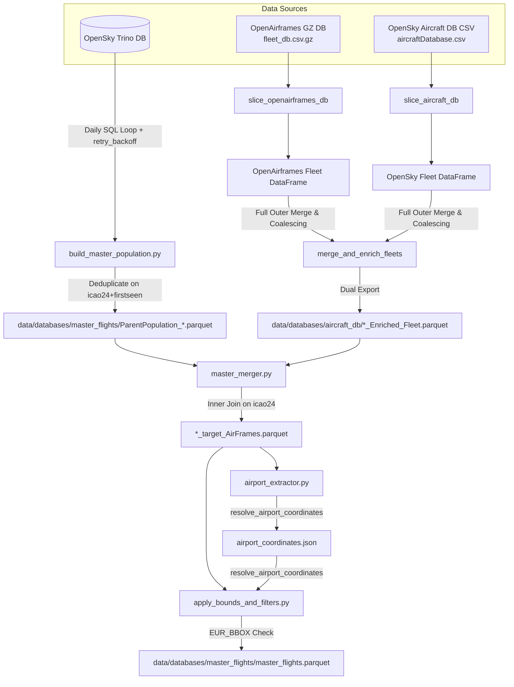
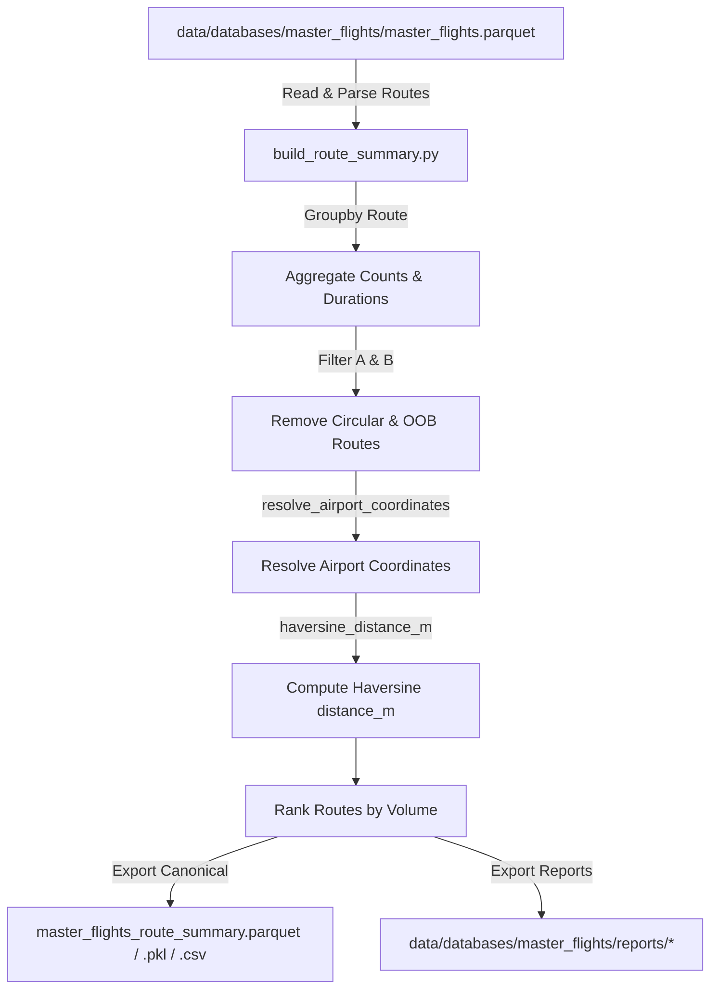

# Acquisition Module

The `acquisition` module handles Track A (fetching flight logs from OpenSky Trino), Track B (slicing and enriching fleet databases from OpenAirframes and AircraftDB), merging flights with fleet metadata, labeling airport metadata, enforcing geographic bounding filters, and generating the canonical master route summary.

---

## 1. Module Structure

```text
src/core/acquisition/
├── build_master_population.py  # Queries Trino FlightsData4 with retry backoff (Track A)
├── fleet_builder.py            # Slices OpenAirframes & AircraftDB (Track B)
├── master_merger.py            # Merges flight population and fleet registry
├── airport_extractor.py        # Extracts unique airports and updates metadata labels
├── apply_bounds_and_filters.py # Enforces EUR_BBOX geographic bounding filter
├── build_route_summary.py      # Generates & enriches master route summary directly from master_flights.parquet
└── README.md                   # This module documentation
```

---

## 2. Functional Analysis Solution Tree (FAST)

```text
Acquisition Module
├── Ingest Flight Logs from Trino (build_master_population.py)
│   ├── Loop day-by-day to respect partition indexing
│   ├── Execute Trino queries with retry_backoff exponential retry helper
│   ├── Apply geographical filters (dep-/arr-airport startswith initials, e.g., B, E, L)
│   ├── Log failed partition dates to failed_dates.json via write_json_dataclass
│   └── Deduplicate flight entries on (icao24, firstseen)
├── Build Enriched Fleet Registry (fleet_builder.py)
│   ├── Parse command-line arguments and configure logging
│   ├── Extract and filter aircraft from OpenAirframes (slice_openairframes_db)
│   │   ├── Stream compressed gzip file in chunks to limit memory usage
│   │   ├── Clean typecode strings and filter for target aircraft families
│   │   ├── Deduplicate on-the-fly (within chunk & against historical set)
│   │   └── Rename columns to standard conventions (icao -> icao24, t -> typecode)
│   ├── Extract and filter aircraft from OpenSky DB (slice_aircraft_db)
│   │   ├── Stream CSV file in chunks using quotechar="'" to handle single-quotes
│   │   ├── Clean typecode strings and filter for target aircraft families
│   │   ├── Deduplicate on-the-fly (within chunk & against historical set)
│   │   └── Rename/keep standard schema columns
│   ├── Fallback to traffic library load if local CSV missing (load_aircraft_db_from_traffic)
│   │   ├── Import traffic.data.aircraft lazily to avoid startup download triggers
│   │   └── Filter and align traffic database columns to unified schema
│   └── Merge and export combined fleet databases (merge_and_enrich_fleets)
│       ├── Full outer merge of both database DataFrames on 'icao24'
│       ├── Coalesce columns (preferring OpenAirframes values, falling back to OpenSky when null)
│       ├── Validate typecodes via is_supported_typecode; log skipped airframes to skipped_aircraft.log
│       └── Export final results in both CSV and Parquet formats to output directory
├── Merge Flights and Fleet Registry (master_merger.py)
│   ├── Auto-resolve or load specific flight population and enriched fleet files
│   ├── Clean/normalize icao24 merge keys
│   ├── Perform Inner Join on 'icao24' to align flights with fleet metadata
│   ├── Validate typecodes against target families (`ALL_TARGET_FAMILIES`); drop and log invalid/NaN typecodes to `data/logs/skipped_aircraft.log`
│   ├── Align and order schema with canonical 16 columns
│   └── Export final merged dataset (default: `ParentPopulation_*_target_AirFrames.parquet`)
├── Extract Airports and Label Metadata (airport_extractor.py)
│   ├── Extract unique departure and arrival ICAOs from raw and fleet parquets
│   ├── Resolve airport coordinates via resolve_airport_coordinates from src.common.utils
│   ├── Evaluate metadata labels (is_icao_schema, has_target_airframe, survived_bbox)
│   └── Export enriched airport database via write_json_dataclass to airport_coordinates.json
├── Apply Geographic Bounds & Filters (apply_bounds_and_filters.py)
│   ├── Load `ParentPopulation_*_target_AirFrames.parquet`
│   ├── Resolve airport coordinates via resolve_airport_coordinates from src.common.utils
│   ├── Filter flights strictly within `EUR_BBOX` lat/lon boundaries from config.py
│   └── Export canonical `master_flights.parquet`
└── Build Route Summary (build_route_summary.py)
    ├── Load master_flights.parquet directly as single source of truth
    ├── Compute duration statistics per route (min, max, median, sum)
    ├── Apply spatial quality filters (remove circular DEP==ARR and out-of-bounds European routes)
    ├── Resolve origin/destination airport coordinates via resolve_airport_coordinates from src.common.utils
    ├── Compute geodetic great-circle distances via shared vectorized haversine_distance_m formula
    ├── Rank routes by total flight volume
    └── Export canonical summary files (.parquet, .pkl, .csv) and reports (rankings text, distribution CSV)
```

---

## 3. Data Workflow

### 3.1 Workflow A — Population Ingestion, Fleet Building & Merger (`build_master_population.py`, `fleet_builder.py`, `master_merger.py`, `airport_extractor.py`, `apply_bounds_and_filters.py`)

The acquisition module executes Track A and Track B independently, enriches airport metadata, and merges them into canonical `master_flights.parquet`:


```mermaid
graph TD
    %% Input Sources
    subgraph Data Sources
        SrcTrino[(OpenSky Trino DB)]
        SrcAirframes[OpenAirframes GZ DB<br>fleet_db.csv.gz]
        SrcAircraftDB[OpenSky Aircraft DB CSV<br>aircraftDatabase.csv]
    end

    %% Track A
    SrcTrino -->|Daily SQL Loop + retry_backoff| A1[build_master_population.py]
    A1 -->|Deduplicate on icao24+firstseen| OutA[data/databases/master_flights/ParentPopulation_*.parquet]

    %% Track B
    SrcAirframes --> B_oa[slice_openairframes_db]
    SrcAircraftDB --> B_os[slice_aircraft_db]
    
    B_oa --> B_oa_out[OpenAirframes Fleet DataFrame]
    B_os --> B_os_out[OpenSky Fleet DataFrame]
    
    B_oa_out -->|Full Outer Merge & Coalescing| B_merge[merge_and_enrich_fleets]
    B_os_out -->|Full Outer Merge & Coalescing| B_merge
    
    B_merge -->|Dual Export| OutB[data/databases/aircraft_db/*_Enriched_Fleet.parquet]

    %% Merger Stage
    OutA --> Merge[master_merger.py]
    OutB --> Merge
    Merge -->|Inner Join on icao24| OutM["*_target_AirFrames.parquet"]
    
    %% Bounding Box & Airport Labeling
    OutM --> Ext[airport_extractor.py]
    Ext -->|resolve_airport_coordinates| Cache[airport_coordinates.json]
    OutM --> FiltBox[apply_bounds_and_filters.py]
    Cache -->|resolve_airport_coordinates| FiltBox
    FiltBox -->|EUR_BBOX Check| Final[data/databases/master_flights/master_flights.parquet]
```

**Step-by-step:**
1. **Track A (Flight Logs)**: `build_master_population.py` connects to Trino, iterates daily through `FlightsData4` using `retry_backoff` from `src.common.utils`, applies European airport prefix filters, deduplicates on `['icao24', 'firstseen']`, and saves `ParentPopulation_*.parquet`. If partition queries fail permanently, details are logged to `failed_dates.json` via `write_json_dataclass()`.
2. **Track B (Fleet Preparation)**: `fleet_builder.py` streams OpenAirframes and OpenSky DBs in chunks, filters target typecodes, renames columns, performs an outer merge with cell-level coalescing, validates typecodes via `is_supported_typecode()`, and exports `*_Enriched_Fleet.parquet`.
3. **Merger Stage**: `master_merger.py` joins population and fleet records on `icao24`, drops unsupported airframes logging them to `skipped_aircraft.log` via `log_skipped_aircraft()`, and saves `ParentPopulation_*_target_AirFrames.parquet`.
4. **Airport Metadata Labeling**: `airport_extractor.py` scans raw and fleet parquets for unique departure and arrival ICAOs, delegates coordinate resolution to `resolve_airport_coordinates()` from `src.common.utils`, evaluates metadata flags (`is_icao_schema`, `has_target_airframe`, `survived_bbox`), and writes `airport_coordinates.json` via `write_json_dataclass()`.
5. **Geographic Filtering**: `apply_bounds_and_filters.py` extracts unique ICAOs, resolves coordinates using `resolve_airport_coordinates()`, enforces the `EUR_BBOX` from `config.py`, drops out-of-bounds flights, and writes the canonical `master_flights.parquet`.

---

### 3.2 Workflow B — Route Summary Generation & Distance Enrichment (`build_route_summary.py`)


```mermaid
graph TD
    InParquet[data/databases/master_flights/master_flights.parquet] -->|Read & Parse Routes| B[build_route_summary.py]
    B -->|Groupby Route| Agg[Aggregate Counts & Durations]
    Agg -->|Filter A & B| Filt[Remove Circular & OOB Routes]
    Filt -->|resolve_airport_coordinates| Coord[Resolve Airport Coordinates]
    Coord -->|haversine_distance_m| Dist[Compute Haversine distance_m]
    Dist --> Rank[Rank Routes by Volume]
    Rank -->|Export Canonical| OutCanon[master_flights_route_summary.parquet / .pkl / .csv]
    Rank -->|Export Reports| OutRep[data/databases/master_flights/reports/*]
```

**Step-by-step:**
1. **Source Loading**: `build_route_summary.py` loads `master_flights.parquet` as its single source of truth.
2. **Route Aggregation**: Computes flight counts, duration stats (`min`, `max`, `median`, `sum`), and lists unique typecodes per route (`DEP -> ARR`).
3. **Spatial Filtering**: Drops circular flights (`DEP == ARR`) and routes extending outside the European bounding box (`EUR_LAT_MIN/MAX`, `EUR_LON_MIN/MAX`).
4. **Coordinate Resolution & Distance Math**: Resolves airport coordinates via `resolve_airport_coordinates()` from `src.common.utils` and calculates vectorized Haversine great-circle distances (`distance_m`) using `haversine_distance_m()`.
5. **Canonical & Report Exports**: Assigns route rankings and writes canonical files (`master_flights_route_summary.parquet`, `.pkl`, `.csv`) and report files (`reports/master_flights_route_rankings.txt`, `reports/master_flights_route_distribution.csv`, `reports/master_flights_detailed_counts.csv`).

---

## 4. CLI Usage Guide

### Ingest Flights (Track A) — `build_master_population.py`
```bash
python -m src.core.acquisition.build_master_population --start-date "2025-01-01" --end-date "2025-01-31" --dep_prefixes "B,E,L" --arr_prefixes "B,E,L" --resume
```
```powershell
python -m src.core.acquisition.build_master_population --start-date "2025-01-01" --end-date "2025-01-31" --dep_prefixes "B,E,L" --arr_prefixes "B,E,L" --resume
```

| Parameter | Type | Default | Description |
|---|---|---|---|
| `--start-date` | str | `"2025-01-01"` | Inclusive start date (`YYYY-MM-DD`). |
| `--end-date` | str | `"2025-01-31"` | Inclusive end date (`YYYY-MM-DD`). |
| `--dep_prefixes` | str | `""` | Comma-separated airport ICAO starting letters (empty = no filter). |
| `--arr_prefixes` | str | `""` | Comma-separated airport ICAO starting letters (empty = no filter). |
| `--resume` | flag | `False` | Resume fetch using daily partition cache files, skipping completed days. |
| `--output` | str | `None` | Path to save output parquet/csv (defaults to `data/databases/master_flights/ParentPopulation_...parquet`). |

---

### Slice Fleet (Track B) — `fleet_builder.py`
```bash
python -m src.core.acquisition.fleet_builder --chunk-size 250000 --output-dir "data/databases/aircraft_db"
```
```powershell
python -m src.core.acquisition.fleet_builder --chunk-size 250000 --output-dir "data/databases/aircraft_db"
```

| Parameter | Type | Default | Description |
|---|---|---|---|
| `--openairframes` | str | `DEFAULT_OPENAIRFRAMES_PATH` | Path to OpenAirframes `.csv.gz` database file. |
| `--aircraft-db` | str | `DEFAULT_AIRCRAFT_DB_PATH` | Path to OpenSky aircraft database CSV file. |
| `--typecodes` | str | `ALL_TARGET_FAMILIES` | Comma-separated typecodes to filter (A320 and B737 families). |
| `--output-dir` | str | `AIRCRAFT_DB_DIR` | Output directory to save CSV and Parquet files (`data/databases/aircraft_db/`). |
| `--chunk-size` | int | `250000` | Pandas chunk size for streaming CSV/Gzip databases. |

---

### Merge Flight Population and Fleet Registry — `master_merger.py`
```bash
python -m src.core.acquisition.master_merger
```
```powershell
python -m src.core.acquisition.master_merger
```

| Parameter | Type | Default | Description |
|---|---|---|---|
| `--flights` | str | `None` | Path to input flight population file. Auto-finds latest `ParentPopulation_*.parquet` if omitted. |
| `--fleet` | str | `None` | Path to input enriched fleet file. Auto-finds latest `*_Enriched_Fleet.parquet` if omitted. |
| `--output` | str | `None` | Path to write final merged Parquet file (defaults to `ParentPopulation_*_target_AirFrames.parquet`). |
| `--skip-fleet-join` | flag | `False` | Output raw flights without merging fleet registry (populates empty `typecode` and `engines`). |
| `--fleet-filter-typecodes` | str | `ALL_TARGET_FAMILIES` | Comma-separated typecodes to keep after fleet join. |

---

### Extract Airports & Label Metadata — `airport_extractor.py`
```bash
python -m src.core.acquisition.airport_extractor --update-labels-only
```
```powershell
python -m src.core.acquisition.airport_extractor --update-labels-only
```

| Parameter | Type | Default | Description |
|---|---|---|---|
| `--raw-flights` | str | `None` | Path to raw flight population parquet file (auto-finds latest `ParentPopulation_*.parquet`). |
| `--fleet-flights` | str | `None` | Path to fleet-filtered flights parquet file (auto-finds latest `*_target_AirFrames.parquet`). |
| `--output-json` | str | `AIRPORTS_CACHE_PATH` | Path to save output JSON database (`airport_coordinates.json`). |
| `--update-labels-only` | flag | `False` | Update metadata labels from existing cache without resolving new coordinates. |
| `--lat-min` | float | `EUR_LAT_MIN` (`34.0`) | Minimum latitude for bounding box survival check. |
| `--lat-max` | float | `EUR_LAT_MAX` (`72.0`) | Maximum latitude for bounding box survival check. |
| `--lon-min` | float | `EUR_LON_MIN` (`-25.0`) | Minimum longitude for bounding box survival check. |
| `--lon-max` | float | `EUR_LON_MAX` (`45.0`) | Maximum longitude for bounding box survival check. |

---

### Apply Geographic Bounding Box Filter — `apply_bounds_and_filters.py`
```bash
python -m src.core.acquisition.apply_bounds_and_filters
```
```powershell
python -m src.core.acquisition.apply_bounds_and_filters
```

| Parameter | Type | Default | Description |
|---|---|---|---|
| `--input` | str | `None` | Path to merged parquet file. Auto-finds latest `*_target_AirFrames.parquet`. |
| `--output` | str | `None` | Path to output canonical parquet file (defaults to `master_flights.parquet`). |
| `--airports-cache` | str | `AIRPORTS_CACHE_PATH` | Path to `airport_coordinates.json` cache (optional override). |
| `--lat-min` | float | `EUR_LAT_MIN` (`34.0`) | Minimum latitude boundary. |
| `--lat-max` | float | `EUR_LAT_MAX` (`72.0`) | Maximum latitude boundary. |
| `--lon-min` | float | `EUR_LON_MIN` (`-25.0`) | Minimum longitude boundary. |
| `--lon-max` | float | `EUR_LON_MAX` (`45.0`) | Maximum longitude boundary. |
| `--no-bbox` | flag | `False` | Disables the bounding box filter. |

---

### Build Route Summary & Distance Enrichment — `build_route_summary.py`
```bash
python -m src.core.acquisition.build_route_summary
```
```powershell
python -m src.core.acquisition.build_route_summary
```

| Parameter | Type | Default | Description |
|---|---|---|---|
| `--input` | str | `MASTER_FLIGHTS_FILE` | Path to input `master_flights.parquet` dataset. |
| `--reports-dir` | str | `MASTER_FLIGHTS_REPORTS_DIR` | Output directory for report files (`data/databases/master_flights/reports/`). |
| `--reports-only` | flag | `False` | Regenerate report files only without overwriting canonical summary files. |

---

## 5. Logging

All scripts initialize logging via `setup_file_logger()` from `src.common.utils` inside their entrypoint blocks.

| Log file written to `data/logs/` | Writer | Purpose |
|---|---|---|
| `acquisition.log` | `build_master_population.py`, `fleet_builder.py`, `master_merger.py`, `airport_extractor.py`, `apply_bounds_and_filters.py`, `build_route_summary.py` | Logs execution progress, partition hits, database chunking, airport coordinate lookups, and route summary generation milestones. |
| `skipped_aircraft.log` | `fleet_builder.py`, `master_merger.py` | Append-only audit record of skipped unsupported aircraft models. |

---

## 6. Prerequisites & Dependencies

* **Libraries**: `pandas`, `sqlalchemy`, `numpy`, `pyarrow` (required for Parquet export).
* **Database Access**: Trino credentials configured (typically in `~/.config/opensky/trino.json`) for Track A (`build_master_population.py`).
* **Central Utilities**: Imports centralized functions from `src.common.utils`:
  * `resolve_airport_coordinates()` for cached airport coordinate resolution.
  * `haversine_distance_m()` for vectorized geodetic distance calculations.
  * `retry_backoff()` for exponential backoff during database queries.
  * `write_json_dataclass()` for atomic JSON file writes.
  * `log_skipped_aircraft()` for append-only audit logging of skipped airframes.
  * `setup_file_logger()` for unified logging handler setup.
