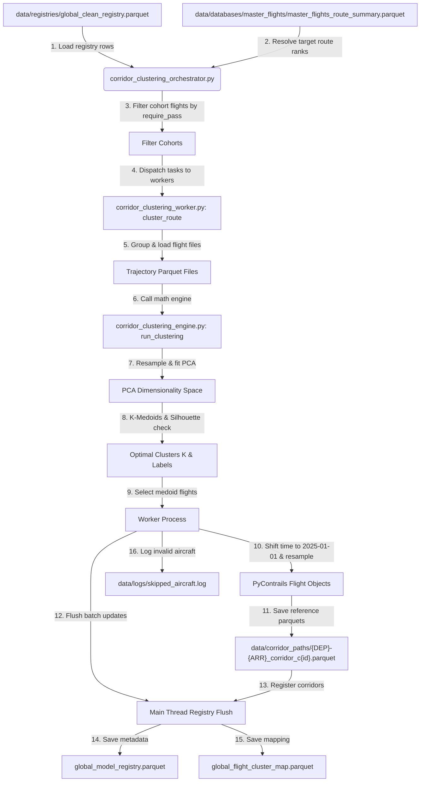

# Corridor Clustering & Trajectory Synthesis Module

This module handles physical corridor clustering and representative trajectory synthesis for the Flight Physics Pipeline. It is responsible for identifying typical flight paths along specific route corridors using spatial and kinematic modeling.

The module operates as **Loop 2b** and **Loop 2c** of the Flight Physics Pipeline.

---

## 1. Module Structure

```text
src/core/corridor/
├── README.md                          # This documentation file
├── corridor_clustering_cli.py        # CLI entrypoint for corridor clustering and medoid path generation
├── corridor_clustering_orchestrator.py # Orchestrated driver for process pooling, registry filtering, and DB updates
├── corridor_clustering_worker.py      # Picklable parallel worker executing mathematical engines and saving parquets
├── corridor_clustering_engine.py      # Core clustering engine (PCA, K-Medoids, Silhouette optimization)
└── pca_compressor.py                  # Trajectory vectorization, scaling, and PCA helpers
```

---

## 2. Function Analysis Solution Tree (FAST)

```text
Module Objectives
 └── Establish representative 4D medoid trajectory templates for flight corridors (Loop 2b & 2c)
      │
      ├── Sub-objective 1: CLI Entry & Configuration Parsing
      │    └── Solution: corridor_clustering_cli.py
      │         ├── Inputs: CLI flags (--ranks, --rank-range, --routes, --require-pass, --max-workers, --overwrite)
      │         └── Outputs: Configures logging and invokes the orchestrator
      │
      ├── Sub-objective 2: Cohort Filtering & Batch Registration (Orchestration)
      │    └── Solution: corridor_clustering_orchestrator.py
      │         ├── Inputs: Target corridors, clean registry (global_clean_registry.parquet)
      │         └── Outputs: Flushes updates to global_model_registry.parquet and global_flight_cluster_map.parquet
      │
      ├── Sub-objective 3: Multi-Process Task Coordination (Worker)
      │    └── Solution: corridor_clustering_worker.py
      │         ├── Inputs: Cohort rows metadata list, target baseline time (2025-01-01 00:00:00 UTC)
      │         └── Outputs: Resampled, time-shifted medoid parquets written to data/corridor_paths/
      │
      ├── Sub-objective 4: Trajectory Compression & Cluster Optimization (Engine)
      │    └── Solution: corridor_clustering_engine.py
      │         ├── Inputs: Trajectory DataFrames, PCA components (D_PCA = 13), k_max (CLUSTERING_MAX_K = 10)
      │         └── Outputs: Cluster labels, optimal cluster count K, and medoid indices
      │
      └── Sub-objective 5: Low-Level Trajectory Resampling & Scaling
           └── Solution: pca_compressor.py
                ├── Inputs: Clean flight coordinate DataFrames
                └── Outputs: Resampled vector arrays, Z-scored features, and fitted PCA estimators
```

---

## 3. Data Workflow

> [!NOTE]
> **Visual Rendering Warning**: Flowcharts are generated using Mermaid. If your markdown viewer does not natively support Mermaid rendering, please refer to the step-by-step text description provided directly below the diagram.

### 3.1. Corridor Clustering Pipeline



#### Step-by-Step Description:
1. **Target Route Resolution**: The CLI resolves the target routes using volume ranks from the `master_flights_route_summary.parquet` metadata registry.
2. **Registry Load**: The orchestrator loads the `global_clean_registry.parquet` dataset into memory once.
3. **Cohort Assembly & Pre-Filtering**: For each target route, the orchestrator filters the registry rows matching the departure and arrival ICAO codes. It retains only the rows where all specified filter columns (e.g. `velocity_pass`, `coordinate_velocity_pass`, `acceleration_pass`, `distance_pass`) are `True`. If a route has fewer than `MIN_FLIGHTS_FOR_CLUSTERING` (default 50) qualifying flights, it is skipped.
4. **Worker Pooling**: The orchestrator spawns worker processes via a `ProcessPoolExecutor` utilizing the `spawn` start method. To prevent BLAS thread oversubscription, the worker initializes with limited numeric threads.
5. **Batch Trajectory Loading**: The worker process loads the clean trajectory parquet files for the route. It groups the target flight IDs by their file paths to read each file only once, minimizing I/O overhead.
6. **Feature Compression**: The worker invokes the math engine (`run_clustering`). The engine standardizes each flight trajectory, projects coordinates, and resamples them onto a 100-waypoint normalized grid. The lats, lons, and altitudes are flattened into a 300-dimensional vector per flight. PCA is then fit to reduce the dataset to `D_PCA` (13) dimensions.
7. **K-Medoids & Silhouette Scoring**: The engine evaluates clustering configurations for $k \in [2, \text{CLUSTERING\_MAX\_K}]$ (default 10). It chooses the optimal number of clusters $K$ that maximizes the mean silhouette score.
8. **Medoid Alignment**: For each cluster, the engine identifies the index of the representative medoid trajectory (the historical flight path closest to the cluster center in PCA space).
9. **Time-Shifting and Interpolation**: The worker retrieves the medoid DataFrames, converts them to PyContrails `Flight` structures, and resamples them to a uniform temporal grid (default 60s). It shifts the trajectory time grid to start exactly at the baseline baseline `2025-01-01 00:00:00 UTC`.
10. **Parquet Output**: The resulting corridor templates are written to `data/corridor_paths/` using the name format `{DEP}-{ARR}_corridor_c{cluster_id}.parquet`.
11. **Registry Flushing**: The orchestrator collects completed results and batch-flushes them to `global_model_registry.parquet` (recording corridor paths, cluster sizes, and silhouette scores) and `global_flight_cluster_map.parquet` (mapping historical flights to their assigned cluster ID).

---

## 4. CLI Usage Guide

### Bash

```bash
# Cluster Rank 1 corridor using all four default clean filters
python -m src.core.corridor.corridor_clustering_cli \
    --ranks 1 \
    --overwrite

# Cluster Rank 1 to 10 corridors using only velocity and distance checks
python -m src.core.corridor.corridor_clustering_cli \
    --rank-range 1 10 \
    --require-pass velocity distance \
    --max-workers 4 \
    --overwrite

# Process explicit corridors with custom batch write sizes
python -m src.core.corridor.corridor_clustering_cli \
    --routes LEPA-LEBL EGLL-EGCC \
    --batch-size 10
```

### PowerShell

```powershell
# Cluster Rank 1 corridor requiring all default passes
python -m src.core.corridor.corridor_clustering_cli `
    --ranks 1 `
    --overwrite

# Run clustering across ranks 1 to 5 utilizing 2 workers and 2 threads per worker
python -m src.core.corridor.corridor_clustering_cli `
    --ranks 1 2 3 4 5 `
    --max-workers 2 `
    --threads-per-worker 2 `
    --overwrite
```

---

### 4.1. Parameter Reference

| CLI Option | Type | Default | Description |
| :--- | :--- | :--- | :--- |
| `--ranks` | `int list` | *None* | Specific route volume ranks to process (e.g. `--ranks 1 2 5`). |
| `--rank-range` | `int int` | *None* | Inclusive range of ranks to process (e.g. `--rank-range 1 50`). |
| `--routes` | `str list` | *None* | Explicit corridor route strings to process (e.g. `--routes LEPA-LEBL EGLL-EGCC`). |
| `--require-pass` | `str list` | `all four` | Registry check filters that must be True (`velocity`, `coordinate_velocity`, `acceleration`, `distance`). |
| `--threads-per-worker` | `int` | `2` | Number of threads for CPU BLAS operations per process worker. |
| `--max-workers` | `int` | *None* | Maximum parallel worker processes (defaults to `CPU count // threads_per_worker`). |
| `--overwrite` | `flag` | *False* | Overwrites existing corridor templates and registry mapping. |
| `--batch-size` | `int` | `50` | Number of completed routes to accumulate before flushing registry files. |

---

## 5. Prerequisites & Dependencies

### Python Libraries
* `pandas` & `pyarrow` (for Parquet data storage and registry reading/writing)
* `numpy` & `scipy` (for numerical metrics and matrix interpolation)
* `scikit-learn` (for PCA dimensionality reduction and silhouette evaluations)
* `pycontrails` (for Flight models, spatial resampling, and time-grid interpolation)

### Input Files
* `data/databases/master_flights/master_flights_route_summary.parquet` (for rank translation)
* `data/registries/global_clean_registry.parquet` (clean trajectories tracking database)

### Output Files
* `data/corridor_paths/{DEP}-{ARR}_corridor_c{cluster_id}.parquet` (corridor templates)
* `data/registries/global_model_registry.parquet` (stores corridor metadata)
* `data/registries/global_flight_cluster_map.parquet` (maps historical flights to cluster IDs)
* `data/logs/skipped_aircraft.log` (logs skipped invalid/NaN medoid typecodes)
* `data/logs/corridor.log` (central logging record)

For naming standards, unit conversions (aviation vs. SI), and coordinate projections, refer to the centralized **[conventions.md](file:///g:/Meine%20Ablage/UNI/SS26/PythonPipeline%20-%20Kopie/src/conventions.md)** standards.
