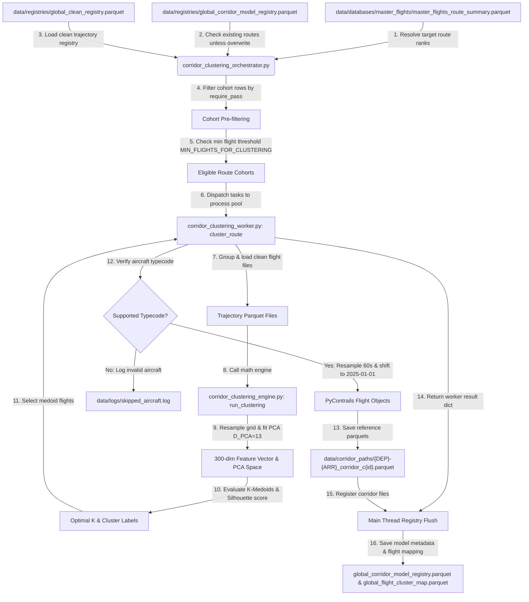
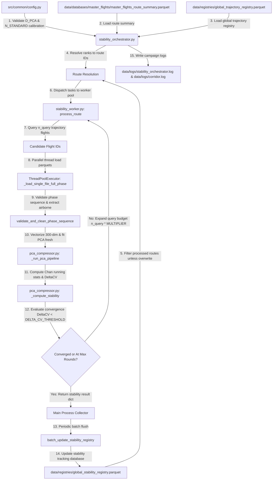

# Corridor Clustering & Trajectory Stability Module

This module handles physical corridor clustering, representative 4D trajectory synthesis, and trajectory cohort stability sampling for the Flight Physics Pipeline. It is responsible for identifying typical flight paths along specific route corridors using spatial, kinematic, and statistical modeling.

The module operates as **Loop 2b** and **Loop 2c** of the Flight Physics Pipeline.

---

## 1. Module Structure

```text
src/core/corridor/
├── README.md                          # Comprehensive technical source of truth
├── corridor_clustering_cli.py        # CLI entrypoint for corridor clustering and medoid path generation
├── corridor_clustering_orchestrator.py # Process pool orchestrator for corridor cohort filtering and registry flushing
├── corridor_clustering_worker.py      # Picklable worker executing math engine, strict typecode checks, and parquet saving
├── corridor_clustering_engine.py      # Core clustering engine (PCA, K-Medoids, Silhouette optimization, chaos scoring)
├── pca_compressor.py                  # Trajectory vectorization (300-dim), Z-score scaling, PCA fitting, and Chan running stats
├── stability_orchestrator.py          # Stage 2 trajectory stability sampling campaign CLI & batch orchestrator
└── stability_worker.py                # Worker executing phase validation, iterative PCA stability sampling, and ΔCV convergence
```

---

## 2. Function Analysis Solution Tree (FAST)

```text
Module Objectives
 ├── Objective 1: Establish representative 4D medoid trajectory templates for flight corridors (Loop 2b & 2c)
 │    │
 │    ├── Sub-objective 1.1: CLI Scoping & Configuration Parsing
 │    │    └── Solution: corridor_clustering_cli.py
 │    │         ├── Inputs: CLI flags (--ranks, --rank-range, --routes, --require-pass, --threads-per-worker, --max-workers, --overwrite, --batch-size, --metric)
 │    │         └── Outputs: Configures logging and invokes the corridor clustering orchestrator
 │    │
 │    ├── Sub-objective 1.2: Route Resolution & Batch Registration (Orchestration)
 │    │    └── Solution: corridor_clustering_orchestrator.py
 │    │         ├── Inputs: Target corridors, clean trajectory registry (global_clean_registry.parquet)
 │    │         └── Outputs: Batch updates to global_corridor_model_registry.parquet and global_flight_cluster_map.parquet
 │    │
 │    ├── Sub-objective 1.3: Worker Task Coordination & Template Generation (Worker)
 │    │    └── Solution: corridor_clustering_worker.py
 │    │         ├── Inputs: Cohort rows metadata list, standard baseline time (2025-01-01 00:00:00 UTC)
 │    │         └── Outputs: Resampled 60s time-shifted medoid parquets in data/corridor_paths/ & skipped_aircraft.log entries
 │    │
 │    └── Sub-objective 1.4: Trajectory Compression & Cluster Optimization (Engine)
 │         └── Solution: corridor_clustering_engine.py
 │              ├── Inputs: Flight DataFrames, PCA components (D_PCA = 13), k_max (CLUSTERING_MAX_K = 1)
 │              └── Outputs: ClusteringResult (optimal K, route class 1-4, silhouette score, cluster labels, medoid indices)
 │
 └── Objective 2: Quantify trajectory cohort convergence & variance via Stage 2 Stability Sampling
      │
      ├── Sub-objective 2.1: Stability Campaign CLI & Batch Driver
      │    └── Solution: stability_orchestrator.py
      │         ├── Inputs: Target ranks (--ranks or --lower-rank/--upper-rank), global_trajectory_registry.parquet
      │         └── Outputs: Flushes route stability metrics to global_stability_registry.parquet and stability_orchestrator.log
      │
      ├── Sub-objective 2.2: Picklable Parallel Worker & Resample Loop
      │    └── Solution: stability_worker.py
      │         ├── Inputs: Route ID, registry DataFrame, N_STANDARD, D_PCA, DELTA_CV_THRESHOLD, STABILITY_RESAMPLE_MULTIPLIER
      │         └── Outputs: Structured stability result dict (N_current, pca_mean_vector, pca_variance, delta_cv, resample_rounds)
      │
      └── Sub-objective 2.3: Preprocessing, PCA Projection & Running Statistics
           └── Solution: pca_compressor.py
                ├── Inputs: TrafficFlight cohorts, raw 300-dim vectors [lat*100, lon*100, alt*100]
                └── Outputs: Z-scored feature matrices, fitted per-route PCA estimators, Chan running stats, and DeltaCV metrics
```

---

## 3. Data Workflow

> [!NOTE]
> **Visual Rendering Warning**: Flowcharts are generated using Mermaid. If your markdown viewer does not natively support Mermaid rendering, please refer to the step-by-step text description provided directly below each diagram.

---

### 3.1 Workflow A — Corridor Clustering & Trajectory Synthesis (`corridor_clustering_cli.py` / `corridor_clustering_orchestrator.py`)


```mermaid
graph TD
    A[data/databases/master_flights/master_flights_route_summary.parquet] -->|1. Resolve target route ranks| B(corridor_clustering_orchestrator.py)
    C[data/registries/global_corridor_model_registry.parquet] -->|2. Check existing routes unless overwrite| B
    D[data/registries/global_clean_registry.parquet] -->|3. Load clean trajectory registry| B
    
    B -->|4. Filter cohort rows by require_pass| E[Cohort Pre-filtering]
    E -->|5. Check min flight threshold MIN_FLIGHTS_FOR_CLUSTERING| F[Eligible Route Cohorts]
    
    F -->|6. Dispatch tasks to process pool| G[corridor_clustering_worker.py: cluster_route]
    G -->|7. Group & load clean flight files| H[Trajectory Parquet Files]
    
    H -->|8. Call math engine| I[corridor_clustering_engine.py: run_clustering]
    I -->|9. Resample grid & fit PCA D_PCA=13| J[300-dim Feature Vector & PCA Space]
    J -->|10. Evaluate K-Medoids & Silhouette score| K[Optimal K & Cluster Labels]
    
    K -->|11. Select medoid flights| G
    G -->|12. Verify aircraft typecode| L{Supported Typecode?}
    L -->|No: Log invalid aircraft| M[data/logs/skipped_aircraft.log]
    
    L -->|Yes: Resample 60s & shift to 2025-01-01| N[PyContrails Flight Objects]
    N -->|13. Save reference parquets| O["data/corridor_paths/{DEP}-{ARR}_corridor_c{id}.parquet"]
    
    G -->|14. Return worker result dict| P[Main Thread Registry Flush]
    O -->|15. Register corridor files| P
    P -->|16. Save model metadata & flight mapping| Q[global_corridor_model_registry.parquet & global_flight_cluster_map.parquet]
```

#### Step-by-Step Description:
1. **Target Route Resolution**: The orchestrator receives target corridor specifications from the CLI (specific ranks, rank ranges, or explicit `DEP-ARR` route strings) and resolves them to route pairs using traffic volume ranks in `master_flights_route_summary.parquet`.
2. **Model Registry Check**: If `--overwrite` is `False`, the orchestrator loads `global_corridor_model_registry.parquet` and excludes any routes that have already been processed.
3. **Clean Registry Load**: The orchestrator loads the central trajectory tracking file `global_clean_registry.parquet` once into memory.
4. **Cohort Pre-Filtering**: For each target route, the orchestrator filters matching flight rows based on departure/arrival ICAOs and applies the specified post-filter boolean checks (`horiz_velocity_pass`, `vert_velocity_pass`, `coord_horiz_velocity_pass`, `coord_vert_velocity_pass`, `acceleration_pass`, `distance_pass`).
5. **Minimum Cohort Threshold Verification**: The orchestrator counts qualifying flights per cohort. If a route has fewer than `MIN_FLIGHTS_FOR_CLUSTERING` valid flights (threshold value configured in [`src/common/config.py`](file:///g:/Meine%20Ablage/UNI/SS26/PythonPipeline%20-%20Kopie/src/common/config.py#L144)), it is skipped with a warning.
6. **Worker Pool Dispatching**: The orchestrator initializes a `ProcessPoolExecutor` using the `spawn` context and dispatches eligible route tasks to `corridor_clustering_worker.py: cluster_route`. Each process initializes worker logging to `data/logs/corridor.log` and caps numeric BLAS threads.
7. **Batch Trajectory Loading**: The worker process groups flight IDs by their respective parquet file paths and reads each parquet file once, minimizing disk I/O overhead.
8. **Clustering Engine Invocation**: The worker passes loaded flight DataFrames to `corridor_clustering_engine.py: run_clustering`.
9. **Feature Compression & PCA Projection**: The engine standardizes trajectories onto a 100-waypoint grid flattening `[lat, lon, alt]` into a 300-dimensional vector per flight, applies Z-score normalization, and fits PCA to project vectors to `D_PCA` (13) dimensions.
10. **K-Medoids & Silhouette Optimization**: The engine evaluates K-Medoids configurations for $k \in [2, \text{CLUSTERING\_MAX\_K}]$ (default 10) and selects the optimal $K$ that maximizes the mean silhouette score. If no candidate exceeds `SILHOUETTE_THRESHOLD` (0.35), $K=1$ is assigned. Route shape class (1=Single, 2=Binary, 3=Multi-Track, 4=Chaos) is assigned based on $K$ and total PCA variance.
11. **Medoid Selection**: For each cluster $c \in [0, K-1]$, the engine computes Euclidean distances in PCA space to the cluster centroid and selects the closest historical flight as the medoid.
12. **Strict Aircraft Typecode Verification**: The worker inspects the medoid flight's `typecode`. If the typecode is missing, `NaN`, or not in `ALL_TARGET_FAMILIES` (verified via `is_supported_typecode`), it appends a record to `data/logs/skipped_aircraft.log` and aborts processing for that route cohort.
13. **Time-Shifting and Interpolation**: Valid medoid DataFrames are converted to PyContrails `Flight` structures, resampled to a uniform 60s temporal grid (`CORRIDOR_TIME_GRID_SECONDS`), and shifted to start precisely at baseline timestamp `2025-01-01 00:00:00 UTC`.
14. **Corridor Template Output**: Synthesized corridor template parquets are saved to `data/corridor_paths/{DEP}-{ARR}_corridor_c{cluster_id}.parquet`.
15. **Main Thread Result Collection**: Completed worker result dictionaries (containing corridor file paths, cluster sizes, silhouette scores, and flight cluster mappings) are returned to the main process.
16. **Batch Registry Update**: When `batch_size` (default 50) completed routes accumulate (or upon final campaign completion), the main thread flushes records to `global_corridor_model_registry.parquet` and `global_flight_cluster_map.parquet`.

---

### 3.2 Workflow B — Stage 2 Trajectory Stability Sampling Campaign (`stability_orchestrator.py`)


```mermaid
graph TD
    A[src/common/config.py] -->|1. Validate D_PCA & N_STANDARD calibration| B(stability_orchestrator.py)
    C[data/databases/master_flights/master_flights_route_summary.parquet] -->|2. Load route summary| B
    D[data/registries/global_trajectory_registry.parquet] -->|3. Load global trajectory registry| B
    
    B -->|4. Resolve ranks to route IDs| E[Route Resolution]
    F[data/registries/global_stability_registry.parquet] -->|5. Filter processed routes unless overwrite| E
    
    E -->|6. Dispatch tasks to worker pool| G[stability_worker.py: process_route]
    G -->|7. Query n_query trajectory flights| H[Candidate Flight IDs]
    
    H -->|8. Parallel thread load parquets| I[ThreadPoolExecutor: _load_single_file_full_phase]
    I -->|9. Validate phase sequence & extract airborne| J[validate_and_clean_phase_sequence]
    
    J -->|10. Vectorize 300-dim & fit PCA fresh| K[pca_compressor.py: _run_pca_pipeline]
    K -->|11. Compute Chan running stats & DeltaCV| L[pca_compressor.py: _compute_stability]
    
    L -->|12. Evaluate convergence DeltaCV < DELTA_CV_THRESHOLD| M{Converged or At Max Rounds?}
    M -->|No: Expand query budget n_query * MULTIPLIER| G
    
    M -->|Yes: Return stability result dict| N[Main Process Collector]
    N -->|13. Periodic batch flush| O[batch_update_stability_registry]
    O -->|14. Update stability tracking database| F
    
    B -->|15. Write campaign logs| P[data/logs/stability_orchestrator.log & data/logs/corridor.log]
```

#### Step-by-Step Description:
1. **Calibration Pre-flight Validation**: The CLI driver checks that Phase A calibration parameters `D_PCA` (> 0) and `N_STANDARD` (> 0) are properly configured in `src/common/config.py`.
2. **Route Summary Load**: The orchestrator reads `master_flights_route_summary.parquet` to establish traffic volume rankings.
3. **Global Trajectory Registry Load**: The orchestrator loads `global_trajectory_registry.parquet` into memory once in the main process.
4. **Rank Translation**: Specified ranks (via `--ranks` or `--lower-rank`/`--upper-rank`) are translated into directional `DEP-ARR` route strings.
5. **Existing Record Pre-filtering**: Unless `--overwrite` is set, the orchestrator loads `global_stability_registry.parquet` and removes already-analyzed routes from the execution list.
6. **Process Pool Initialization**: A process pool (`ProcessPoolExecutor`) is created using `spawn` context. Worker processes initialize logger output to `data/logs/corridor.log` and limit numeric thread counts.
7. **Iterative Flight Querying**: The worker task `process_route` determines the flight query budget $N_{\text{query}}$ (starting at `N_STANDARD`).
8. **Threaded Parquet Loading**: Trajectory files are loaded in parallel inside each worker process using a multi-threaded `ThreadPoolExecutor` (`CORRIDOR_IO_THREADS`).
9. **Flight Phase Sequence Validation**: Loaded trajectories are passed to `validate_and_clean_phase_sequence()`. The validator enforces a clean airborne progression (`GND` $\rightarrow$ `CLIMB` $\rightarrow$ `CRUISE` $\rightarrow$ `DESCENT` $\rightarrow$ `GND`), strips ground rows, and rejects incomplete or truncated flights.
10. **Fresh PCA Pipeline Execution**: Valid airborne trajectories are vectorized to 300 dimensions (`[lat*100, lon*100, alt*100]`), Z-score standardized, and projected through a freshly fitted PCA estimator (`n_components = D_PCA`).
11. **Chan Running Stats & $\Delta CV$ Computation**: The PCA matrix `X_pca` is split into sequential batches. The Chan et al. parallel batch-combining algorithm computes running mean and variance vectors, and `calculate_delta_cv()` measures relative standard deviation shifts across batches.
12. **Convergence Evaluation**: The worker compares the final scalar metric $\Delta CV$ against `DELTA_CV_THRESHOLD`.
13. **Resample Budget Expansion Loop**: If $\Delta CV \ge \text{DELTA\_CV\_THRESHOLD}$ and the resample cap (`STABILITY_MAX_RESAMPLE_ROUNDS`) has not been reached, the worker increments `resample_round`, expands the sample budget ($N_{\text{query}} = N_{\text{STANDARD}} \times \text{STABILITY\_RESAMPLE\_MULTIPLIER}^{\text{round}}$), and restarts the PCA pipeline from scratch.
14. **Worker Result Return**: Once converged (or capped), the worker returns a structured stability result dict (`N_current`, `pca_mean_vector`, `pca_variance`, `delta_cv`, `resample_rounds`).
15. **Registry Batch Updates**: The main process accumulates completed worker results and periodically flushes updates to `global_stability_registry.parquet` in configurable batch sizes (`batch_write_size`, default 500).
16. **Logging & Metric Reporting**: All progress milestones, execution timings, and convergence stats are written to `data/logs/stability_orchestrator.log` and `data/logs/corridor.log`.

---

## 4. CLI Usage Guide

### 4.1 Corridor Clustering Pipeline (`corridor_clustering_cli.py`)

#### Bash
```bash
# Cluster Rank 1 corridor using default clean filters
python -m src.core.corridor.corridor_clustering_cli \
    --ranks 1 \
    --overwrite

# Cluster Rank 1 to 10 corridors using velocity and distance checks
python -m src.core.corridor.corridor_clustering_cli \
    --rank-range 1 10 \
    --require-pass velocity distance \
    --max-workers 4 \
    --overwrite

# Process explicit corridors with custom batch write sizes
python -m src.core.corridor.corridor_clustering_cli \
    --routes LEPA-LEBL EGLL-EGCC \
    --batch-size 10
```

#### PowerShell
```powershell
# Cluster Rank 1 corridor requiring all default passes
python -m src.core.corridor.corridor_clustering_cli `
    --ranks 1 `
    --overwrite

# Run clustering across ranks 1 to 5 utilizing 2 workers and 2 threads per worker
python -m src.core.corridor.corridor_clustering_cli `
    --ranks 1 2 3 4 5 `
    --max-workers 2 `
    --threads-per-worker 2 `
    --overwrite
```

---

### 4.2 Parameter Reference (`corridor_clustering_cli.py`)

| CLI Option | Type | Default | Description |
| :--- | :--- | :--- | :--- |
| `--ranks` | `int list` | *None* | Specific route volume ranks to process (e.g. `--ranks 1 2 5`). |
| `--rank-range` | `int int` | *None* | Inclusive range of ranks to process (e.g. `--rank-range 1 50`). |
| `--routes` | `str list` | *None* | Explicit corridor route strings to process (e.g. `--routes LEPA-LEBL EGLL-EGCC`). |
| `--require-pass` | `str list` | `all four` | Registry check filters that must be True (`velocity`, `coordinate_velocity`, `acceleration`, `distance`). |
| `--threads-per-worker` | `int` | `2` | Number of threads for CPU BLAS operations per process worker. |
| `--max-workers` | `int` | *None* | Maximum parallel worker processes (defaults to `CPU count // threads_per_worker`). |
| `--overwrite` | `flag` | `False` | Overwrites existing corridor templates and registry mapping. |
| `--batch-size` | `int` | `50` | Number of completed routes to accumulate before flushing registry files. |
| `--metric` | `str` | `euclidean` | Distance metric to use for K-Medoids clustering. |

---

### 4.3 Trajectory Stability Sampling Campaign (`stability_orchestrator.py`)

#### Bash
```bash
# Run stability sampling for ranks 1 to 500 using 6 workers
python -m src.core.corridor.stability_orchestrator \
    --lower-rank 1 --upper-rank 500 \
    --max-workers 6

# Run stability sampling for explicit ranks and overwrite existing records
python -m src.core.corridor.stability_orchestrator \
    --ranks 1,5,12 \
    --overwrite \
    --batch-write-size 10
```

#### PowerShell
```powershell
# Run stability sampling for ranks 1 to 50 utilizing 4 workers
python -m src.core.corridor.stability_orchestrator `
    --lower-rank 1 --upper-rank 50 `
    --max-workers 4

# Run specific ranks with small batch flushes
python -m src.core.corridor.stability_orchestrator `
    --ranks 1,2,3 `
    --batch-write-size 5
```

---

### 4.4 Parameter Reference (`stability_orchestrator.py`)

| CLI Option | Type | Default | Description |
| :--- | :--- | :--- | :--- |
| `--ranks` | `str` | *None* | Comma-separated list of route volume ranks to process (e.g. `--ranks 1,5,12`). |
| `--lower-rank` | `int` | *None* | Lower bound of an inclusive route rank range (e.g. `--lower-rank 1`). |
| `--upper-rank` | `int` | *None* | Upper bound of an inclusive route rank range (e.g. `--upper-rank 100`). |
| `--max-workers` | `int` | `4` | Number of parallel worker processes to spawn. |
| `--batch-write-size` | `int` | `500` | Number of completed routes between stability registry flushes to disk. |
| `--overwrite` | `flag` | `False` | Re-processes routes already recorded in the stability registry. |

---

## 5. Prerequisites & Dependencies

### Python Libraries
* `pandas` & `pyarrow` (Parquet table storage and fast registry I/O)
* `numpy` & `scipy` (Numerical array operations, interpolation, and matrix linear algebra)
* `scikit-learn` & `pyclustering` (`PCA`, `KMedoids` via `pyclustering.cluster.kmedoids`, `silhouette_score` metric evaluation)
* `pycontrails` (`Flight` data structures, spatial resampling, and time-grid interpolation)
* `traffic` (`TrafficFlight` trajectory handling and airborne phase filtering)

### Centralized Configuration Constants (`src/common/config.py`)

| Config Constant | Type | Description |
| :--- | :--- | :--- |
| `BASE_DIR` | `Path` | Root directory of the repository workspace. |
| `GLOBAL_CLEAN_REGISTRY` | `Path` | Parquet registry tracking cleaned flight trajectories (`global_clean_registry.parquet`). |
| `GLOBAL_TRAJECTORY_REGISTRY` | `Path` | Central trajectory registry (`global_trajectory_registry.parquet`). |
| `GLOBAL_CORRIDOR_MODEL_REGISTRY` | `Path` | Registry recording corridor clustering model metrics (`global_corridor_model_registry.parquet`). |
| `GLOBAL_FLIGHT_CLUSTER_MAP` | `Path` | Registry mapping historical flights to assigned cluster IDs (`global_flight_cluster_map.parquet`). |
| `GLOBAL_STABILITY_REGISTRY` | `Path` | Registry storing Stage 2 stability metric results (`global_stability_registry.parquet`). |
| `CORRIDOR_PATHS_DIR` | `Path` | Directory where synthesized 4D medoid parquet files are saved (`data/corridor_paths/`). |
| `MIN_FLIGHTS_FOR_CLUSTERING` | `int` | Minimum qualifying flight count required to attempt clustering (configured in `src/common/config.py`). |
| `CORRIDOR_CLUSTERING_THREADS_PER_WORKER` | `int` | Default CPU BLAS threads allocated per worker process (default `2`). |
| `CORRIDOR_IO_THREADS` | `int` | Worker thread pool size for concurrent parquet file reading. |
| `CLUSTERING_MAX_K` | `int` | Maximum candidate cluster count $K$ evaluated during silhouette sweeps (capped to `1` to produce single representative medoid per route). |
| `SILHOUETTE_THRESHOLD` | `float` | Minimum silhouette score required to accept $K > 1$ (default `0.35`). |
| `CHAOS_VARIANCE_THRESHOLD` | `float` | PCA variance threshold to classify un-clustered cohorts as Chaos class 4 (default `200.0`). |
| `D_PCA` | `int` | Calibrated PCA feature dimensions (default `13`). |
| `N_STANDARD` | `int` | Initial flight sample query size for stability sampling. |
| `DELTA_CV_THRESHOLD` | `float` | Relative standard deviation convergence threshold for stability sampling. |
| `STABILITY_RESAMPLE_MULTIPLIER` | `int` | Query budget expansion factor when $\Delta CV$ fails to converge. |
| `STABILITY_MAX_RESAMPLE_ROUNDS` | `int` | Hard ceiling on stability resampling attempts. |
| `DELTA_CV_EPSILON` | `float` | Zero-guard epsilon preventing division by zero in $\Delta CV$ calculations (`1e-8`). |
| `UNSUPPORTED_TYPECODE_FLAG` | `str` | Flag string assigned to missing or invalid aircraft typecodes. |

### Input Files
* `data/databases/master_flights/master_flights_route_summary.parquet` (Route volume rankings)
* `data/registries/global_clean_registry.parquet` (Clean trajectory database)
* `data/registries/global_trajectory_registry.parquet` (Global trajectory tracking file)
* `data/registries/global_stability_registry.parquet` (Stage 2 stability database)

### Output Files
* `data/corridor_paths/{DEP}-{ARR}_corridor_c{cluster_id}.parquet` (Synthesized corridor templates)
* `data/registries/global_corridor_model_registry.parquet` (Corridor model metadata)
* `data/registries/global_flight_cluster_map.parquet` (Flight-to-cluster mappings)
* `data/registries/global_stability_registry.parquet` (Stability metrics database)

### Log Files
* `data/logs/corridor.log` (Central corridor process logging)
* `data/logs/skipped_aircraft.log` (Global tracking log for invalid/skipped aircraft typecodes)
* `data/logs/stability_orchestrator.log` (Stage 2 stability campaign log)

For naming standards, physical unit conversions (SI vs. aviation), and spatial coordinate projections, consult the centralized **[conventions.md](file:///g:/Meine%20Ablage/UNI/SS26/PythonPipeline%20-%20Kopie/src/conventions.md)** standard.
