# OpenSky Trajectory Fetching Module

The **OpenSky Trajectory Fetching Module** retrieves raw ADS-B trajectory state vectors for selected flight cohorts from the OpenSky Trino database, reuses local trajectory caches where possible through an elevated **3-Step Cache Lookup Architecture**, and writes standardized raw trajectory Parquet outputs for downstream processing.

Located at `src/core/fetching/`, this module sits after master population acquisition and filtering, serving as the primary data ingestion engine before trajectory processing (Kalman filtering), corridor synthesis, weather acquisition, and flight physics simulation.

The module operates under a two-tier execution model:
1. `opensky_fetcher.py` — A single-route worker script responsible for resolving, retrieving, and caching trajectories for an individual departure-arrival airport pair.
2. `fetcher_orchestrator.py` — A batch-processing orchestration engine that selects ranked corridors from route summary metadata, computes dynamic sample quotas, and sequentially drives the worker across multiple corridors under a **Two-Pass Concat Architecture** that is safe on Windows Google Drive FUSE mounts.

---

## 1. Module Structure

```text
src/core/fetching/
├── README.md                   # Technical specification and workflow documentation
├── __init__.py                 # Package initializer
├── models.py                   # Dataclasses for data contracts (FetchRunParams, FlightFetchOutcome, FetchResult)
├── helpers.py                  # Pure helper functions for cohort preparation, atomic Parquet I/O
├── opensky_fetcher.py          # Worker: 3-step cache lookup (Registry -> Concat -> Trino) and trajectory downloader
└── fetcher_orchestrator.py     # Orchestrator: batch route selection, quota calculation, Two-Pass concat rebuild
```

---

## 2. Function Analysis Solution Tree (FAST)

```text
Module Objective: Acquire raw OpenSky trajectory waypoints for selected flight cohorts
 ├── Sub-objective: Define immutable data contracts and return types
 │    └── Solution: models.py (FetchRunParams, FlightFetchOutcome, FetchResult)
 │         ├── Inputs: Raw CLI arguments and execution metrics
 │         ├── Outputs: Typed dataclasses replacing loose tuples and dictionaries
 │         └── Safety behavior: Default field initialization and structured summary serialization
 │
 ├── Sub-objective: Prepare and filter flight cohorts in memory
 │    └── Solution: helpers.py::load_master_flights_for_route() & apply_flight_filters()
 │         ├── Inputs: dep, arr, flight_source (default: MASTER_FLIGHTS_FILE), start_date, end_date, typecode
 │         ├── Outputs: Filtered pd.DataFrame of candidate flight records
 │         ├── Config constants: MASTER_FLIGHTS_FILE
 │         └── Safety behavior: Returns empty DataFrame if source is missing or no flights match criteria
 │
 ├── Sub-objective: Execute Trino queries safely with exponential backoff
 │    └── Solution: opensky_fetcher.py::_query_trino_trajectory() via utils.py::retry_backoff()
 │         ├── Inputs: pyopensky Trino client, SQLAlchemy query record
 │         ├── Outputs: pd.DataFrame of waypoints, or None on permanent failure
 │         ├── Config constants: BACKOFF_MAX_RETRIES, BACKOFF_INITIAL_DELAY, BACKOFF_FACTOR, BACKOFF_MAX_DELAY, TRINO_QUERY_TIMEOUT_SECS
 │         └── Safety behavior: Retries transient database errors; logs ERROR and returns None after exhaustion
 │
 ├── Sub-objective: Label flight phases safely without PyArrow nanosecond CPU freeze
 │    └── Solution: opensky_fetcher.py::label_flight_phase()
 │         ├── Inputs: Trajectory DataFrame with baroaltitude, velocity, vertrate, time
 │         ├── Outputs: DataFrame enriched with flight_phase column
 │         ├── Critical fix: Normalizes PyArrow-typed timestamps via .dt.total_seconds() and casts all
 │         │               arrays to np.asarray(..., dtype=float) before calling FlightPhase.set_trajectory().
 │         │               Without this, subtraction of PyArrow timestamps produces nanosecond integers,
 │         │               causing OpenAP to loop max(ts)//60 > 37 billion times and freeze the CPU.
 │         └── Safety behavior: Sets flight_phase=None and appends icao24/typecode to
 │                               data/logs/skipped_aircraft.log if OpenAP phase calculation fails
 │
 ├── Sub-objective: Write Parquet files safely on FUSE mounts (Windows Google Drive)
 │    └── Solution: helpers.py::write_parquet_atomic()
 │         ├── Inputs: pd.DataFrame, target Path
 │         ├── Outputs: Parquet file written at target Path
 │         ├── Pattern: Unlinks existing file first (prevents FUSE lock contention and footer truncation),
 │         │            writes to a UUID-named temp file, then os.replace() atomically swaps into place
 │         └── Safety behavior: Cleans up temp file on exception; propagates to caller
 │
 ├── Sub-objective: Resolve individual flight trajectories against a 3-step cache hierarchy
 │    └── Solution: opensky_fetcher.py::resolve_flight()
 │         ├── Inputs: Flight record dict, cached_flights registry map, concat_df backup, lazy trino_box
 │         ├── Outputs: Tuple[FlightFetchOutcome, Optional[pd.DataFrame]]
 │         ├── Config constants: BASE_DIR, GLOBAL_TRAJECTORY_REGISTRY
 │         └── Safety behavior:
 │              ├── Step 1 (Registry/Disk): Checks GLOBAL_TRAJECTORY_REGISTRY and local raw/ directory;
 │              │   slices by flight_id to guard against multi-flight or concat files in registry
 │              ├── Step 2 (Concat Backup): Extracts from route-level <route>_all_raw.parquet backup
 │              └── Step 3 (Trino Query): Lazily initializes pyopensky Trino client only on cache miss;
 │                  restores firstseen and lastseen schedule metadata columns onto fetched DataFrames
 │
 ├── Sub-objective: Incrementally update route-level consolidated backups (FUSE-safe)
 │    └── Solution: opensky_fetcher.py::update_raw_concat()
 │         ├── Inputs: Concat file path, list of newly fetched/recovered DataFrames
 │         ├── Outputs: Updated <route>_all_raw.parquet file written via write_parquet_atomic()
 │         ├── Config constants: RAW_CONCAT_SUFFIX
 │         └── Safety behavior: Deduplicates against existing flight_ids before appending and writing atomically
 │
 ├── Sub-objective: Extract target routes and calculate sample quotas
 │    └── Solution: src.common.utils::extract_target_routes() & fetcher_orchestrator.py::compute_fetch_targets()
 │         ├── Inputs: RouteSummary parquet, rank bounds/list, strategy, value, date/typecode filters
 │         ├── Outputs: Execution plan list containing per-corridor sample targets and flight_source paths
 │         ├── Config constants: ROUTE_SUMMARY_PARQUET, MIN_DISTANCE_KM, MASTER_FLIGHTS_FILE
 │         └── Safety behavior: Evaluates filters in-memory; skips corridors with zero post-filter capacity
 │
 └── Sub-objective: Orchestrate batch fetching across ranked corridors (Two-Pass Concat)
      └── Solution: fetcher_orchestrator.py::run_batch()
           ├── Inputs: Execution plan, run_id, seed, filtering arguments, resume flag
           ├── Outputs: Route-level trajectory datasets, run manifests, and orchestrator summary manifest
           ├── Config constants: TRAJECTORIES_DIR, FETCH_RUNS_DIRNAME, GLOBAL_TRAJECTORY_REGISTRY
           └── Safety behavior:
                ├── Pass 1: Workers save individual raw/ files with update_concat=False per corridor
                ├── Pass 2: After all corridor FUSE writes complete, batch rebuild of all concat files
                ├── Resume mode: Only skips corridors whose manifest explicitly records success=True
                └── Catches corridor-level exceptions without aborting the batch pipeline
```

---

## 3. Shared Infrastructure & Centralized Constants

Both execution workflows rely on centralized configuration from [`src/common/config.py`](file:///g:/Meine%20Ablage/UNI/SS26/PythonPipeline%20-%20Kopie/src/common/config.py) and robust utilities from [`src/common/utils.py`](file:///g:/Meine%20Ablage/UNI/SS26/PythonPipeline%20-%20Kopie/src/common/utils.py). No module defines local copies of pipeline-wide settings. See [`src/conventions.md`](file:///g:/Meine%20Ablage/UNI/SS26/PythonPipeline%20-%20Kopie/src/conventions.md) for project-wide naming and formatting standards.

### 3.1 Canonical Config Constants Used
* **`BASE_DIR`**: Root workspace directory used to resolve relative registry paths.
* **`LOGS_DIR`**: Target directory for unified logging (`data/logs/`).
* **`MASTER_FLIGHTS_FILE`**: Canonical master population database (`data/databases/master_flights/master_flights.parquet`).
* **`TRAJECTORIES_DIR`**: Root output directory for corridor trajectory datasets (`data/trajectories/`).
* **`ROUTE_SUMMARY_PARQUET`**: Ranked corridor summary database (`data/databases/master_flights/master_flights_route_summary.parquet`).
* **`GLOBAL_TRAJECTORY_REGISTRY`**: Global index mapping `flight_id` to relative file paths (`data/registries/global_trajectory_registry.parquet`).
* **`RAW_TRAJECTORY_DIRNAME`**: Subdirectory name for individual raw flight files (`raw`).
* **`FETCH_RUNS_DIRNAME`**: Subdirectory name for checkpoint and manifest storage (`runs`).
* **`RAW_CONCAT_SUFFIX`**: Filename suffix for route-level consolidated backups (`_all_raw.parquet`).
* **`MIN_DISTANCE_KM`**: Default minimum route distance threshold (800.0 km).
* **`BACKOFF_MAX_RETRIES`** / **`BACKOFF_INITIAL_DELAY`** / **`BACKOFF_FACTOR`** / **`BACKOFF_MAX_DELAY`** / **`TRINO_QUERY_TIMEOUT_SECS`**: Network retry and timeout parameters for Trino queries.

### 3.2 Unified Logging Policy
All scripts invoke `setup_file_logger(log_filename="fetching.log")` from `src.common.utils` exclusively within their `if __name__ == "__main__":` entrypoint blocks (after `init_runtime()`).
* **Idempotency**: `setup_file_logger` checks existing handlers before attaching new ones, preventing duplicate console logs across multiple module invocations.
* **Target File**: All log records are appended to `data/logs/fetching.log`.
* **Skipped Airframes**: Any airframe for which OpenAP phase labeling fails is appended to `data/logs/skipped_aircraft.log` as a tab-separated `icao24\ttypecode\terror` line.

### 3.3 Runtime Initialization
Every `__main__` entrypoint calls `init_runtime()` from `src.common.config` before any filesystem I/O. `init_runtime()` creates required data directories and redirects `TEMP`/`TMP`/`TMPDIR` environment variables to `data/temp/`. This function must NOT be called at import time.

---

## 4. Data Workflow

### 4.1 Workflow A — Single-Route Trajectory Worker (`opensky_fetcher.py`)

```mermaid
flowchart TD
    CLI["CLI: python -m src.core.fetching.opensky_fetcher"] --> Init["init_runtime() + setup_file_logger('fetching.log')"]
    Init --> Cohort["_prepare_cohort(): Load master flights from --flight-source"]
    Cohort --> Filter["apply_flight_filters(): start_date, end_date, typecode"]
    Filter --> Sample["sample_flights(): sample_size, seed"]
    Sample --> Recs["prepare_flight_records(): Build target flight record dicts"]

    Recs --> EmptyCheck{"Any valid records?"}
    EmptyCheck -->|No| ExitEmpty["Write empty FetchResult manifest to runs/ and return"]
    EmptyCheck -->|Yes| FastCheck{"all_individual_files_exist() & concat backup exists?"}

    FastCheck -->|Yes| ExitFast["Log fast cache hit; write manifest and return FetchResult"]
    FastCheck -->|No| LoadReg["_load_cached_registry_map(): Read GLOBAL_TRAJECTORY_REGISTRY"]
    LoadReg --> LoadConcat["Load existing <route>_all_raw.parquet concat backup if present"]

    LoadConcat --> Loop["Loop over flight records (1..N)"]
    Loop --> Step1{"Step 1: In Registry or Disk?\n(check cached_flights & raw_path)\nSlice by flight_id after read"}

    Step1 -->|Hit| ReadDisk["Read parquet from disk;\nlabel_flight_phase() if missing;\nwrite_parquet_atomic() to update"]
    Step1 -->|Miss| Step2{"Step 2: In Concat Backup?\n(check concat_df for flight_id)"}

    Step2 -->|Hit| ExtractConcat["Extract slice from concat_df;\nlabel_flight_phase();\nwrite_parquet_atomic() to raw/"]
    Step2 -->|Miss| Step3["Step 3: Query OpenSky Trino\n(lazy init Trino client)"]

    Step3 --> Query["_query_trino_trajectory() via retry_backoff()"]
    Query --> QuerySuccess{"Waypoints returned?"}
    QuerySuccess -->|Yes| SaveTrino["Inject metadata + firstseen/lastseen;\nlabel_flight_phase();\nwrite_parquet_atomic() to raw/"]
    QuerySuccess -->|No| MarkFail["Record failed flight_id; log ERROR"]

    ReadDisk --> Accum["Append DataFrame & track registry entry"]
    ExtractConcat --> Accum
    SaveTrino --> Accum
    MarkFail --> NextLoop{"More records?"}
    Accum --> NextLoop

    NextLoop -->|Yes| Loop
    NextLoop -->|No| RegUpdate["update_global_registry(GLOBAL_TRAJECTORY_REGISTRY, new_entries)"]
    RegUpdate --> ConcatCheck{"update_concat == True?"}
    ConcatCheck -->|Yes| ConcatUpdate["update_raw_concat():\nwrite_parquet_atomic() for <route>_all_raw.parquet"]
    ConcatCheck -->|No| SkipConcat["Skip concat rebuild (Pass 1 mode)"]
    ConcatUpdate --> Manifest["write_run_manifest(): Save FetchResult to runs/<run_id>.json"]
    SkipConcat --> Manifest
    Manifest --> Done["Return FetchResult"]
```



**Step-by-step Walkthrough:**
1. **Entrypoint & Initialization**: The script calls `init_runtime()` to create required directories, then `setup_file_logger("fetching.log")` for idempotent centralized logging.
2. **Cohort Preparation**: `_prepare_cohort()` loads candidate flights for the specified `--dep` and `--arr` airports from `--flight-source` (defaulting to `MASTER_FLIGHTS_FILE` = `data/databases/master_flights/master_flights.parquet`).
3. **Filtering & Sampling**: `apply_flight_filters()` filters records by `--start-date`, `--end-date`, and `--typecode`. `sample_flights()` deterministically selects up to `--sample-size` records using `--seed`.
4. **Record Preparation**: `prepare_flight_records()` builds structured dictionary records containing ICAO24, callsign, time bounds, and target file paths. If no records exist, an empty manifest is written and execution ends.
5. **Fast Exit Check**: Checks if all target files already exist in `raw/` and the consolidated backup exists. If so, logs a fast cache hit, writes a completion manifest, and returns immediately without querying Trino.
6. **Cache Index Loading**: Loads `GLOBAL_TRAJECTORY_REGISTRY` into an in-memory dictionary mapping `flight_id` to relative file paths, and reads any existing route-level concat backup (`<route>_all_raw.parquet`).
7. **3-Step Cache Resolution Loop**: For each flight record, `resolve_flight()` executes the lookup hierarchy:
   - **Step 1 (Registry / Disk Check)**: Checks if the flight is registered in `cached_flights` or already exists at `raw/<flight_id>_raw.parquet`. If found, reads the file from disk and **slices by `flight_id`** (guards against multi-flight or concat files misregistered in the global index). Applies `label_flight_phase()` if phase labels were missing, then saves via `write_parquet_atomic()`.
   - **Step 2 (Concat Backup Recovery)**: If missing from disk, checks if `flight_id` exists in the loaded `concat_df`. If found, extracts the flight's waypoints, applies phase labeling, restores the individual file to `raw/` via `write_parquet_atomic()`.
   - **Step 3 (OpenSky Trino Query)**: If absent from all local caches, lazily initializes the `pyopensky` Trino client and executes `_query_trino_trajectory()` using `retry_backoff()`. If waypoints are retrieved, enriches them with metadata (including `firstseen` and `lastseen` schedule columns), applies phase labeling, saves via `write_parquet_atomic()`.
8. **PyArrow Nanosecond Safety in `label_flight_phase()`**: Before calling `fp.set_trajectory()`, timestamps are normalized: `ts_series.dt.total_seconds().values` if a `.dt` accessor is available, or `.values` otherwise. All arrays (`ts`, `alt`, `spd`, `roc`) are explicitly cast to `np.asarray(..., dtype=float)` to strip PyArrow extension types. Without this normalization, PyArrow-typed timestamps produce raw nanosecond integers ($10^9$/second), causing `max(ts)//60 > 37 billion` iterations and freezing the CPU.
9. **Failure Handling**: If Step 3 yields no waypoints or fails after exponential backoff, the flight is marked as failed, logged at ERROR level, and skipped.
10. **Global Registry Update**: All newly fetched or recovered trajectories are atomically appended to `GLOBAL_TRAJECTORY_REGISTRY` via `update_global_registry()`.
11. **Incremental Concat Update (if `update_concat=True`)**: `update_raw_concat()` merges all successful DataFrames with any existing rows in `<route>_all_raw.parquet`, deduplicating by `flight_id` and writing via `write_parquet_atomic()`.
12. **Manifest Serialization**: A complete `FetchResult` dataclass is serialized to `<out_dir>/runs/<run_id>.json` via `write_run_manifest()`.

---

### 4.2 Workflow B — Batch Trajectory Orchestrator (`fetcher_orchestrator.py`)

```mermaid
flowchart TD
    CLI["CLI: python -m src.core.fetching.fetcher_orchestrator"] --> Init["init_runtime() + setup_file_logger('fetching.log')"]
    Init --> Validate["Validate mutually exclusive rank args & seed range"]
    Validate --> RunID["generate_dataset_name(): Create dynamic run_id"]

    RunID --> LoadSummary["src.common.utils::extract_target_routes(): Load ROUTE_SUMMARY_PARQUET"]
    LoadSummary --> RankFilter["Filter by explicit --ranks or --lower-rank/--upper-rank"]
    RankFilter --> DistFilter["Filter by --min-distance (default: 800 km)"]
    DistFilter --> FormatCheck{"--format roundtrip?"}

    FormatCheck -->|Yes| ResolveReturn["_resolve_roundtrip_routes(): Append inverse ARR->DEP routes"]
    FormatCheck -->|No| SplitRoutes["Split route strings into dep and arr"]
    ResolveReturn --> SplitRoutes

    SplitRoutes --> RoutesExist{"Target routes found?"}
    RoutesExist -->|No| StopNoRoutes["Log ERROR and terminate"]
    RoutesExist -->|Yes| Targets["compute_fetch_targets(): Scan --flight-source"]

    Targets --> PerRoute["For each target route corridor"]
    PerRoute --> LoadRouteFlights["load_master_flights_for_route() from --flight-source"]
    LoadRouteFlights --> MemFilter["apply_flight_filters(): start_date, end_date, typecode"]
    MemFilter --> CapCheck{"Post-filter capacity > 0?"}

    CapCheck -->|No| SkipRoute["Log WARNING and skip corridor"]
    CapCheck -->|Yes| Quota["_calculate_target_quota(): Apply strategy (fixed, percent, all)"]
    Quota --> AppendPlan["Append corridor item to execution plan"]
    SkipRoute --> NextRoute{"More routes?"}
    AppendPlan --> NextRoute
    NextRoute -->|Yes| PerRoute

    NextRoute -->|No| PlanExist{"Execution plan non-empty?"}
    PlanExist -->|No| StopNoPlan["Log ERROR and terminate"]
    PlanExist -->|Yes| BatchLoop["run_batch() Pass 1: Loop over planned corridors (1..M)\nupdate_concat=False for every worker call"]

    BatchLoop --> ResumeCheck{"--resume active & manifest success=True?"}
    ResumeCheck -->|Yes| SkipResumed["Log checkpoint hit; skip worker execution"]
    ResumeCheck -->|No| ExecWorker["Call opensky_fetcher.fetch_trajectories(update_concat=False)"]

    ExecWorker --> WorkerResult{"FetchResult.success == True?"}
    WorkerResult -->|Yes| LogSucc["Record corridor success metrics"]
    WorkerResult -->|No| LogErr["Log corridor failure; continue pipeline"]

    SkipResumed --> NextCorridor{"More corridors in plan?"}
    LogSucc --> NextCorridor
    LogErr --> NextCorridor

    NextCorridor -->|Yes| BatchLoop
    NextCorridor -->|No| Pass2["Pass 2: Rebuild all <route>_all_raw.parquet concat files\n(FUSE file handles now flushed)"]
    Pass2 --> PrintSum["print_batch_summary(): Display execution summary table"]
    PrintSum --> SaveOrchManifest["write_orchestrator_manifest(): Save runs/<run_id>_orchestrator.json"]
```



**Step-by-step Walkthrough:**
1. **Entrypoint & Initialization**: Calls `init_runtime()` then `setup_file_logger("fetching.log")`. Validates mutually exclusive CLI options (`--ranks` vs `--lower-rank`/`--upper-rank`) and seed bounds.
2. **Dynamic Namespace Generation**: Generates a standardized dataset identifier using `generate_dataset_name()`, which serves as the aggregate `run_id` for checkpoints and directory structures.
3. **Route Extraction**: `src.common.utils::extract_target_routes()` reads `ROUTE_SUMMARY_PARQUET`, filters corridors by rank bounds or explicit rank indices, and enforces `--min-distance` (defaulting to `MIN_DISTANCE_KM` = 800 km).
4. **Roundtrip Resolution**: If `--format roundtrip` is requested, `_resolve_roundtrip_routes()` (in `src.common.utils`) identifies all inverse return paths (`ARR -> DEP`) in the master summary and appends them to the target corridor list without duplication.
5. **In-Memory Quota Calculation**: For each candidate route, `compute_fetch_targets()` loads flights directly from `--flight-source` into memory and applies date and aircraft typecode filters. This in-memory evaluation ensures that sample quotas are calculated against actual post-filter capacity rather than raw pre-filter totals.
6. **Strategy Application**: `_calculate_target_quota()` computes the sample target based on `--strategy`: `fixed` → `min(int(value), capacity)`, `percent` → `min(ceil(capacity * value / 100.0), capacity)`, `all` → `capacity`.
7. **Plan Display**: `print_batch_plan()` outputs a clean table to the console detailing every planned corridor, its rank, requested sample size, and total available capacity.
8. **Pass 1 — Sequential Batch Execution**: `run_batch()` iterates through the execution plan sequentially, calling `fetch_trajectories(..., update_concat=False)` for each corridor. Workers save only individual raw files to `raw/` without touching route concat files. FUSE lock contention is avoided because no file is immediately re-read after being written.
   - **Resume Evaluation**: If `--resume` is enabled and `<out_dir>/runs/<run_id>.json` exists, the manifest is parsed and the corridor is skipped only if `result.success == True`.
9. **Pass 2 — Concat Rebuild**: After all corridor passes complete and all FUSE file handles have flushed, the orchestrator iterates over all planned corridors, reads the individual `raw/` files, and rebuilds each `<route>_all_raw.parquet` via `update_raw_concat()` using `write_parquet_atomic()`.
10. **Summary Reporting**: `print_batch_summary()` outputs a terminal summary table showing total corridors processed, success counts, and per-route retrieval statistics.
11. **Orchestrator Manifest Serialization**: `write_orchestrator_manifest()` saves an aggregate JSON manifest to `data/trajectories/runs/<run_id>_orchestrator.json`.

---

### 4.3 Performance Profiles & Memory / FUSE Safety Modes

* **Standard Memory Mode (Default)**: During batch orchestration, master flight lists are loaded per-corridor rather than globally, keeping RAM consumption manageable even when processing thousands of corridors.
* **Incremental Concat Recovery (Low-Disk Mode)**: If individual trajectory files in `raw/` are deleted to save disk space, Step 2 of `resolve_flight()` automatically reconstructs them on-demand from the route-level `<route>_all_raw.parquet` consolidated file without querying Trino over the network.
* **Lazy Database Initialization**: The `pyopensky` Trino client is initialized lazily only when a cache miss forces a Step 3 network query. Entirely cached runs execute in milliseconds with zero network overhead.
* **FUSE-Safe Atomic Parquet Writes**: All Parquet files (individual raw trajectories and route-level concat files) are written via `write_parquet_atomic()` in `helpers.py`. This helper unlinks any existing file first (preventing FUSE lock contention on `G:\`), writes to a UUID-named temp file in the same directory, then calls `os.replace()` to atomically swap the target. JSON manifests use the analogous `write_json_dataclass()` from `src/common/utils.py`.
* **Two-Pass Concat Architecture**: The orchestrator separates individual file writes (Pass 1 — one corridor at a time) from concat rebuilding (Pass 2 — all corridors after the batch loop). This ensures FUSE buffers are fully flushed before any file is re-read for consolidation, preventing 4-byte truncated footer errors.

---

## 5. CLI Usage Guide

### 5.1 Worker CLI (`opensky_fetcher.py`)

#### Bash Syntax
```bash
python -m src.core.fetching.opensky_fetcher \
    --dep EDDF \
    --arr EGLL \
    --out-dir data/trajectories/rank_001_EDDF-EGLL \
    --flight-source data/databases/master_flights/master_flights.parquet \
    --sample-size 50 \
    --seed 42 \
    --start-date "2024-01-01" \
    --end-date "2024-01-31" \
    --typecode A320 \
    --min-distance 800.0 \
    --run-id test_run_001
```

#### PowerShell Syntax
```powershell
python -m src.core.fetching.opensky_fetcher `
    --dep EDDF `
    --arr EGLL `
    --out-dir data/trajectories/rank_001_EDDF-EGLL `
    --flight-source data/databases/master_flights/master_flights.parquet `
    --sample-size 50 `
    --seed 42 `
    --start-date "2024-01-01" `
    --end-date "2024-01-31" `
    --typecode A320 `
    --min-distance 800.0 `
    --run-id test_run_001
```

#### Parameter Reference

| Option | Type | Default | Required | Description |
| :--- | :--- | :--- | :--- | :--- |
| `--dep` | `str` | — | **Yes** | Departure airport ICAO code (e.g., `EDDF`). |
| `--arr` | `str` | — | **Yes** | Arrival airport ICAO code (e.g., `EGLL`). |
| `--out-dir` | `str` | — | **Yes** | Target output directory for route trajectories and manifests. |
| `--flight-source` | `str` | `data/databases/master_flights/master_flights.parquet` | No | Path to candidate master flights Parquet database. |
| `--sample-size` | `int` | `None` (all) | No | Number of random flights to sample from the filtered population. |
| `--seed` | `int` | `42` | No | Random seed for deterministic cohort sampling. |
| `--start-date` | `str` | `None` | No | Lower bound of departure window in ISO format (e.g., `2024-01-01`). |
| `--end-date` | `str` | `None` | No | Upper bound of departure window in ISO format (e.g., `2024-01-31`). |
| `--typecode` | `str` | `None` | No | Aircraft model filter (e.g., `A320`, `B738`). |
| `--min-distance` | `float` | `800.0` | No | **Metadata-only for single-route worker runs.** Route distance filtering is applied by `fetcher_orchestrator`. |
| `--run-id` | `str` | `None` | No | Optional custom run identifier for checkpoint naming. |
| `--rank` | `int` | `None` | No | Corridor rank index metadata for manifest reporting. |
| `--strategy` | `str` | `None` | No | Sampling strategy name metadata for manifest reporting. |
| `--fetch-format` | `str` | `None` | No | Format name metadata (e.g., `oneway`, `roundtrip`). |

---

### 5.2 Orchestrator CLI (`fetcher_orchestrator.py`)

#### Bash Syntax
```bash
python -m src.core.fetching.fetcher_orchestrator \
    --route-summary data/databases/master_flights/master_flights_route_summary.parquet \
    --flight-source data/databases/master_flights/master_flights.parquet \
    --format roundtrip \
    --lower-rank 1 \
    --upper-rank 10 \
    --strategy fixed \
    --value 50 \
    --seed 42 \
    --min-distance 800.0 \
    --resume
```

#### PowerShell Syntax
```powershell
python -m src.core.fetching.fetcher_orchestrator `
    --route-summary data/databases/master_flights/master_flights_route_summary.parquet `
    --flight-source data/databases/master_flights/master_flights.parquet `
    --format roundtrip `
    --lower-rank 1 `
    --upper-rank 10 `
    --strategy fixed `
    --value 50 `
    --seed 42 `
    --min-distance 800.0 `
    --resume
```

#### Parameter Reference

| Option | Type | Default | Required | Description |
| :--- | :--- | :--- | :--- | :--- |
| `--route-summary` | `str` | `data/databases/master_flights/master_flights_route_summary.parquet` | No | Path to ranked RouteSummary Parquet file. |
| `--flight-source` | `str` | `data/databases/master_flights/master_flights.parquet` | No | Path to candidate master flights Parquet database. |
| `--format` | `str` | `oneway` | No | Directionality format: `oneway` or `roundtrip` (resolves inverse routes). |
| `--ranks` | `str` | `None` | \* | Explicit comma-separated list of corridor ranks (e.g., `1,5,12`). *Mutually exclusive with `--lower-rank`.* |
| `--lower-rank` | `int` | `None` | \* | Lower bound of corridor rank interval. *Requires `--upper-rank`.* |
| `--upper-rank` | `int` | `None` | Conditional | Upper bound of corridor rank interval. Required if `--lower-rank` is provided. |
| `--strategy` | `str` | `fixed` | No | Sampling strategy: `fixed` (exact count), `percent` (percentage of capacity), or `all`. |
| `--value` | `float` | `50.0` | No | Numeric value corresponding to the chosen sampling strategy. |
| `--seed` | `int` | `42` | No | Random seed (`0` to `4294967295`) for deterministic sampling across all corridors. |
| `--start-date` | `str` | `None` | No | Global start date filter passed down to worker executions. |
| `--end-date` | `str` | `None` | No | Global end date filter passed down to worker executions. |
| `--typecode` | `str` | `None` | No | Global aircraft model filter passed down to worker executions. |
| `--min-distance` | `float` | `800.0` | No | Minimum route distance threshold in km. Routes below this are excluded from the execution plan. |
| `--resume` | flag | `False` | No | Skips corridors with existing manifests where `result.success == True`. |

> \* Exactly one of `--ranks` or `--lower-rank` is required.

---

## 6. Prerequisites & Dependencies

### 6.1 Library Dependencies
* **`pandas` / `pyarrow`**: Parquet database loading, filtering, and columnar serialization.
* **`numpy`**: Required for PyArrow-safe array casting (`np.asarray(..., dtype=float)`) in `label_flight_phase()`.
* **`pyopensky`**: Official Trino SQL client for querying OpenSky historical ADS-B StateVectorsData4 archives.
* **`openap`**: Open-source aircraft performance models used for aerodynamic flight phase labeling.
* **`sqlalchemy`**: Core query builder used to construct parameterized SQL expressions for Trino.

### 6.2 Referenced Registry & Configuration Files
All filesystem paths and physical constants conform to the standards defined in [`src/common/config.py`](file:///g:/Meine%20Ablage/UNI/SS26/PythonPipeline%20-%20Kopie/src/common/config.py) and [`src/conventions.md`](file:///g:/Meine%20Ablage/UNI/SS26/PythonPipeline%20-%20Kopie/src/conventions.md):
* `data/databases/master_flights/master_flights.parquet` (`MASTER_FLIGHTS_FILE`): Source population of verified commercial flights.
* `data/databases/master_flights/master_flights_route_summary.parquet` (`ROUTE_SUMMARY_PARQUET`): Aggregated corridor rankings and traffic density metrics.
* `data/registries/global_trajectory_registry.parquet` (`GLOBAL_TRAJECTORY_REGISTRY`): Canonical project-wide trajectory index mapping `flight_id` to relative Parquet paths (2-column schema: `flight_id`, `file_path`).
* `data/logs/fetching.log` (`LOGS_DIR`): Centralized execution and milestone log for all fetching operations.
* `data/logs/skipped_aircraft.log` (`LOGS_DIR`): Append-only audit record of airframes skipped during OpenAP phase labeling. Written as tab-separated `icao24\ttypecode\terror` lines.