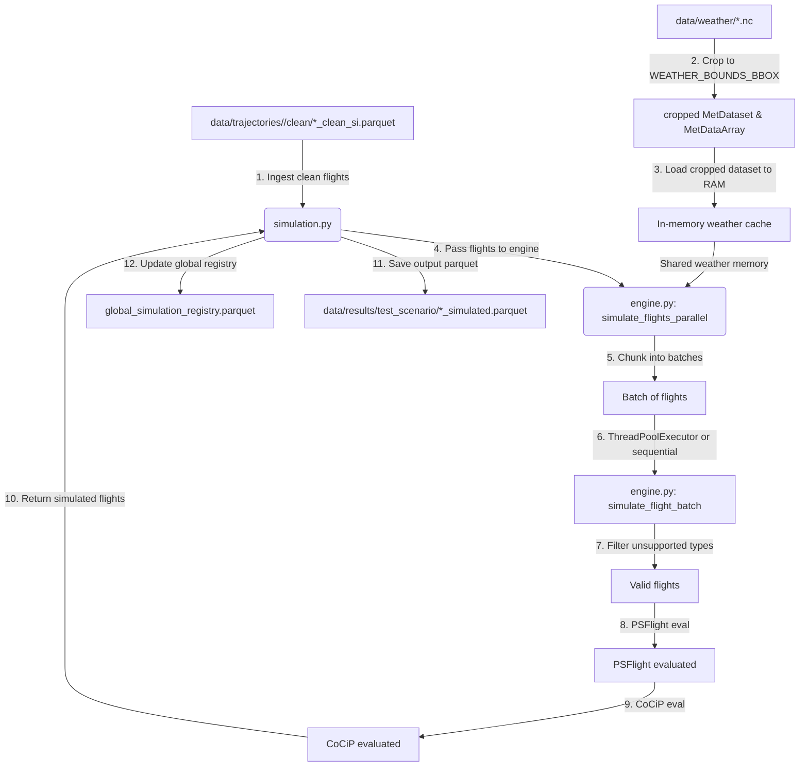
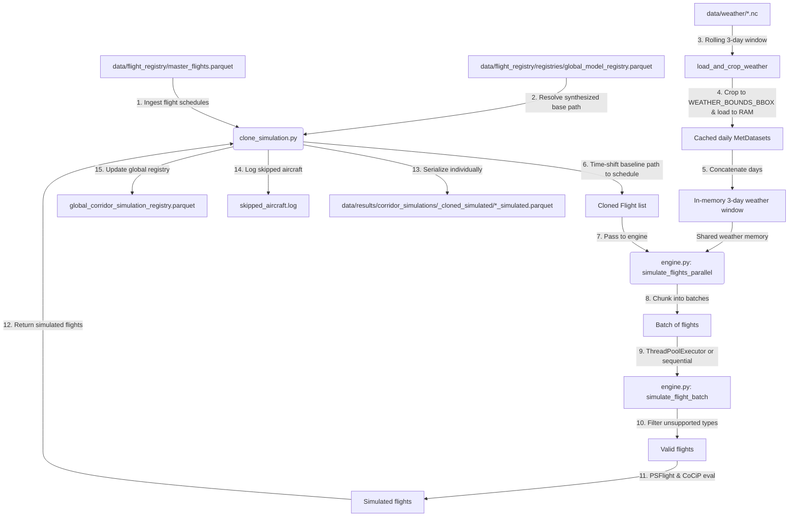

# Physics Simulation Module

This module handles the physical simulation of aircraft trajectories under the **CoCiP** (Contrail Cirrus Prediction) and **PSFlight** (Performance-based System Flight) models in `pycontrails`. 

It has been refactored into a highly modular, thread-safe, and memory-optimized architecture. The core simulation logic is decoupled from file loading and schedule management into a dedicated core engine, allowing it to be easily reused for future studies (such as variational flight level changes).

It contains three primary files:
1. **Core Physics Engine (`engine.py`)**: A stateless module containing atomized helper functions for weather dataset cropping, model creation, vectorized batch evaluation (with error recovery), and thread-pool execution.
2. **Standard Simulation (`simulation.py`)**: The entrypoint that runs weather-canned physics evaluations on already-recorded and cleaned trajectories.
3. **Batch Clone Simulation (`clone_simulation.py`)**: A fault-tolerant schedule-cloning engine that takes synthesized corridor trajectories, clones them, time-shifts them to match flight schedules, and batch-simulates them daily.

It operates as **Loop 3b** of the Flight Physics Pipeline.

---

## 1. Module Structure

```text
src/core/physics/
├── README.md              # This documentation file
├── engine.py              # Stateless, reusable core physics simulation helper functions
├── simulation.py          # Entrypoint for standard clean trajectories (uses engine.py)
└── clone_simulation.py    # Entrypoint for batch cloned corridor flights (uses engine.py)
```

---

## 2. Function Analysis Solution Tree (FAST)

```text
Module Objectives
 └── Physical simulation of flight trajectories under CoCiP and PSFlight models (Loop 3b)
      │
      ├── Sub-objective 1: Standard trajectory modeling
      │    └── Solution: run_physics_pipeline() in simulation.py
      │         ├── Inputs: clean trajectory files/directory, weather cache path, output directory, max contrail age
      │         └── Outputs: Parquet file(s) containing simulated contrail waypoints (*_simulated.parquet), global_simulation_registry.parquet, skipped_aircraft.log, simulation.log
      │
      ├── Sub-objective 2: Batch clone corridor flight simulation
      │    └── Solution: run_batch_clone_simulation() in clone_simulation.py
      │         ├── Inputs: ranks, date ranges, weather cache path, output directory, max contrail age, min_distance, clusters_per_flight
      │         └── Outputs: Incremental flight-level simulated parquets (*_simulated.parquet), global_corridor_simulation_registry.parquet, skipped_aircraft.log, simulation.log
      │
      ├── Sub-objective 3: Spatial weather downselection
      │    └── Solution: crop_met_dataset() in engine.py
      │         ├── Inputs: MetDataset, bounding box [West, South, East, North], coordinate padding
      │         └── Outputs: Spatially cropped MetDataset (supports descending latitudes)
      │
      ├── Sub-objective 4: Thread-safe model creation
      │    └── Solution: create_simulation_models() in engine.py
      │         ├── Inputs: cropped met/rad datasets, max age, low-memory flag
      │         └── Outputs: Instantiated (PSFlight, Cocip) model tuple (with preprocess_lowmem if active)
      │
      ├── Sub-objective 5: Vectorized batch simulation with resilient fallback
      │    └── Solution: simulate_flight_batch() in engine.py
      │         ├── Inputs: list of Flight objects, met/rad datasets, max age, low-memory flag
      │         └── Outputs: Tuple of (list of simulated Flights, list of skipped flight_ids and typecodes)
      │         └── Safety: Falls back to individual flight simulation if vectorized batch evaluation fails
      │
      └── Sub-objective 6: Concurrency & execution orchestration
           └── Solution: simulate_flights_parallel() in engine.py
                ├── Inputs: list of Flights, met/rad datasets, max age, batch size, max workers, low-memory flag
                └── Outputs: Tuple of (list of simulated Flights, list of skipped flight_ids and typecodes)
                └── Concurrency: runs batches in ThreadPoolExecutor (or sequentially if low-memory is active)
```

---

## 3. Data Workflow

> [!NOTE]
> **Visual Rendering Warning**: Flowcharts are generated using Mermaid. If your markdown viewer does not natively support Mermaid rendering, please refer to the step-by-step text description provided directly below each diagram.

### 3.1. Standard Simulation Workflow (`simulation.py`)



#### Step-by-Step Description: Standard Simulation
1. **Trajectory Ingestion**: The standard simulation entrypoint in `simulation.py` reads EKF-cleaned flight trajectories (`*_clean_si.parquet`) from a specified file or folder.
2. **Weather Timeframe Calculation**: The script dynamically scans the temporal bounds (min/max timestamps) of all flights to establish a weather query window, applying a 1-hour start buffer and a `max_age` (e.g., 48 hours) plus 1-hour end buffer.
3. **Weather Loading & Spatial Slicing**: Using local cached ERA5 NetCDF files, the script opens the Pressure Level and Surface Level weather variables and crops them to the coordinates in `WEATHER_BOUNDS_BBOX` plus a 5.0-degree spatial padding buffer using `crop_met_dataset` in `engine.py`.
4. **RAM Pre-loading**: Unless low-memory mode is active, the cropped datasets are eagerly loaded into system RAM (`.load()`) to speed up subsequent point calculations.
5. **Parallel Batch Partitioning**: In `engine.py:simulate_flights_parallel`, the cohort is sliced into batch chunks (default: 50 flights) and evaluated in parallel via a `ThreadPoolExecutor`.
6. **Aircraft Type Verification**: For each batch inside `engine.py:simulate_flight_batch`, aircraft typecodes are checked against the supported PSFlight aircraft list. Unsupported types are skipped and logged to `skipped_aircraft.log`.
7. **Vectorized Simulation & Fallback**: Valid flights are evaluated together in a vectorized batch using PSFlight (for fuel/emission calculations) and CoCiP (for contrail forecasting). If the vectorized step raises an error, the batch falls back to an exception-safe sequential loop to process valid flights individually.
8. **Trajectory Serialization**: Simulated flight data containing contrail attributes are serialized to a `*_simulated.parquet` file under the designated output directory.
9. **Global Registry Update**: The script updates the centralized index registry (`global_simulation_registry.parquet`) mapping each simulated flight ID to its output Parquet file path.

---

### 3.2. Batch Clone Simulation Workflow (`clone_simulation.py`)



#### Step-by-Step Description: Batch Clone Simulation
1. **Schedule Database Ingestion**: The batch clone simulation (`clone_simulation.py`) loads the master schedules database (`master_flights.parquet`) and the route summary indices.
2. **Synthesized Base Path Mapping**: The script resolves the file paths of baseline synthesized corridor medoid trajectories by querying the model registry (`global_model_registry.parquet`).
3. **Cohort Filtering**: Filters flights by requested ranks, date ranges, minimum route distance (default: 800.0 km), and bypasses airport loops and already-simulated flights.
4. **Rolling Weather Management**: Iterates day-by-day over the cohort. For each day, it maintains a rolling 3-day weather window (Day N, Day N+1, Day N+2) in memory to cover potential advection time, evicting expired days and loading new ones.
5. **Base Path Cloning & Time-shifting**: For each scheduled flight, the base synthesized path is cloned, and its datetime index is offset to align with the flight's scheduled departure time (`firstseen`).
6. **Synthetic Track Sampling**: Samples random synthesized tracks according to the requested number of `--clusters-per-flight` to represent corridor alternatives.
7. **Parallel Engine Simulation**: The time-shifted cloned flights are passed to `engine.py:simulate_flights_parallel` to run parallel batch simulation.
8. **Corridor Trajectory Serialization**: Simulated trajectories are written to individual Parquet files under corridor-specific folders (e.g., `<origin>-<destination>_cloned_simulated/`) inside the output directory.
9. **Global Corridor Registry Update**: Registers the newly simulated cloned trajectories in the `global_corridor_simulation_registry.parquet`.

---

### 3.3. Optimization & Memory Modes

To support simulation runs across a variety of hardware (from desktops with high RAM/CPU count to laptops with less than 1 GB of free RAM), the engine supports two distinct execution profiles:

#### Standard Mode (High Performance)
*   **Weather Dataset Loading**: The cropped weather datasets (covering `WEATHER_BOUNDS_BBOX` plus spatial padding) are fully loaded into RAM using `.load()` at the start of the cohort day. Slicing reduces the global grid down to a lightweight subset (under 400 MB), allowing fast memory access.
*   **Concurrency**: Batches of flights (default size: 50) are dispatched in parallel using a `ThreadPoolExecutor` (releasing Python's GIL inside NumPy/Pandas C-loops). 
*   **RAM Safety**: Multiple threads read from the *same shared in-memory weather datasets*, ensuring weather grids are not duplicated in memory.

#### Low-Memory Mode (`--low-mem` flag)
*   **Weather Dataset Loading**: The cropped weather datasets are kept **lazy** on disk (using Dask). Coordinates are interpolated on-demand.
*   **CoCiP Parameter Tuning**: Injects `preprocess_lowmem=True` to enforce chunk-by-chunk coordinate lazy interpolation, avoiding massive in-memory array allocations.
*   **Concurrency**: Forces sequential execution (`max_workers=1`). Evaluating one batch at a time prevents concurrent Dask reading tasks, keeping peak memory allocations within the 1 GB envelope.

---

### 3.4. Logging & Performance Metrics

When executing a batch clone simulation, the engine tracks execution time and logs summaries at both the daily level and the overall run level. The counters distinguish between the number of original schedules and the randomized synthetic trajectory clones.

#### Daily Cohort Summary
At the end of each simulated day, a summary is logged showing:
*   **Cohort Scheduled Flights**: The number of unique flight schedules matched from the database.
*   **Total Trajectories**: The number of simulated synthetic trajectory tracks (Scheduled Flights × `--clusters-per-flight`).
*   **Success / Skipped / Failure**: Trajectory-level counts of simulated tracks.
*   **Time Elapsed**: Duration of the daily simulation loop in seconds, including average time per simulated trajectory.

```text
==================================================
CLONED SIMULATION DAILY SUMMARY - 2026-06-29 19:30:00
Period/Date: 2025-12-06
Cohort Scheduled Flights: 36
Total Trajectories: 108
Success (Trajectories): 93
Skipped (Trajectories): 15
Failure (Trajectories): 0
Time Elapsed: 45.20 seconds (0.42s per trajectory)
==================================================
```

#### Final Run Performance Summary
At the very end of the script execution, a consolidated summary prints overall counters, total execution time, and a daily timing breakdown:

```text
==================================================
CLONED BATCH RUN PERFORMANCE SUMMARY
Total Simulation Days: 3
Total Scheduled Flights: 108
Total Trajectories: 324
Overall Success: 279
Overall Skipped: 45
Overall Failure: 0
Total Execution Time: 2m 15.6s (Avg: 45.2s per day)

Breakdown:
  - 2025-12-06: 36 flights (108 trajectories) in 45.20s
  - 2025-12-07: 36 flights (108 trajectories) in 44.80s
  - 2025-12-08: 36 flights (108 trajectories) in 45.00s
==================================================
```

---

## 4. CLI Usage Guide

### Bash

```bash
# 1. Run standard simulation with multithreading and batch optimization
python -m src.core.physics.simulation \
    --input-file "data/trajectories/ranks_1_strat_fixed_val_2.0_seed_42_format_oneway_ee7a02/clean/LEPA-LEBL_ab1081_clean_si.parquet" \
    --out-dir "data/results/test_scenario/" \
    --weather-cache "data/weather" \
    --max-workers 4 \
    --batch-size 50

# 2. Run standard simulation in LOW-MEMORY mode
python -m src.core.physics.simulation \
    --input-file "data/trajectories/ranks_1_strat_fixed_val_2.0_seed_42_format_oneway_ee7a02/clean/LEPA-LEBL_ab1081_clean_si.parquet" \
    --out-dir "data/results/test_scenario/" \
    --weather-cache "data/weather" \
    --low-mem

# 3. Run cloned batch simulation for specific ranks (Standard Mode)
python -m src.core.physics.clone_simulation \
    --ranks 1,3 \
    --start-date "2025-01-02" \
    --end-date "2025-01-05" \
    --weather-cache "data/weather" \
    --out-dir "data/results/corridor_simulations" \
    --max-workers 4 \
    --batch-size 100

# 4. Run cloned batch simulation in LOW-MEMORY mode
python -m src.core.physics.clone_simulation \
    --ranks 1,3 \
    --start-date "2025-01-02" \
    --end-date "2025-01-05" \
    --weather-cache "data/weather" \
    --out-dir "data/results/corridor_simulations" \
    --low-mem
```

### PowerShell

```powershell
# Run standard simulation in low-memory mode
python -m src.core.physics.simulation `
    --input-file "data/trajectories/ranks_1_strat_fixed_val_2.0_seed_42_format_oneway_ee7a02/clean/LEPA-LEBL_ab1081_clean_si.parquet" `
    --out-dir "data/results/test_scenario/" `
    --weather-cache "data/weather" `
    --low-mem

# Run cloned batch simulation in standard mode with 4 threads
python -m src.core.physics.clone_simulation `
    --ranks 1,76,177,205,209,278,288,321,411,508,509,592,633,710,712,727,761,792,848,888,926 `
    --start-date "2025-12-01" `
    --end-date "2025-12-05" `
    --weather-cache "data/weather" `
    --out-dir "data/results/corridor_simulations" `
    --max-workers 4 `
    --batch-size 50

# Run cloned batch simulation in low-memory and test mode
python -m src.core.physics.clone_simulation --ranks 1,76,177 --test-mode --weather-cache "data/weather" --out-dir "data/results/test_lowmem" --low-mem --overwrite
```

---

### 4.1. Parameter References

#### Common Optimization Parameters (Both Entrypoints)

| CLI Option | Type | Default | Description |
| :--- | :--- | :--- | :--- |
| `--low-mem` | `flag` | *False* | Enforces low-RAM operations: keeps datasets lazy on disk (Dask), sets `preprocess_lowmem=True` in CoCiP, and runs flight batches sequentially (`max_workers=1`). |
| `--batch-size` | `int` | `50` | Size of flight batches passed to `pycontrails` for vectorized execution. Larger sizes speed up array calculations but consume more RAM. |
| `--max-workers` | `int` | `4` | Number of concurrent worker threads. Ignored if `--low-mem` is specified. |

#### Parameter Reference (`simulation.py`)

| CLI Option | Type | Default | Description |
| :--- | :--- | :--- | :--- |
| `--input-file` | `str` | *None* | Path to cleaned SI trajectory Parquet file (`*_clean_si.parquet`) or directory containing multiple cleaned Parquet files. (Required) |
| `--out-dir` | `str` | *None* | Output directory for simulation results, logs, and skipped aircraft files. (Required) |
| `--weather-cache` | `str` | *None* | Path to the NetCDF ERA5 weather files directory. (Required) |
| `--max-age` / `--age` | `int` | `48` | Maximum contrail simulation/advection age in hours. |

#### Parameter Reference (`clone_simulation.py`)

| CLI Option | Type | Default | Description |
| :--- | :--- | :--- | :--- |
| `--ranks` | `str` | *None* | Comma-separated list of route ranks to process (e.g., `"1,3"`). Mutually exclusive with `--lower-rank`. |
| `--lower-rank` | `int` | *None* | Start of a corridor rank range to simulate. Requires `--upper-rank`. |
| `--upper-rank` | `int` | *None* | End of a corridor rank range to simulate. Requires `--lower-rank`. |
| `--start-date` | `str` | *None* | Start date (YYYY-MM-DD) for flight scheduling. (Required unless `--test-mode` is active) |
| `--end-date` | `str` | *None* | End date (YYYY-MM-DD) for flight scheduling. (Required unless `--test-mode` is active) |
| `--weather-cache` | `str` | `data/weather` | Path to the NetCDF ERA5 weather files directory. |
| `--out-dir` | `str` | `data/results/corridor_simulations` | Output directory for simulation results and logs. |
| `--max-age` / `--age` | `int` | `48` | Maximum contrail simulation/advection age in hours. |
| `--overwrite` | `flag` | *False* | Forces re-simulation of already simulated flights. |
| `--test-mode` | `flag` | *False* | Enables test mode: slices the cohort to 1 flight total, sets the start/end date to `2025-01-02` / `2025-01-03`, and disables day-by-day temporal windowing. |
| `--no-day-by-day` | `flag` | *False* (default is false) | Disables day-by-day temporal weather windowing and runs the entire cohort as a single batch. (By default, day-by-day windowing is active) |
| `--min-distance` | `float` | `800.0` | Minimum route distance in kilometers to process. Bypasses corridors that are shorter than the specified distance threshold. Set to `0` to disable. |
| `--clusters-per-flight` / `-x` | `int` | `1` | Number of randomized synthetic tracks to sample per flight schedule. |

---

## 5. Prerequisites & Dependencies

### Python Libraries
* `pandas` & `pyarrow` (for data manipulation and Parquet parsing)
* `numpy` & `scipy` (for math and physics arrays)
* `pycontrails` (for PSFlight and Cocip contrail physics simulation models)
* `xarray` & `dask` (for NetCDF grid parsing and lazy-loading)

### Data Requirements
* **Weather Cache**: Populated weather NetCDF files covering the flight timelines plus advection padding.
* **Flight Lists**: Standard corridor lists Parquet files matching schedules.
* **Master Flight Schedules & Routes**: `master_flights.parquet` and `master_flights_route_summary.pkl` located in the `data/flight_registry/` directory.
* **Synthesized Baseline**: Synthesized trajectories registered in `global_model_registry.parquet`.

For naming standards and coordinate reference systems, refer to the centralized **[conventions.md](file:///g:/Meine%20Ablage/UNI/SS26/PythonPipeline%20-%20Kopie/src/conventions.md)** standards.