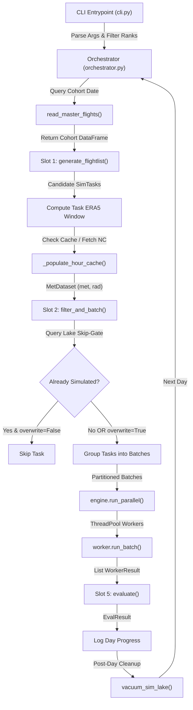
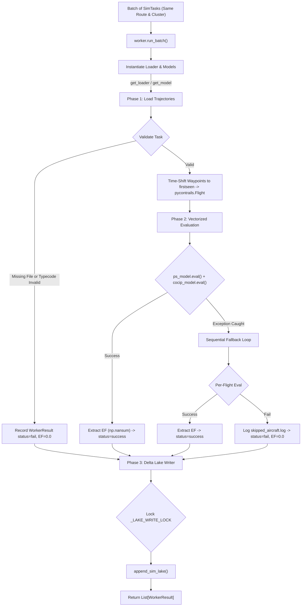

# Physics Simulation Pipeline (`src/core/physics`)

## 1. Title & Introduction

The `src/core/physics` module implements the high-performance, slotted contrail simulation engine for the Flight Physics Pipeline. Built on top of the [`pycontrails`](https://pycontrails.org/) framework (utilising standard `PSFlight` performance models and `Cocip` contrail evolution models), this module evaluates total energy forcing ($\text{EF}$ in Joules) and contrail persistence across thousands of historical commercial flights operating over Europe.

The engine features a **5-Slot architecture** decoupled from data storage, model selection, and execution orchestration:
1. **Slot 1 (Flight List Generation)**: Builds uniform `SimTask` dataclass items from raw flight cohorts.
2. **Slot 2 (Task Filtering & Batching)**: Filters tasks against Delta Lake execution history (skip-gate) and groups unsimulated tasks by route corridor and cluster trajectory.
3. **Slot 3 (Trajectory Loading)**: Loads, validates, and time-shifts representative cluster trajectories to match target flight departure timestamps.
4. **Slot 4 (Model Instantiation & Evaluation)**: Dynamically instantiates PyContrails model pairs (`PSFlight` + `Cocip`) and runs vectorized flight evaluations with sequential per-flight fallbacks.
5. **Slot 5 (Batch Evaluation)**: Evaluates completed worker outcomes, classifies succeeded vs failed tasks, and yields structured `EvalResult` objects back to the day loop.

Concurrency is handled via a **`ThreadPoolExecutor`** model dispatch architecture, enabling worker threads to concurrently access shared in-memory ERA5 `MetDataset` objects without duplicating multi-gigabyte weather arrays across process boundaries.

> [!NOTE]
> legacy entrypoints (`simulation.py` and `clone_simulation.py`) are superseded by this slotted architecture (`cli.py` + `orchestrator.py` + `worker.py`).

---

## 2. Module Structure

```text
src/core/physics/
├── README.md                      ← Module technical specification (this file)
├── __init__.py                    ← Package initialization
├── cli.py                         ← Main CLI entrypoint (parses args & invokes orchestrator)
├── orchestrator.py                ← Day-by-day loop coordinator & ERA5 hour-cache manager
├── engine.py                      ← Pure parallel execution layer (ThreadPoolExecutor dispatch)
├── worker.py                      ← Single batch execution worker (Slot 3+4 integration & Lake I/O)
├── clone_simulation.py            ← Legacy unslotted orchestrator (maintained for baseline comparison)
├── simulation.py                 ← Legacy unslotted orchestrator (maintained for baseline comparison)
├── loaders/                       ← Slot 3: Trajectory loading implementations
│   ├── __init__.py                ← Loader factory (`get_loader`)
│   └── cluster_loader.py          ← Slot 3a: K-Cluster trajectory loader & time-shifter
├── models/                        ← Slot 4: Physics model builders
│   ├── __init__.py                ← Model package initialization
│   └── ps_cocip.py                ← Kerosene PSFlight + CoCiP model builder (`get_model`)
└── slots/                         ← Slotted pipeline step definitions
    ├── __init__.py                ← Slots package initialization
    ├── slot1_flightlist_gen.py    ← Slot 1: Flight list generation from master_flights slices
    ├── slot1_cohort_enum.py       ← Backward compatibility shim (re-exports slot1_flightlist_gen)
    ├── slot1_task_gen.py          ← Backward compatibility shim (re-exports slot1_flightlist_gen)
    ├── slot2_batcher.py           ← Slot 2: Delta Lake skip-gate filtering & route batching
    ├── slot5_evaluator.py         ← Slot 5: Batch evaluation & result classification
    └── utils.py                   ← Pure slot helper utilities (step-down task computation)
```

---

## 3. Function Analysis Solution Tree (FAST)

```text
Module Objective: Efficient, Thread-Safe Physics & Contrail Simulation across Flight Cohorts
│
├── 1. Command Line Parsing & Execution Dispatch
│   └── cli.main() / parse_args()
│       ├── Input: Sys argv flags (--start-date, --end-date, --sim-mode, --low-mem, etc.)
│       ├── Output: argparse.Namespace
│       └── Safety/Fallback: Validates date ranges, filters corridors by rank via global_model_registry.parquet, exits on empty/invalid inputs.
│
├── 2. Day-by-Day Orchestration & Dynamic ERA5 Windowing
│   └── orchestrator.run()
│       ├── Input: Date range, corridors_map, lake_path, weather_cache_dir, execution flags.
│       ├── Output: None (writes directly to Delta Lake).
│       └── Safety/Fallback: Calculates exact ERA5 window from task min(firstseen) / max(lastseen) + max_age_hours; evicts stale ERA5 hours dynamically; handles missing cohort days gracefully.
│
├── 3. Slot 1: Flight List Generation
│   └── slot1_flightlist_gen.generate_flightlist()
│       ├── Input: Cohort DataFrame (master_flights slice), available_clusters dictionary (CorridorCluster metadata).
│       ├── Output: List[SimTask]
│       └── Safety/Fallback: Skips flights without available route clusters; checks cluster.fl validity (hard skip on missing/invalid FL); generates unique SimTask per (flight x cluster).
│
├── 4. Slot 2: Task Filtering & Batching (Skip-Gate)
│   └── slot2_batcher.filter_and_batch()
│       ├── Input: Candidate List[SimTask], sim_mode, lake_path, overwrite flag, max_batch_size.
│       ├── Output: List[List[SimTask]] (partitioned execution batches).
│       └── Safety/Fallback: Queries sim_fid_exists() against Delta Lake; bypasses check if overwrite=True; splits large route groups into max_batch_size sub-batches.
│
├── 5. Slot 3: Trajectory Loading & Time-Shifting
│   └── loaders.cluster_loader.load() (via get_loader(sim_mode))
│       ├── Input: SimTask, corridors_map.
│       ├── Output: Optional[pycontrails.Flight]
│       └── Safety/Fallback: Validates aircraft typecode via is_supported_typecode(); shifts timestamps relative to task.firstseen; returns None on missing files or invalid typecodes.
│
├── 6. Slot 4: Physics Model Instantiation & Evaluation
│   └── models.ps_cocip.get_model() / worker.run_batch()
│       ├── Input: model_config_id ('kerosene'), MetDataset (met), MetDataset (rad), max_age_hours, low_mem.
│       ├── Output: Tuple[PSFlight, Cocip] / List[WorkerResult]
│       └── Safety/Fallback: Runs vectorized ps_model.eval() + cocip_model.eval(); on vector exception, falls back to sequential per-flight evaluation; logs unrecoverable failures to skipped_aircraft.log.
│
├── 7. Parallel Execution Coordination
│   └── engine.run_parallel()
│       ├── Input: List[List[SimTask]], worker_fn (partial run_batch), max_workers.
│       ├── Output: Iterator[List[WorkerResult]]
│       └── Safety/Fallback: Spawns ThreadPoolExecutor; catches batch exceptions and yields empty lists; calls gc.collect() after each batch completion.
│
├── 8. Slot 5: Batch Evaluation
│   └── slots.slot5_evaluator.evaluate()
│       ├── Input: List[WorkerResult], sim_mode, step_size, min_safe_fl.
│       ├── Output: EvalResult (succeeded, failed, still_todo).
│       └── Safety/Fallback: For O1, partitions succeeded vs failed and sets still_todo=[]; O2 pass reserved.
│
└── 9. Results Persistence & Lake Vacuuming
    └── worker._write_to_lake() / data_manager.io_utils.vacuum_sim_lake()
        ├── Input: List[WorkerResult], lake_path, overwrite.
        ├── Output: Delta Lake storage update.
        └── Safety/Fallback: Thread lock (_LAKE_WRITE_LOCK) serializes Delta Lake writes; vacuum_sim_lake() cleans unreferenced parquet files post-day.
```

---

## 4. Data Workflow

### 4.1 Workflow A — O1 Waterfall Baseline (`cli.py` + `orchestrator.py`)


```mermaid
flowchart TD
    A["CLI Entrypoint (cli.py)"] -->|"Parse Args & Filter Ranks"| B["Orchestrator (orchestrator.py)"]
    B -->|"Query Cohort Date"| C["read_master_flights()"]
    C -->|"Return Cohort DataFrame"| D["Slot 1: generate_flightlist()"]
    D -->|"Candidate SimTasks"| E["Compute Task ERA5 Window"]
    E -->|"Check Cache / Fetch NC"| F["_populate_hour_cache()"]
    F -->|"MetDataset (met, rad)"| G["Slot 2: filter_and_batch()"]
    G -->|"Query Lake Skip-Gate"| H{"Already Simulated?"}
    H -->|"Yes & overwrite=False"| I["Skip Task"]
    H -->|"No OR overwrite=True"| J["Group Tasks into Batches"]
    J -->|"Partitioned Batches"| K["engine.run_parallel()"]
    K -->|"ThreadPool Workers"| L["worker.run_batch()"]
    L -->|"List WorkerResult"| M["Slot 5: evaluate()"]
    M -->|"EvalResult"| N["Log Day Progress"]
    N -->|"Post-Day Cleanup"| O["vacuum_sim_lake()"]
    O -->|"Next Day"| B
```

#### Step-by-Step Description:

1. **CLI Initialization**: `cli.py` parses command-line flags (date range, corridor ranks, worker count, memory flags) and calls `_build_corridors_map()` to map `(route_id, cluster_id)` pairs to cluster parquet file paths from `GLOBAL_CORRIDOR_MODEL_REGISTRY`. If `--ranks` or `--lower-rank`/`--upper-rank` is provided, the mapping is filtered using `route_summary.parquet`.
2. **Daily Cohort Query**: For each day in the date range, `orchestrator.run()` queries `master_flights.parquet` via `read_master_flights()` for flights departing between `00:00:00` and `23:59:59` UTC.
3. **Flight List Generation (Slot 1)**: `generate_flightlist()` converts cohort rows into `SimTask` dataclass items by matching route codes (`dep-arr`) against available cluster trajectories in `corridors_map`.
4. **Dynamic ERA5 Windowing**: The orchestrator inspects all generated tasks for the day and calculates exact hourly bounds:
   $$\text{era5\_start} = \lfloor \min(\text{task.firstseen}) \rfloor - 1\text{h}$$
   $$\text{era5\_end} = \lceil \max(\text{task.lastseen}) \rceil + \text{max\_age\_hours} + 1\text{h}$$
   Stale hours prior to `era5_start` are evicted from `hour_cache`, and missing hours are opened from disk/disk-cache concurrently (pressure level and surface level).
5. **Weather Slicing**: Hourly ERA5 `MetDataset` blocks are concatenated along the time dimension into complete `met` and `rad` datasets for the day.
6. **Task Skip-Gate & Batching (Slot 2)**: `filter_and_batch()` checks each task's `SIM_FID` against the Delta Lake via `sim_fid_exists()`. Unless `--overwrite` is enabled, already-simulated tasks are skipped. Remaining tasks are grouped by `(dep, arr, cluster_id)` and chunked into sub-batches of `batch_size` (default 50).
7. **Parallel Dispatch**: The orchestrator invokes `engine.run_parallel()`, passing the batches to a `ThreadPoolExecutor` running `worker.run_batch()`.
8. **Batch Evaluation (Slot 5)**: As each worker completes, `evaluate()` partitions worker results into `succeeded` ($\text{status} = \text{"success"}$) and `failed` ($\text{status} = \text{"fail"}$). For O1 runs, `still_todo` is always empty.
9. **Daily Vacuum & GC**: After all batches for the day finish, `vacuum_sim_lake()` is called to prune stale Delta Lake files, dataset references are deleted, and explicit `gc.collect()` is triggered before advancing to the next day.

---

### 4.2 Workflow B — Single Batch Worker (`worker.py`)


```mermaid
flowchart TD
    A["Batch of SimTasks (Same Route & Cluster)"] --> B["worker.run_batch()"]
    B --> C["Instantiate Loader & Models"]
    C -->|"get_loader / get_model"| D["Phase 1: Load Trajectories"]
    D --> E{"Validate Task"}
    E -->|"Missing File or Typecode Invalid"| F["Record WorkerResult status=fail, EF=0.0"]
    E -->|"Valid"| G["Time-Shift Waypoints to firstseen -> pycontrails.Flight"]
    G --> H["Phase 2: Vectorized Evaluation"]
    H --> I{"ps_model.eval() + cocip_model.eval()"}
    I -->|"Success"| J["Extract EF (np.nansum) -> status=success"]
    I -->|"Exception Caught"| K["Sequential Fallback Loop"]
    K --> L{"Per-Flight Eval"}
    L -->|"Success"| M["Extract EF -> status=success"]
    L -->|"Fail"| N["Log skipped_aircraft.log -> status=fail, EF=0.0"]
    J --> O["Phase 3: Delta Lake Writer"]
    F --> O
    M --> O
    N --> O
    O --> P{"Lock _LAKE_WRITE_LOCK"}
    P --> Q["append_sim_lake()"]
    Q --> R["Return List[WorkerResult]"]
```

#### Step-by-Step Description:

1. **Worker Setup**: `worker.run_batch()` receives a batch of `SimTask` items (all sharing the same `dep`, `arr`, and `cluster_id`), the day's `met` and `rad` `MetDataset` objects, and configuration parameters. It initializes the trajectory loader (`cluster_loader.load`) and physics models (`_build_kerosene`).
2. **Phase 1 (Flight Trajectory Loading)**:
   - For each task, `cluster_loader.load()` fetches the cluster parquet file from `corridors_map`.
   - Validates `task.typecode` using `is_supported_typecode()`. If invalid or missing, logs to `data/logs/skipped_aircraft.log` and returns `None`.
   - Time-shifts trajectory waypoints such that waypoint[0] matches `task.firstseen`.
   - Returns a `pycontrails.Flight` object with metadata attributes attached (`flight_id`, `aircraft_type`, `icao24`, etc.).
   - Tasks failing trajectory loading are marked as `WorkerResult(status="fail", ef=0.0)`.
3. **Phase 2 (Physics Evaluation)**:
   - **Vectorized Evaluation**: All successfully loaded `Flight` objects are passed as a batch to `ps_model.eval(flights_list)` and subsequently `cocip_model.eval(source=fl_ps)`. Results are parsed, and total Energy Forcing ($\text{EF} = \sum \text{ef}$ in Joules) is calculated via `_extract_ef()`.
   - **Sequential Fallback**: If the vectorized call raises an exception (e.g., array shape mismatch, local NaN propagation), worker catches the error and executes a sequential loop over individual flights. If a single flight fails sequential evaluation, `log_skipped_aircraft()` writes the error flag to `skipped_aircraft.log`, and the flight is marked `status="fail", ef=0.0`.
4. **Phase 3 (Delta Lake Persistence)**:
   - Worker builds a result DataFrame containing columns: `SIM_FID`, `model_config_id`, `route`, `EF`, `FL`.
   - Acquires `_LAKE_WRITE_LOCK` (a thread-level lock preventing concurrent Delta Lake manifest mutations).
   - Calls `append_sim_lake()`. In standard mode (`overwrite=False`), performs a MERGE upsert on `(SIM_FID, model_config_id)`. In overwrite mode (`overwrite=True`), deletes matching `SIM_FID` rows before inserting.
   - Returns `List[WorkerResult]` to `engine.run_parallel()`.

---

### 4.3 Optimization & Memory Modes

Weather dataset operations (ERA5 loading and slicing) dominate system RAM consumption. The pipeline provides two distinct execution modes governed by the `--low-mem` flag:

| Feature / Behavior | Standard Mode (`--low-mem` omitted) | Low-Memory Mode (`--low-mem` enabled) |
|---|---|---|
| **ERA5 Spatial Crop** | Cropped to `EUR_BBOX` ($[-26^\circ, 30^\circ, 44^\circ, 79^\circ]$) $+ 10^\circ$ padding via `crop_met_dataset()`. | **Skipped entirely**. Dask slices touched chunks lazily without spatial crop overhead. |
| **ERA5 In-Memory Load** | Executes eager `.load()` call to pull cropped array into uncompressed RAM. | **Skipped eager load**. Data remains in lazy Dask / NetCDF arrays. |
| **CoCiP Preprocessing** | Standard PyContrails array processing. | Enables `preprocess_lowmem=True` parameter inside `Cocip` model initialization. |
| **Primary Advantage** | Fastest execution speed per batch; optimal for high-CPU nodes with ample RAM ($\ge 32\text{ GB}$). | **Minimizes peak RAM footprint**; prevents OOM crashes on memory-constrained workers or large temporal windows. |

---

## 5. CLI Usage Guide

### 5.1 Bash Syntax

```bash
# Standard O1 Waterfall Simulation run for January 2025 across ranks 1 to 5
python -m src.core.physics.cli \
    --start-date 2025-01-01 \
    --end-date 2025-01-31 \
    --lower-rank 1 \
    --upper-rank 5 \
    --max-workers 4 \
    --batch-size 50 \
    --out-dir data/results/corridor_simulations

# Low-Memory Mode run for specific cluster ranks with forced overwrite
python -m src.core.physics.cli \
    --start-date 2025-01-01 \
    --end-date 2025-01-07 \
    --ranks 1,3,5 \
    --out-dir data/results/corridor_simulations \
    --low-mem \
    --overwrite

# Quick Single-Day Test Mode Run
python -m src.core.physics.cli --out-dir data/temp/test_lake --test-mode
```

### 5.2 PowerShell Syntax

```powershell
# Standard O1 Waterfall Simulation run for January 2025 across ranks 1 to 5
python -m src.core.physics.cli `
    --start-date 2025-01-01 `
    --end-date 2025-01-31 `
    --lower-rank 1 `
    --upper-rank 5 `
    --max-workers 4 `
    --batch-size 50 `
    --out-dir data/results/corridor_simulations

# Low-Memory Mode run for specific cluster ranks with forced overwrite
python -m src.core.physics.cli `
    --start-date 2025-01-01 `
    --end-date 2025-01-07 `
    --ranks "1,3,5" `
    --out-dir data/results/corridor_simulations `
    --low-mem `
    --overwrite

# Quick Single-Day Test Mode Run
python -m src.core.physics.cli --out-dir data/temp/test_lake --test-mode
```

### 5.3 Parameter Reference Table

| Parameter | Type | Default | Description |
|---|---|---|---|
| `--start-date` | `str` | *Required* | First calendar day to process (inclusive, format `YYYY-MM-DD`). |
| `--end-date` | `str` | *Required* | Last calendar day to process (inclusive, format `YYYY-MM-DD`). |
| `--ranks` | `str` | `None` | Comma-separated list of route cluster ranks to process (e.g. `'1,3,5'`). Mutually exclusive with `--lower-rank`. |
| `--lower-rank` | `int` | `None` | Lower bound of corridor cluster rank (inclusive). Requires `--upper-rank`. |
| `--upper-rank` | `int` | `None` | Upper bound of corridor cluster rank (inclusive). Requires `--lower-rank`. |
| `--weather-cache` | `str` | `data/weather` | Directory containing hourly ERA5 pressure-level and surface `.nc` cache files. |
| `--out-dir` | `str` | *Required* | Root directory path for Delta Lake simulation storage (e.g. `data/results/corridor_simulations`). |
| `--corridors-dir` | `str` | `data/corridor_paths` | Directory containing synthesized cluster parquet trajectory files. |
| `--max-age`, `--age` | `int` | `48` | Maximum contrail simulation and advection lifetime in hours. |
| `--clusters-per-flight`, `-x` | `int` | `1` | Number of representative cluster trajectories sampled per flight. |
| `--min-distance` | `float` | `0.0` | Pre-filter minimum route distance in kilometers; shorter routes are skipped. |
| `--sim-mode` | `str` | `'O1'` | Simulation mode: `'O1'` (standard waterfall baseline) or `'O2'` (step-down variational pass). |
| `--model-config-id` | `str` | `'kerosene'` | Fuel/model configuration identifier passed to physics engine (`'kerosene'`). |
| `--step-size` | `float` | `1000.0` | FL step-down decrement increment in feet (O2 mode only). |
| `--min-safe-fl` | `float` | `280.0` | Minimum safe flight level in feet below which step-down halts (O2 mode only). |
| `--max-workers` | `int` | `4` | Number of concurrent worker threads in `ThreadPoolExecutor`. |
| `--batch-size` | `int` | `50` | Maximum number of flight tasks per parallel execution batch. |
| `--low-mem` | `flag` | `False` | Enables lazy ERA5 loading, skips spatial cropping and eager `.load()`. |
| `--overwrite` | `flag` | `False` | Bypass Delta Lake skip-gate and overwrite existing `SIM_FID` results. |
| `--test-mode` | `flag` | `False` | Restricts run to single day (`2025-01-01`) and single cluster per flight. |

---

## 6. Prerequisites & Dependencies

### Python Package Dependencies
- **`pycontrails`**: Contrails and flight performance modeling framework (`PSFlight`, `Cocip`, `MetDataset`, `Flight`, `Fleet`).
- **`deltalake`**: High-performance Delta Lake transactional table interface for Rust-backed ACID storage.
- **`xarray` / `dask` / `netCDF4`**: Multi-dimensional meteorological data indexing and lazy array streaming.
- **`pyarrow`**: Parquet serialization and dataset predicate pushdown engine.
- **`pandas` / `numpy`**: Vectorized numerical data manipulation.

### Pipeline Config & Registries Referenced
- **`src.common.config`**:
  - `WEATHER_DIR` (`data/weather`)
  - `CORRIDOR_SIMULATIONS_DIR` (`data/results/corridor_simulations`)
  - `CORRIDOR_PATHS_DIR` (`data/corridor_paths`)
  - `GLOBAL_CORRIDOR_MODEL_REGISTRY` (`data/registries/global_model_registry.parquet`)
  - `EUR_BBOX` ($[-26, 30, 44, 79]$)
  - `ERA5_GRID`, `ERA5_PRESSURE_LEVEL_VARIABLES`, `ERA5_SURFACE_VARIABLES`, `ERA5_REQUIRED_PRESSURE_LEVELS`
  - `is_supported_typecode()` / `UNSUPPORTED_TYPECODE_FLAG`
- **Logging Destination**: Written to `data/logs/simulation.log` via `setup_file_logger("simulation.log")`. Skipped or unsupported airframes are appended to `data/logs/skipped_aircraft.log`.