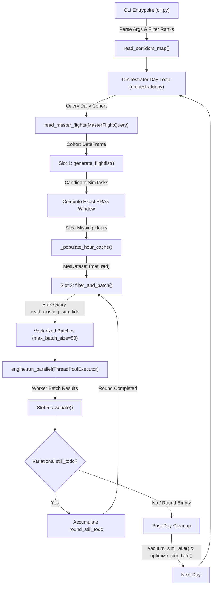
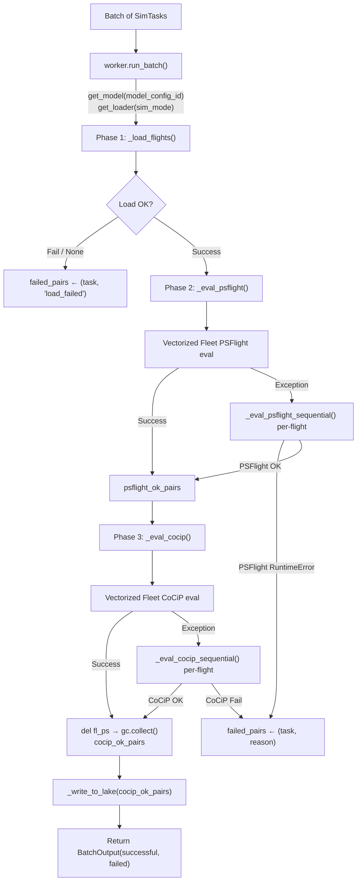

# Physics Simulation Pipeline (`src/core/physics`)

## 1. Title & Introduction

The `src/core/physics` module implements the high-performance, slotted contrail simulation engine for the Flight Physics Pipeline. Built on top of the [`pycontrails`](https://pycontrails.org/) framework (utilising standard `PSFlight` performance models and `Cocip` contrail evolution models), this module evaluates total energy forcing ($\text{EF}_{\text{total}}$ in Joules) and contrail persistence across historical commercial flights operating over Europe.

The engine features a **5-Slot architecture** cleanly decoupled from data access, model selection, and parallel execution orchestration:
1. **Slot 1 (Flight List Generation)**: Converts master flight cohorts into strongly typed `SimTask` items using calibrated cluster flight levels from `GLOBAL_CORRIDOR_MODEL_REGISTRY`.
2. **Slot 2 (Task Filtering, Mutation & Batching)**: Owns skip-gate filtering against Delta Lake execution history, step-down task generation for variational campaigns (`compute_stepdown_task`), and route-based batch chunking.
3. **Slot 3 (Trajectory Loading & Time-Shifting)**: Loads, validates (`is_supported_typecode`), and time-shifts representative corridor cluster trajectories to match target departure timestamps, attaching `attrs["fuel"]`.
4. **Slot 4 (Model Instantiation & Physics Evaluation)**: Dynamically instantiates PyContrails model pairs (`PSFlight` + `Cocip`) and executes vectorized batch evaluations with robust per-flight sequential fallbacks.
5. **Slot 5 (Batch Evaluation & Classification)**: Evaluates completed worker outcomes, classifies succeeded vs failed flights, and delegates to Slot 2 to create `still_todo` tasks for intra-day variational requeueing.

Concurrency is orchestrated via a **`ThreadPoolExecutor`** model dispatch architecture, enabling worker threads to concurrently access shared in-memory ERA5 `MetDataset` objects without duplicating multi-gigabyte weather arrays across process boundaries.

---

## 2. Module Structure

```text
src/core/physics/
├── README.md                      ← Module technical specification (this file)
├── __init__.py                    ← Package initialization
├── cli.py                         ← Main CLI entrypoint (parses args & invokes orchestrator)
├── orchestrator.py                ← Day-by-day loop coordinator, ERA5 cache manager & round re-batcher
├── engine.py                      ← Pure parallel execution layer (ThreadPoolExecutor dispatch)
├── worker.py                      ← Single batch execution worker (Slot 3+4 integration & Lake I/O)
├── clone_simulation.py            ← Legacy unslotted orchestrator (maintained for baseline comparison)
├── simulation.py                 ← Legacy unslotted orchestrator (maintained for baseline comparison)
├── loaders/                       ← Slot 3: Trajectory loading implementations
│   ├── __init__.py                ← Loader factory (`get_loader`)
│   └── cluster_loader.py          ← Slot 3a: K-Cluster trajectory loader & time-shifter
├── models/                        ← Slot 4: Physics model builders
│   ├── __init__.py                ← Model package initialization
│   └── ps_cocip.py                ← Kerosene & Hydrogen PSFlight + CoCiP model builder (`get_model`)
└── slots/                         ← Slotted pipeline step definitions
    ├── __init__.py                ← Slots package initialization
    ├── slot1_flightlist_gen.py    ← Slot 1: Flight list generation from master_flights slices
    ├── slot1_cohort_enum.py       ← Backward compatibility shim (re-exports slot1_flightlist_gen)
    ├── slot1_task_gen.py          ← Backward compatibility shim (re-exports slot1_flightlist_gen)
    ├── slot2_batcher.py           ← Slot 2: Skip-gate filtering, step-down task mutation & batching
    ├── slot5_evaluator.py         ← Slot 5: Batch evaluation & classification
    └── utils.py                   ← Backward compatibility shim (re-exports compute_stepdown_task)
```

---

## 3. Function Analysis Solution Tree (FAST)

```text
Module Objective: High-Performance, Thread-Safe Physics Simulation & Trajectory Persistence
│
├── 1. Command Line Parsing & Execution Dispatch
│   └── cli.main() / parse_args()
│       ├── Input: Sys argv flags (--start-date, --end-date, --sim-mode, --fuel, --low-mem, etc.)
│       ├── Output: argparse.Namespace
│       └── Safety/Fallback: Validates date ranges, filters corridors by rank via PyArrow predicate pushdown on route_summary.parquet, exits on empty/invalid inputs.
│
├── 2. Day-by-Day Orchestration & Dynamic ERA5 Windowing
│   └── orchestrator.run()
│       ├── Input: Date range, corridors_map, lake_path, weather_cache_dir, execution flags.
│       ├── Output: None (writes directly to Delta Lake).
│       └── Safety/Fallback: Calculates exact ERA5 window from task min(firstseen) / max(lastseen) + max_age_hours; evicts stale ERA5 hours dynamically with gc.collect(); loads missing hours via bounded packets (_load_hour_packet) with ThreadPoolExecutor(WEATHER_IO_WORKERS); re-batches step-down tasks at round boundaries.
│
├── 3. Slot 1: Flight List Generation & Selection
│   ├── slot1_flightlist_gen.generate_base_flightlist()
│   │   ├── Input: Cohort DataFrame (master_flights slice), corridors_map (from data_manager.read_corridors_map).
│   │   ├── Output: List[FlightCandidate]
│   │   └── Safety/Fallback: Pure transform; maps flights to all valid available route clusters; checks cluster.fl validity (hard skip on missing/invalid FL); safely sanitizes nullable callsign and typecode fields using pd.notna to guard against boolean evaluation errors on pandas.NA.
│   └── slot1_flightlist_gen.select_clusters()
│       ├── Input: candidate_pool (List[FlightCandidate]), available_clusters, strategy ('random'), clusters_per_flight.
│       ├── Output: List[SimTask]
│       └── Safety/Fallback: Samples cluster IDs from candidate valid pool and materializes strongly typed SimTask instances.
│
├── 4. Slot 2: Task Filtering, Mutation & Batching
│   ├── slot2_batcher.partition_tasks()
│   │   ├── Input: List[SimTask], max_batch_size.
│   │   ├── Output: List[List[SimTask]] (100% saturated execution batches).
│   │   └── Safety/Fallback: Deterministically sorts tasks by (dep, arr, cluster_id, firstseen); continuously slices into full max_batch_size batches to maximize vectorized saturation and preserve trajectory cache locality.
│   ├── slot2_batcher.filter_and_batch()
│   │   ├── Input: Candidate List[SimTask], sim_mode, lake_path, overwrite flag, max_batch_size.
│   │   ├── Output: List[List[SimTask]] (partitioned execution batches).
│   │   └── Safety/Fallback: Standard mode: calls read_existing_sim_fids(tasks) → frozenset skip-gate;
│   │       if overwrite, calls delete_sim_lake_rows(exact SIM_FID list) before emit.
│   │       Variational mode: calls read_ef_by_base_key(tasks) → CLUSTER_FID-keyed EF dict;
│   │       if overwrite, reads + resolves CLUSTER_FIDs then calls delete_sim_lake_rows.
│   │       Both IO calls delegate to read_sim_lake_metadata() — the unified engine.
│   │       ⚠ RAM/IO: bounded to one day by the daily loop; do not invoke with unbounded task lists.
│   └── slot2_batcher.compute_stepdown_task()
│       ├── Input: task (SimTask), ef (float), step_size (float), min_safe_fl (float).
│       ├── Output: Optional[SimTask]
│       └── Safety/Fallback: Returns None if ef <= 0 (suppressed) or next_fl < min_safe_fl (floor reached); otherwise returns dataclasses.replace(task, fl=next_fl).
│
├── 5. Slot 3: Trajectory Loading & Time-Shifting
│   └── loaders.cluster_loader.load() (via get_loader(sim_mode, fuel, step_down_method))
│       ├── Input: SimTask, corridors_map, use_hydrogen, step_down_method ('cap').
│       ├── Output: Optional[pycontrails.Flight]
│       └── Safety/Fallback: Validates mode-method mutual exclusion; validates aircraft typecode via is_supported_typecode(); shifts timestamps relative to task.firstseen; clamps altitude ceiling if step_down_method=='cap'; returns None on missing files or invalid typecodes.
│
├── 6. Slot 4: Physics Model Instantiation & Evaluation
│   └── models.ps_cocip.get_model() / worker.run_batch()
│       ├── Input: model_config_id, MetDataset (met), MetDataset (rad), max_age_hours, fuel, step_down_method.
│       ├── Output: Tuple[PSFlight, Cocip] / BatchOutput (containing raw (SimTask, Flight) pairs for successes and (SimTask, reason_str) for failures).
│       └── Safety/Fallback: get_model() dispatches via _BUILDERS dict using model_config_id ('kerosene' or 'kerosene_lowmem'). run_batch() executes two independent phases: Phase 2 _eval_psflight() (vectorized Fleet PSFlight → sequential fallback) and Phase 3 _eval_cocip() (vectorized Fleet CoCiP → sequential fallback). Each phase independently falls back. Lazy sequential model instantiation — PSFlight and Cocip sequential instances are created only inside the except branch, never upfront. del fl_ps; gc.collect() called after Fleet CoCiP eval. Returns BatchOutput, never constructs WorkerResult.
│
├── 7. Parallel Execution Coordination
│   └── engine.run_parallel()
│       ├── Input: List[List[SimTask]], worker_fn (partial run_batch), max_workers.
│       ├── Output: Iterator[BatchOutput]
│       └── Safety/Fallback: Spawns ThreadPoolExecutor; catches batch exceptions and yields BatchOutput(successful=[], failed=[]); calls gc.collect() after each batch completion.
│
├── 8. Slot 5: Batch Result Evaluation & FL Sanity Check
│   └── slots.slot5_evaluator.evaluate()
│       ├── Input: BatchOutput (raw batch output from worker), task_by_fid, sim_mode, model_config_id, step_size, min_safe_fl.
│       ├── Output: EvalResult (succeeded, failed, still_todo).
│       └── Safety/Fallback: First calls _classify_results(batch_output, model_config_id) — the universal, sim_mode-independent verdict constructor that builds all WorkerResult objects. Then dispatches to mode evaluator _evaluate_standard or _evaluate_variational which receive pre-classified (succeeded, failed) lists and only compute still_todo. FL sanity check remains in _evaluate_variational (mutates result.status = 'fail' for |actual_fl - task.fl| > 1.5 FL). WorkerResult is only ever constructed inside _classify_results — this is the central ownership invariant.
│
└── 9. Trajectory Persistence & Post-Day Lake Optimization
    ├── worker._write_to_lake()
    │   ├── Input: List[Tuple[SimTask, Flight]], model_config_id, fuel, lake_path, overwrite.
    │   ├── Output: Delta Lake storage update.
    │   └── Safety/Fallback: Serializes 14 fixed metadata columns + 68 dynamic physics columns; guarded by thread lock (_LAKE_WRITE_LOCK); delegates to io_utils.append_sim_lake().
    └── orchestrator post-day cleanup
        └── io_utils.vacuum_sim_lake() & io_utils.optimize_sim_lake()
            └── Multi-dimensional Z-ordering on ['dep_date', 'route', 'EF_total'] after daily runs.
```

---

## 4. Data Workflow

### 4.1 Workflow A — Daily Orchestrator Loop (`cli.py` + `orchestrator.py`)


```mermaid
flowchart TD
    A["CLI Entrypoint (cli.py)"] -->|"Parse Args & Filter Ranks"| B["read_corridors_map()"]
    B --> C["Orchestrator Day Loop (orchestrator.py)"]
    C -->|"Query Daily Cohort"| D["read_master_flights(MasterFlightQuery)"]
    D -->|"Cohort DataFrame"| E["Slot 1: generate_flightlist()"]
    E -->|"Candidate SimTasks"| F["Compute Exact ERA5 Window"]
    F -->|"Slice Missing Hours"| G["_populate_hour_cache()"]
    G -->|"MetDataset (met, rad)"| H["Slot 2: filter_and_batch()"]
    H -->|"Bulk Query read_existing_sim_fids"| I["Vectorized Batches (max_batch_size=50)"]
    I --> J["engine.run_parallel(ThreadPoolExecutor)"]
    J -->|"Worker Batch Results"| K["Slot 5: evaluate()"]
    K --> L{"Variational still_todo?"}
    L -->|"Yes"| M["Accumulate round_still_todo"]
    M -->|"Round Completed"| H
    L -->|"No / Round Empty"| N["Post-Day Cleanup"]
    N -->|"vacuum_sim_lake() & optimize_sim_lake()"| O["Next Day"]
    O --> C
```

#### Step-by-Step Description:

1. **CLI Initialization**: `cli.py` parses command-line flags (date range, corridor ranks, worker count, fuel, simulation mode, memory flags). `read_corridors_map()` loads `(route_id, cluster_id)` corridor metadata and calibrated FLs from `GLOBAL_CORRIDOR_MODEL_REGISTRY`, filtered via PyArrow dataset predicate pushdown on `route_summary.parquet` if ranks are specified.
2. **Daily Cohort Ingestion**: For each calendar day in `--start-date` to `--end-date`, `orchestrator.run()` queries `master_flights.parquet` via `read_master_flights()` for flights departing between `00:00:00` and `23:59:59` UTC, leveraging single-column predicate pushdown on precomputed `route` fields.
3. **Flight List Generation (Slot 1)**: `generate_base_flightlist()` converts cohort rows into `FlightCandidate` items by matching route codes against available cluster trajectories in `corridors_map`, safely handling missing `callsign` and `typecode` fields with `pd.notna` guards. `select_clusters()` then samples and materializes strongly typed `SimTask` dataclass items.
4. **Dynamic ERA5 Windowing & Packetized Ingestion**: The orchestrator inspects all generated tasks for the day and calculates hourly bounds:
   $$\text{era5\_start} = \lfloor \min(\text{task.firstseen}) \rfloor - 1\text{h}$$
   $$\text{era5\_end} = \lceil \max(\text{task.lastseen}) \rceil + \text{max\_age\_hours} + 1\text{h}$$
   Stale hours before `era5_start` are evicted from `hour_cache` and garbage-collected (`gc.collect()`). Missing hours are partitioned into discrete packets of size `WEATHER_OPEN_PACKET_HOURS` and loaded via `ThreadPoolExecutor(max_workers=WEATHER_IO_WORKERS)` using `_load_hour_packet()`. Each worker builds an isolated dictionary without mutating shared state. The main thread aggregates packets into `hour_cache` and wraps the concatenated daily datasets with `MetDataset(..., copy=False)`.
5. **Bulk Skip-Gate & Batch Packing (Slot 2)**: `filter_and_batch()` delegates to the unified IO engine `read_sim_lake_metadata()` via two thin wrappers:
   - **Standard mode**: `read_existing_sim_fids(tasks)` bulk-queries all simulated SIM_FIDs for the day in a single 4-stage scan (`dep_date` file-skip → `firstseen` row filter → `waypoint==0` one-row-per-SIM_FID → in-RAM `Base_FID` frozenset match). Unsimulated tasks are packed into batches of `max_batch_size` (default 50). If `--overwrite`, exact SIM_FIDs are deleted first via `delete_sim_lake_rows()`.
   - **Variational mode**: `read_ef_by_base_key(tasks)` uses the same scan, projecting `["SIM_FID", "FL", "EF_total"]`, grouped by `CLUSTER_FID` = `SIM_FID` without `_{FL}` suffix. If `--overwrite`, all FL variants per CLUSTER_FID are resolved in-RAM and deleted before re-emitting tasks at nominal FL.
6. **Parallel Dispatch**: The orchestrator invokes `engine.run_parallel()`, passing batches to a `ThreadPoolExecutor` running `worker.run_batch()`.
7. **Batch Evaluation (Slot 5) & Round-Boundary Re-Batching**: Before dispatching parallel batches, the orchestrator constructs `task_by_fid = {t.to_sim_fid(): t}` once per round across all pending batches (avoiding redundant dictionary constructions inside the inner worker batch stream). As workers complete, `evaluate()` receives `batch_output` (a `BatchOutput`) and `model_config_id`. It first calls `_classify_results(batch_output, model_config_id)` to universally construct all `WorkerResult` objects, then dispatches to the mode-specific evaluator. In variational mode, flights with positive warming ($\text{EF}_{\text{total}} > 0$) call `slot2_batcher.compute_stepdown_task()` to populate `still_todo`. The orchestrator accumulates all `still_todo` tasks across the round and re-batches them via Slot 2 at the round boundary into full vectorized batches.
8. **Post-Day Vacuum & Z-Order Optimization**: After all batches and step-downs for the day finish, `vacuum_sim_lake()` prunes stale parquet files older than 168 hours and `optimize_sim_lake()` compacts small files into optimal **512 MB** Parquet chunks (`DELTA_LAKE_TARGET_FILE_SIZE_BYTES = 536,870,912` bytes from `config.py`) and applies multi-dimensional Z-ordering on `['dep_date', 'route', 'EF_total']`.
9. **Wall-to-Wall Temporal & Task Emission Metrics**:
   - Tracks end-to-end wall-clock elapsed time per day and across the entire campaign, calculating effective throughput (`s/task` and `tasks/s`).
   - Clearly distinguishes between **Total Tasks Committed** (all unique trajectories written to the Delta Lake), **Baseline Cohort Tasks** (initial nominal simulations), and **Step-Downs Emitted** (iterative descent flights).
   - **Daily Transition Log Format**:
     ```text
     Day YYYY-MM-DD completed in 1m 50s (110.3s) — 87 tasks committed to lake (1.27s/task) [24 baseline + 63 step-downs emitted, 0 failed].
     ```
   - **Global Campaign Summary Block**:
     ```text
     ================================================================================
     ORCHESTRATOR CAMPAIGN SUMMARY
     ================================================================================
     Total Duration:          1m 50s (110.3s) across 1 calendar day(s)
     Total Tasks Committed:   87 tasks written to Delta Lake (1.27s/task, 0.79 tasks/s)
       • Baseline Tasks:      24 tasks
       • Step-Downs Emitted:  63 tasks
     Failed Simulations:      0
     ================================================================================
     ```

> [!WARNING]
> **RAM Risk — `read_sim_lake_metadata` (unified Slot 2 IO engine)**
> After Stage 3 (`waypoint == 0`) on-disk filtering, the in-RAM table is at most
> ~1.2 × N_tasks rows for one day's cohort (~2,400 rows for 2,000 tasks ≈ 50 KB).
> `filter_and_batch()` is always called inside the orchestrator's daily loop, which
> keeps N_tasks naturally bounded. Do **not** call `read_sim_lake_metadata` directly
> with task lists spanning multiple days in a single invocation — in-RAM row count
> scales linearly with the number of unique `dep_date` values in the task list.

> [!WARNING]
> **IO Risk — `delete_sim_lake_rows` with `--overwrite` outside the daily loop**
> The delete engine emits a single `SIM_FID IN (...)` SQL predicate and is designed
> for the daily overwrite path, where the SIM_FID list is bounded to one day's tasks
> (≤ ~10,000 strings). If `--overwrite` is applied to an unbounded multi-day task
> list in a single `filter_and_batch()` call (i.e. bypassing the orchestrator's
> day-by-day iteration), both the SQL predicate string and the Parquet file rewrite
> cost grow unboundedly. Peak RAM during deletion ≈ X_lake / Y_days per file batch.
> Always run the orchestrator day-by-day; never batch multiple days into one
> `filter_and_batch(overwrite=True)` call.

---

### 4.2 Workflow B — Single Batch Worker (`worker.py`)


```mermaid
flowchart TD
    A["Batch of SimTasks"] --> B["worker.run_batch()"]
    B --> |"get_model(model_config_id)\nget_loader(sim_mode)"| C["Phase 1: _load_flights()"]
    C --> D{"Load OK?"}
    D --> |"Fail / None"| E["failed_pairs ← (task, 'load_failed')"]
    D --> |"Success"| F["Phase 2: _eval_psflight()"]
    F --> G["Vectorized Fleet PSFlight eval"]
    G --> |"Success"| H["psflight_ok_pairs"]
    G --> |"Exception"| I["_eval_psflight_sequential() per-flight"]
    I --> |"PSFlight RuntimeError"| J["failed_pairs ← (task, reason)"]
    I --> |"PSFlight OK"| H
    H --> K["Phase 3: _eval_cocip()"]
    K --> L["Vectorized Fleet CoCiP eval"]
    L --> |"Success"| M["del fl_ps → gc.collect()\ncocip_ok_pairs"]
    L --> |"Exception"| N["_eval_cocip_sequential() per-flight"]
    N --> |"CoCiP OK"| M
    N --> |"CoCiP Fail"| J
    M --> O["_write_to_lake(cocip_ok_pairs)"]
    O --> P["Return BatchOutput(successful, failed)"]
```

#### Step-by-Step Description:

1. **Worker Setup**: `run_batch()` receives batch, MetDatasets, and config. Calls `get_model(model_config_id)` to get a single model pair (dispatch via `_BUILDERS` dict: `'kerosene'` or `'kerosene_lowmem'`). Calls `get_loader()` for the trajectory loader. No sequential model instances created yet.
2. **Phase 1 — Trajectory Loading (`_load_flights`)**: For each task, calls `cluster_loader.load()`. Invalid/missing → appended to `failed_pairs` as `(task, 'load_failed')`. Valid → `loaded_pairs`.
3. **Phase 2 — PSFlight (`_eval_psflight`)**: Attempts vectorized Fleet PSFlight eval on all loaded flights. On any exception, falls back flight-by-flight via `_eval_psflight_sequential()`. Sequential model instance (`PSFlight(met=ps_model.met, params={...copy_source: False})`) is created lazily **only inside the `except` branch**. PSFlight kinematic rejections (`RuntimeError`) → `failed_pairs`. Survivors → `psflight_ok_pairs`.
4. **Phase 3 — CoCiP (`_eval_cocip`)**: Takes `psflight_ok_pairs`. Attempts vectorized Fleet CoCiP eval. On success: `del fl_ps; gc.collect()` immediately to release PSFlight memory. On exception: falls back per-flight via `_eval_cocip_sequential()`. Sequential Cocip instance (`Cocip(met=..., rad=..., params={...})`) created lazily **only inside the `except` branch**. CoCiP failures → `failed_pairs`. Survivors → `cocip_ok_pairs`.
5. **Delta Lake Write**: `_write_to_lake(cocip_ok_pairs)` serializes trajectory DataFrames, injects 14 fixed metadata columns, acquires `_LAKE_WRITE_LOCK`, calls `io_utils.append_sim_lake()`. Only successful pairs are written.
6. **Return**: `BatchOutput(successful=cocip_ok_pairs, failed=failed_pairs)`. No `WorkerResult` constructed here. Slot 5 owns all verdict construction.

---

### 4.3 Optimization & Memory Modes

| Feature / Behavior | Standard Mode (`--low-mem` omitted) | Low-Memory Mode (`--low-mem` enabled) |
|---|---|---|
| **ERA5 Spatial Crop** | Cropped to `EUR_BBOX` ($[-26^\circ, 30^\circ, 44^\circ, 79^\circ]$) $+ 10^\circ$ padding via native `downselect()`. | Cropped lazily to `EUR_BBOX` $+ 10^\circ$ via `downselect()` (limits Dask index space). |
| **ERA5 In-Memory Load** | Executes eager `.load()` call to pull cropped array into uncompressed RAM. | Skip ERA5 eager `.load()`; arrays stay file-backed. Does NOT affect CoCiP preprocessing — use `--model-config-id kerosene_lowmem` for that. |
| **ERA5 Ingestion Chunking** | Loads missing hours in packets of `WEATHER_OPEN_PACKET_HOURS` across `WEATHER_IO_WORKERS`. | Uses `WEATHER_OPEN_PACKET_HOURS=1` and `WEATHER_IO_WORKERS=1` on VM to eliminate NetCDF lock races and memory spikes. |
| **Flight Memory Lifecycle** | `copy_source=True` for Fleet evaluation (PyContrails requirement); sequential fallback uses lazy `copy_source=False` instances created only inside the `except` branch. | Identical to standard mode. `--low-mem` does not affect the worker execution path — both phases always attempt vectorized Fleet eval first and fall back per-flight on exception. |
| **CoCiP Preprocessing** | Standard PyContrails CoCiP preprocessing. | No longer controlled by `--low-mem`. Use `--model-config-id kerosene_lowmem` to enable `Cocip(preprocess_lowmem=True)`. |
| **Primary Advantage** | Fastest execution speed per batch; optimal for high-CPU nodes with ample RAM ($\ge 32\text{ GB}$). | **Minimizes peak RAM footprint**; prevents OOM crashes and file-handle exhaustion on memory-constrained workers. |

> **Separation of concerns**: `--low-mem` controls only ERA5 I/O (whether xarray arrays are eagerly loaded into RAM). `--model-config-id kerosene_lowmem` controls only CoCiP preprocessing behaviour (`preprocess_lowmem=True`). These two flags are fully independent.


---

## 5. CLI Usage Guide

### 5.1 Bash Syntax

```bash
# Standard Simulation run for January 2025 across ranks 1 to 5 (Jet-A / Kerosene)
python -m src.core.physics.cli \
    --start-date 2025-01-01 \
    --end-date 2025-01-31 \
    --lower-rank 1 \
    --upper-rank 5 \
    --sim-mode standard \
    --fuel kerosene \
    --model-config-id kerosene \
    --max-workers 4 \
    --batch-size 50 \
    --out-dir data/results/corridor_simulations_kerosene

# Variational Step-Down Campaign (Hydrogen) with Low-Memory mode and Altitude Capping
python -m src.core.physics.cli \
    --start-date 2025-01-01 \
    --end-date 2025-01-07 \
    --ranks 1,3,5 \
    --sim-mode variational \
    --step-down-method cap \
    --fuel hydrogen \
    --model-config-id kerosene \
    --step-size 10.0 \
    --min-safe-fl 190.0 \
    --out-dir data/results/corridor_simulations_hydrogen \
    --low-mem \
    --max-age 1
```

### 5.2 PowerShell Syntax

```powershell
# Standard Simulation run for January 2025 across ranks 1 to 5 (Jet-A / Kerosene)
python -m src.core.physics.cli `
    --start-date 2025-01-01 `
    --end-date 2025-01-31 `
    --lower-rank 1 `
    --upper-rank 5 `
    --sim-mode standard `
    --fuel kerosene `
    --model-config-id kerosene `
    --max-workers 4 `
    --batch-size 50 `
    --out-dir data/results/corridor_simulations_kerosene

# Variational Step-Down Campaign (Hydrogen) with Low-Memory mode and Altitude Capping
python -m src.core.physics.cli `
    --start-date 2025-01-01 `
    --end-date 2025-01-07 `
    --ranks "1,3,5" `
    --sim-mode variational `
    --step-down-method cap `
    --fuel hydrogen `
    --model-config-id kerosene `
    --step-size 10.0 `
    --min-safe-fl 190.0 `
    --out-dir data/results/corridor_simulations_hydrogen `
    --low-mem `
    --max-age 1
```

### 5.3 Parameter Reference Table

| Parameter | Type | Default | Description |
|---|---|---|---|
| `--start-date` | `str` | *Required* | First calendar day to process (inclusive, format `YYYY-MM-DD`). |
| `--end-date` | `str` | *Required* | Last calendar day to process (inclusive, format `YYYY-MM-DD`). |
| `--sim-mode` | `str` | `'standard'` | Simulation mode: `'standard'` (nominal FL baseline) or `'variational'` (step-down optimization pass). |
| `--step-down-method` | `str` | `None` | Step-down altitude modification method in Slot 3 (`'cap'`). **Required if and only if `--sim-mode variational` is active**. |
| `--fuel` | `str` | `'kerosene'` | Fuel type: `'kerosene'` or `'hydrogen'`. Attaches `Flight(fuel=...)` in Slot 3 and sets `fuel` column. |
| `--model-config-id` | `str` | `'kerosene'` | Physics model configuration passed to get_model() and used as Delta Lake composite merge key. Supported: 'kerosene' (standard Jet-A), 'kerosene_lowmem' (Jet-A with CoCiP preprocess_lowmem=True). SAF variants reserved. |
| `--ranks` | `str` | `None` | Comma-separated list of route cluster ranks to process (e.g. `'1,3,5'`). Mutually exclusive with `--lower-rank`. |
| `--lower-rank` | `int` | `None` | Lower bound of corridor cluster rank (inclusive). Requires `--upper-rank`. |
| `--upper-rank` | `int` | `None` | Upper bound of corridor cluster rank (inclusive). Requires `--lower-rank`. |
| `--out-dir` | `str` | *Required* | Root directory path for Delta Lake simulation storage. Suggested copy-paste targets: `data/results/corridor_simulations_kerosene` (Jet-A/Kerosene) or `data/results/corridor_simulations_hydrogen` (Hydrogen). |
| `--weather-cache` | `str` | `data/weather` | Directory containing hourly ERA5 pressure-level and surface `.nc` cache files. |
| `--corridors-dir` | `str` | `data/corridor_paths` | Directory containing cluster parquet trajectory files. |
| `--max-age`, `--age` | `int` | `48` | Maximum contrail segment age in hours passed to CoCiP. |
| `--step-size` | `float` | `10.0` | FL decrement step size in FL units (default `10.0` = 1,000 ft, used in variational mode). |
| `--min-safe-fl` | `float` | `190.0` | Minimum safe flight level in FL units below which step-down halts (`MIN_SAFE_FL`). |
| `--cluster-selection` | `str` | `'random'` | Strategy for cluster selection (e.g. `'random'`). Controls how available cluster IDs in candidate pool are sampled. |
| `--clusters-per-flight`, `-x` | `int` | `1` | Number of representative cluster trajectories sampled per flight. |
| `--min-distance` | `float` | `0.0` | Pre-filter minimum route distance in kilometers; shorter routes are skipped. |
| `--max-workers` | `int` | `4` | Number of concurrent worker threads in `ThreadPoolExecutor`. |
| `--batch-size` | `int` | `50` | Maximum number of flight tasks per parallel execution batch. |
| `--low-mem` | `flag` | `False` | Skips eager ERA5 .load(); xarray arrays remain file-backed until accessed during CoCiP interpolation. Does NOT affect CoCiP preprocessing — use --model-config-id kerosene_lowmem for that. |
| `--overwrite` | `flag` | `False` | Bypass Delta Lake skip-gate and delete-then-append fresh results. |
| `--test-mode` | `flag` | `False` | Restricts run to single day (`2025-01-01`) and single cluster per flight. |

### 5.4 Environment Variable Tuning Options

| Environment Variable | Default | Description |
|---|---|---|
| `WEATHER_OPEN_PACKET_HOURS` | `12` | Number of ERA5 hours per discrete load packet. Set to `1` in `.env` on VM / SMB mounts; increase on fast local SSDs. |
| `WEATHER_IO_WORKERS` | `2` | Number of concurrent `ThreadPoolExecutor` workers for weather packet ingestion. Set to `1` in `.env` on VM / SMB mounts. |
| `HDF5_USE_FILE_LOCKING` | OS default | Set to `FALSE` on network mounts (SMB/NFS) to prevent HDF5 file locking errors across workers. |

---

## 6. Prerequisites & Dependencies

### Python Package Dependencies
- **`pycontrails`**: Contrails and flight performance modeling framework (`PSFlight`, `Cocip`, `MetDataset`, `Flight`, `Fleet`).
- **`deltalake`**: Native Rust bindings for Delta Lake transactional reads, writes, merges, deletes, compact, and Z-ordering.
- **`xarray` / `dask` / `netCDF4`**: Multi-dimensional meteorological data indexing and lazy array streaming.
- **`pyarrow`**: Parquet serialization and dataset predicate pushdown engine.
- **`pandas` / `numpy`**: Vectorized numerical data manipulation.

### Pipeline Config & Registries Referenced
- **`src.common.config`**:
  - `BASE_DIR`
  - `WEATHER_DIR` (`data/weather`)
  - `CORRIDOR_SIMULATIONS_DIR` (`data/results/corridor_simulations`)
  - `CORRIDOR_PATHS_DIR` (`data/corridor_paths`)
  - `GLOBAL_CORRIDOR_MODEL_REGISTRY` (`data/registries/global_model_registry.parquet`)
  - `ROUTE_SUMMARY_PARQUET` (`data/databases/master_flights/master_flights_route_summary.parquet`)
  - `EUR_BBOX` ($[-26, 30, 44, 79]$)
  - `MIN_SAFE_FL` (`190.0`)
  - `DELTA_LAKE_TARGET_FILE_SIZE_BYTES` (`536,870,912` = 512 MB)
  - `is_supported_typecode()` / `UNSUPPORTED_TYPECODE_FLAG`
- **Logging Destination**: Written to `data/logs/simulation.log` via `setup_file_logger("simulation.log")`. Skipped or unsupported airframes are appended to `data/logs/skipped_aircraft.log`.