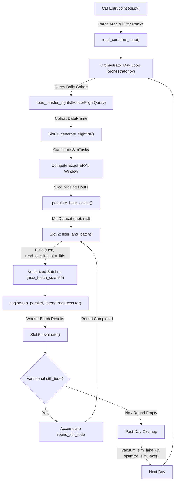
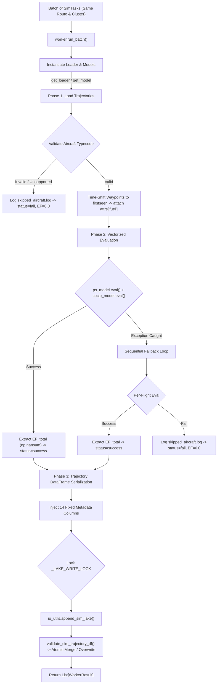

# Physics Simulation Pipeline (`src/core/physics`)

## 1. Title & Introduction

The `src/core/physics` module implements the high-performance, slotted contrail simulation engine for the Flight Physics Pipeline. Built on top of the [`pycontrails`](https://pycontrails.org/) framework (utilising standard `PSFlight` performance models and `Cocip` contrail evolution models), this module evaluates total energy forcing ($\text{EF}_{\text{total}}$ in Joules) and contrail persistence across historical commercial flights operating over Europe.

The engine features a **5-Slot architecture** cleanly decoupled from data access, model selection, and parallel execution orchestration:
1. **Slot 1 (Flight List Generation)**: Converts master flight cohorts into strongly typed `SimTask` items using calibrated cluster flight levels from `GLOBAL_CORRIDOR_MODEL_REGISTRY`.
2. **Slot 2 (Task Filtering, Mutation & Batching)**: Owns skip-gate filtering against Delta Lake execution history, step-down task generation for variational campaigns (`compute_stepdown_task`), and route-based batch chunking.
3. **Slot 3 (Trajectory Loading & Time-Shifting)**: Loads, validates (`is_supported_typecode`), and time-shifts representative corridor cluster trajectories to match target departure timestamps, attaching `attrs["fuel"]`.
4. **Slot 4 (Model Instantiation & Physics Evaluation)**: Dynamically instantiates PyContrails model pairs (`PSFlight` + `Cocip`) and executes vectorized batch evaluations with robust per-flight sequential fallbacks.
5. **Slot 5 (Batch Evaluation & Classification)**: Evaluates completed worker outcomes, classifies succeeded vs failed flights, and delegates to Slot 2 to create `still_todo` tasks for intra-day variational requeueing.

Concurrency is orchestrated via a **`ThreadPoolExecutor`** model dispatch architecture, enabling worker threads to concurrently access shared in-memory ERA5 `MetDataset` objects without duplicating multi-gigabyte weather arrays across process boundaries.

---

## 2. Module Structure

```text
src/core/physics/
├── README.md                      ← Module technical specification (this file)
├── __init__.py                    ← Package initialization
├── cli.py                         ← Main CLI entrypoint (parses args & invokes orchestrator)
├── orchestrator.py                ← Day-by-day loop coordinator, ERA5 cache manager & round re-batcher
├── engine.py                      ← Pure parallel execution layer (ThreadPoolExecutor dispatch)
├── worker.py                      ← Single batch execution worker (Slot 3+4 integration & Lake I/O)
├── clone_simulation.py            ← Legacy unslotted orchestrator (maintained for baseline comparison)
├── simulation.py                 ← Legacy unslotted orchestrator (maintained for baseline comparison)
├── loaders/                       ← Slot 3: Trajectory loading implementations
│   ├── __init__.py                ← Loader factory (`get_loader`)
│   └── cluster_loader.py          ← Slot 3a: K-Cluster trajectory loader & time-shifter
├── models/                        ← Slot 4: Physics model builders
│   ├── __init__.py                ← Model package initialization
│   └── ps_cocip.py                ← Kerosene & Hydrogen PSFlight + CoCiP model builder (`get_model`)
└── slots/                         ← Slotted pipeline step definitions
    ├── __init__.py                ← Slots package initialization
    ├── slot1_flightlist_gen.py    ← Slot 1: Flight list generation from master_flights slices
    ├── slot1_cohort_enum.py       ← Backward compatibility shim (re-exports slot1_flightlist_gen)
    ├── slot1_task_gen.py          ← Backward compatibility shim (re-exports slot1_flightlist_gen)
    ├── slot2_batcher.py           ← Slot 2: Skip-gate filtering, step-down task mutation & batching
    ├── slot5_evaluator.py         ← Slot 5: Batch evaluation & classification
    └── utils.py                   ← Backward compatibility shim (re-exports compute_stepdown_task)
```

---

## 3. Function Analysis Solution Tree (FAST)

```text
Module Objective: High-Performance, Thread-Safe Physics Simulation & Trajectory Persistence
│
├── 1. Command Line Parsing & Execution Dispatch
│   └── cli.main() / parse_args()
│       ├── Input: Sys argv flags (--start-date, --end-date, --sim-mode, --fuel, --low-mem, etc.)
│       ├── Output: argparse.Namespace
│       └── Safety/Fallback: Validates date ranges, filters corridors by rank via route_summary.parquet, exits on empty/invalid inputs.
│
├── 2. Day-by-Day Orchestration & Dynamic ERA5 Windowing
│   └── orchestrator.run()
│       ├── Input: Date range, corridors_map, lake_path, weather_cache_dir, execution flags.
│       ├── Output: None (writes directly to Delta Lake).
│       └── Safety/Fallback: Calculates exact ERA5 window from task min(firstseen) / max(lastseen) + max_age_hours; evicts stale ERA5 hours dynamically; re-batches step-down tasks at round boundaries.
│
├── 3. Slot 1: Flight List Generation
│   └── slot1_flightlist_gen.generate_flightlist()
│       ├── Input: Cohort DataFrame (master_flights slice), corridors_map (from data_manager.read_corridors_map).
│       ├── Output: List[SimTask]
│       └── Safety/Fallback: Pure transform; skips flights without available route clusters; checks cluster.fl validity (hard skip on missing/invalid FL); generates unique SimTask per (flight x cluster).
│
├── 4. Slot 2: Task Filtering, Mutation & Batching
│   ├── slot2_batcher.filter_and_batch()
│   │   ├── Input: Candidate List[SimTask], sim_mode, lake_path, overwrite flag, max_batch_size.
│   │   ├── Output: List[List[SimTask]] (partitioned execution batches).
│   │   └── Safety/Fallback: Bulk-queries read_existing_sim_fids(); skips already-simulated tasks; groups by (dep, arr, cluster_id); chunks into full max_batch_size sub-batches.
│   └── slot2_batcher.compute_stepdown_task()
│       ├── Input: task (SimTask), ef (float), step_size (float), min_safe_fl (float).
│       ├── Output: Optional[SimTask]
│       └── Safety/Fallback: Returns None if ef <= 0 (suppressed) or next_fl < min_safe_fl (floor reached); otherwise returns dataclasses.replace(task, fl=next_fl).
│
├── 5. Slot 3: Trajectory Loading & Time-Shifting
│   └── loaders.cluster_loader.load() (via get_loader(sim_mode, fuel, cap_altitude))
│       ├── Input: SimTask, corridors_map, use_hydrogen, cap_altitude.
│       ├── Output: Optional[pycontrails.Flight]
│       └── Safety/Fallback: Validates aircraft typecode via is_supported_typecode(); shifts timestamps relative to task.firstseen; attaches flight.attrs['fuel']; returns None on missing files or invalid typecodes.
│
├── 6. Slot 4: Physics Model Instantiation & Evaluation
│   └── models.ps_cocip.get_model() / worker.run_batch()
│       ├── Input: model_config_id, MetDataset (met), MetDataset (rad), max_age_hours, low_mem, fuel.
│       ├── Output: Tuple[PSFlight, Cocip] / List[WorkerResult]
│       └── Safety/Fallback: Runs vectorized ps_model.eval() + cocip_model.eval(); on vector exception, executes sequential per-flight fallback; logs unrecoverable failures to skipped_aircraft.log.
│
├── 7. Parallel Execution Coordination
│   └── engine.run_parallel()
│       ├── Input: List[List[SimTask]], worker_fn (partial run_batch), max_workers.
│       ├── Output: Iterator[List[WorkerResult]]
│       └── Safety/Fallback: Spawns ThreadPoolExecutor; catches batch exceptions and yields empty lists; calls gc.collect() after each batch completion.
│
├── 8. Slot 5: Batch Result Evaluation
│   └── slots.slot5_evaluator.evaluate()
│       ├── Input: List[WorkerResult], task_by_fid, sim_mode, step_size, min_safe_fl.
│       ├── Output: EvalResult (succeeded, failed, still_todo).
│       └── Safety/Fallback: Partitions succeeded vs failed; for variational mode, calls slot2_batcher.compute_stepdown_task() to populate still_todo.
│
└── 9. Trajectory Persistence & Post-Day Lake Optimization
    ├── worker._write_to_lake()
    │   ├── Input: List[Tuple[SimTask, Flight]], model_config_id, fuel, lake_path, overwrite.
    │   ├── Output: Delta Lake storage update.
    │   └── Safety/Fallback: Serializes 14 fixed metadata columns + 68 dynamic physics columns; guarded by thread lock (_LAKE_WRITE_LOCK); delegates to io_utils.append_sim_lake().
    └── orchestrator post-day cleanup
        └── io_utils.vacuum_sim_lake() & io_utils.optimize_sim_lake()
            └── Multi-dimensional Z-ordering on ['dep_date', 'route', 'EF_total'] after daily runs.
```

---

## 4. Data Workflow

### 4.1 Workflow A — Daily Orchestrator Loop (`cli.py` + `orchestrator.py`)


```mermaid
flowchart TD
    A["CLI Entrypoint (cli.py)"] -->|"Parse Args & Filter Ranks"| B["read_corridors_map()"]
    B --> C["Orchestrator Day Loop (orchestrator.py)"]
    C -->|"Query Daily Cohort"| D["read_master_flights(MasterFlightQuery)"]
    D -->|"Cohort DataFrame"| E["Slot 1: generate_flightlist()"]
    E -->|"Candidate SimTasks"| F["Compute Exact ERA5 Window"]
    F -->|"Slice Missing Hours"| G["_populate_hour_cache()"]
    G -->|"MetDataset (met, rad)"| H["Slot 2: filter_and_batch()"]
    H -->|"Bulk Query read_existing_sim_fids"| I["Vectorized Batches (max_batch_size=50)"]
    I --> J["engine.run_parallel(ThreadPoolExecutor)"]
    J -->|"Worker Batch Results"| K["Slot 5: evaluate()"]
    K --> L{"Variational still_todo?"}
    L -->|"Yes"| M["Accumulate round_still_todo"]
    M -->|"Round Completed"| H
    L -->|"No / Round Empty"| N["Post-Day Cleanup"]
    N -->|"vacuum_sim_lake() & optimize_sim_lake()"| O["Next Day"]
    O --> C
```

#### Step-by-Step Description:

1. **CLI Initialization**: `cli.py` parses command-line flags (date range, corridor ranks, worker count, fuel, simulation mode, memory flags). `read_corridors_map()` loads `(route_id, cluster_id)` corridor metadata and calibrated FLs from `GLOBAL_CORRIDOR_MODEL_REGISTRY`, filtered by `route_summary.parquet` if ranks are specified.
2. **Daily Cohort Ingestion**: For each calendar day in `--start-date` to `--end-date`, `orchestrator.run()` queries `master_flights.parquet` via `read_master_flights()` for flights departing between `00:00:00` and `23:59:59` UTC.
3. **Flight List Generation (Slot 1)**: `generate_flightlist()` converts cohort rows into `SimTask` dataclass items by matching route codes against available cluster trajectories in `corridors_map`.
4. **Dynamic ERA5 Windowing**: The orchestrator inspects all generated tasks for the day and calculates hourly bounds:
   $$\text{era5\_start} = \lfloor \min(\text{task.firstseen}) \rfloor - 1\text{h}$$
   $$\text{era5\_end} = \lceil \max(\text{task.lastseen}) \rceil + \text{max\_age\_hours} + 1\text{h}$$
   Stale hours before `era5_start` are evicted from `hour_cache`, missing hours are opened concurrently, and concatenated into daily `met` and `rad` datasets.
5. **Bulk Skip-Gate & Batch Packing (Slot 2)**: In standard mode, `filter_and_batch()` calls `read_existing_sim_fids()` to retrieve all simulated `SIM_FID`s for the day in a single PyArrow scan. Unsimulated tasks are grouped by `(dep, arr, cluster_id)` and packed into full batches of `max_batch_size` (default 50). In variational mode, `read_ef_by_base_key()` retrieves prior FLs and Energy Forcing values.
6. **Parallel Dispatch**: The orchestrator invokes `engine.run_parallel()`, passing batches to a `ThreadPoolExecutor` running `worker.run_batch()`.
7. **Batch Evaluation (Slot 5) & Round-Boundary Re-Batching**: As workers complete, `evaluate()` classifies outcomes into `succeeded` and `failed`. In variational mode, flights with positive warming ($\text{EF}_{\text{total}} > 0$) call `slot2_batcher.compute_stepdown_task()` to populate `still_todo`. The orchestrator accumulates all `still_todo` tasks across the round and re-batches them via Slot 2 at the round boundary into full vectorized batches.
8. **Post-Day Vacuum & Z-Order Optimization**: After all batches and step-downs for the day finish, `vacuum_sim_lake()` prunes stale parquet files and `optimize_sim_lake()` compacts files and applies multi-dimensional Z-ordering on `['dep_date', 'route', 'EF_total']`.

---

### 4.2 Workflow B — Single Batch Worker (`worker.py`)


```mermaid
flowchart TD
    A["Batch of SimTasks (Same Route & Cluster)"] --> B["worker.run_batch()"]
    B --> C["Instantiate Loader & Models"]
    C -->|"get_loader / get_model"| D["Phase 1: Load Trajectories"]
    D --> E{"Validate Aircraft Typecode"}
    E -->|"Invalid / Unsupported"| F["Log skipped_aircraft.log -> status=fail, EF=0.0"]
    E -->|"Valid"| G["Time-Shift Waypoints to firstseen -> attach attrs['fuel']"]
    G --> H["Phase 2: Vectorized Evaluation"]
    H --> I{"ps_model.eval() + cocip_model.eval()"}
    I -->|"Success"| J["Extract EF_total (np.nansum) -> status=success"]
    I -->|"Exception Caught"| K["Sequential Fallback Loop"]
    K --> L{"Per-Flight Eval"}
    L -->|"Success"| M["Extract EF_total -> status=success"]
    L -->|"Fail"| N["Log skipped_aircraft.log -> status=fail, EF=0.0"]
    J & M --> O["Phase 3: Trajectory DataFrame Serialization"]
    O --> P["Inject 14 Fixed Metadata Columns"]
    P --> Q{"Lock _LAKE_WRITE_LOCK"}
    Q --> R["io_utils.append_sim_lake()"]
    R --> S["validate_sim_trajectory_df() -> Atomic Merge / Overwrite"]
    S --> T["Return List[WorkerResult]"]
```

#### Step-by-Step Description:

1. **Worker Setup**: `worker.run_batch()` receives a batch of `SimTask` items (sharing the same `dep`, `arr`, and `cluster_id`), the day's `met` and `rad` datasets, and configuration flags. It retrieves the configured trajectory loader (`get_loader`) and physics models (`get_model`).
2. **Phase 1 (Trajectory Loading & Time-Shifting)**:
   - For each task, `cluster_loader.load()` fetches the cluster parquet file from `corridors_map`.
   - Validates `task.typecode` using `is_supported_typecode()`. If invalid or unsupported, logs to `data/logs/skipped_aircraft.log` and returns `None`.
   - Shifts all waypoints so waypoint[0] matches `task.firstseen`.
   - Instantiates a `pycontrails.Flight` object, attaches `flight.attrs["fuel"] = "hydrogen"` or `"kerosene"`, and assigns fuel-specific properties.
3. **Phase 2 (Physics Evaluation & Fallback)**:
   - **Vectorized Evaluation**: All loaded `Flight` objects are evaluated in a single vector call: `ps_model.eval(flights_list)` and `cocip_model.eval(source=fl_ps)`. Total Energy Forcing ($\text{EF}_{\text{total}} = \sum \text{ef}$ in Joules) is computed via `_extract_ef()`.
   - **Sequential Fallback**: If vectorized evaluation raises an exception, the worker falls back to sequential single-flight evaluation. Any flight that fails sequential simulation logs to `skipped_aircraft.log` and is marked `status="fail", ef=0.0`.
4. **Phase 3 (Full Trajectory Delta Lake Persistence)**:
   - For all successful flights, the worker extracts the full per-waypoint DataFrame (`flight.to_dataframe()`) preserving all 68+ dynamic physics columns.
   - Injects the **14 mandatory fixed metadata columns** (`SIM_FID`, `model_config_id`, `fuel`, `route`, `icao24`, `callsign`, `typecode`, `cluster_id`, `FL`, `dep_date`, `firstseen`, `lastseen`, `EF_total`, `total_fuel_burn`).
   - Acquires `_LAKE_WRITE_LOCK` and calls `io_utils.append_sim_lake()`.
   - `validate_sim_trajectory_df()` enforces schema compliance before committing an atomic MERGE on `(SIM_FID, model_config_id, time)` or clean delete-then-append.
   - Returns `List[WorkerResult]` to the engine.

---

### 4.3 Optimization & Memory Modes

| Feature / Behavior | Standard Mode (`--low-mem` omitted) | Low-Memory Mode (`--low-mem` enabled) |
|---|---|---|
| **ERA5 Spatial Crop** | Cropped to `EUR_BBOX` ($[-26^\circ, 30^\circ, 44^\circ, 79^\circ]$) $+ 10^\circ$ padding via `crop_met_dataset()`. | **Skipped entirely**. Dask slices touched chunks lazily without spatial crop overhead. |
| **ERA5 In-Memory Load** | Executes eager `.load()` call to pull cropped array into uncompressed RAM. | **Skipped eager load**. Data remains in lazy Dask / NetCDF arrays. |
| **CoCiP Preprocessing** | Standard PyContrails array processing. | Enables `preprocess_lowmem=True` parameter inside `Cocip` model initialization. |
| **Primary Advantage** | Fastest execution speed per batch; optimal for high-CPU nodes with ample RAM ($\ge 32\text{ GB}$). | **Minimizes peak RAM footprint**; prevents OOM crashes on memory-constrained workers. |

---

## 5. CLI Usage Guide

### 5.1 Bash Syntax

```bash
# Standard Simulation run for January 2025 across ranks 1 to 5 (Kerosene)
python -m src.core.physics.cli \
    --start-date 2025-01-01 \
    --end-date 2025-01-31 \
    --lower-rank 1 \
    --upper-rank 5 \
    --sim-mode standard \
    --fuel kerosene \
    --model-config-id kerosene \
    --max-workers 4 \
    --batch-size 50 \
    --out-dir data/results/corridor_simulations

# Variational Step-Down Campaign (Hydrogen) with Low-Memory mode
python -m src.core.physics.cli \
    --start-date 2025-01-01 \
    --end-date 2025-01-07 \
    --ranks 1,3,5 \
    --sim-mode variational \
    --fuel hydrogen \
    --model-config-id kerosene \
    --step-size 10.0 \
    --min-safe-fl 190.0 \
    --out-dir data/results/corridor_simulations \
    --low-mem \
    --max-age 1
```

### 5.2 PowerShell Syntax

```powershell
# Standard Simulation run for January 2025 across ranks 1 to 5 (Kerosene)
python -m src.core.physics.cli `
    --start-date 2025-01-01 `
    --end-date 2025-01-31 `
    --lower-rank 1 `
    --upper-rank 5 `
    --sim-mode standard `
    --fuel kerosene `
    --model-config-id kerosene `
    --max-workers 4 `
    --batch-size 50 `
    --out-dir data/results/corridor_simulations

# Variational Step-Down Campaign (Hydrogen) with Low-Memory mode
python -m src.core.physics.cli `
    --start-date 2025-01-01 `
    --end-date 2025-01-07 `
    --ranks "1,3,5" `
    --sim-mode variational `
    --fuel hydrogen `
    --model-config-id kerosene `
    --step-size 10.0 `
    --min-safe-fl 190.0 `
    --out-dir data/results/corridor_simulations `
    --low-mem `
    --max-age 1
```

### 5.3 Parameter Reference Table

| Parameter | Type | Default | Description |
|---|---|---|---|
| `--start-date` | `str` | *Required* | First calendar day to process (inclusive, format `YYYY-MM-DD`). |
| `--end-date` | `str` | *Required* | Last calendar day to process (inclusive, format `YYYY-MM-DD`). |
| `--sim-mode` | `str` | `'standard'` | Simulation mode: `'standard'` (nominal FL baseline) or `'variational'` (step-down optimization pass). |
| `--fuel` | `str` | `'kerosene'` | Fuel type: `'kerosene'` or `'hydrogen'`. Attaches `Flight(fuel=...)` in Slot 3 and sets `fuel` column. |
| `--model-config-id` | `str` | `'kerosene'` | Model configuration identifier passed to physics engine and composite merge key. |
| `--ranks` | `str` | `None` | Comma-separated list of route cluster ranks to process (e.g. `'1,3,5'`). Mutually exclusive with `--lower-rank`. |
| `--lower-rank` | `int` | `None` | Lower bound of corridor cluster rank (inclusive). Requires `--upper-rank`. |
| `--upper-rank` | `int` | `None` | Upper bound of corridor cluster rank (inclusive). Requires `--lower-rank`. |
| `--out-dir` | `str` | *Required* | Root directory path for Delta Lake simulation storage (e.g. `data/results/corridor_simulations`). |
| `--weather-cache` | `str` | `data/weather` | Directory containing hourly ERA5 pressure-level and surface `.nc` cache files. |
| `--corridors-dir` | `str` | `data/corridor_paths` | Directory containing cluster parquet trajectory files. |
| `--max-age`, `--age` | `int` | `48` | Maximum contrail segment age in hours passed to CoCiP. |
| `--step-size` | `float` | `10.0` | FL decrement step size in FL units (default `10.0` = 1,000 ft, used in variational mode). |
| `--min-safe-fl` | `float` | `190.0` | Minimum safe flight level in FL units below which step-down halts (`MIN_SAFE_FL`). |
| `--clusters-per-flight`, `-x` | `int` | `1` | Number of representative cluster trajectories sampled per flight. |
| `--min-distance` | `float` | `0.0` | Pre-filter minimum route distance in kilometers; shorter routes are skipped. |
| `--cap-altitude` | `flag` | `False` | Apply FL altitude ceiling cap to trajectory waypoints in Slot 3. |
| `--max-workers` | `int` | `4` | Number of concurrent worker threads in `ThreadPoolExecutor`. |
| `--batch-size` | `int` | `50` | Maximum number of flight tasks per parallel execution batch. |
| `--low-mem` | `flag` | `False` | Enables lazy ERA5 loading, skips spatial cropping and eager `.load()`. |
| `--overwrite` | `flag` | `False` | Bypass Delta Lake skip-gate and delete-then-append fresh results. |
| `--test-mode` | `flag` | `False` | Restricts run to single day (`2025-01-01`) and single cluster per flight. |

---

## 6. Prerequisites & Dependencies

### Python Package Dependencies
- **`pycontrails`**: Contrails and flight performance modeling framework (`PSFlight`, `Cocip`, `MetDataset`, `Flight`, `Fleet`).
- **`deltalake`**: Native Rust bindings for Delta Lake transactional reads, writes, merges, deletes, compact, and Z-ordering.
- **`xarray` / `dask` / `netCDF4`**: Multi-dimensional meteorological data indexing and lazy array streaming.
- **`pyarrow`**: Parquet serialization and dataset predicate pushdown engine.
- **`pandas` / `numpy`**: Vectorized numerical data manipulation.

### Pipeline Config & Registries Referenced
- **`src.common.config`**:
  - `BASE_DIR`
  - `WEATHER_DIR` (`data/weather`)
  - `CORRIDOR_SIMULATIONS_DIR` (`data/results/corridor_simulations`)
  - `CORRIDOR_PATHS_DIR` (`data/corridor_paths`)
  - `GLOBAL_CORRIDOR_MODEL_REGISTRY` (`data/registries/global_corridor_model_registry.parquet`)
  - `ROUTE_SUMMARY_PARQUET` (`data/databases/master_flights/master_flights_route_summary.parquet`)
  - `EUR_BBOX` ($[-26, 30, 44, 79]$)
  - `MIN_SAFE_FL` (`190.0`)
  - `is_supported_typecode()` / `UNSUPPORTED_TYPECODE_FLAG`
- **Logging Destination**: Written to `data/logs/simulation.log` via `setup_file_logger("simulation.log")`. Skipped or unsupported airframes are appended to `data/logs/skipped_aircraft.log`.