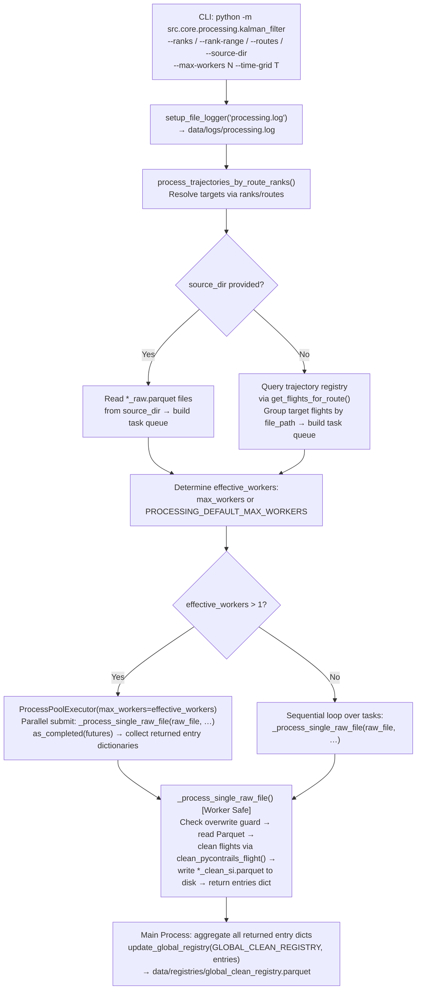
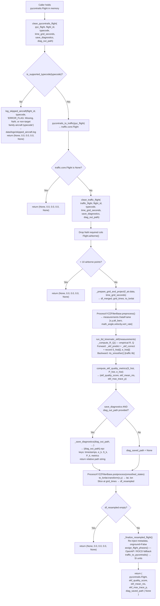

# Trajectory Processing & EKF Smoothing Module

This module is **Step 2.1** of the Flight Physics Pipeline. It consumes raw, noisy ADS-B
trajectories produced by the fetching stage, applies a **6-Dimensional Kinematic Extended
Kalman Filter (EKF)** derived from the `traffic` library's mathematics, resamples every
flight to a uniform equidistant time grid (defaulting to `CORRIDOR_TIME_GRID_SECONDS = 60 s` but configurable via CLI/API), assigns
OpenAP aerodynamic flight phases, and writes clean SI Parquet trajectories — optionally
augmented with per-step EKF diagnostic tensors — to the `clean/` corridor subdirectory.
It also exposes two **programmatic in-process entry points** (`clean_traffic_flight` and
`clean_pycontrails_flight`) so that other pipeline stages can invoke the filter without
ever touching the filesystem.

> [!IMPORTANT]
> **Input Expectation**: The EKF engine is calibrated for **raw, high-frequency, noisy
> ADS-B trajectories**. Do not feed it synthesised or centroid paths.

> [!IMPORTANT]
> **Rule 11 — Strict Typecode Validation**: Every entry point that accepts a `typecode`
> argument calls `is_supported_typecode(typecode)` from `src.common.config` before any
> processing begins. Records with missing (`None`, `NaN`), empty, or unsupported typecodes
> are **silently dropped and logged** to `data/logs/skipped_aircraft.log` via
> `log_skipped_aircraft()`. No default typecode is ever injected.

---

## 2. Module Structure

```text
src/core/processing/
├── README.md                          # This documentation file
├── kalman_filter.py                   # 6D Kinematic EKF filtering, grid resampling,
│                                      #   phase assignment & registry update engine
└── TRAFFIC_LIBRARY_EKF_ANALYSIS.md   # Advanced mathematical reference for the EKF
```

---

## 3. Function Analysis Solution Tree (FAST)

```text
Module Objective
 └── Apply 6D Kinematic EKF smoothing, resample to uniform grid (default 60 s), assign aerodynamic phases,
     write clean SI Parquet trajectories, and optionally export diagnostic tensors.
      │
      ├── Sub-objective 1 — Typecode validation & early rejection
      │    ├── Input : typecode string (from Parquet attrs or caller)
      │    ├── Solution : is_supported_typecode(typecode)  [src.common.config]
      │    │              → returns False for None/NaN/empty/out-of-family
      │    ├── On reject : log_skipped_aircraft(fid, typecode, "ERROR_FLAG: …")
      │    │               → appends to data/logs/skipped_aircraft.log
      │    └── Output : bool guard; processing proceeds only on True
      │
      ├── Sub-objective 2 — Airborne segmentation & uniform grid injection
      │    ├── Input : traffic.core.Flight in aviation units (ft, kt, ft/min)
      │    ├── Solution : Flight.airborne() → drop < 10 points
      │    │   _prepare_grid_and_project():
      │    │     • Build uniform DatetimeIndex at time_grid_seconds spacing (default CORRIDOR_TIME_GRID_SECONDS)
      │    │     • Merge raw + grid timestamps; deduplicate; sort
      │    │     • _fill_geodetic_gaps(): great-circle lat/lon interpolation (WGS84 Geod)
      │    │       for ADS-B gaps > GEODESIC_DISTANCE_THRESHOLD_M (100 000 m)
      │    │     • Time-interpolate all columns; ffill/bfill boundary rows
      │    │     • LAEA Cartesian projection centred on flight mean lat/lon
      │    │       (+proj=laea via pyproj; yields (x, y) in metres)
      │    └── Output : df_merged (DatetimeIndex), grid_times, to_lonlat Transformer
      │
      ├── Sub-objective 3 — EKF state preprocessing
      │    ├── Input : df_merged with columns [x, y, alt_baro, math_angle, velocity, vert_rate]
      │    ├── Solution : ProcessXYZZFilterBase.preprocess()  [traffic library]
      │    │              Scales aviation-unit columns to EKF internal representation;
      │    │              state vector order: [x, y, alt_baro, math_angle, velocity, vert_rate]
      │    └── Output : measurements pd.DataFrame (DatetimeIndex)
      │
      ├── Sub-objective 4 — 6D Kinematic EKF forward pass + diagnostic recording
      │    ├── Input : measurements DataFrame
      │    ├── Solution : run_6d_kinematic_ekf()
      │    │   _compute_R_Q() : empirical rolling-window noise matrices
      │    │     (verbatim copy of traffic EKF.apply() lines 246-326)
      │    │   Forward loop [verbatim traffic.algorithms.filters.ekf.extended_kalman_filter
      │    │                  lines 40-73, + 2 extra diagnostic recording lines]:
      │    │     _ekf_predict() : F = EKF.jacobian_state_transition(x, dt)
      │    │                      x_pred = EKF.state_transition_function(x, dt)
      │    │                      P_pred = F @ P @ F.T + Q
      │    │     _ekf_correct() : nu = measurement − x_pred  (innovation)
      │    │                      S  = H @ P_pred @ H.T + R  (innovation covariance)
      │    │                      σ-gate: |ν_j| > reject_sigma · √S_jj
      │    │                        → zero H_jj, replace measurement_j with x_pred_j
      │    │                      K = solve(S, H @ P_pred).T  (Kalman gain)
      │    │                      x_u = x_pred + K @ nu
      │    │                      P_u = (I − K @ H) @ P_pred
      │    │                      + record S_hist[i] = S   ← diagnostic line 1
      │    │                      + record e_hist[i] = nu  ← diagnostic line 2
      │    └── Output : states (T,6), covariances P_hist (T,6,6),
      │                 S_hist (T,6,6), e_hist (T,6)
      │
      ├── Sub-objective 5 — RTS backward smoother
      │    ├── Input : states_df, covariances P_hist, Q, timestamps,
      │    │           EKF.jacobian_state_transition, EKF.state_transition_function
      │    ├── Solution : rts_smoother()  [traffic.algorithms.filters.ekf — no custom math]
      │    └── Output : smoothed_states pd.DataFrame (T,6)
      │
      ├── Sub-objective 6 — EKF quality metrics
      │    ├── Input : S_hist (T,6,6), P_hist (T,6,6), e_hist (T,6)
      │    ├── Solution : compute_ekf_quality_metrics()
      │    │     mean_NIS  = Σ (e_i^T S_i^{-1} e_i) / valid_steps
      │    │     NIS factor  = 6 / max(6, mean_NIS)
      │    │     trace factor = exp(−max(0, max_trace_P − 60) / 500)
      │    │     quality_score = clip(NIS_factor × trace_factor, 0, 1)
      │    └── Output : (ekf_quality_score, ekf_mean_nis, ekf_max_trace_p)
      │
      ├── Sub-objective 7 — Optional diagnostic tensor export
      │    ├── Input : measurements, e_hist, S_hist, P_hist, metrics
      │    ├── Solution : _save_diagnostics() → np.savez_compressed()
      │    │     File : {out_dir}/diagnostics/{flight_id}_ekf_diag.npz
      │    │     Keys : timestamps (T,), e_k (T,6), S_k (T,6,6),
      │    │             P_k (T,6,6), metrics (3,)
      │    └── Output : relative path string (vs BASE_DIR) written to registry
      │
      ├── Sub-objective 8 — Postprocessing & grid resampling
      │    ├── Input : smoothed_states, df_merged, to_lonlat Transformer, grid_times
      │    ├── Solution : ProcessXYZZFilterBase.postprocess(smoothed_states)
      │    │   → back-converts EKF state to aviation units (alt_ft, gs_kts, vr_fpm)
      │    │   to_lonlat.transform(x, y) → (longitude, latitude) in WGS84
      │    │   df_out sliced at grid_times → df_resampled
      │    └── Output : df_resampled (exact grid points only, default 60 s spacing)
      │
      ├── Sub-objective 9 — Flight phase assignment
      │    ├── Input : df_resampled in aviation units (altitude ft, groundspeed kts,
      │    │           vertical_rate ft/min)
      │    ├── Solution : assign_flight_phases()
      │    │   Primary : openap.phase.FlightPhase.set_trajectory() + .phaselabel()
      │    │   Fallback (OpenAP unavailable): ROCD threshold
      │    │     > 500 ft/min → "CL", < −500 ft/min → "DE", else → "CR"
      │    │   Writes both "flight_phase" and "phase" columns
      │    └── Output : df_phased with phase labels
      │
      ├── Sub-objective 10 — Metadata re-injection & pycontrails conversion
      │    ├── Input : df_phased, f_air.data (original airborne segment), flight_id, typecode
      │    ├── Solution : _finalize_resampled_flight()
      │    │   Re-injects icao24, callsign, typecode, airports, firstseen, lastseen
      │    │   Sets onground = False
      │    │   traffic_to_pycontrails(df_phased, typecode=typecode)
      │    └── Output : pycontrails.Flight object in SI units
      │
      └── Sub-objective 11 — Batch orchestration & registry update
           ├── Input : raw *_raw.parquet files resolved via registry, time_grid_seconds
           ├── Solution : process_trajectories_by_route_ranks()
           │   get_flights_for_route() / extract_target_routes() → query registry for files
           │   _process_single_raw_file() per unique registered Parquet file
           │     parquet_to_pycontrails() → dict[flight_id → pycontrails.Flight]
           │     clean_pycontrails_flight() per flight (includes Rule 11 check)
           │     write_flights_to_parquet() → *_clean_si.parquet
           │   update_global_registry(GLOBAL_CLEAN_REGISTRY, entries)
           └── Output : *_clean_si.parquet + GLOBAL_CLEAN_REGISTRY updated
```

---

## 4. Data Workflow

### 4.1 Workflow A — Batch File Processing (`kalman_filter.py` CLI)

This is the primary batch execution path. It is invoked from the command line to process
all raw Parquet files for one or more corridor directories across multiple CPU cores,
writing clean SI Parquet files and updating `GLOBAL_CLEAN_REGISTRY` in the main process.



**Step-by-step:**

1. **Logger setup**: `main()` immediately calls `setup_file_logger("processing.log")`, directing all `logging` output to `data/logs/processing.log`. `logging.basicConfig()` is never called.
2. **Corridor resolution & task queue construction**: If `--source-dir` is provided, the pipeline collects all matching `*_raw.parquet` files into a task queue. Otherwise, it queries the trajectory registry using `get_flights_for_route(dep, arr)` for target corridors resolved by `--routes` or `--ranks`/`--rank-range`, grouping flights by raw `file_path`.
3. **Parallel Execution via `ProcessPoolExecutor`**: If `max_workers` is greater than `1` (or defaults to `PROCESSING_DEFAULT_MAX_WORKERS` from `src.common.config`), the task queue is dispatched across multiple independent worker processes using `concurrent.futures.ProcessPoolExecutor`. Each child process executes `_process_single_raw_file()` independently. If `max_workers == 1`, execution falls back to a clean sequential loop.
4. **Overwrite guard & Ingestion (in worker)**: Each worker checks whether `*_clean_si.parquet` already exists and skips reading if `--overwrite` is not set. Otherwise, `parquet_to_pycontrails(raw_file)` loads all flights in the file.
5. **Rule 11 typecode gate**: `is_supported_typecode(t_code)` is called for every flight inside the worker. Missing, `NaN`, or out-of-family typecodes trigger `log_skipped_aircraft()` to `data/logs/skipped_aircraft.log` and are skipped immediately.
7. **Pycontrails → traffic conversion**: `clean_pycontrails_flight()` first calls `is_supported_typecode()` again (its own Rule 11 guard), then delegates to `pycontrails_to_traffic()` to produce a `traffic.core.Flight` in aviation units (`ft`, `kt`, `ft/min`).
8. **Airborne segmentation**: `Flight.airborne()` removes ground-level ADS-B pings. If fewer than 10 airborne points remain, the flight returns `(None, 0.0, 0.0, 0.0, None)` and is skipped.
9. **Grid injection & LAEA projection** (`_prepare_grid_and_project()`):
   - A uniform `DatetimeIndex` is built at `time_grid_seconds` spacing (defaulting to `CORRIDOR_TIME_GRID_SECONDS = 60` s), from `floor(t_min)` to `ceil(t_max)`.
   - Grid timestamps are concatenated with the raw flight rows, deduplicated, and sorted.
   - `_fill_geodetic_gaps()` walks consecutive raw-measurement pairs. For gaps exceeding `GEODESIC_DISTANCE_THRESHOLD_M = 100 000 m` (great-circle distance on WGS84 ellipsoid via `pyproj.Geod`), it interpolates intermediate grid-injected rows along a geodesic path using `Geod.npts()`.
   - All measurement columns (`latitude`, `longitude`, `altitude`, `groundspeed`, `track`, `vertical_rate`) are time-interpolated using `pandas.DataFrame.interpolate(method="time")`, followed by `ffill()`/`bfill()` for boundary rows.
   - A per-flight LAEA Cartesian projection (`+proj=laea`) is constructed centred on the flight's mean latitude and longitude. All rows are transformed from WGS84 `(lon, lat)` to LAEA `(x, y)` in metres. The inverse `to_lonlat` `Transformer` is retained for the postprocessing step.
10. **EKF preprocessing**: `ProcessXYZZFilterBase.preprocess()` (traffic library) converts the merged DataFrame (set as a `DatetimeIndex`) into the EKF state representation. The state vector is **[x, y, alt_baro, math_angle, velocity, vert_rate]** — 6 dimensions.
11. **Noise matrix estimation** (`_compute_R_Q()`): This is a verbatim copy of `traffic.algorithms.filters.ekf.EKF.apply()` lines 246–326. It computes empirical measurement noise `R` and process noise `Q` matrices using a rolling window (`window_size=17`) over each state dimension. `Q = diag([0.1, 0.1, 0.01, 0.3, 1.0, 0.5]) × R`.
12. **Forward EKF loop** (`run_6d_kinematic_ekf()`): Iterates from step `i=1` to `T−1`. At each step:
    - **Predict**: `_ekf_predict()` — verbatim copy of traffic EKF lines 40–45. Computes Jacobian `F`, propagates state `x_pred = EKF.state_transition_function(x, dt)`, and advances covariance `P_pred = F @ P @ F.T + Q`.
    - **Correct**: `_ekf_correct()` — verbatim copy of traffic EKF lines 47–73, **plus two extra diagnostic recording lines**. Computes innovation `v = measurement − x_pred` and innovation covariance `S = H @ P_pred @ H.T + R`. A sigma-gate (default `reject_sigma=3.0`) tests each component: if `|v_j| > 3 * sqrt(S_jj)`, that component is gated out by setting `H_jj = 0` and replacing `measurement_j` with `x_pred_j`. After gating, `S` is recomputed, the Kalman gain `K` is solved, and `x_u = x_pred + K @ v` (using the **pre-gate** innovation, per traffic verbatim logic). The **two added diagnostic lines** record `S_hist[i] = S` and `e_hist[i] = v.to_numpy()`.
13. **RTS backward smoother**: `rts_smoother(states_df, covariances, Q, timestamps, EKF.jacobian_state_transition, EKF.state_transition_function)` is called directly from the `traffic` library. No custom backward-pass math is implemented; this is a direct call to the upstream function.
14. **Quality metrics** (`compute_ekf_quality_metrics()`): Iterates over non-zero `e_hist` rows. For each valid step, the Normalised Innovation Squared (NIS) `= e_i^T * S_i^{-1} * e_i` is accumulated (capped at `1e5`). Final metrics: `mean_NIS`, `max_trace_P`, `ekf_quality_score = clip(NIS_factor * trace_factor, 0, 1)` where `NIS_factor = 6 / max(6, mean_NIS)` and `trace_factor = exp(-max(0, max_trace_P - 60) / 500)`.
15. **Diagnostic export** (optional, `--save-diagnostics`): `_save_diagnostics()` creates `{out_dir}/diagnostics/{flight_id}_ekf_diag.npz` using `np.savez_compressed()` with keys `timestamps (T,)`, `e_k (T,6)`, `S_k (T,6,6)`, `P_k (T,6,6)`, `metrics (3,)`. The relative path (vs `BASE_DIR`) is stored in the registry `diag_file_path` column. When `--save-diagnostics` is not set, `diag_file_path = None`.
16. **Postprocessing & grid resampling**: `ProcessXYZZFilterBase.postprocess(smoothed_states)` converts the smoothed EKF state back to aviation units. `to_lonlat.transform(x, y)` reprojects LAEA Cartesian back to WGS84 `(longitude, latitude)`. The full merged DataFrame is then sliced to only the rows whose timestamps are in `grid_times` (`df_out[df_out["timestamp"].isin(grid_times)]`), yielding an exactly equidistant trajectory of spacing `time_grid_seconds`.
17. **Phase assignment & metadata**: `_finalize_resampled_flight()` re-injects original flight metadata (`icao24`, `callsign`, `typecode`, airport codes, `firstseen`/`lastseen`), sets `onground = False`, calls `assign_flight_phases()` (OpenAP primary, ROCD fallback), and converts to a `pycontrails.Flight` in SI units via `traffic_to_pycontrails()`.
18. **Output write**: All successfully cleaned pycontrails flights from a single raw Parquet are collected and written together by `write_flights_to_parquet(pc_flights, out_path)` → `{out_dir}/*_clean_si.parquet`.
19. **Registry update**: `update_global_registry(GLOBAL_CLEAN_REGISTRY, all_entries)` appends all collected registry rows — `flight_id`, `file_path`, `ekf_quality_score`, `ekf_mean_nis`, `ekf_max_trace_p`, `diag_file_path` — to `data/registries/global_clean_registry.parquet` using an atomic deduplication-aware write.

---

### 4.2 Workflow B — Programmatic In-Process Entry (`clean_pycontrails_flight` / `clean_traffic_flight`)

This workflow exposes the EKF cleaning pipeline as a library call, suitable for use by the
fetcher, corridor orchestrator, or any other pipeline stage that already holds an in-memory
flight object without writing raw files to disk first.



**Step-by-step:**

1. **Entry via `clean_pycontrails_flight()`**: The caller passes a `pycontrails.Flight`, a `flight_id` string, and a `typecode` string. Two optional parameters control diagnostics: `save_diagnostics: bool` and `diag_out_path: Path | None`. The `time_grid_seconds` parameter defaults to `CORRIDOR_TIME_GRID_SECONDS` (60 s) but can be overridden programmatically.
2. **Rule 11 typecode validation**: `is_supported_typecode(typecode)` is called immediately. If it returns `False`, `log_skipped_aircraft(flight_id, str(typecode), "ERROR_FLAG: Missing, NaN, or non-target family aircraft typecode")` appends an audit line to `data/logs/skipped_aircraft.log`, and the function returns the 5-tuple `(None, 0.0, 0.0, 0.0, None)` without raising an exception.
3. **Format conversion**: `pycontrails_to_traffic(pyc_flight)` converts the `pycontrails.Flight` to a `traffic.core.Flight` in aviation units. If the conversion fails (returns `None`), the same null 5-tuple is returned.
4. **Delegation to `clean_traffic_flight()`**: The validated and converted flight is passed to `clean_traffic_flight()`. Note that `clean_traffic_flight()` itself performs **no** Rule 11 typecode check — the validation contract is that callers must validate before calling it. The docstring states this explicitly: *"Rule 11 typecode validation must be performed by the caller before this function."*
5. **Required column guard**: `clean_traffic_flight()` drops rows with `NaN` in any required column (`timestamp`, `latitude`, `longitude`, `track`, `groundspeed`, `vertical_rate`, `altitude`, `onground`). If fewer than 10 rows remain, returns null 5-tuple.
6. **Airborne segmentation**: `Flight(f_data).airborne()` removes ground pings. If the resulting airborne `Flight` is `None` or has fewer than 10 points, returns null 5-tuple.
7. **Grid injection & LAEA projection**: `_prepare_grid_and_project(f_air.data.copy(), time_grid_seconds)` — identical to the batch workflow (see Workflow A, step 9). Returns `df_merged`, `grid_times`, and the inverse `to_lonlat` `Transformer`.
8. **EKF preprocessing, forward pass, backward smoother, quality metrics**: Identical to steps 10–14 of Workflow A.
9. **Optional diagnostic save**: If both `save_diagnostics=True` and `diag_out_path` is not `None`, `_save_diagnostics()` is called to write `{diag_out_path}` (which must include the `{flight_id}_ekf_diag.npz` filename). The function creates parent directories as needed and returns a `BASE_DIR`-relative path string.
10. **Postprocessing & slicing**: Identical to step 16 of Workflow A. If `df_resampled` is empty after the grid slice, returns null 5-tuple.
11. **Finalisation & return**: `_finalize_resampled_flight()` re-injects metadata and assigns phases (identical to step 17 of Workflow A). The function returns the 5-tuple `(pycontrails.Flight, ekf_quality_score, ekf_mean_nis, ekf_max_trace_p, diag_saved_path | None)`. The caller is responsible for writing the output file and updating registries.

> [!NOTE]
> **Caller contract for `clean_traffic_flight()`**: If a module already holds a
> `traffic.core.Flight` in aviation units (e.g., the corridor orchestrator), it may call
> `clean_traffic_flight()` directly, **but must** have validated the typecode with
> `is_supported_typecode()` beforehand and must handle registry writes itself.

---

### 4.3 Multi-Process & External Dataflow Synchronization Contract

To ensure that `kalman_filter.py` can be seamlessly embedded within both standalone CLI invocations and external multi-process dataflows (such as custom corridor simulation orchestrators or batch campaign executors), all core workers strictly adhere to a decoupled memory and disk synchronization contract:

1. **Decoupled Worker Functions (`_process_single_raw_file`, `clean_pycontrails_flight`, `clean_traffic_flight`)**:
   - None of these functions open, modify, or lock `GLOBAL_CLEAN_REGISTRY` (`data/registries/global_clean_registry.parquet`).
   - `_process_single_raw_file()` writes individual `*_clean_si.parquet` files to the target directory and returns a clean Python list of metadata dictionaries (`list[dict[str, Any]]`) representing the processed flights.
2. **Safe Concurrent Execution (`ProcessPoolExecutor`)**:
   - Because workers do not touch global shared registries, `_process_single_raw_file()` can be safely scheduled across arbitrary parallel process pools (`concurrent.futures.ProcessPoolExecutor`).
3. **External Orchestrator Responsibilities**:
   - If an external pipeline or custom dataflow executes these functions across its own multi-process worker pool, that external orchestrator is strictly responsible for collecting all returned entry dictionaries from its futures and calling `update_global_registry(GLOBAL_CLEAN_REGISTRY, all_entries)` in its parent main process exactly once after the pool shuts down (or triggering a global clean registry rebuild).

---

## 5. CLI Usage Guide

### Bash

```bash
# Process specific corridor volume ranks across 8 parallel CPU cores
python -m src.core.processing.kalman_filter --ranks 1 2 3 --max-workers 8

# Process an inclusive range of volume ranks with diagnostic tensor export across all CPUs
python -m src.core.processing.kalman_filter --rank-range 1 10 --save-diagnostics --max-workers 4

# Process explicit corridor strings, custom source and output directories, force overwrite
python -m src.core.processing.kalman_filter \
    --routes EDDF-LIRF EGLL-BIKF \
    --source-dir "data/trajectories/rank_1_EDDF-LIRF/raw" \
    --out-dir "data/trajectories/rank_1_EDDF-LIRF/clean" \
    --save-diagnostics \
    --overwrite \
    --max-workers 6

# Process all corridors by rank, saving diagnostics for later EKF audit
python -m src.core.processing.kalman_filter --rank-range 1 50 --save-diagnostics

# Override the EKF time-grid resolution to 30 seconds for a specific route
python -m src.core.processing.kalman_filter --routes EDDF-LIRF --time-grid 30 --overwrite --workers 1
```

### PowerShell

```powershell
# Process specific corridor volume ranks across 8 parallel CPU cores
python -m src.core.processing.kalman_filter --ranks 1 2 3 --max-workers 8

# Process an inclusive range of volume ranks with diagnostic tensor export across all CPUs
python -m src.core.processing.kalman_filter --rank-range 1 10 --save-diagnostics --max-workers 4

# Process explicit corridor strings, custom source and output directories, force overwrite
python -m src.core.processing.kalman_filter `
    --routes EDDF-LIRF EGLL-BIKF `
    --source-dir "data\trajectories\rank_1_EDDF-LIRF\raw" `
    --out-dir "data\trajectories\rank_1_EDDF-LIRF\clean" `
    --save-diagnostics `
    --overwrite `
    --max-workers 6

# Process all corridors by rank range, saving diagnostics
python -m src.core.processing.kalman_filter --rank-range 1 50 --save-diagnostics

# Override the EKF time-grid resolution to 30 seconds for a specific route
python -m src.core.processing.kalman_filter --routes EDDF-LIRF --time-grid 30 --overwrite --workers 1
```

### Parameter Reference

| Option | Type | Default | Required | Description |
| :--- | :--- | :--- | :--- | :--- |
| `--ranks` | `int` (list) | `None` | No | One or more specific corridor volume rank indices to process (e.g. `1 2 3`). Looked up in `master_flights_route_summary.parquet`. |
| `--rank-range` | `int int` | `None` | No | Inclusive start–end rank range to process (e.g. `1 10`). Internally passed as `tuple(args.rank_range)`. |
| `--routes` | `str` (list) | `None` | No | One or more explicit corridor strings to process (e.g. `EDDF-LIRF EGLL-BIKF`). |
| `--source-dir` | `str` | `None` | No | Direct path to a directory of `*_raw.parquet` files. When provided, bypasses `extract_target_routes()` entirely. |
| `--out-dir` | `str` | `None` | No | Custom output directory for `*_clean_si.parquet` files. Defaults to sibling `clean/` directory relative to `raw/` when `source_dir` resolves a standard corridor layout. |
| `--save-diagnostics` | flag | `False` | No | When set, writes per-flight EKF tensors `S_k (T,6,6)`, `P_k (T,6,6)`, `e_k (T,6)`, and scalar `metrics (3,)` to `{out_dir}/diagnostics/{flight_id}_ekf_diag.npz` (compressed NumPy archive). |
| `--overwrite` | flag | `False` | No | When set, re-processes and overwrites any existing `*_clean_si.parquet` (and diagnostic `.npz`) files that would otherwise be skipped. |
| `--workers`, `--num-workers`, `--max-workers` | `int` | `None` | No | Maximum number of parallel `ProcessPoolExecutor` worker processes to spawn. Defaults to `PROCESSING_DEFAULT_MAX_WORKERS` from `src.common.config` (currently `4`). If set to `1`, execution falls back to sequential loop. |
| `--time-grid`, `--time-grid-seconds` | `int` | `CORRIDOR_TIME_GRID_SECONDS` / `60` | No | Uniform time grid spacing in seconds for EKF resampling. |

---

## 6. Prerequisites & Dependencies

### Python Libraries

| Library | Role |
| :--- | :--- |
| `pandas`, `pyarrow` | Parquet I/O, DataFrame time-series operations, DatetimeIndex interpolation |
| `numpy`, `numpy.typing` | Array arithmetic, diagnostic tensor construction (`S_hist`, `P_hist`, `e_hist`), `savez_compressed` |
| `scipy.linalg` | `linalg.solve(S, H @ P_pred, assume_a="pos")` for Kalman gain; `linalg.inv(S)` for NIS computation |
| `pyproj` (`CRS`, `Geod`, `Transformer`) | WGS84 geodesic distance (`Geod.inv`, `Geod.npts`) for gap detection and great-circle interpolation; per-flight LAEA Cartesian projection (`+proj=laea`) for state space; inverse reprojection back to WGS84 |
| `traffic` (`Flight`, `EKF`, `ProcessXYZZFilterBase`, `rts_smoother`) | EKF Jacobians (`EKF.jacobian_state_transition`, `EKF.state_transition_function`), state preprocessing / postprocessing (`ProcessXYZZFilterBase`), RTS backward smoother (`rts_smoother`) |
| `openap.phase.FlightPhase` | Primary aerodynamic flight phase labelling (`CL`, `CR`, `DE`, …); ROCD-threshold fallback if unavailable |
| `pycontrails` | `pycontrails.Flight` SI containers; consumed and produced by `clean_pycontrails_flight()` |

### Config Constants (`src.common.config`)

| Constant | Value / Type | Usage |
| :--- | :--- | :--- |
| `BASE_DIR` | `pathlib.Path` | Workspace root; used to construct all absolute paths and compute registry-relative path strings |
| `CORRIDOR_TIME_GRID_SECONDS` | `60` (int) | Default temporal resolution of the injected uniform time grid when no CLI or programmatic override is specified |
| `GLOBAL_CLEAN_REGISTRY` | `Path` → `data/registries/global_clean_registry.parquet` | Registry file updated by `update_global_registry()` after each batch run |
| `is_supported_typecode` | `Callable[[Any], bool]` | Rule 11 typecode validation: checks membership in `ALL_TARGET_FAMILIES` (A320neo, A320ceo, B737NG, B737MAX families) |

### Registry Files

| File | Access | Description |
| :--- | :--- | :--- |
| `data/registries/global_clean_registry.parquet` (`GLOBAL_CLEAN_REGISTRY`) | **Written** | Indexed output: one row per successfully cleaned flight, with `flight_id`, `file_path`, `ekf_quality_score`, `ekf_mean_nis`, `ekf_max_trace_p`, `diag_file_path`. |
| `data/databases/master_flights/master_flights_route_summary.parquet` | **Read** | Looked up by `extract_target_routes()` to map rank indices / corridor strings to raw trajectory directories. |
| `data/logs/processing.log` | **Written** | All `logging` output from batch runs (INFO progress, WARNING anomalies, ERROR per-flight failures). |
| `data/logs/skipped_aircraft.log` | **Appended** | Tab-separated audit entries (`ISO_UTC \t flight_id \t typecode \t REASON`) for every flight rejected by the Rule 11 typecode gate. |

For canonical naming conventions, coordinate reference system definitions, and unit
standards, refer to **[conventions.md](file:///g:/Meine%20Ablage/UNI/SS26/PythonPipeline%20-%20Kopie/src/conventions.md)**.
