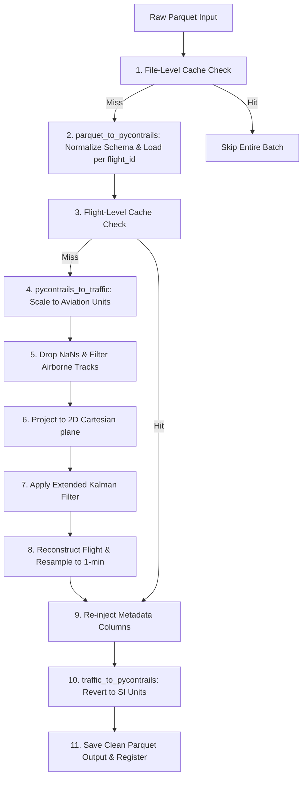

# Trajectory Processing & EKF Smoothing Module

This module represents the second step in the Flight Physics Pipeline. It is responsible for mathematically smoothing the raw ADS-B trajectories downloaded from OpenSky, dropping ground-level noise, applying an Extended Kalman Filter (EKF), and resampling coordinates to a 1-minute frequency optimal for PyContrails.

> [!IMPORTANT]
> **Input Expectation**: The EKF smoothing engine is explicitly designed and calibrated to be invoked on **raw, noisy flight trajectories** (high-frequency waypoints), not on synthesized/idealized paths or centroid trajectories.

---

## 1. Module Structure

```text
src/core/processing/
├── README.md                      # This primary documentation
├── kalman_filter.py               # EKF filtering & resampling engine
└── TRAFFIC_LIBRARY_EKF_ANALYSIS.md # Advanced EKF mathematical reference
```

---

## 2. Function Analysis Solution Tree (FAST)

```text
Module Objectives
 └── Apply Extended Kalman Filter (EKF) smoothing and resample raw ADSB waypoints
      │
      ├── Sub-objective 1: Ingest raw coordinates, normalize schema, and scale to aviation units
       │    └── Solution: parquet_to_pycontrails() in adapters.py normalizes raw OpenSky column names (lat→latitude, baroaltitude→altitude, etc.) and groups by flight_id; pycontrails_to_traffic() then scales SI units to aviation units (ft, kt, ft/min) for EKF input
      │
      ├── Sub-objective 2: Group trajectories and filter to valid airborne tracks
      │    └── Solution: Ingest DataFrame into traffic collection, run airborne() segmentation, and bypass flights with unknown/missing typecodes or < 10 points
      │
      ├── Sub-objective 3: Check cache index for processed flights
      │    └── Solution: Query global_clean_registry.parquet to skip already-smoothed flight paths
      │
      ├── Sub-objective 4: Apply Rauch-Tung-Striebel (RTS) Kalman smoothing
      │    └── Solution: Project flight coordinates onto local Cartesian 2D plane (laea) and run EKF math engine
      │
      ├── Sub-objective 5: Snap flight path to standard temporal grids
      │    └── Solution: Resample EKF smoothed Cartesian coordinates to standard 1-minute intervals
      │
      └── Sub-objective 6: Convert outputs back to SI units and save
           └── Solution: Re-convert aviation units back to SI metric standards, strip EKF processing columns, write to Parquet, and register cleaned IDs
```

---

## 3. Data Workflow

> [!NOTE]
> **Mermaid Render Support**: The workflow diagram below uses Mermaid syntax. If you are viewing this markdown file in VS Code and it does not render visually, you will need to install a Mermaid preview extension, such as **Markdown Preview Mermaid Support** (by Matt Bierner) or view it in an environment that supports it natively (like GitHub or Obsidian).



1. **Pre-Execution Cache Checks**: Bypasses processing if the target output file already exists on disk (file-level check) or skips individual flight coordinates if their IDs are already indexed in `global_clean_registry.parquet` (flight-level check).
2. **Schema Normalization & Loading**: `parquet_to_pycontrails()` (from `src/common/adapters.py`) reads the raw Parquet file, renames raw OpenSky columns to the PyContrails standard schema (`lat`→`latitude`, `baroaltitude`→`altitude`, `vertrate`→`vertical_rate`, etc.), parses timestamps, drops NaN rows, and groups the result into one `pycontrails.Flight` object per `flight_id`. Flights with unknown or missing typecodes are bypassed.
3. **Forward Unit Conversion (SI → Aviation)**: `pycontrails_to_traffic()` scales each PyContrails Flight from SI units to standard aviation units required by the `traffic` EKF engine (meters→feet, m/s→knots, m/s→ft/min) and renames columns to the Traffic schema (`time`→`timestamp`, `gs`→`groundspeed`, `rocd`→`vertical_rate`). The resulting `traffic.core.Flight` is filtered to airborne phases and NaN rows are dropped.
4. **EKF Mathematical Smoothing**: Projects flight tracks onto a flat 2D Lambert Azimuthal Equal Area (`laea`) coordinate plane centered at the flight's average coordinates. Applies the Extended Kalman Filter (RTS backward pass) to smooth coordinate noise.
5. **Resampling & Registration**: Snaps Cartesian tracks to a uniform 1-minute grid frequency. Re-injects metadata columns (callsign, typecode, etc.). `traffic_to_pycontrails()` then reverts aviation units back to SI (feet→meters, knots→m/s, ft/min→m/s), writes files to `clean/` sub-folders, and appends cleaned IDs to the central registry.

---

## 4. CLI Usage Guide

### Bash
```bash
# 1. Smooth a single raw trajectory file (automatically saves to sibling 'clean/' sub-folder)
python -m src.core.processing.kalman_filter \
    --input-file "data/trajectories/ranks_1-5_sample_10_seed_42_01_0430fb/raw/LEPA-LEBL_c53b3a_raw.parquet"

# 2. Batch smooth an entire directory of raw trajectories (skips already-processed files)
python -m src.core.processing.kalman_filter \
    --input-file "data/trajectories/ranks_1-5_sample_10_seed_42_01_0430fb/raw"
```

### PowerShell
```powershell
# 1. Smooth a single raw trajectory file
python -m src.core.processing.kalman_filter `
    --input-file "data/trajectories/ranks_1-5_sample_10_seed_42_01_0430fb/raw/LEPA-LEBL_c53b3a_raw.parquet"

# 2. Batch smooth an entire directory of raw trajectories
python -m src.core.processing.kalman_filter `
    --input-file "data\trajectories\ranks_1-2_strat_fixed_val_1.0_seed_42_format_oneway_start_2025-01-01T00-00-00_end_2025-01-31T23-59-59_198b87"
```

**Parameters**:
- `--input-file`: Path to the raw trajectory Parquet file OR a directory containing multiple raw Parquet files.
- `--out-dir`: Sliced list directory for output. (default: a sibling `clean/` folder if parent is `raw/`, otherwise parent directory).

---

## 5. Prerequisites & Dependencies

### Python Libraries
* `pandas` & `pyarrow` (for data manipulation and Parquet parsing)
* `numpy` & `scipy` (for EKF matrices and interpolation)
* `pyproj` (for dynamic Lambert Azimuthal Equal Area coordinate projections)
* `traffic` (for track collections, airborne filtering, and EKF algorithms)
* `pycontrails` (for Flight container structures and temporal interpolation engines)

### Input Datasets
* Raw coordinate Parquet files (`*_raw.parquet`) generated by Loop 1.

For naming standards and coordinate reference systems, refer to the centralized **[conventions.md](file:///g:/Meine%20Ablage/UNI/SS26/PythonPipeline%20-%20Kopie/src/conventions.md)** standards.

---

## Appendix A: EKF Column & Unit Mappings

During the EKF post-processing workflow, units and column names shift according to the requirements of the processing algorithms:

| Raw Parquet Column | Traffic Schema (Input to EKF) | EKF State Variable (SI) | EKF Output (Aviation) | PyContrails Schema |
| :--- | :--- | :--- | :--- | :--- |
| `time` | `timestamp` | Index (DatetimeIndex) | Index (DatetimeIndex) | `time` |
| `lat` / `lon` | `latitude` / `longitude` | *Not in state (kept in data)* | *Not in postprocess (kept)* | `latitude` / `longitude` |
| `baroaltitude` | `altitude` (feet) | `alt_baro` (meters) | `altitude` (feet) | `altitude` (meters) |
| `velocity` | `groundspeed` (knots) | `velocity` (m/s) | `groundspeed` (knots) | `gs` (m/s) |
| `heading` | `track` (degrees) | `math_angle` (radians) | `track` (degrees) | `heading` (degrees) |
| `vertrate` | `vertical_rate` (ft/min) | `vert_rate` (m/s) | `vertical_rate` (ft/min) | `rocd` (m/s) |
| `onground` | `onground` | *Not in state (kept)* | `onground` | *Not in standard PyContrails schema* (forced `False`) |

### Explaining `x`, `y`, and `track_unwrapped` Columns
- **`x` and `y`** (`float64`): Standard geographic coordinates (`latitude` / `longitude`) are projected onto a 2D Cartesian plane using a Lambert Azimuthal Equal Area projection (`laea`) centered dynamically at the mean latitude/longitude of the flight. This allows the kinematic equations inside the Extended Kalman Filter (EKF) to work with flat Cartesian distances and speeds in meters/seconds, minimizing distortion.
- **`track_unwrapped`** (`float64`): Standard heading values range between 0 and 360 degrees. If an aircraft flies close to North (crossing 359° to 0°), the EKF's state estimation will see a massive discontinuity. Unwrapping standardizes this track by making the angles continuous (e.g. crossing to 361° instead of resetting to 1°), which prevents the Kalman filter from breaking.
- **Pruning**: The shared adapter in `src/common/adapters.py` automatically prunes the EKF's mathematical columns (`x`, `y`, `track_unwrapped`) before instantiating the final `pycontrails.Flight` objects, returning a clean dataframe conforming strictly to the physical variables expected by downstream physics simulations.

---

## Appendix B: History of the Index Mismatch Bug (Resolved)

The diagnostic analysis during the V3 pipeline refactoring identified a critical index alignment mismatch inside the EKF post-processing module of the `traffic` library that previously caused 100% of the smoothed EKF columns to be overwritten with `NaN` values:

```
=====================================================================================
 f_projected.data index: RangeIndex (0, 1, 2, ..., N)
 measurements index:     DatetimeIndex (2025-10-31 09:19:00, ...)
=====================================================================================
                                 |
                                 v  [ekf.apply()]
                      data.assign(**postprocess(filtered_states))
                                 |
                                 v  [Pandas Alignment Mismatch]
  Wiped to 100% NaN: 'altitude', 'track', 'groundspeed', 'vertical_rate', 'x', 'y'
  Untouched & Valid: 'latitude', 'longitude', 'geoaltitude', 'timestamp'
=====================================================================================
```

### Root Cause
1. In `kalman_filter.py`, the `Traffic` and `Flight` constructors reset the DataFrame index of the flight trajectory to a standard **`RangeIndex`** (0, 1, 2, ..., N).
2. During `ekf.apply(f_projected.data)` execution, the internal `preprocess()` method sets the index to the `timestamp` column, creating a **`DatetimeIndex`**.
3. After smoothing, `postprocess()` returns the smoothed variables as Series with this `DatetimeIndex`.
4. The `traffic` library merges these Series using `.assign()`:
   ```python
   return data.assign(**self.postprocess(filtered_states))
   ```
5. Because `data` (RangeIndex) and EKF outputs (DatetimeIndex) have non-overlapping indices, pandas fails to align the rows and fills the entire columns (`altitude`, `groundspeed`, `track`, `vertical_rate`, `x`, `y`) with `NaN`.

### Resolution & Exception
To resolve the row alignment issue, the EKF engine in `kalman_filter.py` was updated to explicitly reset the index of the EKF outputs back to a `RangeIndex` using `.reset_index(drop=True)` before mapping coordinates and unit conversions, ensuring clean row alignment.
Additionally, to prevent JSON time serialization issues from a historical fix (May 27), the index setting code immediately prior to the EKF call remains commented out. This represents an intentional exception to the standard indexing convention.
Finally, we clear pandas custom attributes (`df.attrs = {}`) before exporting to Parquet to prevent PyArrow serialization crashes.
