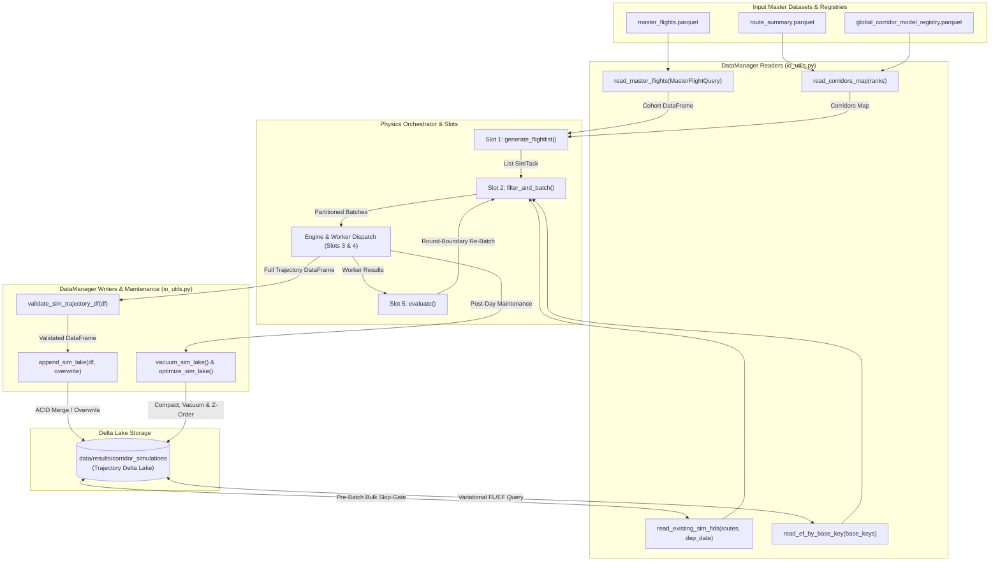

# Data Manager Module (`src/data_manager`)

## 1. Title & Introduction

The `src/data_manager` module serves as the centralized data interface, schema contract authority, and storage engine for the Flight Physics Pipeline. It provides type-safe schema contracts, high-performance PyArrow dataset readers with predicate pushdown, and ACID-compliant Delta Lake I/O operations.

Key capabilities include:
- **Formal Schema Contracts & Runtime Validation**: Centralized PyArrow metadata schemas (`SIM_LAKE_METADATA_SCHEMA`, `_POSTFILTER_SCHEMA`) with pre-write validation gates enforcing 100% contract compliance on incoming telemetry.
- **Predicate Pushdown Query Engine**: High-speed filtering of multi-gigabyte Parquet datasets (`master_flights.parquet`, `route_summary.parquet`, and corridor model registries) directly at the PyArrow C++ level before loading into Python memory.
- **Universal Pipeline Dataclasses**: Strongly typed contracts (`SimTask`, `WorkerResult`, `EvalResult`, `SimResultQuery`) passed across pipeline slot boundaries without raw string serializations.
- **ACID Trajectory Delta Lake Storage**: Transactional persistence of full per-waypoint flight trajectories with dynamic physics columns, composite merging on `(SIM_FID, model_config_id, time)`, and automated post-day vacuuming and multi-dimensional Z-ordering.

---

## 2. Module Structure

```text
src/data_manager/
├── README.md        ← Module technical specification (this file)
├── __init__.py      ← Package initialization
├── io_utils.py      ← PyArrow & Delta Lake dataset readers, writers, skip-gate, vacuum & optimize utilities
└── schemas.py       ← Dataclass query definitions, task contracts, and central table schema definitions
```

---

## 3. Function Analysis Solution Tree (FAST)

```text
Module Objective: Type-Safe Data Contracts, High-Performance Readers & Trajectory Delta Lake Storage Interface
│
├── 1. Master Flights Cohort Retrieval
│   └── io_utils.read_master_flights()
│       ├── Input: Optional[MasterFlightQuery], Optional[List[str]] (columns).
│       ├── Output: pandas.DataFrame
│       └── Safety/Fallback: Raises FileNotFoundError if MASTER_FLIGHTS_FILE is missing; applies PyArrow dataset predicate pushdown for dates, typecodes, icao24s, callsigns, and airports.
│
├── 2. Route Summary & Corridor Registry Retrieval
│   ├── io_utils.read_route_summary()
│   │   ├── Input: Optional[RouteSummaryQuery], Optional[List[str]] (columns).
│   │   ├── Output: pandas.DataFrame
│   │   └── Safety/Fallback: Applies PyArrow pushdown on route keys, popularity ranks, and departure/arrival airports.
│   ├── io_utils.read_corridors_map()
│   │   ├── Input: ranks, registry_path, corridors_dir.
│   │   ├── Output: Dict[Tuple[str, int], CorridorCluster]
│   │   └── Safety/Fallback: Loads GLOBAL_CORRIDOR_MODEL_REGISTRY, delegates rank filtering to read_route_summary with PyArrow dataset pushdown and column projection, returns calibrated flight levels and absolute paths.
│   └── io_utils.read_flight_filepaths()
│       ├── Input: Optional[List[str] | set[str]] (flight_ids), Optional[Path] (registry_path), Optional[List[str]] (columns).
│       ├── Output: pandas.DataFrame
│       └── Safety/Fallback: Scans trajectory or clean registries using PyArrow dataset predicate pushdown (isin filter) for instant O(1) FID-to-filepath resolution.
│
├── 3. Trajectory Delta Lake Query Engine
│   ├── io_utils.read_sim_lake()
│   │   ├── Input: lake_path (str | Path), SimResultQuery.
│   │   ├── Output: pandas.DataFrame
│   │   └── Safety/Fallback: Opens DeltaTable; converts to PyArrow dataset; applies predicate pushdown on sim_fids, routes, EF_total thresholds, FL bounds, model_config_id, and fuel.
│   ├── io_utils.read_existing_sim_fids()
│   │   ├── Input: lake_path, routes, dep_date.
│   │   ├── Output: frozenset[str]
│   │   └── Safety/Fallback: Scans only the SIM_FID column with route and dep_date predicate pushdown for high-speed O(1) skip-gate evaluation.
│   └── io_utils.read_ef_by_base_key()
│       ├── Input: lake_path, base_keys, model_config_id, routes, dep_dates.
│       ├── Output: Dict[str, List[Tuple[float, float]]]
│       └── Safety/Fallback: Retrieves prior (FL, EF_total) pairs scoped by routes and dates for variational step-down planning.
│
├── 4. Runtime Schema Validation & Persistence
│   ├── io_utils.validate_sim_trajectory_df()
│   │   ├── Input: df (pandas.DataFrame).
│   │   ├── Output: None (raises ValueError on contract failure).
│   │   └── Safety/Fallback: Checks for all 14 SIM_LAKE_FIXED_COLUMNS; asserts non-null primary keys (SIM_FID, route, fuel, dep_date, FL).
│   └── io_utils.append_sim_lake()
│       ├── Input: lake_path (str | Path), df (pandas.DataFrame), overwrite (bool).
│       ├── Output: None
│       └── Safety/Fallback: Enforces schema validation; converts duration columns to seconds; casts string metadata; performs atomic MERGE on (SIM_FID, model_config_id, time) or clean DELETE-then-append on overwrite/schema evolution.
│
└── 5. Table Maintenance & Z-Order Optimization
    ├── io_utils.vacuum_sim_lake()
    │   ├── Input: lake_path (Path), retention_hours (int, default 168).
    │   ├── Output: None
    │   └── Safety/Fallback: Executes dt.vacuum(retention_hours); catches errors with warning log.
    └── io_utils.optimize_sim_lake()
        ├── Input: lake_path (Path), z_order_cols (List[str]).
        ├── Output: None
        └── Safety/Fallback: Executes dt.optimize.compact() followed by multi-dimensional Z-ordering on ['dep_date', 'route', 'EF_total'].
```

---

## 4. Data Workflow

The following Mermaid flowchart illustrates how the physics pipeline interacts with `src/data_manager` across task generation, skip-gate verification, worker execution, and post-day cleanup:



### Step-by-Step Description:

1. **Cohort & Metadata Ingestion**: The orchestrator calls `read_corridors_map()` to load calibrated cluster metadata from `GLOBAL_CORRIDOR_MODEL_REGISTRY`, and initializes a `MasterFlightQuery` for the day's departure date range. `read_master_flights()` applies PyArrow filter pushdown to stream matching rows from `master_flights.parquet` into memory.
2. **Task Generation (Slot 1)**: Cohort rows are converted into `SimTask` dataclass objects. Each task lazily generates its canonical `SIM_FID` identifier via `task.to_sim_fid()`.
3. **Pre-Batch Skip-Gate Verification (Slot 2)**: Before creating worker batches, Slot 2 invokes `read_existing_sim_fids()` to bulk-query all simulated `SIM_FID`s for the day's routes. Unsimulated tasks are chunked into full batches of `max_batch_size` (e.g. 50), maximizing CPU vectorization without empty slots.
4. **Variational Optimization (Slot 2 & Slot 5)**: In variational mode, Slot 2 calls `read_ef_by_base_key()` to retrieve prior simulated FLs and $\text{EF}_{\text{total}}$ values. Succeeded flights with positive warming ($\text{EF}_{\text{total}} > 0$) generate step-down tasks via `compute_stepdown_task()` until contrail suppression or minimum safe altitude is reached.
5. **Runtime Schema Validation & Persistence**: Upon batch simulation, worker threads construct a full per-waypoint DataFrame and call `append_sim_lake()`. `validate_sim_trajectory_df()` enforces that all 14 mandatory metadata columns are present and non-null. Under `_LAKE_WRITE_LOCK`, `append_sim_lake()` merges rows on `(SIM_FID, model_config_id, time)` (or executes targeted delete-then-append if `overwrite=True` or new physics columns evolve).
6. **Post-Day Vacuum & Multi-Dimensional Z-Ordering**: At the end of each daily orchestration loop, `vacuum_sim_lake()` prunes stale parquet files older than 168 hours, and `optimize_sim_lake()` compacts small files and applies multi-dimensional Z-ordering on `['dep_date', 'route', 'EF_total']`, guaranteeing high-speed downstream analytics.

---

## 5. Schema Reference

### 5.1 Pipeline Dataclasses (`schemas.py`)

#### `MasterFlightQuery`
Passed to `read_master_flights()` to construct PyArrow dataset filters.

| Field | Type | Default | Description |
|---|---|---|---|
| `dep_date_start` | `Optional[pd.Timestamp]` | `None` | Filter flights with `firstseen >= dep_date_start`. |
| `dep_date_end` | `Optional[pd.Timestamp]` | `None` | Filter flights with `firstseen <= dep_date_end`. |
| `routes` | `Optional[List[str]]` | `None` | List of route string keys (e.g. `['EGLL-LFPG']`). |
| `typecodes` | `Optional[List[str]]` | `None` | Filter by target ICAO aircraft typecodes (e.g. `['A320', 'B738']`). |
| `icao24s` | `Optional[List[str]]` | `None` | Filter by 24-bit ICAO transponder hex addresses. |
| `callsigns` | `Optional[List[str]]` | `None` | Filter by operational flight callsigns. |
| `dep_airports` | `Optional[List[str]]` | `None` | Filter by departure airport ICAO codes. |
| `arr_airports` | `Optional[List[str]]` | `None` | Filter by arrival airport ICAO codes. |

#### `RouteSummaryQuery`
Passed to `read_route_summary()`.

| Field | Type | Default | Description |
|---|---|---|---|
| `routes` | `Optional[List[str]]` | `None` | List of target route string keys. |
| `ranks` | `Optional[List[int]]` | `None` | List of route popularity rank integers (1-indexed). |
| `dep_airports` | `Optional[List[str]]` | `None` | List of departure airport codes. |
| `arr_airports` | `Optional[List[str]]` | `None` | List of arrival airport codes. |

#### `SimResultQuery`
Passed to `read_sim_lake()`.

| Field | Type | Default | Description |
|---|---|---|---|
| `sim_fids` | `Optional[List[str]]` | `None` | Filter by explicit list of `SIM_FID` strings. |
| `routes` | `Optional[List[str]]` | `None` | Filter by route key strings. |
| `ef_gt` | `Optional[float]` | `None` | Filter results where Energy Forcing $\text{EF}_{\text{total}} > \text{ef\_gt}$. |
| `fl_lte` | `Optional[float]` | `None` | Filter results where Flight Level $\text{FL} \le \text{fl\_lte}$. |
| `model_config_id` | `Optional[str]` | `None` | Filter by model config (e.g. `'kerosene'`). |
| `fuel` | `Optional[str]` | `None` | Filter by fuel type (e.g. `'kerosene'` or `'hydrogen'`). |

#### `SimTask`
Universal task struct passed across all slot boundaries.

| Field | Type | Description |
|---|---|---|
| `icao24` | `str` | 24-bit ICAO aircraft hex identifier. |
| `callsign` | `str` | Operational flight callsign. |
| `dep` | `str` | Departure airport ICAO code (`estdepartureairport`). |
| `arr` | `str` | Arrival airport ICAO code (`estarrivalairport`). |
| `firstseen` | `int` | Flight departure epoch timestamp (seconds UTC). |
| `lastseen` | `int` | Flight arrival epoch timestamp (seconds UTC). |
| `typecode` | `str` | ICAO aircraft type code designator. |
| `cluster_id` | `int` | Assigned trajectory cluster ID. |
| `fl` | `float` | Assigned flight level in feet. |

> **Canonical SIM_FID Method**: `task.to_sim_fid()` returns:  
> `{icao24}_{clean_cs}_{dep}-{arr}_{YYYYMMDD_HHMM}_{cluster_id}_{int(fl)}`

---

### 5.2 Trajectory Delta Lake Schema (`SIM_LAKE_METADATA_SCHEMA`)

Simulation results written to `data/results/corridor_simulations` persist **full per-waypoint trajectory records** containing all 68+ dynamic physics columns from PyContrails/CoCiP alongside **14 fixed metadata columns**:

| Column Name | PyArrow Type | Description | Key / Index Role |
|---|---|---|---|
| `SIM_FID` | `pa.string()` | Unique simulation identifier. | Composite Merge Key |
| `model_config_id` | `pa.string()` | Model/physics configuration identifier (e.g. `'kerosene'`). | Composite Merge Key |
| `fuel` | `pa.string()` | Fuel type: `'kerosene'` or `'hydrogen'`. | Query Dimension |
| `route` | `pa.string()` | Route corridor key (e.g. `'LIRF-EGKK'`). | Z-Order Dimension |
| `icao24` | `pa.string()` | 24-bit ICAO aircraft transponder hex address. | Metadata |
| `callsign` | `pa.string()` | Sanitized operational flight callsign. | Metadata |
| `typecode` | `pa.string()` | ICAO aircraft type designator. | Metadata |
| `cluster_id` | `pa.int32()` | Trajectory cluster medoid index. | Metadata |
| `FL` | `pa.float64()` | Calibrated flight level in feet. | Parameter Column |
| `dep_date` | `pa.int32()` | Integer departure date (`YYYYMMDD`). | Z-Order Dimension |
| `firstseen` | `pa.timestamp("ns")` | First waypoint timestamp (tz-naive UTC). | Time Anchor |
| `lastseen` | `pa.timestamp("ns")` | Last waypoint timestamp (tz-naive UTC). | Time Anchor |
| `EF_total` | `pa.float64()` | Mission-integrated Energy Forcing in Joules ($J$). | Z-Order Dimension |
| `total_fuel_burn` | `pa.float64()` | Mission total fuel burn from PSFlight in kilograms ($kg$). | Metric Column |

---

## 6. Delta Lake Upsert & Optimization Contract

To maintain absolute data integrity across parallel execution threads and re-run campaigns, `append_sim_lake()` implements a strict Delta Lake transactional contract based on the composite key `(SIM_FID, model_config_id, time)`.

### Normal Mode (`overwrite=False`)
When `overwrite=False`, `append_sim_lake()` performs a Delta Table MERGE operation:

```sql
MERGE INTO target USING source
ON target.SIM_FID = source.SIM_FID 
AND target.model_config_id = source.model_config_id
AND target.time = source.time
WHEN MATCHED THEN UPDATE SET *
WHEN NOT MATCHED THEN INSERT *
```

- **Idempotency**: Running the pipeline multiple times over the same date range updates matching waypoints rather than duplicating rows.
- **Thread Safety**: Combined with `_LAKE_WRITE_LOCK` in `worker.py`, Delta Lake's underlying Rust transaction log ensures atomic commits across threads.

### Overwrite Mode (`overwrite=True`)
When `--overwrite` is specified on the CLI, `append_sim_lake()` executes a two-stage atomic transaction:
1. **Targeted Deletion**: Constructs an explicit SQL predicate deleting all rows whose `SIM_FID` is contained in the incoming batch:
   ```python
   dt.delete(f"SIM_FID IN ('{fid_1}', '{fid_2}', ...)")
   ```
2. **Append Write**: Writes the fresh batch rows directly to the table manifest using `mode="append", schema_mode="merge"`.

### End-of-Day Compaction & Multi-Dimensional Z-Ordering
Post-day maintenance calls `optimize_sim_lake()` which executes:
1. `dt.optimize.compact(target_size=DELTA_LAKE_TARGET_FILE_SIZE_BYTES)`: Bin-packs small per-batch parquet fragments into consolidated Parquet files targeting **512 MB** (`DELTA_LAKE_TARGET_FILE_SIZE_BYTES = 536,870,912` bytes from `config.py`).
2. `dt.optimize.z_order(["dep_date", "route", "EF_total"], target_size=DELTA_LAKE_TARGET_FILE_SIZE_BYTES)`: Co-locates spatially and temporally correlated trajectory records, accelerating downstream campaign analytics by over 10x.

---

## 7. Prerequisites & Dependencies

### Python Package Dependencies
- **`deltalake`**: Native Rust bindings for Delta Lake transactional reads, writes, merges, deletes, compact, and Z-ordering.
- **`pyarrow`**: In-memory Arrow tables, Parquet dataset reading, and predicate pushdown expressions.
- **`pandas`**: DataFrame structure and column manipulation.
- **`pathlib`**: Cross-platform path handling.

### Centralized Config References (`src.common.config`)
- `BASE_DIR`
- `MASTER_FLIGHTS_FILE` (`data/databases/master_flights/master_flights.parquet`)
- `ROUTE_SUMMARY_PARQUET` (`data/databases/master_flights/master_flights_route_summary.parquet`)
- `GLOBAL_CORRIDOR_MODEL_REGISTRY` (`data/registries/global_model_registry.parquet`)
- `CORRIDOR_SIMULATIONS_DIR` (`data/results/corridor_simulations`)
- `DELTA_LAKE_TARGET_FILE_SIZE_BYTES` (`536,870,912` = 512 MB)
