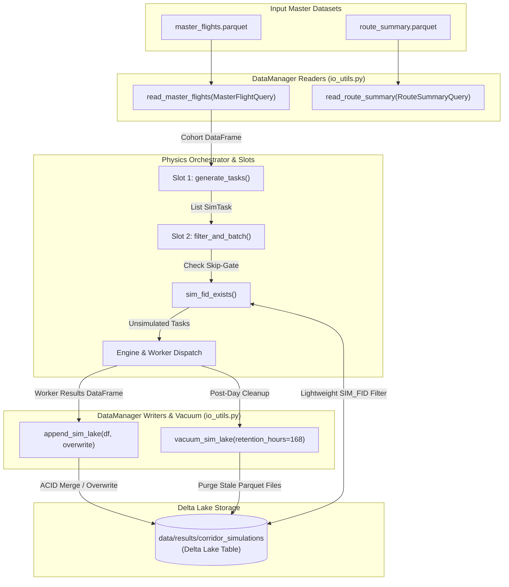

# Data Manager Module (`src/data_manager`)

## 1. Title & Introduction

The `src/data_manager` module serves as the centralized data interface and storage layer for the Flight Physics Pipeline. It provides type-safe schema contracts, high-performance PyArrow dataset readers with predicate pushdown, and ACID-compliant Delta Lake I/O operations.

Key capabilities include:
- **Predicate Pushdown Query Engine**: High-speed filtering of multi-gigabyte Parquet datasets (`master_flights.parquet` and `route_summary.parquet`) directly at the PyArrow C++ level before loading into Python memory.
- **Universal Pipeline Dataclasses**: Strongly typed contracts (`SimTask`, `WorkerResult`, `EvalResult`) passed across pipeline slot boundaries without raw string serializations.
- **ACID Delta Lake Storage**: Transactional upsert and overwrite mechanisms for simulation results, enforcing composite uniqueness on `(SIM_FID, model_config_id)` and providing automatic stale-file vacuuming.

---

## 2. Module Structure

```text
src/data_manager/
├── README.md        ← Module technical specification (this file)
├── __init__.py    ← Package initialization
├── io_utils.py      ← PyArrow & Delta Lake dataset readers, writers, skip-gate, and vacuum utilities
└── schemas.py       ← Dataclass query definitions, task contracts, and result structures
```

---

## 3. Function Analysis Solution Tree (FAST)

```text
Module Objective: Type-Safe Data Contracts, High-Performance Readers & Delta Lake Storage Interface
│
├── 1. Master Flights Cohort Retrieval
│   └── io_utils.read_master_flights()
│       ├── Input: Optional[MasterFlightQuery], Optional[List[str]] (columns).
│       ├── Output: pandas.DataFrame
│       └── Safety/Fallback: Raises FileNotFoundError if MASTER_FLIGHTS_FILE is missing; applies PyArrow dataset predicate pushdown for dates, typecodes, icao24s, callsigns, and airports.
│
├── 2. Route Summary Registry Retrieval
│   └── io_utils.read_route_summary()
│       ├── Input: Optional[RouteSummaryQuery], Optional[List[str]] (columns).
│       ├── Output: pandas.DataFrame
│       └── Safety/Fallback: Raises FileNotFoundError if ROUTE_SUMMARY_PARQUET is missing; applies PyArrow pushdown on route keys and departure/arrival airports.
│
├── 3. Simulation Delta Lake Reader
│   └── io_utils.read_sim_lake()
│       ├── Input: lake_path (str | Path), SimResultQuery.
│       ├── Output: pandas.DataFrame
│       └── Safety/Fallback: Opens DeltaTable; converts to PyArrow dataset; applies predicate pushdown on sim_fids, routes, EF thresholds, FL bounds, and model_config_id.
│
├── 4. Delta Lake Skip-Gate Existence Check
│   └── io_utils.sim_fid_exists()
│       ├── Input: lake_path (str | Path), sim_fid (str).
│       ├── Output: bool
│       └── Safety/Fallback: Reads ONLY the SIM_FID column with PyArrow filter; returns False if lake directory does not exist or table is uninitialized.
│
├── 5. Transactional Delta Lake Upsert / Overwrite
│   └── io_utils.append_sim_lake()
│       ├── Input: lake_path (str | Path), df (pandas.DataFrame), overwrite (bool).
│       ├── Output: None
│       └── Safety/Fallback: Raises TypeError if df is empty/invalid; initializes new Delta Lake if non-existent; normal mode performs MERGE on (SIM_FID, model_config_id); overwrite mode executes DELETE IN (...) then appends.
│
└── 6. Delta Lake Stale File Pruning
    └── io_utils.vacuum_sim_lake()
        ├── Input: lake_path (Path), retention_hours (int, default 168).
        ├── Output: None
        └── Safety/Fallback: Executes dt.vacuum(retention_hours); no-op if lake does not exist; swallows errors with WARNING log to prevent halting pipeline runs.
```

---

## 4. Data Workflow

The following Mermaid flowchart illustrates how the physics pipeline interacts with `src/data_manager` across task generation, skip-gate verification, worker execution, and post-day cleanup:



### Step-by-Step Description:

1. **Cohort & Metadata Ingestion**: The orchestrator initializes a `MasterFlightQuery` specifying the day's departure date range (`dep_date_start`, `dep_date_end`). `read_master_flights()` applies PyArrow filter pushdown to stream matching rows from `master_flights.parquet` into memory. Optionally, `read_route_summary()` fetches route ranking data.
2. **Task Generation (Slot 1)**: Cohort rows are converted into `SimTask` dataclass objects. Each task lazily generates its canonical `SIM_FID` identifier via `task.to_sim_fid()`.
3. **Skip-Gate Verification (Slot 2)**: Before submitting tasks for simulation, Slot 2 calls `sim_fid_exists()` for each candidate `SIM_FID`. `sim_fid_exists()` queries the Delta Lake manifest, scanning *only* the `SIM_FID` column via PyArrow pushdown to return a boolean result instantly without loading heavy telemetry.
4. **Result Persistence**: Upon batch completion, worker threads construct a result DataFrame and call `append_sim_lake()`. Under `_LAKE_WRITE_LOCK`, `append_sim_lake()` merges rows on `(SIM_FID, model_config_id)` (or deletes matching `SIM_FID` rows if `overwrite=True`).
5. **Periodic Vacuum Cleanup**: At the end of each daily orchestration loop, `vacuum_sim_lake()` opens the Delta Table and deletes orphaned Parquet files older than 168 hours (7 days), keeping disk usage minimal and storage transactions clean.

---

## 5. Schema Reference

### 5.1 Pipeline Dataclasses (`schemas.py`)

#### `MasterFlightQuery`
Passed to `read_master_flights()` to construct PyArrow dataset filters.

| Field | Type | Default | Description |
|---|---|---|---|
| `dep_date_start` | `Optional[pd.Timestamp]` | `None` | Filter flights with `firstseen >= dep_date_start`. |
| `dep_date_end` | `Optional[pd.Timestamp]` | `None` | Filter flights with `firstseen <= dep_date_end`. |
| `routes` | `Optional[List[str]]` | `None` | List of route string keys (e.g. `['EGLL-LFPG']`). |
| `typecodes` | `Optional[List[str]]` | `None` | Filter by target ICAO aircraft typecodes (e.g. `['A320', 'B738']`). |
| `icao24s` | `Optional[List[str]]` | `None` | Filter by 24-bit ICAO transponder hex addresses. |
| `callsigns` | `Optional[List[str]]` | `None` | Filter by operational flight callsigns. |
| `dep_airports` | `Optional[List[str]]` | `None` | Filter by departure airport ICAO codes. |
| `arr_airports` | `Optional[List[str]]` | `None` | Filter by arrival airport ICAO codes. |

#### `RouteSummaryQuery`
Passed to `read_route_summary()`.

| Field | Type | Default | Description |
|---|---|---|---|
| `routes` | `Optional[List[str]]` | `None` | List of target route string keys. |
| `dep_airports` | `Optional[List[str]]` | `None` | List of departure airport codes. |
| `arr_airports` | `Optional[List[str]]` | `None` | List of arrival airport codes. |

#### `SimResultQuery`
Passed to `read_sim_lake()`.

| Field | Type | Default | Description |
|---|---|---|---|
| `sim_fids` | `Optional[List[str]]` | `None` | Filter by explicit list of `SIM_FID` strings. |
| `routes` | `Optional[List[str]]` | `None` | Filter by route key strings. |
| `ef_gt` | `Optional[float]` | `None` | Filter results where Energy Forcing $\text{EF} > \text{ef\_gt}$. |
| `fl_lte` | `Optional[float]` | `None` | Filter results where Flight Level $\text{FL} \le \text{fl\_lte}$. |
| `model_config_id` | `Optional[str]` | `None` | Filter by model config (e.g. `'kerosene'`). |

#### `SimTask`
Universal task struct passed across all slot boundaries.

| Field | Type | Description |
|---|---|---|
| `icao24` | `str` | 24-bit ICAO aircraft hex identifier. |
| `callsign` | `str` | Operational flight callsign. |
| `dep` | `str` | Departure airport ICAO code (`estdepartureairport`). |
| `arr` | `str` | Arrival airport ICAO code (`estarrivalairport`). |
| `firstseen` | `int` | Flight departure epoch timestamp (seconds UTC). |
| `lastseen` | `int` | Flight arrival epoch timestamp (seconds UTC). |
| `typecode` | `str` | ICAO aircraft type code designator. |
| `cluster_id` | `int` | Assigned trajectory cluster ID. |
| `fl` | `float` | Assigned flight level in feet. |

> **Method**: `to_sim_fid()` returns string formatted as:  
> `{icao24}_{callsign}_{dep}-{arr}_{YYYYMMDD}_{cluster_id}_{int(fl)}`

#### `WorkerResult`
Result metadata returned by `worker.run_batch()`.

| Field | Type | Description |
|---|---|---|
| `sim_fid` | `str` | Canonical simulation flight identifier. |
| `ef` | `float` | Calculated Energy Forcing in Joules ($\text{EF} = 0.0$ on failure). |
| `fl` | `float` | Simulated flight level in feet. |
| `model_config_id` | `str` | Model/fuel configuration identifier. |
| `status` | `str` | Execution outcome: `"success"` or `"fail"`. |

#### `EvalResult`
Produced by Slot 5 after evaluating a worker batch.

| Field | Type | Description |
|---|---|---|
| `succeeded` | `List[WorkerResult]` | Tasks successfully simulated ($\text{status} = \text{"success"}$). |
| `failed` | `List[WorkerResult]` | Tasks that encountered errors ($\text{status} = \text{"fail"}$). |
| `still_todo` | `List[SimTask]` | Tasks re-queued for further evaluation (used in O2 step-down runs; empty in O1). |

---

### 5.2 Delta Lake Simulation Results Schema (`corridor_simulations`)

Simulation results written to `data/results/corridor_simulations` adhere strictly to the following Delta Lake schema:

| Column Name | PyArrow / Delta Type | Description | Primary Key / Index |
|---|---|---|---|
| `SIM_FID` | `string` | Canonical task identifier (`{icao24}_{callsign}_{dep}-{arr}_{YYYYMMDD}_{cluster_id}_{fl}`). | Composite Merge Key |
| `model_config_id` | `string` | Fuel / model configuration flag (e.g. `'kerosene'`). | Composite Merge Key |
| `route` | `string` | Route corridor key (e.g. `'EGLL-LFPG'`). | Partition Candidate |
| `EF` | `double` (`float64`) | Total contrail Energy Forcing in Joules (J). Summed along trajectory. | Metric Column |
| `FL` | `double` (`float64`) | Simulated flight level in feet (e.g. `350.0`). | Parameter Column |

---

## 6. Delta Lake Upsert Contract

To maintain absolute data integrity across parallel execution threads and re-run campaigns, `append_sim_lake()` implements a strict Delta Lake transactional contract based on the composite key `(SIM_FID, model_config_id)`.

### Why the Key Includes `model_config_id`
The simulation pipeline supports comparing different fuel and physical model configurations (e.g. standard `'kerosene'` vs future SAF variants such as `'saf20'` or `'saf50'`) for the exact same physical flight trajectory (`SIM_FID`). Including `model_config_id` in the merge key ensures that running a SAF simulation pass inserts distinct result records without clobbering or overwriting pre-existing baseline kerosene results.

### Normal Mode (`overwrite=False`)
When `overwrite=False`, `append_sim_lake()` performs a Delta Table MERGE operation:

```sql
MERGE INTO target USING source
ON target.SIM_FID = source.SIM_FID 
AND target.model_config_id = source.model_config_id
WHEN MATCHED THEN UPDATE SET *
WHEN NOT MATCHED THEN INSERT *
```

- **Idempotency**: Running the pipeline multiple times over the same date range will update existing matching records rather than duplicating rows.
- **Thread Safety**: Combined with `_LAKE_WRITE_LOCK` in `worker.py`, Delta Lake's underlying Rust transaction log ensures atomic commits.

### Overwrite Mode (`overwrite=True`)
When `--overwrite` is specified on the CLI, `append_sim_lake()` executes a two-stage transaction:
1. **Targeted Deletion**: Constructs an explicit SQL predicate deleting all rows whose `SIM_FID` is contained in the incoming batch:
   ```python
   dt.delete(f"SIM_FID IN ('{fid_1}', '{fid_2}', ...)")
   ```
2. **Append Write**: Writes the fresh batch rows directly to the table manifest using `mode="append"`.

> [!IMPORTANT]
> Overwrite mode completely purges all duplicate historical entries for the incoming `SIM_FID` set, making it the recovery mechanism for cleaning dirty tables produced by previous interrupted runs.

---

## 7. Prerequisites & Dependencies

### Python Package Dependencies
- **`deltalake`**: Native Rust bindings for Delta Lake transactional reads, writes, merges, deletes, and vacuuming.
- **`pyarrow`**: In-memory Arrow tables, Parquet dataset reading, and predicate pushdown expressions.
- **`pandas`**: DataFrame structure and column manipulation.
- **`pathlib`**: Cross-platform path handling.

### Centralized Config References (`src.common.config`)
- `MASTER_FLIGHTS_FILE` (`data/databases/master_flights/master_flights.parquet`)
- `ROUTE_SUMMARY_PARQUET` (`data/databases/master_flights/master_flights_route_summary.parquet`)
- `CORRIDOR_SIMULATIONS_DIR` (`data/results/corridor_simulations`)
