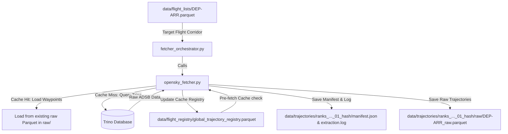

# API Trajectory Fetching Module

This module queries raw flight trajectory coordinates (state vectors) from the OpenSky Trino database or loads them from a local cache, consolidating them into dynamically generated dataset directories.

## Module Structure

```
src/fetching/
├── README.md                  # This documentation file
├── opensky_fetcher.py         # Downloader logic with local cache pre-checks
└── fetcher_orchestrator.py     # Coordinates batch corridor fetches
```

---

## Function Analysis Solution Tree (FAST)

```
Module Objectives
 └── Query flight coordinates from OpenSky and save to isolated run directories
      ├── Sub-objective: Query coordinates for a single flight list with cache checking
      │    └── Solution: fetch_trajectories() in opensky_fetcher.py
      │         ├── Inputs:
      │         │    ├── input_list_path (str): Path to sliced route Parquet
      │         │    ├── out_dir (str): Directory to save trajectories and manifest
      │         │    ├── sample_size (int): Number of flights to randomly sample
      │         │    └── seed (int): Random seed for sampling reproducibility
      │         └── Outputs: Consolidated raw Parquet, Manifest JSON, and updated global index
      │
      ├── Sub-objective: Prevent Trino server overloads and retry query failures
      │    └── Solution: fetch_with_backoff() in opensky_fetcher.py
      │         ├── Inputs: trino_client, query, max_retries
      │         └── Outputs: DataFrame of waypoints or None on permanent failure
      │
      └── Sub-objective: Batch coordinate acquisition across multiple route corridors
           ├── Solution: extract_target_routes() in fetcher_orchestrator.py
           │    ├── Inputs: summary_path, lower, upper, specific_ranks, fetch_format
           │    ├── Outputs: DataFrame with columns '[rank, dep, arr, no_of_flights]'
           │    └── Role: Resolves ranked corridors (supporting oneway/roundtrip routes)
           │
           ├── Solution: compute_fetch_targets() in fetcher_orchestrator.py
           │    ├── Inputs: routes_df, input_dir, strategy, value
           │    ├── Outputs: execution_plan (list of dicts containing sample sizes)
           │    └── Role: Maps routes to sliced files and computes sample quotas
           │
           └── Solution: execute_batch_fetch() in fetcher_orchestrator.py
                ├── Inputs: execution_plan, out_dir, seed
                └── Role: Sequentially triggers opensky_fetcher for each corridor in the plan
```

---

## Data Workflow

> [!NOTE]
> **Mermaid Render Support**: The workflow diagram below uses Mermaid syntax. If you are viewing this markdown file in VS Code and it does not render visually, you will need to install a Mermaid preview extension, such as **Markdown Preview Mermaid Support** (by Matt Bierner) or view it in an environment that supports it natively (like GitHub or Obsidian).



1. **Local Trajectory Cache Check**: For each target flight, the fetcher checks `global_trajectory_registry.parquet` for a matching `flight_id`. 
   - **Cache Hit**: Waypoints are read locally from the existing raw file path (inside `raw/`), avoiding API calls.
   - **Cache Miss**: A Trino query is executed with exponential backoff.
2. **Dynamic Dataset Namespaces**: Folder directories are dynamically named based on prompt inputs, ensuring that runs are isolated and cross-validation cohorts do not stomp on each other:
   `data/trajectories/<corridors>_sample_<size>_seed_<seed>_<numbering>_<hash>/`
   - Manifest files and execution logs are saved at the root of this folder.
   - Raw trajectories are written to the `raw/` subdirectory.
3. **Registry Updates**: Freshly fetched flights are appended to the global index for future cache hits.

---

## CLI Guide

### 1. `opensky_fetcher.py` (Single Corridor Fetcher)
Fetches trajectories for a single corridor list directly.

```bash
# Fetches waypoints for EGLL-KJFK
python -m src.fetching.opensky_fetcher --input-list data/flight_lists/EGLL-KJFK.parquet --out-dir data/trajectories/manual_test --sample-size 50 --seed 42
```

**Parameters**:
- `--input-list`: Sliced route list file.
- `--out-dir`: Directory where raw Parquet files and manifest JSON are saved.
- `--sample-size`: Number of flights to randomly sample.
- `--seed`: Seed value for random state reproducibility (default: `42`). Accepts any standard 32-bit integer (e.g., `0` to `4294967295`).
  - **Selecting Seed Values**: You can choose any integer between `0` and `4294967295`. 
  - Using a different seed (e.g., `101` instead of `42`) changes the specific random flights selected in the sample.
  - Using the same seed guarantees that the exact same flight sample is selected on repeated runs.

---

### 2. `fetcher_orchestrator.py` (Batch Corridor Orchestrator)
Orchestrates downloading trajectories for ranks corridors, automatically resolving dynamic dataset folder names.

```bash
# Fetch 50 random flights per corridor for a range of ranks (ranks 1 to 20)
python -m src.fetching.fetcher_orchestrator --lower-rank 1 --upper-rank 20 --strategy fixed --value 50 --seed 99

# Fetch 50 random flights per corridor for specific ranks (ranks 1 and 2)
python -m src.fetching.fetcher_orchestrator --ranks "1, 76, 177, 205, 209, 278, 288, 321, 411, 508, 509, 592, 633, 710, 712, 727, 761, 792, 848, 888, 926" --strategy fixed --value 50 --seed 42 --format roundtrip
```

**Parameters**:
- `--route-summary`: Custom path to RouteSummary pickle file (default: `data/flight_registry/master_flights_RouteSummary.pkl`).
- `--input-dir`: Folder containing flight lists (default: `data/flight_lists/`).
- `--format`: Directionality (`oneway` / `roundtrip`). If `roundtrip`, resolves and includes inverse return routes automatically.
- `--ranks`: Comma-separated ranks to extract.
- `--lower-rank` & `--upper-rank`: Corridor bounds of ranks to extract.
- `--strategy`: Sampling quota strategy (`fixed` / `percent` / `all`).
- `--value`: Integer size value mapping to the chosen strategy (e.g. 50 flights for `fixed`).
- `--seed`: Seed value for random state reproducibility (default: `42`). Accepts any standard 32-bit integer (e.g., `0` to `4294967295`).
  - **Selecting Seed Values**: You can choose any integer between `0` and `4294967295`. 
  - Using a different seed (e.g., `101` instead of `42`) changes the specific random flights selected in the sample.
  - Using the same seed guarantees that the exact same flight sample is selected on repeated runs.

