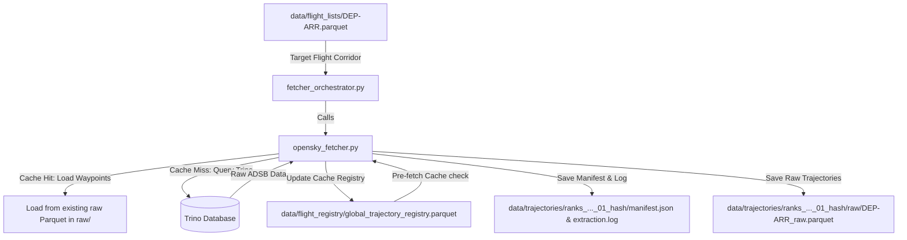

# API Trajectory Fetching Module

This module queries raw flight trajectory coordinates (state vectors) from the OpenSky Trino database or loads them from a local cache, consolidating them into dynamically generated dataset directories.

It operates as **Loop 1** of the Flight Physics Pipeline.

---

## 1. Module Structure

```text
src/fetching/
├── README.md                  # This documentation file
├── opensky_fetcher.py         # Downloader logic with local cache pre-checks
└── fetcher_orchestrator.py     # Coordinates batch corridor fetches
```

---

## 2. Function Analysis Solution Tree (FAST)

```text
Module Objectives
 └── Query flight coordinates from OpenSky and save to isolated run directories
      │
      ├── Sub-objective 1: Query coordinates for a single flight list with cache checking and filtering
      │    └── Solution: fetch_trajectories() in opensky_fetcher.py
      │         ├── Inputs:
      │         │    ├── input_list_path (str): Path to sliced route Parquet
      │         │    ├── out_dir (str): Directory to save trajectories and manifest
      │         │    ├── sample_size (int): Number of flights to randomly sample
      │         │    ├── seed (int): Random seed for sampling reproducibility
      │         │    ├── start_date (str): Optional ISO start date window
      │         │    ├── end_date (str): Optional ISO end date window
      │         │    └── typecode (str): Optional aircraft typecode (case-insensitive)
      │         └── Outputs: Consolidated raw Parquet, Manifest JSON, and updated global index
      │
      ├── Sub-objective 2: Apply modular column-matching and time bounds to flight lists in-memory
      │    └── Solution: filter_flight_list() in opensky_fetcher.py
      │         ├── Inputs: df (pd.DataFrame), start_date, end_date, **kwargs
      │         └── Outputs: Filtered pd.DataFrame
      │
      ├── Sub-objective 3: Prevent Trino server overloads and retry query failures
      │    └── Solution: fetch_with_backoff() in opensky_fetcher.py
      │         ├── Inputs: trino_client, query, max_retries
      │         └── Outputs: DataFrame of waypoints or None on permanent failure
      │
      └── Sub-objective 4: Batch coordinate acquisition across multiple route corridors
           ├── Solution: extract_target_routes() in fetcher_orchestrator.py
           │    ├── Inputs: summary_path, lower, upper, specific_ranks, fetch_format, min_distance
           │    ├── Outputs: DataFrame with columns '[rank, dep, arr, no_of_flights]'
           │    └── Role: Resolves ranked corridors (supporting oneway/roundtrip routes) and filters by distance
           │
           ├── Solution: compute_fetch_targets() in fetcher_orchestrator.py
           │    ├── Inputs: routes_df, input_dir, strategy, value, start_date, end_date, typecode
           │    ├── Outputs: execution_plan (list of dicts containing sample sizes)
           │    └── Role: Maps routes, applies filters in-memory, and computes quotas on matching subset size
           │
           └── Solution: execute_batch_fetch() in fetcher_orchestrator.py
                ├── Inputs: execution_plan, out_dir, seed, start_date, end_date, typecode
                └── Role: Sequentially triggers opensky_fetcher for each corridor in the plan
```

---

## 3. Data Workflow

> [!NOTE]
> **Mermaid Render Support**: The workflow diagram below uses Mermaid syntax. If you are viewing this markdown file in VS Code and it does not render visually, you will need to install a Mermaid preview extension, such as **Markdown Preview Mermaid Support** (by Matt Bierner) or view it in an environment that supports it natively (like GitHub or Obsidian).



1. **Local Trajectory Cache Check**: For each flight schedule, the fetcher checks `global_trajectory_registry.parquet` for an existing `flight_id`.
   - **Cache Hit**: Waypoints are read locally from the existing raw file path, avoiding database queries and API costs.
   - **Cache Miss**: A Trino query is executed with exponential backoff to retrieve coordinates from the remote OpenSky database.
2. **In-Memory Filtering**: Flights are filtered in-memory using the provided start/end dates and aircraft typecodes.
3. **Dynamic Cohort Isolation**: Saves data into uniquely named folders like `data/trajectories/<corridors>_strat_..._seed_..._[hash]/` containing an `extraction.log`, a run `manifest.json`, and raw parquet files written to a `raw/` sub-folder.
4. **Registry Updates**: Freshly fetched trajectory records are registered in `global_trajectory_registry.parquet` for future cache hits.

---

## 4. CLI Usage Guide

### Bash
```bash
# 1. Fetch trajectories for a single corridor directly
python -m src.fetching.opensky_fetcher \
    --input-list data/flight_lists/LEPA-LEBL.parquet \
    --out-dir data/trajectories/manual_test \
    --start-date "2025-01-01T11:00:00" \
    --end-date "2025-01-01T13:00:00" \
    --typecode "A320" \
    --sample-size 5

# 2. Orchestrate batch downloading for specific ranked routes
python -m src.fetching.fetcher_orchestrator \
    --ranks "1, 76" \
    --strategy fixed \
    --value 5 \
    --seed 42 \
    --start-date "2025-01-02" \
    --end-date "2025-01-05" \
    --typecode "A320"
```

### PowerShell
```powershell
# 1. Fetch trajectories for a single corridor directly
python -m src.fetching.opensky_fetcher `
    --input-list data/flight_lists/LEPA-LEBL.parquet `
    --out-dir data/trajectories/manual_test `
    --start-date "2025-01-01T11:00:00" `
    --end-date "2025-01-01T13:00:00" `
    --typecode "A320" `
    --sample-size 5

# 2. Orchestrate batch downloading for specific ranked routes
python -m src.fetching.fetcher_orchestrator `
    --ranks "1, 76" `
    --strategy fixed `
    --value 5 `
    --seed 42 `
    --start-date "2025-01-02" `
    --end-date "2025-01-05" `
    --typecode "A320"
```

**Parameters (`opensky_fetcher.py`)**:
- `--input-list`: Path to the sliced corridor list Parquet file.
- `--out-dir`: Sliced list directory for output.
- `--sample-size`: Number of flights to randomly sample.
- `--seed`: Seed value for random state reproducibility (default: `42`).
- `--start-date` / `--end-date`: Temporal departure windows (ISO format).
- `--typecode`: Aircraft model designator (e.g. `A320`).

**Parameters (`fetcher_orchestrator.py`)**:
- `--route-summary`: Custom path to RouteSummary pickle file (default: `data/flight_registry/master_flights_RouteSummary.pkl`).
- `--input-dir`: Sliced list input folder (default: `data/flight_lists/`).
- `--format`: Directionality (`oneway` / `roundtrip`).
- `--ranks`: Comma-separated ranks to extract.
- `--lower-rank` & `--upper-rank`: Corridor bounds of ranks to extract.
- `--strategy`: Quota strategy (`fixed` / `percent` / `all`).
- `--value`: Integer size value mapping to the chosen strategy (e.g. `50`).
- `--seed`: Seed value for random state reproducibility (default: `42`, allowed values: `0` to `4294967295`).
- `--min-distance`: Minimum route distance in kilometers (default: `800.0` km).

---

## 5. Prerequisites & Dependencies

### Python Libraries
* `pandas` & `pyarrow` (for data manipulation and Parquet parsing)
* `pyopensky` (OpenSky Network Trino query client API)

### Credentials
* Active Trino connection credentials for OpenSky Network.

For naming standards and coordinate reference systems, refer to the centralized **[conventions.md](file:///g:/Meine%20Ablage/UNI/SS26/PythonPipeline%20-%20Kopie/src/conventions.md)** standards.
