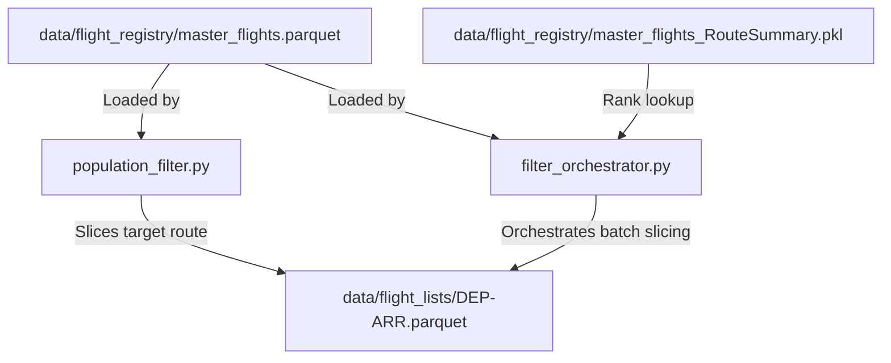

# Corridor Slicing & Filtering Module

This module extracts specific route flight populations (cohort records) from the master flights database and saves them as targeted flight list files. These lists are subsequently used by the fetcher to request raw trajectory waypoints.

---

## 1. Module Structure

```text
src/filtering/
├── README.md                  # This documentation file
├── population_filter.py       # Core logic to filter and slice the registry
└── filter_orchestrator.py     # Batch corridor generator using ranks in RouteSummary
```

---

## 2. Function Analysis Solution Tree (FAST)

```text
Module Objectives
 └── Slicing specific route populations from the master registry
      │
      ├── Sub-objective 1: Slice a single corridor by criteria (e.g., Origin, Destination, Dates, Typecode, Distance)
      │    └── Solution: filter_population() in population_filter.py
      │         ├── Inputs:
      │         │    ├── file_path (str): Path to master flights registry (Parquet/CSV)
      │         │    ├── out_dir (str): Directory where sliced lists are saved
      │         │    ├── start_date / end_date (str): YYYY-MM-DD temporal filters
      │         │    ├── typecode (str): Aircraft type filter (e.g., B777)
      │         │    ├── origin / dest (str): Departure/arrival airport ICAOs
      │         │    └── min_distance (float): Minimum route distance in kilometers (default: 800.0)
      │         └── Outputs: Sliced Parquet list named '<typecode>_<origin>-<dest>_<dates>.parquet'
      │
      └── Sub-objective 2: Slice multiple corridors in batch using ranked traffic lists
           ├── Solution: orchestrate_filtered_list_creation() in filter_orchestrator.py
           │    ├── Inputs: route_summary_path, master_file_path, output_dir, lower_rank, upper_rank, min_distance
           │    └── Role: Resolves a range of ranks to actual routes and triggers slicing, filtering out short routes
           │
           ├── Sub-solution: extract_airports_from_ranks() in filter_orchestrator.py
           │    ├── Inputs: route_summary_path (str), ranks (list of ints), min_distance (float)
           │    ├── Outputs: DataFrame with columns '[rank, dep, arr]'
           │    └── Role: Decodes route strings (e.g., "EGLL -> KJFK") for chosen ranks and filters by distance
           │
           └── Sub-solution: filtered_lists_from_ranks() in filter_orchestrator.py
                ├── Inputs: airports_df (pd.DataFrame), master_file_path (str), output_dir (str)
                ├── Outputs: Sliced Parquet files inside 'data/flight_lists/'
                └── Role: Iteratively slices the master database for each rank in airports_df
```

---

## 3. Data Workflow

> [!NOTE]
> **Mermaid Render Support**: The workflow diagram below uses Mermaid syntax. If you are viewing this markdown file in VS Code and it does not render visually, you will need to install a Mermaid preview extension, such as **Markdown Preview Mermaid Support** (by Matt Bierner) or view it in an environment that supports it natively (like GitHub or Obsidian).



1. **Airport / Route Resolution**: Routes are identified either individually by ICAO codes (`--origin` / `--dest`) or loaded dynamically from the `master_flights_RouteSummary.pkl` for specified ranks. Distance filtering is applied to exclude corridors shorter than the `--min-distance` threshold (default: 800.0 km).
2. **Master Registry Loading**: The filter engine reads the large-scale master flight database (`master_flights.parquet`).
3. **In-Memory Population Slicing**: Evaluates the coordinate entries and timestamps, slicing the flight registry to isolate matching flights (filtering on departure airports, arrival airports, aircraft typecodes, and departure date windows).
4. **Flight List Serialization**: Sliced cohorts are written to disk as individual Parquet lists inside `data/flight_lists/` (e.g. `LCLK-LGAV.parquet`), providing target files for subsequent OpenSky trajectory fetching modules.

---

## 4. CLI Usage Guide

### Bash
```bash
# 1. Slice flights from EGLL to KJFK
python -m src.filtering.population_filter \
    --origin EGLL \
    --dest KJFK \
    --start-date "2025-01-01" \
    --end-date "2025-01-07"

# 2. Slice a range of ranks (top 1 to 20 routes)
python -m src.filtering.filter_orchestrator \
    --lower-rank 1 \
    --upper-rank 20
```

### PowerShell
```powershell
# 1. Slice flights from EGLL to KJFK
python -m src.filtering.population_filter `
    --origin EGLL `
    --dest KJFK `
    --start-date "2025-01-01" `
    --end-date "2025-01-07"

# 2. Slice a range of ranks (top 1 to 20 routes)
python -m src.filtering.filter_orchestrator `
    --lower-rank 1 `
    --upper-rank 20
```

**Parameters (`population_filter.py`)**:
- `--csv`: Custom path to the master flight registry database (default: `data/flight_registry/master_flights.parquet`).
- `--out-dir`: Where to save sliced corridors (default: `data/flight_lists/`).
- `--start-date` / `--end-date`: Date bounds `YYYY-MM-DD`.
- `--typecode`: Filter by specific aircraft designator (e.g. `B777`).
- `--origin` / `--dest`: Origin/destination airport ICAO codes.
- `--min-distance`: Minimum route distance in kilometers (default: `800.0` km). Bypasses corridors that are shorter than the specified distance threshold. Set to `0` to disable.

**Parameters (`filter_orchestrator.py`)**:
- `--route-summary`: Custom path to RouteSummary pickle file (default: `data/flight_registry/master_flights_RouteSummary.pkl`).
- `--master-file`: Custom path to master flights registry (default: `data/flight_registry/master_flights.parquet`).
- `--out-dir`: Sliced lists output folder (default: `data/flight_lists/`).
- `--ranks`: Comma-separated ranks to extract (e.g. `"1, 76"`).
- `--lower-rank` & `--upper-rank`: Corridor bounds of ranks to extract.
- `--min-distance`: Minimum route distance in kilometers (default: `800.0` km).

---

## 5. Prerequisites & Dependencies

### Python Libraries
* `pandas` & `pyarrow` (for data manipulation and Parquet I/O)

### Input Datasets
* `data/flight_registry/master_flights.parquet` (for reading global historical flights)
* `data/flight_registry/master_flights_RouteSummary.pkl` (for resolving ranked routes)

For naming standards and coordinate reference systems, refer to the centralized **[conventions.md](file:///g:/Meine%20Ablage/UNI/SS26/PythonPipeline%20-%20Kopie/src/conventions.md)** standards.
