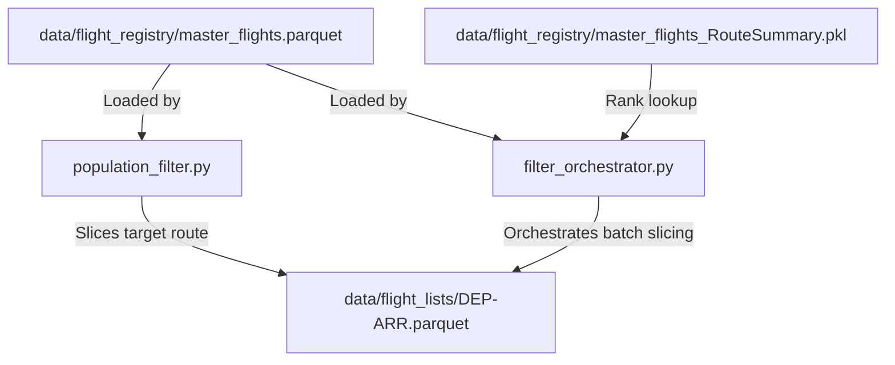

# Corridor Slicing & Filtering Module

This module extracts specific route flight populations (cohort records) from the master flights database and saves them as targeted flight list files. These lists are subsequently used by the fetcher to request raw trajectory waypoints.

## Module Structure

```
src/filtering/
├── README.md                  # This documentation file
├── population_filter.py       # Core logic to filter and slice the registry
└── filter_orchestrator.py     # Batch corridor generator using ranks in RouteSummary
```

---

## Function Analysis Solution Tree (FAST)

```
Module Objectives
 └── Slicing specific route populations from the master registry
      ├── Sub-objective: Slice a single corridor by criteria (e.g., Origin, Destination, Dates, Typecode)
      │    └── Solution: filter_population() in population_filter.py
      │         ├── Inputs:
      │         │    ├── file_path (str): Path to master flights registry (Parquet/CSV)
      │         │    ├── out_dir (str): Directory where sliced lists are saved
      │         │    ├── start_date / end_date (str): YYYY-MM-DD temporal filters
      │         │    ├── typecode (str): Aircraft type filter (e.g., B777)
      │         │    └── origin / dest (str): Departure/arrival airport ICAOs
      │         └── Outputs: Sliced Parquet list named '<typecode>_<origin>-<dest>_<dates>.parquet'
      │
      └── Sub-objective: Slice multiple corridors in batch using ranked traffic lists
           ├── Solution: orchestrate_filtered_list_creation() in filter_orchestrator.py
           │    ├── Inputs: route_summary_path, master_file_path, output_dir, lower_rank, upper_rank
           │    └── Role: Resolves a range of ranks to actual routes and triggers slicing
           │
           ├── Sub-solution: extract_airports_from_ranks() in filter_orchestrator.py
           │    ├── Inputs: route_summary_path (str), ranks (list of ints)
           │    ├── Outputs: DataFrame with columns '[rank, dep, arr]'
           │    └── Role: Decodes route strings (e.g., "EGLL -> KJFK") for chosen ranks
           │
           └── Sub-solution: filtered_lists_from_ranks() in filter_orchestrator.py
                ├── Inputs: airports_df (pd.DataFrame), master_file_path (str), output_dir (str)
                ├── Outputs: Sliced Parquet files inside 'data/flight_lists/'
                └── Role: Iteratively slices the master database for each rank in airports_df
```

---

## Data Workflow

> [!NOTE]
> **Mermaid Render Support**: The workflow diagram below uses Mermaid syntax. If you are viewing this markdown file in VS Code and it does not render visually, you will need to install a Mermaid preview extension, such as **Markdown Preview Mermaid Support** (by Matt Bierner) or view it in an environment that supports it natively (like GitHub or Obsidian).



1. **Corridor Identification**: Routes can be queried either individually by specifying ICAO codes (`--origin` / `--dest`) or in batches by using RouteSummary ranked lists (`--ranks` / `--lower-rank` & `--upper-rank`).
2. **Registry Query**: The script loads the master database (CSV or Parquet) and applies filters (dates, typecodes, origin, destination).
3. **Parquet Slicing**: Slices are exported as standalone files in `data/flight_lists/`.

---

## CLI Guide

### 1. `population_filter.py` (Single Corridor Slicer)
Run this script to filter out a single flight corridor manually.

```bash
# Slices flights from EGLL to KJFK
python -m src.filtering.population_filter --origin EGLL --dest KJFK --start-date 2025-01-01 --end-date 2025-01-07
```

**Parameters**:
- `--csv`: Custom path to the master flight registry database (default: `data/flight_registry/master_flights.parquet`).
- `--out-dir`: Where to save sliced corridors (default: `data/flight_lists/`).
- `--start-date` / `--end-date`: Date bounds `YYYY-MM-DD`.
- `--typecode`: Filter by specific aircraft designator (e.g. `B777`).
- `--origin` / `--dest`: Origin/destination airport ICAO codes.

---

### 2. `filter_orchestrator.py` (Batch Corridor Slicer)
Slices multiple corridors concurrently based on ranked traffic counts from the RouteSummary.

```bash
# Slice specific ranks
python -m src.filtering.filter_orchestrator --ranks "1, 76, 177"
# Slice a continuous corridor of ranks (e.g., top 1 to 20 routes)
python -m src.filtering.filter_orchestrator --lower-rank 1 --upper-rank 20
```

**Parameters**:
- `--route-summary`: Custom path to RouteSummary pickle file (default: `data/flight_registry/master_flights_RouteSummary.pkl`).
- `--master-file`: Custom path to master flights registry (default: `data/flight_registry/master_flights.parquet`).
- `--out-dir`: Sliced lists output folder (default: `data/flight_lists/`).
- `--ranks`: Comma-separated ranks to extract.
- `--lower-rank` & `--upper-rank`: Corridor bounds of ranks to extract.
