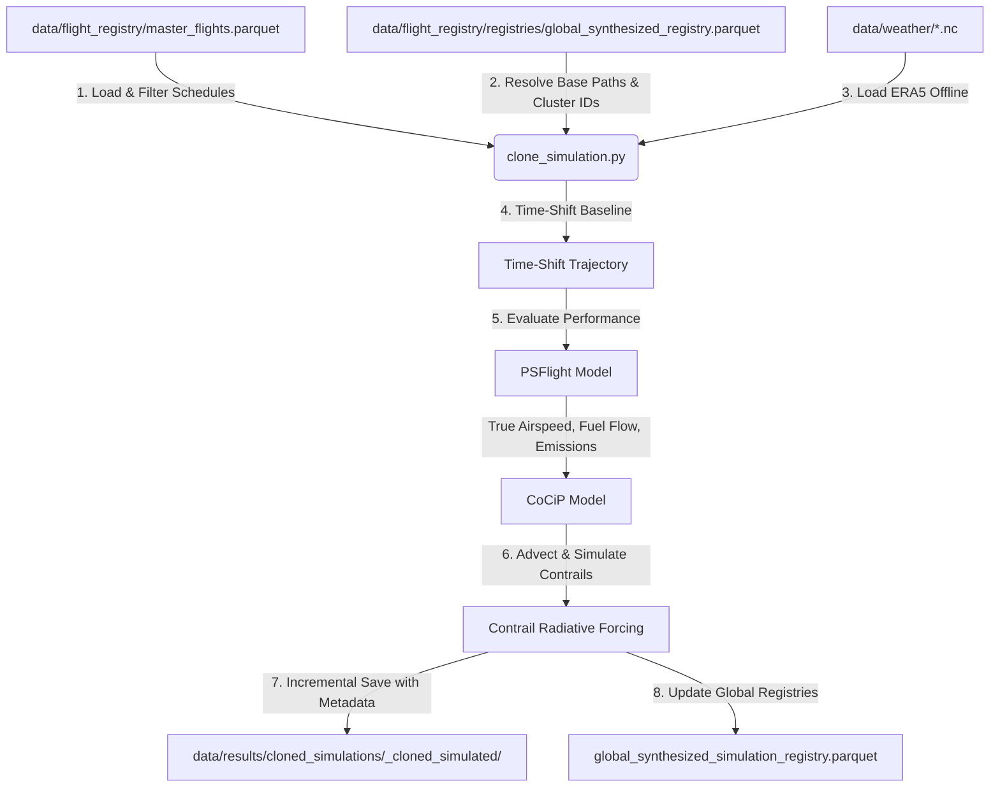

# Physics Simulation Module

This module handles the physical simulation of aircraft trajectories under the **CoCiP** (Contrail Cirrus Prediction) and **PSFlight** (Performance-based System Flight) models in `pycontrails`. It contains two primary entrypoints:

1. **Standard Simulation (`simulation.py`)**: Runs weather-canned physics evaluations on already-recorded and cleaned trajectories.
2. **Batch Clone Simulation (`clone_simulation.py`)**: A fault-tolerant engine that takes a single synthesized corridor trajectory, clones it, shifts it to match real flight schedules in timezone-aware UTC, and batch-simulates them against ECMWF ERA5 weather grids.

It operates as **Loop 3b** of the Flight Physics Pipeline.

---

## 1. Module Structure

```text
src/physics/
├── README.md              # This documentation file
├── simulation.py          # Runs CoCiP and PSFlight models on standard clean trajectories
└── clone_simulation.py    # Batch clones, shifts, and simulates synthesized corridor flights
```

---

## 2. Function Analysis Solution Tree (FAST)

```text
Module Objectives
 └── Physical simulation of flight trajectories under CoCiP and PSFlight models (Loop 3b)
      │
      ├── Sub-objective 1: Standard trajectory modeling
      │    └── Solution: run_physics_pipeline() in simulation.py
      │         ├── Inputs: clean trajectory files/directory, weather cache path, output directory
      │         └── Outputs: Parquet file(s) containing simulated contrail waypoints (*_simulated.parquet), global_simulation_registry.parquet, skipped_aircraft.log, simulation.log
      │
      ├── Sub-objective 2: Batch clone corridor flight simulation
      │    └── Solution: run_batch_clone_simulation() in clone_simulation.py
      │         ├── Inputs: ranks, date ranges, weather cache path, output directory, max contrail age, min_distance
      │         ├── Outputs: Incremental flight-level simulated parquets (*_simulated.parquet), global_synthesized_simulation_registry.parquet, skipped_aircraft.log, simulation.log
      │         └── Role: Orchestrates daily weather batches and flight schedule simulations
      │
      ├── Sub-objective 3: Slicing cohort schedules from master registry
      │    └── Solution: filter_cohort_flights() in clone_simulation.py
      │         ├── Inputs: master_flights.parquet, RouteSummary, ranks, start/end dates, synthesized manifest, min_distance
      │         └── Outputs: Sorted and filtered cohort DataFrame of target flights
      │
      ├── Sub-objective 4: Offline-first ERA5 weather dataset loading
      │    └── Solution: load_weather_for_flights() in clone_simulation.py
      │         ├── Inputs: cohort DataFrame, weather cache directory, max age hours
      │         └── Outputs: Merged meteorological and radiative datasets (met, rad)
      │
      └── Sub-objective 5: Single flight cloned simulation under CoCiP/PSFlight
           └── Solution: simulate_single_flight() in clone_simulation.py
                ├── Inputs: flight schedule row, base synthesized flight path, weather datasets
                └── Outputs: Simulated Flight object containing contrail and emission metrics
```

---

## 3. Data Workflow

> [!NOTE]
> **Mermaid Render Support**: The workflow diagram below uses Mermaid syntax. If you are viewing this markdown file in VS Code and it does not render visually, you will need to install a Mermaid preview extension, such as **Markdown Preview Mermaid Support** (by Matt Bierner) or view it in an environment that supports it natively (like GitHub or Obsidian).



1. **Schedule Filtering**: Loads schedules from the `master_flights.parquet` database and slices them based on rank bounds.
2. **Flight Base Tracking**: Retrieves the synthesized base flight trajectory (DTW tracks) and looks up its corresponding `cluster_id` from the global registries (e.g., `global_synthesized_registry.parquet`).
3. **Offline Weather Loading**: Automatically loads matching ERA5 NetCDF weather datasets from `data/weather/` cache for the simulation time frame.
4. **Time Shifting & Evaluation**: Temporally shifts the baseline trajectory to match the scheduled flight time. Evaluates the coordinates via the PSFlight model (obtaining True Airspeed, fuel flow, and emissions parameters).
5. **Contrail Simulation**: Runs the CoCiP advection model using the 3D weather variables to compute contrail formation, persistence, and radiative forcing metrics.
6. **Incremental Save & Registry Update**: Writes outputs individually on completion to provide fault-tolerant, resume-ready checkpoints. It appends finished runs to the global registries: standard simulations update `global_simulation_registry.parquet`, and batch clone simulations update `global_synthesized_simulation_registry.parquet`. Any flights with unsupported aircraft types are skipped, and logged in `skipped_aircraft.log`.

### Skipped Aircraft Log (`skipped_aircraft.log`)
If a flight's aircraft type is not supported by the PSFlight model, the flight is skipped. Details of any skipped flights are appended to `skipped_aircraft.log` under the output directory in a comma-separated format:
```text
<flight_id>,<unsupported_typecode>
```
This ensures strict tracking of unsupported aircraft performance models without causing simulation-wide failures.

---

## 4. CLI Usage Guide

### Bash
```bash
# 1. Run simulation on a single cleaned trajectory file
python -m src.physics.simulation \
    --input-file "data/trajectories/ranks_1_strat_fixed_val_2.0_seed_42_format_oneway_ee7a02/clean/LEPA-LEBL_ab1081_clean_si.parquet" \
    --out-dir "data/results/test_scenario/" \
    --weather-cache "data/weather" \
    --age 48

# 2. Run cloned batch simulation for specific ranks
python -m src.physics.clone_simulation \
    --ranks 1,3 \
    --start-date "2025-01-02" \
    --end-date "2025-01-05" \
    --weather-cache "data/weather" \
    --out-dir "data/results/cloned_simulations"

# 3. Run cloned batch simulation for a rank range with multiple clusters per flight
python -m src.physics.clone_simulation \
    --lower-rank 1 \
    --upper-rank 20 \
    --start-date "2025-01-01" \
    --end-date "2025-01-31" \
    --weather-cache "data/weather" \
    --out-dir "data/results/cloned_simulations" \
    --max-age 72 \
    --clusters-per-flight 3 \
    --min-distance 800.0
```

### PowerShell
```powershell
# 1. Run simulation on a single cleaned trajectory file
python -m src.physics.simulation `
    --input-file "data/trajectories/ranks_1_strat_fixed_val_2.0_seed_42_format_oneway_ee7a02/clean/LEPA-LEBL_ab1081_clean_si.parquet" `
    --out-dir "data/results/test_scenario/" `
    --weather-cache "data/weather" `
    --age 48

# 2. Run cloned batch simulation for specific ranks
python -m src.physics.clone_simulation `
    --ranks 1,3 `
    --start-date "2025-01-02" `
    --end-date "2025-01-05" `
    --weather-cache "data/weather" `
    --out-dir "data/results/cloned_simulations"

# 3. Run cloned batch simulation for a rank range with multiple clusters per flight
python -m src.physics.clone_simulation `
    --lower-rank 1 `
    --upper-rank 20 `
    --start-date "2025-01-01" `
    --end-date "2025-01-31" `
    --weather-cache "data/weather" `
    --out-dir "data/results/cloned_simulations" `
    --max-age 72 `
    --clusters-per-flight 3 `
    --min-distance 800.0
```

### Parameter Reference (`simulation.py`)

| CLI Option | Type | Default | Description |
| :--- | :--- | :--- | :--- |
| `--input-file` | `str` | *None* | Path to cleaned SI trajectory Parquet file (`*_clean_si.parquet`) or directory containing multiple cleaned Parquet files. (Required) |
| `--out-dir` | `str` | *None* | Output directory for simulation results, logs, and skipped aircraft files. (Required) |
| `--weather-cache` | `str` | *None* | Path to the NetCDF ERA5 weather files directory. (Required) |
| `--max-age` / `--age` | `int` | `48` | Maximum contrail simulation/advection age in hours. (Optional) |

### Parameter Reference (`clone_simulation.py`)

| CLI Option | Type | Default | Description |
| :--- | :--- | :--- | :--- |
| `--ranks` | `str` | *None* | Comma-separated list of route ranks to process (e.g., `"1,3"`). Mutually exclusive with `--lower-rank`. |
| `--lower-rank` | `int` | *None* | Start of a corridor rank range to simulate. Requires `--upper-rank`. |
| `--upper-rank` | `int` | *None* | End of a corridor rank range to simulate. Requires `--lower-rank`. |
| `--start-date` | `str` | *None* | Start date (YYYY-MM-DD) for flight scheduling. (Required unless `--test-mode` is active) |
| `--end-date` | `str` | *None* | End date (YYYY-MM-DD) for flight scheduling. (Required unless `--test-mode` is active) |
| `--weather-cache` | `str` | `data/weather` | Path to the NetCDF ERA5 weather files directory. |
| `--out-dir` | `str` | `data/results/cloned_simulations` | Output directory for simulation results and logs. |
| `--max-age` / `--age` | `int` | `48` | Maximum contrail simulation/advection age in hours. |
| `--overwrite` | `flag` | *False* | Forces re-simulation of already simulated flights. |
| `--test-mode` | `flag` | *False* | Enables test mode: slices the cohort to 1 flight total, sets the start/end date to `2025-01-01`, and disables day-by-day temporal windowing (runs as a single batch without 2-hour spacing). |
| `--no-day-by-day` | `flag` | *True* (default is true) | Disables day-by-day temporal weather windowing and runs the entire cohort as a single batch. |
| `--min-distance` | `float` | `800.0` | Minimum route distance in kilometers to process. Bypasses corridors that are shorter than the specified distance threshold. Set to `0` to disable. |
| `--clusters-per-flight` / `-x` | `int` | `1` | Number of randomized synthetic tracks to sample per flight schedule. |

### Maximal CLI Examples

Here are comprehensive examples showing all available parameters in action:

#### Example 1: Full Range Simulation with All Options (Bash)
```bash
python -m src.physics.clone_simulation \
    --lower-rank 1 \
    --upper-rank 10 \
    --start-date "2025-01-01" \
    --end-date "2025-01-15" \
    --weather-cache "G:/Meine Ablage/UNI/SS26/PythonPipeline - Kopie/data/weather" \
    --out-dir "data/results/cloned_simulations/full_analysis" \
    --max-age 72 \
    --min-distance 1000.0 \
    --clusters-per-flight 3 \
    --no-day-by-day
```

#### Example 2: Selective Ranks with Overwrite (PowerShell)
```powershell
python -m src.physics.clone_simulation `
    --ranks "1,3,5,10,50" `
    --start-date "2025-01-02" `
    --end-date "2025-01-10" `
    --weather-cache "data/weather" `
    --out-dir "data/results/high_priority_routes" `
    --max-age 48 `
    --min-distance 800.0 `
    --clusters-per-flight 2 `
    --overwrite
```

#### Example 3: Test Mode Verification (Quick Local Test)
```bash
python -m src.physics.clone_simulation \
    --ranks 1,3 \
    --test-mode \
    --weather-cache "data/weather" \
    --out-dir "data/results/test_run" \
    --clusters-per-flight 1
```

#### Example 4: High-Resolution Multi-Cluster Batch (Production)
```bash
python -m src.physics.clone_simulation \
    --lower-rank 1 \
    --upper-rank 76 \
    --start-date "2025-01-01" \
    --end-date "2025-01-31" \
    --weather-cache "/path/to/weather/cache" \
    --out-dir "data/results/production_batch_jan2025" \
    --max-age 72 \
    --min-distance 500.0 \
    --clusters-per-flight 5 \
    --no-day-by-day
```

### Key Configuration Notes

- **`--clusters-per-flight`**: Controls synthetic variation. Higher values (e.g., 5-10) generate multiple alternative trajectories per flight for uncertainty quantification. Default (1) is fastest.
- **`--min-distance`**: Routes shorter than this threshold are skipped (airport-loop filtering). Common values: `0` (none), `500` (medium), `800` (long-haul).
- **`--no-day-by-day`**: Trades memory for speed. Disables daily weather batching; use only if RAM and weather coverage allow full-period loading.
- **`--overwrite`**: Re-simulates flights even if outputs exist. Useful after model updates or parameter changes.
- **`--test-mode`**: Always use first before production runs to validate setup against local cached data (`2024-12-31` to `2025-01-10`).

> **Offline Verification**: `--test-mode` ensures the simulation runs against the local cached weather data (`2024-12-31` to `2025-01-10`), avoiding the need to fetch new ERA5 data from Copernicus API during verification.

---

## 5. Prerequisites & Dependencies

### Python Libraries
* `pandas` & `pyarrow` (for data manipulation and Parquet parsing)
* `numpy` & `scipy` (for math and physics arrays)
* `pycontrails` (for PSFlight and Cocip contrail physics simulation models)

### Data Requirements
* **Weather Cache**: Populated weather NetCDF files covering the flight timelines plus advection padding.
* **Flight Lists**: Standard corridor lists Parquet files matching schedules.
* **Master Flight Schedules & Routes**: `master_flights.parquet` and `master_flights_route_summary.pkl` located in the `data/flight_registry/` directory.
* **Synthesized Baseline**: Synthesized trajectories registered in `global_synthesized_registry.parquet`.

For naming standards and coordinate reference systems, refer to the centralized **[conventions.md](file:///g:/Meine%20Ablage/UNI/SS26/PythonPipeline%20-%20Kopie/src/conventions.md)** standards.