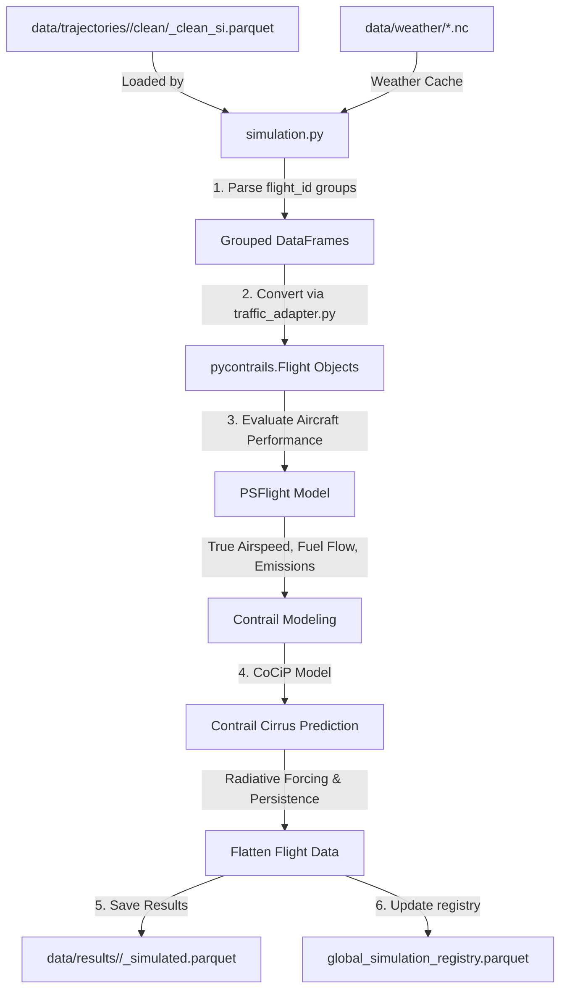

Loop 3b: Physics Simulation Module

This module represents the final execution engine of the Flight Physics Pipeline. It mathematically bridges the geodetic flight paths with the atmospheric cache to compute real-world aircraft performance and contrail radiative forcing.

Module Structure

src/physics/
├── simulation.py          # Runs the PSFlight and Cocip models sequentially
└── README.md              # This file

## Workflow

The simulation engine is designed as a functional executor. It does not download data.

> [!NOTE]
> **Mermaid Render Support**: The workflow diagram below uses Mermaid syntax. If you are viewing this markdown file in VS Code and it does not render visually, you will need to install a Mermaid preview extension, such as **Markdown Preview Mermaid Support** (by Matt Bierner) or view it in an environment that supports it natively (like GitHub or Obsidian).

1. **Hydration**: Uses the `traffic_adapter.py` utility to load flat `.parquet` data and structure it into dictionaries of `pycontrails.Flight` objects.
2. **Aircraft Performance (PSFlight)**: Computes True Airspeed (TAS), fuel mass flow rates, and dynamic engine emissions indices (NOx, soot) based on the aircraft typecode and the ambient 3D ERA5 weather grids loaded from the cache.
3. **Contrail Modeling (Cocip)**: Feeds the aerodynamically-enriched flights into the Contrail Cirrus Prediction model to evaluate the Schmidt-Appleman criterion, contrail persistence, and total Radiative Forcing (RF).
4. **Serialization**: Re-flattens the enriched trajectory objects and exports a single, high-fidelity `_simulated.parquet` file to your output directory, then registers it in the cache index.

Usage:

# 1. Process a single clean file:
python -m src.physics.simulation `
    --input-file "data/trajectories/ranks_1_strat_fixed_val_2.0_seed_42_format_oneway_ee7a02/clean/LEPA-LEBL_ab1081_clean_si.parquet" `
    --out-dir "data/results/test_scenario" `
    --weather-cache "data/weather" `
    --age 48

# 2. Process an entire directory of clean files:
python -m src.physics.simulation `
    --input-file "data/trajectories/ranks_1_strat_fixed_val_2.0_seed_42_format_oneway_ee7a02/clean" `
    --out-dir "data/results/test_scenario" `
    --weather-cache "data/weather" `
    --age 48

**Parameters**:
- `--input-file`: Path to cleaned SI trajectory Parquet file OR directory containing multiple cleaned Parquet files (scans for `*_clean_si.parquet`).
- `--out-dir`: Output directory for simulated results.
- `--weather-cache`: Directory containing ERA5 NetCDF cache files.
- `--age` / `--max-age`: Maximum contrail simulation/advection age in hours (default: 48). This parameter is passed directly to the CoCiP model and is used to dynamically construct the temporal window bounds for the ERA5 weather datalib constructor.

Prerequisites

Your data/weather/ directory must be populated (Loop 3a) with ERA5 NetCDF weather data covering the temporal bounds of the trajectory.