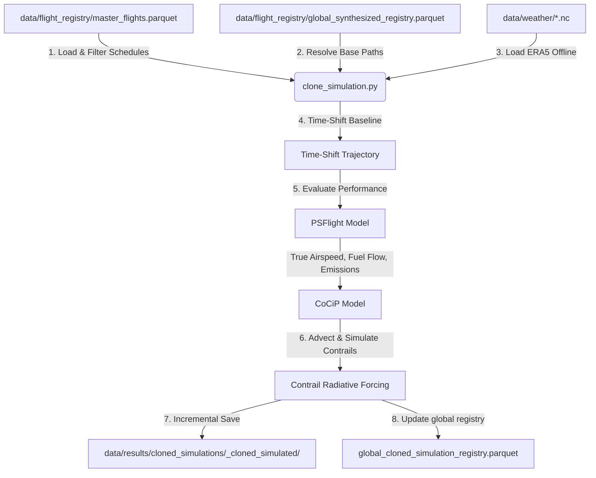

# Module 3: Physics & Cloned Simulation Component

This component handles the physical simulation of aircraft trajectories under the **CoCiP** (Contrail Cirrus Prediction) and **PSFlight** (Performance-based System Flight) models in `pycontrails`. It contains two primary entrypoints:

1. **Standard Simulation (`simulation.py`)**: Runs weather-canned physics evaluations on already-recorded and cleaned trajectories.
2. **Batch Clone Simulation (`clone_simulation.py`)**: A fault-tolerant engine that takes a single synthesized corridor trajectory, clones it, shifts it to match real flight schedules in timezone-aware UTC, and batch-simulates them against ECMWF ERA5 weather grids.

---

## Component Directory Structure

```text
src/physics/
├── simulation.py          # Runs CoCiP and PSFlight models on standard clean trajectories
├── clone_simulation.py    # Batch clones, shifts, and simulates synthesized corridor flights
└── README.md              # This documentation
```

---

## Function Analysis Solution Tree (FAST)

```text
Module Objectives
 └── Physical simulation of flight trajectories under CoCiP and PSFlight models
      │
      ├── Sub-objective: Standard trajectory modeling
      │    └── Solution: simulate_clean_trajectories() in simulation.py
      │         ├── Inputs: clean trajectory files/directory, weather cache path, output directory
      │         └── Outputs: Parquet file(s) containing simulated contrail waypoints
      │
      ├── Sub-objective: Batch clone corridor flight simulation
      │    └── Solution: run_batch_clone_simulation() in clone_simulation.py
      │         ├── Inputs: ranks, date ranges, weather cache path, output directory, max contrail age
      │         ├── Outputs: Incremental flight-level simulated parquets and updated manifests
      │         └── Role: Orchestrates daily weather batches and flight schedule simulations
      │
      ├── Sub-objective: Slicing cohort schedules from master registry
      │    └── Solution: filter_cohort_flights() in clone_simulation.py
      │         ├── Inputs: master_flights.parquet, RouteSummary, ranks, start/end dates, synthesized manifest
      │         └── Outputs: Sorted and filtered cohort DataFrame of target flights
      │
      ├── Sub-objective: Offline-first ERA5 weather dataset loading
      │    └── Solution: load_weather_for_flights() in clone_simulation.py
      │         ├── Inputs: cohort DataFrame, weather cache directory, max age hours
      │         └── Outputs: Merged meteorological and radiative datasets (met, rad)
      │
      └── Sub-objective: Single flight cloned simulation under CoCiP/PSFlight
           └── Solution: simulate_single_flight() in clone_simulation.py
                ├── Inputs: flight schedule row, base synthesized flight path, weather datasets
                └── Outputs: Simulated Flight object containing contrail and emission metrics
```

---

## Workflow & Architecture



### Key Architectural Designs

#### 1. Fault-Tolerant, Resume-Ready Execution
Batch simulation of corridors can process hundreds of flights, making it susceptible to interruption or crashes. 
- The engine uses **incremental saving**: each simulated flight is saved to its own individual Parquet file immediately upon completion.
- If run again, the script checks for the existence of `<flight_id>_simulated.parquet` and automatically **skips** already-simulated flights.
- Completed runs are registered in `global_cloned_simulation_registry.parquet` to avoid directory scans for downstream analytics.

#### 2. Timezone-Aware UTC Design
To prevent timezone mismatch errors (e.g., `TypeError: Cannot subtract tz-naive and tz-aware datetime-like objects`), the clone engine:
- Normalizes all input schedules and baseline synthesized time-series coordinates to **timezone-aware UTC**.
- Computes time-shift offsets as timezone-neutral `pd.Timedelta` objects.
- Safely strips the timezone *only* during the final string formatting for ERA5 queries, ensuring the CoCiP model receives clean dates.

#### 3. Shared Weather Optimization
Loading weather data is highly resource-intensive. If the flight corridor batch spans a short temporal window (e.g., $\le$ 72 hours, such as in `--test-mode`), the script loads the ERA5 meteorological and radiative datasets **once** into memory and shares them across all flights in the batch, drastically reducing execution time.

---

## Usage Guide

### 1. Standard Simulation

Use `simulation.py` to evaluate individual cleaned trajectories.

```powershell
# Run simulation on a single cleaned trajectory file
python -m src.physics.simulation `
    --input-file "data/trajectories/ranks_1_strat_fixed_val_2.0_seed_42_format_oneway_ee7a02/clean/LEPA-LEBL_ab1081_clean_si.parquet" `
    --out-dir "data/results/test_scenario/" `
    --weather-cache "data/weather" `
    --age 48

# Run simulation on an entire directory of cleaned trajectories
python -m src.physics.simulation `
    --input-file "data\trajectories\ranks_1-76_strat_fixed_val_1.0_seed_43_format_oneway_start_2025-01-02_end_2025-01-05_36d19e\clean" `
    --out-dir "data/results/test_scenario" `
    --weather-cache "data/weather" `
    --age 48
```

### 2. Cloned Batch Simulation

Use `clone_simulation.py` to clone, shift, and batch-simulate synthetic flight paths.

```powershell
# Run standard corridor simulation for specific ranks (e.g., ranks 1 and 3)
python -m src.physics.clone_simulation `
    --ranks 1,3 `
    --weather-cache "data/weather" `
    --out-dir "data/results/cloned_simulations"

# Run corridor simulation across a range of ranks (e.g., ranks 1 to 5 inclusive)
python -m src.physics.clone_simulation `
    --lower-rank 1 `
    --upper-rank 5 `
    --weather-cache "data/weather"

# Offline Test Mode (verifies logic using cached January weather data)
python -m src.physics.clone_simulation `
    --ranks 3 `
    --weather-cache "data/weather" `
    --test-mode
```

---

## Parameter Reference

### `clone_simulation.py`

| CLI Option | Type | Default | Description |
| :--- | :--- | :--- | :--- |
| `--ranks` | `str` | *None* | Comma-separated list of route ranks to process (e.g., `"1,3"`). Mutually exclusive with `--lower-rank`. |
| `--lower-rank` | `int` | *None* | Start of a corridor rank range to simulate. Requires `--upper-rank`. |
| `--upper-rank` | `int` | *None* | End of a corridor rank range to simulate. Requires `--lower-rank`. |
| `--weather-cache` | `str` | `data/weather` | Path to the NetCDF ERA5 weather files directory. |
| `--out-dir` | `str` | `data/results/cloned_simulations` | Output directory for simulation results and logs. |
| `--max-age` / `--age` | `int` | `48` | Maximum contrail simulation/advection age in hours. |
| `--test-mode` | `flag` | *False* | Limit to the first 1 flights of each corridor, and override departure dates starting at `2025-01-01 00:00:00 UTC` spaced 2 hours apart. |

> [!TIP]
> **Test Mode Advantage**: `--test-mode` ensures the simulation runs against the local cached weather data (`2024-12-31` to `2025-01-10`), avoiding the need to fetch new ERA5 data from Copernicus API during verification.

---

## Prerequisites & Data Requirements

- **Weather Cache**: The cache directory (specified by `--weather-cache`) must be populated with ERA5 pressure-level and surface variables covering the duration of the flight(s) plus the `--max-age` advection window.
- **Flight Lists**: A Parquet flight list must exist under `data/flight_lists/<DEP>-<ARR>.parquet` for each route to resolve schedules.
- **Synthesized Baseline**: The target route must have a synthesized trajectory pre-generated and registered in `data/flight_registry/global_synthesized_registry.parquet`.