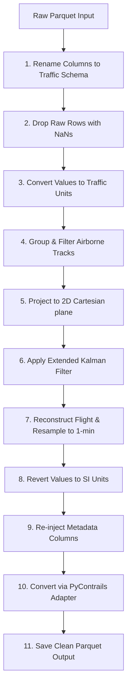

# Processing Module Workflow Architecture Analysis

This document provides a detailed architectural analysis of the trajectory processing pipeline in the `src/processing/` directory. It maps the sequential execution flow, details interactions with internal data structures, specifies EKF integration details, and explains the index mismatch bug causing 100% NaN outputs.

---

## 1. Step-by-Step Pipeline Workflow

The data processing pipeline is implemented in [kalman_filter.py](file:///g:/Meine%20Ablage/UNI/SS26/PythonPipeline%20-%20Kopie/src/processing/kalman_filter.py) and executes the following steps in sequence:



### Detailed Steps:
1.  **Read Raw Data:** The raw Parquet file (e.g., `LEPA-LEBL_ab1081_raw.parquet`) is read into a pandas DataFrame.
2.  **Schema Alignment:** Columns are renamed to conform to the `traffic` library's expected terminology (e.g., `'velocity'` $\to$ `'groundspeed'`, `'baroaltitude'` $\to$ `'altitude'`).
3.  **NaN Pruning:** Rows containing `NaN` in key variables (`timestamp`, `latitude`, `longitude`, `track`, `groundspeed`, `vertical_rate`, `altitude`, `onground`) are dropped using `dropna`.
4.  **Unit Conversion (Initial):** Variables are converted from metric/SI units to standard aviation units (meters $\to$ feet, m/s $\to$ knots, m/s $\to$ feet/minute).
5.  **Traffic Object Instantiation:** The DataFrame is wrapped in a `traffic.core.Traffic` collection.
6.  **Airborne Segmentation:** For each flight, the airborne portion is extracted via `flight.airborne()`. Tracks with fewer than 10 points are discarded.
7.  **Spatial Projection:** The flight is projected into a 2D Cartesian plane (EPSG:3857) using `compute_xy()` to provide `x` and `y` coordinates.
8.  **EKF Application:** The Extended Kalman Filter is invoked via `ekf.apply()` on the flight's coordinates.
9.  **Resampling:** The smoothed data is wrapped in a `Flight` object and resampled to a regular 1-minute frequency using `resample("1min")`.
10. **Unit Reversion (Final):** Numeric columns are converted back from aviation units to SI units.
11. **Metadata Re-injection:** Key metadata fields (e.g., `icao24`, `callsign`, `typecode`, `flight_id`) are copied from the original flight data.
12. **PyContrails Adaptation:** The DataFrame is converted into a `pycontrails.Flight` object using `dataframe_to_pycontrails()`.
13. **Export:** Cleaned flights are compiled and exported as a Parquet file (e.g., `LEPA-LEBL_ab1081_clean_si.parquet`).

---

## 2. Data Structure Interactions

The scripts manipulate three distinct types of data representations at different stages of the workflow:

| Stage | Data Structure | Class/Type | Key Responsibility |
| :--- | :--- | :--- | :--- |
| **Ingestion / Unit Conversion** | Pandas DataFrame | `pd.DataFrame` | Initial column mapping, unit conversion, and basic data pruning. |
| **EKF & Resampling** | Traffic / Flight Objects | `traffic.core.Traffic`, `traffic.core.Flight` | Trajectory manipulation: airborne filtering, spatial coordinate projection, EKF smoothing, and frequency resampling. |
| **Adapter / Downstream Simulation** | PyContrails Flight | `pycontrails.Flight` | Conforming to the schema required by the physical contrail models (e.g., CoCiP). |

---

## 3. EKF Integration & Column Mapping

The Extended Kalman Filter is integrated at line 76 in `kalman_filter.py` and is called directly on the flight's data attribute:
```python
df_smoothed = ekf.apply(f_projected.data)
```

The mappings between columns at various stages of the pipeline are detailed in the table below:

| Raw Parquet Column | Traffic Schema (Input to EKF) | EKF Preprocessed State Variable | EKF Postprocessed Output | PyContrails Schema |
| :--- | :--- | :--- | :--- | :--- |
| `time` | `timestamp` | Index (DatetimeIndex) | Index (DatetimeIndex) | `time` |
| `lat` | `latitude` | *Not in state (kept in data)* | *Not in postprocess (kept)* | `latitude` |
| `lon` | `longitude` | *Not in state (kept in data)* | *Not in postprocess (kept)* | `longitude` |
| `baroaltitude` | `altitude` (feet) | `alt_baro` (meters) | `altitude` (feet) | `altitude` (meters) |
| `velocity` | `groundspeed` (knots) | `velocity` (m/s) | `groundspeed` (knots) | `gs` (m/s) |
| `heading` | `track` (degrees) | `math_angle` (radians) | `track` (degrees) | `heading` (degrees) |
| `vertrate` | `vertical_rate` (ft/min) | `vert_rate` (m/s) | `vertical_rate` (ft/min) | `rocd` (m/s) |
| `geoaltitude` | `geoaltitude` | *Not in state (kept in data)* | *Not in postprocess (kept)* | `geoaltitude` |

---

## 4. The Disconnect: Root Cause of the 100% NaN Bug

The diagnostic analysis reveals a critical disconnect during EKF post-processing that explains why valid inputs are lost and wiped to `NaN`.

```
=====================================================================================
 f_projected.data index: RangeIndex (0, 1, 2, ..., N)
 measurements index:     DatetimeIndex (2025-10-31 09:19:00, ...)
=====================================================================================
                                 |
                                 v  [ekf.apply()]
                      data.assign(**postprocess(filtered_states))
                                 |
                                 v  [Pandas Alignment Mismatch]
 Wiped to 100% NaN: 'altitude', 'track', 'groundspeed', 'vertical_rate', 'x', 'y'
 Untouched & Valid: 'latitude', 'longitude', 'geoaltitude', 'timestamp'
=====================================================================================
```

### 4.1 Index Alignment Disconnect
In [kalman_filter.py](file:///g:/Meine%20Ablage/UNI/SS26/PythonPipeline%20-%20Kopie/src/processing/kalman_filter.py), `Traffic` is instantiated from `df`. The `Traffic` and `Flight` constructors reset the DataFrame index of the flight trajectory to a standard **`RangeIndex`** (0, 1, 2, ..., N). Thus, `f_projected.data` possesses a `RangeIndex`.

When `ekf.apply(f_projected.data)` is called:
1.  **`preprocess()`** creates a temporary DataFrame from the flight data and sets its index to the `timestamp` column:
    ```python
    return pd.DataFrame({ ... }).set_index(df["timestamp"])
    ```
    This changes the index of the measurements to a **`DatetimeIndex`**.
2.  The EKF and RTS smoother process this data and return `filtered_states` with the same `DatetimeIndex`.
3.  **`postprocess()`** runs unit conversions and returns a dictionary of pandas Series (`altitude`, `track`, `groundspeed`, `vertical_rate`, `x`, `y`) containing the smoothed values. Since they are derived from `filtered_states`, these Series also carry the **`DatetimeIndex`**.
4.  **`assign()`** is invoked to merge the EKF outputs back into the original projected DataFrame:
    ```python
    return data.assign(**self.postprocess(filtered_states))
    ```
    Here, `data` is `f_projected.data` (which has a `RangeIndex`), and the Series in the dictionary have a `DatetimeIndex`.
5.  **Index Mismatch:** Because pandas aligns Series by their index values when assigning them to a DataFrame, and a `RangeIndex` shares no overlapping keys with a timezone-aware `DatetimeIndex`, **pandas fails to align the rows and fills the entire columns with `NaN`**.

### 4.2 Columns Wiped vs. Columns Preserved
*   **Wiped to NaN (`altitude`, `gs`, `heading`, `rocd`):** These columns are directly computed by EKF and returned by `postprocess()`. During the `assign()` call, they are aligned against the mismatched index and wiped to `NaN`.
*   **Preserved (`latitude`, `longitude`, `geoaltitude`):** These columns are *not* part of the EKF state vector or the `postprocess()` dictionary. They remain untouched in `f_projected.data` and retain their raw, valid values.
*   **Resampling & Output:** During `f_smoothed.resample("1min")`, the valid `latitude`, `longitude`, and `geoaltitude` columns are interpolated correctly. The EKF columns (`altitude`, `track`, `groundspeed`, `vertical_rate`) are also interpolated, but because they are 100% NaN, the resulting resampled values remain 100% NaN.
