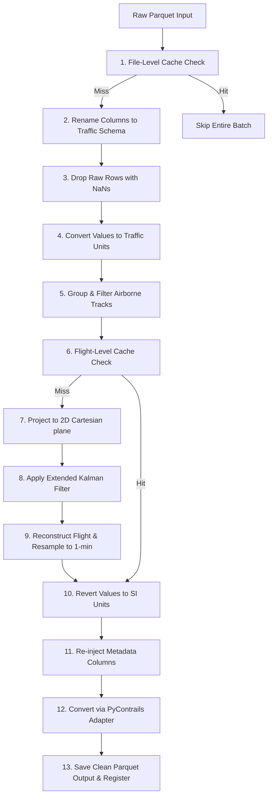

# Trajectory Processing & EKF Smoothing Module

This module represents the second step in the Flight Physics Pipeline. It is responsible for mathematically smoothing the raw ADS-B trajectories downloaded from OpenSky, dropping ground-level noise, applying an Extended Kalman Filter (EKF), and resampling coordinates to a 1-minute frequency optimal for PyContrails.

## 1. Module Structure

```text
src/processing/
├── README.md                      # This primary documentation
├── kalman_filter.py               # EKF filtering & resampling engine
└── TRAFFIC_LIBRARY_EKF_ANALYSIS.md # Advanced EKF mathematical reference
```

---

## 2. Step-by-Step Data Workflow

The pipeline processes trajectories through file-level and flight-level caching layers before performing Cartesian projection and EKF smoothing:



### Detailed Execution Phase
1. **File-Level Pre-check:** Checks if the target clean output parquet file (e.g., `LEPA-LEBL_ab1081_clean_si.parquet`) already exists on disk. If yes, EKF is skipped for the whole batch.
2. **Read Raw Data:** The raw Parquet file is read into a pandas DataFrame.
3. **Schema Alignment:** Columns are renamed to conform to the `traffic` library's expected terminology (e.g., `'velocity'` $\to$ `'groundspeed'`, `'baroaltitude'` $\to$ `'altitude'`).
4. **NaN Pruning:** Rows containing `NaN` in key variables (`timestamp`, `latitude`, `longitude`, `track`, `groundspeed`, `vertical_rate`, `altitude`, `onground`) are dropped using `dropna`.
5. **Unit Conversion (Initial):** Variables are converted from metric/SI units to standard aviation units (meters $\to$ feet, m/s $\to$ knots, m/s $\to$ feet/minute) required by the EKF math.
6. **Traffic Object Instantiation:** The DataFrame is wrapped in a `traffic.core.Traffic` collection.
7. **Airborne Segmentation & Cache Checking:** For each flight, the airborne portion is extracted. Tracks with fewer than 10 points are discarded. Before processing, the script checks if the specific `flight_id` is already registered in `global_clean_registry.parquet`.
    * **Cache Hit:** Loads the cleaned flight waypoints directly from the existing clean parquet, bypasses the spatial projection, EKF, and resampling steps, and proceeds directly to unit reversion (Step 11).
    * **Cache Miss:** Proceeds to EKF smoothing (Step 8).
8. **Spatial Projection:** The flight is projected into a 2D Cartesian plane using a Lambert Azimuthal Equal Area (`laea`) projection centered dynamically at the mean latitude/longitude of the flight, adding columns `x` and `y` to allow standard Cartesian distance calculations.
9. **EKF Application:** The Extended Kalman Filter is invoked via `ekf.apply()` on the flight's coordinates using Rauch-Tung-Striebel (RTS) backward pass smoothing.
10. **Resampling:** The smoothed data is wrapped in a `Flight` object and resampled to a regular 1-minute frequency.
11. **Unit Reversion (Final):** Numeric columns are converted back from aviation units to SI units.
12. **Metadata Re-injection:** Key metadata fields (e.g., `icao24`, `callsign`, `typecode`, `flight_id`) are copied from the original flight data.
13. **PyContrails Adaptation:** The DataFrame is converted into a `pycontrails.Flight` object using `dataframe_to_pycontrails()`.
14. **Export & Register:** Cleaned flights are compiled, exported as a Parquet file, and registered in `global_clean_registry.parquet`.

---

## 3. Data Structure Interactions

The processing module translates trajectories between three distinct data structures to bridge raw ADS-B data, traffic modeling libraries, and physical simulation engines:

| Stage | Data Structure | Class/Type | Key Responsibility |
| :--- | :--- | :--- | :--- |
| **Ingestion / Unit Conversion** | Pandas DataFrame | `pd.DataFrame` | Initial column mapping, unit conversion, and basic data pruning. |
| **EKF & Resampling** | Traffic / Flight Objects | `traffic.core.Traffic`, `traffic.core.Flight` | Trajectory manipulation: airborne filtering, spatial coordinate projection, EKF smoothing, and frequency resampling. |
| **Adapter / Downstream Simulation** | PyContrails Flight | `pycontrails.Flight` | Conforming to the schema required by the physical contrail models (e.g., CoCiP). |

---

## 4. EKF Column & Unit Mappings

During the transition between stages, units and column names shift according to the requirements of the processing algorithms:

| Raw Parquet Column | Traffic Schema (Input to EKF) | EKF State Variable (SI) | EKF Output (Aviation) | PyContrails Schema |
| :--- | :--- | :--- | :--- | :--- |
| `time` | `timestamp` | Index (DatetimeIndex) | Index (DatetimeIndex) | `time` |
| `lat` / `lon` | `latitude` / `longitude` | *Not in state (kept in data)* | *Not in postprocess (kept)* | `latitude` / `longitude` |
| `baroaltitude` | `altitude` (feet) | `alt_baro` (meters) | `altitude` (feet) | `altitude` (meters) |
| `velocity` | `groundspeed` (knots) | `velocity` (m/s) | `groundspeed` (knots) | `gs` (m/s) |
| `heading` | `track` (degrees) | `math_angle` (radians) | `track` (degrees) | `heading` (degrees) |
| `vertrate` | `vertical_rate` (ft/min) | `vert_rate` (m/s) | `vertical_rate` (ft/min) | `rocd` (m/s) |

### Explaining `x`, `y`, and `track_unwrapped` Columns
During the EKF post-processing workflow:
- **`x` and `y`** (`float64`): Standard geographic coordinates (`latitude` / `longitude`) are projected onto a 2D Cartesian plane using a Lambert Azimuthal Equal Area projection (`laea`) centered dynamically at the mean latitude/longitude of the flight. This allows the kinematic equations inside the Extended Kalman Filter (EKF) to work with flat Cartesian distances and speeds in meters/seconds, minimizing distortion.
- **`track_unwrapped`** (`float64`): Standard heading values range between 0 and 360 degrees. If an aircraft flies close to North (crossing 359° to 0°), the EKF's state estimation will see a massive discontinuity. Unwrapping standardizes this track by making the angles continuous (e.g. crossing to 361° instead of resetting to 1°), which prevents the Kalman filter from breaking.

**Filtering**: The shared adapter in `src/common/adapters.py` automatically prunes the EKF's mathematical columns (`x`, `y`, `track_unwrapped`) before instantiating the final `pycontrails.Flight` objects, returning a clean dataframe conforming strictly to the physical variables expected by downstream physics simulations.

---

## 5. Caching & Pre-Execution Checks

To prevent redundant EKF calculations and minimize write operations, the trajectory processing module implements file-level and flight-level cache checks:

1. **Pre-Execution File Check**:
   * When `kalman_filter.py` runs (in either single-file or directory mode), it resolves the target path for the output `*_clean_si.parquet` file.
   * If that file already exists on disk, EKF smoothing is bypassed entirely for that batch, printing: `Clean file already exists: <path>. Skipping.`

2. **Flight-Level Cache Check (Inside the Processing Loop)**:
   * For each flight in the raw dataset, the loop checks the clean manifest (`global_clean_registry.parquet`) for a matching `flight_id`.
   * If a cache hit occurs and the clean file exists on disk, the cleaned waypoints are loaded directly from the cache, completely bypassing EKF smoothing for that flight.
   * If it is a cache miss, the flight is processed normally (Cartesian projection, EKF smoothing, and resampling).

3. **Manifest Registry Registration**:
   * Upon successfully smoothing a batch of trajectories, the EKF engine extracts all unique `flight_id`s from the output dataset.
   * It registers these identifiers along with their relative file path in the central manifest database at `data/flight_registry/global_clean_registry.parquet` using the `update_global_registry()` helper.
   * This central index allows downstream physics simulations to verify in-memory if a cleaned flight path is available for modeling.

---

## 6. CLI Usage Guide

### `kalman_filter.py` (EKF Engine)
Runs the airborne, EKF, and unit conversion logic on a raw trajectory file or a directory of files.

```bash
# 1. Smooth a single raw trajectory file (automatically saves to sibling 'clean/' if parent is 'raw/')
python -m src.processing.kalman_filter --input-file "data/trajectories/ranks_1-5_sample_10_seed_42_01_0430fb/raw/LEPA-LEBL_c53b3a_raw.parquet"

# 2. Batch smooth an entire directory of raw trajectories (skips files if clean outputs already exist)
python -m src.processing.kalman_filter --input-file "data\trajectories\ranks_1-76-177-205-209-278-288-321-411-508-509-592-633-710-712-727-761-792-848-888-926_strat_fixed_val_50.0_seed_42_format_roundtrip_97df21\raw"
```

**Parameters**:
- `--input-file`: Path to the input raw trajectory parquet file OR a directory containing multiple raw parquet files.
- `--out-dir`: Directory where the clean output Parquet file(s) will be written (defaults to a sibling `clean/` folder if parent is `raw/`, otherwise parent directory). If batch processing a directory, it checks for existing files in the resolved clean directory to skip reprocessing them.

---

## 7. Appendix: History of the Index Mismatch Bug (Resolved)

The diagnostic analysis during the V3 pipeline refactoring identified a critical index alignment mismatch inside the EKF post-processing module of the `traffic` library that previously caused 100% of the smoothed EKF columns to be overwritten with `NaN` values:

```
=====================================================================================
 f_projected.data index: RangeIndex (0, 1, 2, ..., N)
 measurements index:     DatetimeIndex (2025-10-31 09:19:00, ...)
=====================================================================================
                                 |
                                 v  [ekf.apply()]
                      data.assign(**postprocess(filtered_states))
                                 |
                                 v  [Pandas Alignment Mismatch]
  Wiped to 100% NaN: 'altitude', 'track', 'groundspeed', 'vertical_rate', 'x', 'y'
  Untouched & Valid: 'latitude', 'longitude', 'geoaltitude', 'timestamp'
=====================================================================================
```

### Root Cause
1. In `kalman_filter.py`, the `Traffic` and `Flight` constructors reset the DataFrame index of the flight trajectory to a standard **`RangeIndex`** (0, 1, 2, ..., N).
2. During `ekf.apply(f_projected.data)` execution, the internal `preprocess()` method sets the index to the `timestamp` column, creating a **`DatetimeIndex`**.
3. After smoothing, `postprocess()` returns the smoothed variables as Series with this `DatetimeIndex`.
4. The `traffic` library merges these Series using `.assign()`:
   ```python
   return data.assign(**self.postprocess(filtered_states))
   ```
5. Because `data` (RangeIndex) and EKF outputs (DatetimeIndex) have non-overlapping indices, pandas fails to align the rows and fills the entire columns (`altitude`, `groundspeed`, `track`, `vertical_rate`, `x`, `y`) with `NaN`.

### Resolution
The EKF engine in `kalman_filter.py` was updated to explicitly reset the index of the EKF outputs back to a `RangeIndex` using `.reset_index(drop=True)` before mapping coordinates and unit conversions, ensuring clean row alignment. Additionally, we clear pandas custom attributes (`df.attrs = {}`) before exporting to Parquet to prevent PyArrow serialization crashes.
