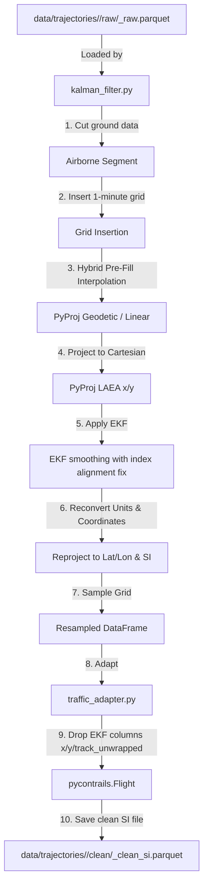

# Trajectory Processing & EKF Smoothing Module

This module represents the second step in the Flight Physics Pipeline. It is responsible for mathematically smoothing the raw ADS-B trajectories downloaded from OpenSky, dropping ground-level noise, applying an Extended Kalman Filter (EKF), and resampling coordinates to a 1-minute frequency optimal for PyContrails.

## Module Structure

```
src/processing/
├── README.md                      # This documentation file
├── kalman_filter.py               # EKF filtering & resampling engine
├── traffic_adapter.py             # Converts traffic flights to pycontrails.Flight
└── TRAFFIC_LIBRARY_EKF_ANALYSIS.md # Detailed mathematical review of EKF filters
```

---

## Function Analysis Solution Tree (FAST)

```
Module Objectives
 └── Cut ground points, insert 1-minute grid, project coordinates via PyProj, apply kinematic EKF smoothing, and prepare PyContrails objects
      ├── Sub-objective: Handle EKF smoothing and grid interpolation on airborne segments
      │    └── Solution: clean_trajectories() in kalman_filter.py
      │         ├── Inputs:
      │         │    ├── input_file (str): Path to raw trajectories Parquet
      │         │    └── out_dir (str): Directory where cleaned Parquet is saved
      │         ├── Outputs: Cleaned trajectory Parquet named '<route>_<hash>_clean_si.parquet'
      │         └── Role: Inserts grid, pre-fills with hybrid linear/geodesic logic, projects via pyproj, runs EKF (with alignment fix), and samples
      │
      ├── Sub-objective: Adapt pandas DataFrames into pycontrails.Flight objects
      │    └── Solution: dataframe_to_pycontrails() in traffic_adapter.py
      │         ├── Inputs:
      │         │    ├── df_flight (pd.DataFrame): Cleaned single flight coordinates
      │         │    └── typecode (str): Aircraft designator (e.g. B777)
      │         ├── Outputs: pycontrails.Flight object
      │         └── Role: Renames columns to pycontrails schema, sets attributes, resolves true_airspeed fallback, and drops EKF coordinates (x, y, track_unwrapped)
      │
      └── Sub-objective: Load grouped flights from a multi-flight Parquet file
           └── Solution: extract_flights_from_parquet() in traffic_adapter.py
                ├── Inputs: parquet_path (str)
                ├── Outputs: dict mapping flight_id -> pd.DataFrame
                └── Role: Groups flights in a clean parquet by flight_id for downstream physics simulation
```

---

## Data Workflow

> [!NOTE]
> **Mermaid Render Support**: The workflow diagram below uses Mermaid syntax. If you are viewing this markdown file in VS Code and it does not render visually, you will need to install a Mermaid preview extension, such as **Markdown Preview Mermaid Support** (by Matt Bierner) or view it in an environment that supports it natively (like GitHub or Obsidian).



### Explaining `x`, `y`, and `track_unwrapped` Columns
During the post-processing workflow:
- **`x` and `y`** (`float64`): Standard geographic coordinates (`latitude` / `longitude`) are projected onto a 2D Cartesian plane using a Lambert Azimuthal Equal Area projection (`laea`) centered dynamically at the mean latitude/longitude of the flight. This allows the kinematic equations inside the Extended Kalman Filter (EKF) to work with flat Cartesian distances and speeds in meters/seconds, minimizing distortion.
- **`track_unwrapped`** (`float64`): Standard heading values range between 0 and 360 degrees. If an aircraft flies close to North (crossing 359° to 0°), the EKF's state estimation will see a massive discontinuity. Unwrapping standardizes this track by making the angles continuous (e.g. crossing to 361° instead of resetting to 1°), which prevents the Kalman filter from breaking.

**Filtering**: The `traffic_adapter.py` utility automatically prunes the EKF's mathematical columns (`x`, `y`, `track_unwrapped`) before instantiating the final `pycontrails.Flight` objects, returning a clean dataframe conforming strictly to the physical variables expected by downstream physics simulations.

---

## CLI Guide

### `kalman_filter.py` (EKF Engine)
Runs the airborne, EKF, and unit conversion logic on a raw trajectory file or a directory of files.

```bash
# 1. Smooth a single raw trajectory file (automatically saves to sibling 'clean/' if parent is 'raw/')
python -m src.processing.kalman_filter --input-file "data/trajectories/ranks_1-5_sample_10_seed_42_01_0430fb/raw/LEPA-LEBL_c53b3a_raw.parquet"

# 2. Batch smooth an entire directory of raw trajectories (skips files if clean outputs already exist)
python -m src.processing.kalman_filter --input-file "data\trajectories\ranks_1-76-177-205-209-278-288-321-411-508-509-592-633-710-712-727-761-792-848-888-926_strat_fixed_val_50.0_seed_42_format_roundtrip_97df21\raw"
```


**Parameters**:
- `--input-file`: Path to the input raw trajectory parquet file OR a directory containing multiple raw parquet files.
- `--out-dir`: Directory where the clean output Parquet file(s) will be written (defaults to a sibling `clean/` folder if parent is `raw/`, otherwise parent directory). If batch processing a directory, it checks for existing files in the resolved clean directory to skip reprocessing them.

---

## Caching & Pre-Execution Checks

To prevent redundant EKF calculations and minimize write operations, the trajectory processing module implements file-level cache hit detection:

1. **Pre-Execution File Check**:
   * When `kalman_filter.py` runs (in either single-file or directory mode), it resolves the target path for the output `*_clean_si.parquet` file.
   * If that file already exists on disk, EKF smoothing is bypassed entirely for that batch, printing: `Clean file already exists: <path>. Skipping.`

2. **Manifest Registry Registration**:
   * Upon successfully smoothing a batch of trajectories, the EKF engine extracts all unique `flight_id`s from the output dataset.
   * It registers these identifiers along with their relative file path in the central manifest database at `data/flight_registry/global_clean_registry.parquet` using the `update_global_registry()` helper.
   * This central index allows downstream physics simulations to verify in-memory if a cleaned flight path is available for modeling.
