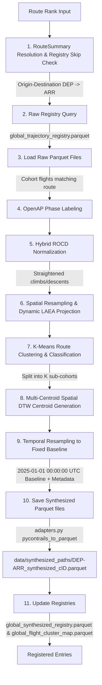

# Flight Trajectory Synthesis Module

This module represents the trajectory synthesis step in the Flight Physics Pipeline. It aggregates a cohort of raw OpenSky trajectories for a specific route rank into a single idealized, typical, and noise-filtered "synthesized" trajectory mapped onto a uniform temporal grid starting at a fixed baseline datetime.

---

## 1. Module Structure

```text
src/synthesis/
├── README.md                  # This documentation file
├── path_generator.py          # Synthesized trajectory generator engine (refactored)
└── synthesis_orchestrator.py  # Batch synthesis orchestrator with skip capability
```

---

## 2. Function Analysis Solution Tree (FAST)

```text
Module Objectives
 └── Synthesize a representative 4D trajectory from a local cohort of historical flights
      │
      ├── Sub-objective 1: Local Cohort Resolution & Iterative Adapter Ingestion
      │    └── Solution: Query registries, load files sequentially using adapters, and filter to airborne phases
      │         ├── load_route_summary() -> Resolve departure and arrival using CLI `--rank`.
      │         ├── pd.read_parquet() -> Fetch raw cohort filepaths from global_trajectory_registry.parquet.
      │         └── For each filepath:
      │              ├── parquet_to_pycontrails(path) -> Load and normalize raw OpenSky schemas.
      │              ├── pycontrails_to_traffic(pyc_flight) -> Convert to traffic.core.Flight (scaled to aviation units).
      │              └── trf_flight.airborne() -> Strip ground-borne taxi/takeoff/landing segments.
      │
      ├── Sub-objective 2: Hybrid Climb/Descent Normalization (Holding Pattern Correction)
      │    └── Solution: Use OpenAP to locate TOC/TOD, identify holding-pattern outliers, and correct them using cohort median ROCDs
      │         ├── Phase Classification: Run `openap.phase.FlightPhase` on each flight to locate TOC and TOD.
      │         ├── Kinematic Metrics: Calculate average climb ROCD (takeoff to TOC) and descent ROCD (TOD to landing).
      │         ├── Clustering: Group flights into clean flights and holding-pattern outliers (e.g. descent ROCD < 1200 ft/min).
      │         ├── Median Derivation: Compute median climb/descent ROCD of clean flights.
      │         └── Segment Correction: For holding-pattern flights, replace climb/descent with linear paths scaled to the median clean ROCD duration, preserving original cruise tracks.
      │
      ├── Sub-objective 3: Geospatial Projection & Dynamic Spatial Standardization
      │    └── Solution: Project and resample all normalized cohort flights onto oversampled spatial checkpoints
      │         ├── Project: Convert WGS84 coordinates to local LAEA projection centered at cohort mean lat/lon.
      │         ├── Calculate Duration: Determine max_duration_seconds across normalized cohort.
      │         ├── Spacing: Calculate min_sample_spacing_seconds = max(grid_seconds / 10.0, 1.0).
      │         └── Resample: Traffic.resample(nb_samples = max_duration_seconds / min_sample_spacing_seconds)
      │
      ├── Sub-objective 3.5: [NEW] Route Sameness Classification & Clustering
      │    └── Solution: Flatten spatial checkpoints and evaluate multi-track signatures using K-Means
      │         ├── Resample Features: Resample each flight to 100 points to extract 100 lats/lons (200-dim feature vector).
      │         ├── Cluster Search: Run KMeans for k=2, 3, 4 and calculate Silhouette scores.
      │         ├── Classify: Assign Class 1 (Single), 2 (Binary Split), 3 (Multi-Track), or 4 (Chaos, if variance > 200.0).
      │         └── Split: Group the cohort flights into k sub-cohorts based on optimal cluster labels.
      │
      ├── Sub-objective 4: [MODIFIED] Spatial Track Centroid Generation
      │    └── Solution: Extract median spatial tracks using traffic's DTW centroid method per sub-cohort
      │         └── Loop: For each of the k sub-cohorts, calculate Traffic.centroid()
      │
      ├── Sub-objective 5: Kinematic Validation & Temporal Gridding (APPLIED TO ALL K)
      │    └── Solution: Snap the centroid back to a uniform temporal grid using pycontrails
      │         ├── pycontrails.Flight(centroid_df) -> Ingest back to PyContrails (converting back to SI units, stamping route_class and cluster_id).
      │         └── Flight.resample_and_fill(freq=f"{grid_seconds}s") -> Snap to uniform CLI temporal grid.
      │
      └── Sub-objective 6: [MODIFIED] Timeline Normalization & File Output Updates
           └── Solution: Write multiple outputs if k > 1 and update metadata registries
                ├── Shift: Shift timeline to project baseline (2025-01-01 00:00:00 UTC).
                ├── Serialize: Save as DEP-ARR_synthesized_c{cluster_id}.parquet.
                ├── Register: Append route, rank, filepath, route_class, and cluster_id to global_synthesized_registry.parquet.
                └── Map: Save raw flight ID mappings inside global_flight_cluster_map.parquet.
```

---

## 3. Data Workflow



1.  **Route Rank Resolution & Skip Check**: The input `--rank` is resolved to a specific departure and arrival airport (e.g. `LGAV` and `LCLK`). The orchestrator queries `global_synthesized_registry.parquet` to check if this rank's synthesis was already completed.
2.  **Registry Query**: The script queries `global_trajectory_registry.parquet` directly to locate all raw Parquet files containing flights matching the route pattern (e.g. `_LGAV-LCLK_`).
3.  **Phase Identification & ROCD Calculation**: For each flight in the cohort, `openap.phase.FlightPhase` classifies waypoints and locates the Top of Climb (TOC) and Top of Descent (TOD). The average climb and descent rates of climb/descent (ROCD) are computed.
4.  **Holding Pattern Correction**: Flights are classified into clean baseline flights and holding-pattern outliers (e.g. descent ROCD $< 1200$ ft/min). For outliers, their climb/descent segments are replaced with direct 3D lines scaled to the median clean ROCD duration, removing circles, loops, and delay times while maintaining realistic ground speeds.
5.  **Spatial Standardization**: Trajectories are projected to a dynamic local Lambert Azimuthal Equal Area (`laea`) coordinate plane centered at the cohort's average coordinates. Flights are resampled to a dense set of spatial checkpoints (with spacing at `1/10` of the grid resolution).
6.  **K-Means Route Clustering & Classification**:
    * Resamples trajectories specifically to 100 checkpoints to build a 200-dimensional coordinate feature vector.
    * Runs K-Means for $k \in [2, 4]$ and calculates Silhouette scores.
    * Configures `route_class` based on best clustering score: `Class 1` (Single Track), `Class 2` (Binary Split), `Class 3` (Multi-Track), or `Class 4` (Chaos if variance is high but clustering score is low).
7.  **Multi-Centroid DTW Centroid Generation**: Loops over the identified clusters and computes a spatial track centroid using Dynamic Time Warping (DTW) for each sub-cohort independently.
8.  **Baseline Temporal Resampling**: Snaps each centroid to SI units, stamps `route_class` and `cluster_id` columns, and temporal-interpolates to a uniform grid (default 60s) starting at `2025-01-01 00:00:00 UTC`.
9.  **Serialization & Registration**:
    * Saves each track to `<DEP-ARR>_synthesized_c{cluster_id}.parquet`.
    * Updates `global_synthesized_registry.parquet` with the new route files, class, and cluster ID.
    * Updates `global_flight_cluster_map.parquet` mapping flight IDs to their cluster assignments.

---

## 4. CLI Usage Guide

### Bash
```bash
python -m src.synthesis.path_generator \
    --rank 76 \
    --grid-seconds 60
```

### PowerShell
```powershell
python -m src.synthesis.path_generator `
    --rank 76 `
    --grid-seconds 60
```

**Parameters**:
*   `--rank` (Required): The route rank in `master_flights_RouteSummary.pkl` to process.
*   `--out-dir` (Optional): Directory where the synthesized Parquet file is saved (defaults to `data/synthesized_paths/`).
*   `--grid-seconds` (Optional): The resampling temporal grid resolution in seconds (default: `60`).

### 2. `synthesis_orchestrator.py` (Batch Synthesis Orchestrator)
Orchestrates synthesized trajectory generation across multiple ranks (list or range), with built-in skip checks.

#### Bash
```bash
# 1. Generate synthesized trajectories for a list of ranks (skips existing by default)
python -m src.synthesis.synthesis_orchestrator --ranks "1,76,177"

# 2. Generate synthesized trajectories for a range of ranks, forcing overwrite
python -m src.synthesis.synthesis_orchestrator --lower-rank 1 --upper-rank 5 --overwrite
```

#### PowerShell
```powershell
# 1. Generate synthesized trajectories for a list of ranks (skips existing by default)
python -m src.synthesis.synthesis_orchestrator --ranks "1,76,177"

# 2. Generate synthesized trajectories for a range of ranks, forcing overwrite
python -m src.synthesis.synthesis_orchestrator --lower-rank 1 --upper-rank 5 --overwrite
```

**Parameters**:
*   `--ranks`: Comma-separated list of route ranks to process.
*   `--lower-rank` & `--upper-rank`: Corridor bounds of ranks to process.
*   `--out-dir` (Optional): Output directory for synthesized trajectories (default: `data/synthesized_paths/`).
*   `--grid-seconds` (Optional): Time grid resolution in seconds (default: `60`).
*   `--overwrite`: If set, deletes existing synthesized parquets and forces recalculation.

---

## 5. Prerequisites & Dependencies

### Python Libraries
*   `pandas` & `pyarrow` (for Parquet I/O operations)
*   `numpy` & `scipy` (for arrays and interpolation)
*   `pyproj` (for dynamic localized projection transformations)
*   `scikit-learn` (for K-Means clustering and Silhouette analysis)
*   `traffic` (for spatial resampling, airborne filtering, and DTW track centroids)
*   `openap` (for fuzzy logic flight phase labeling and TOC/TOD detection)
*   `pycontrails` (for Flight container structures and temporal interpolation engines)

### Input Files
*   `data/flight_registry/master_flights_RouteSummary.pkl` (for decoding route ranks)
*   `data/flight_registry/global_trajectory_registry.parquet` (for identifying raw source trajectories)

### Central Standards & References
*   For naming conventions, schemas, and unit systems (SI vs Aviation), refer directly to the centralized **[conventions.md](file:///g:/Meine%20Ablage/UNI/SS26/PythonPipeline%20-%20Kopie/src/conventions.md)** standards.
