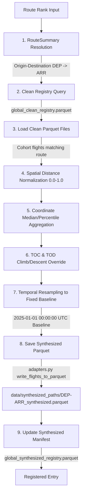

# Flight Trajectory Synthesis Module

This module represents the trajectory synthesis step in the Flight Physics Pipeline. It aggregates a cohort of cleaned EKF trajectories for a specific route rank into a single idealized, typical, and noise-filtered "synthesized" trajectory mapped onto a uniform temporal grid starting at a fixed baseline datetime.

---

## 1. Module Structure

```text
src/synthesis/
├── README.md                  # This documentation file
└── path_generator.py          # Synthesized trajectory generator engine
```

---

## 2. Function Analysis Solution Tree (FAST)

```text
Module Objectives
 └── Synthesize a representative trajectory for a route based on clean cohort flights
      ├── Sub-objective: Create synthesized flight coordinates and times
      │    └── Solution: create_synthesized_trajectory() in path_generator.py
      │         ├── Inputs:
      │         │    ├── rank (int): Route rank from RouteSummary
      │         │    ├── output_parquet (str): Path to write the output parquet
      │         │    └── time_grid_seconds (int): Resampling temporal resolution in seconds (default: 60)
      │         └── Outputs: Path to the generated parquet file or None
      │
      └── Sub-objective: Register the generated path in the central index
           └── Solution: update_synthesized_registry() in path_generator.py
                ├── Inputs:
                │    ├── registry_file (Path): Path to global_synthesized_registry.parquet
                │    ├── route (str): Route name (DEP-ARR)
                │    ├── rank (int): Route rank
                │    └── file_path (str): Relative path to the generated parquet file
                └── Outputs: None
```

---

## 3. Data Workflow

> [!NOTE]
> **Mermaid Render Support**: The workflow diagram below uses Mermaid syntax. If you are viewing this markdown file in VS Code and it does not render visually, you will need to install a Mermaid preview extension, such as **Markdown Preview Mermaid Support** (by Matt Bierner).



1.  **Route Rank Resolution**: The input `--rank` is resolved to a specific departure and arrival airport (e.g. `LGAV` and `LCLK`) using the `master_flights_RouteSummary.pkl`.
2.  **Registry Query**: The script queries `global_clean_registry.parquet` to locate all cleaned Parquet files containing flights matching the route pattern (e.g. `_LGAV-LCLK_`).
3.  **Spatial Standardization**: For each flight in the cohort, the cumulative distance is calculated and normalized from `0.0` (Departure) to `1.0` (Arrival) across 1,000 spatial checkpoints. Coordinates (`latitude`, `longitude`, `altitude`) and elapsed time are linearly interpolated onto this grid.
4.  **Aggregation & Noise Filtering**: 
    *   `latitude` & `longitude` use the median value to filter out weather deviations and runway alignment noise.
    *   `altitude` uses the 75th percentile to favor high-altitude contrail cruise levels.
5.  **Climb & Descent Linearization**: Coordinates between departure and Top of Climb (TOC) and coordinates after Top of Descent (TOD) are overwritten with straight 3D lines (`np.linspace`) to provide a clean average climb/descent baseline.
6.  **Baseline Temporal Resampling**: The spatial trajectory is resampled onto a uniform temporal grid (e.g. 60s steps) starting at a fixed baseline datetime (**`2025-01-01 00:00:00 UTC`**). This baseline is used by downstream scripts to shift time coordinates to match any target flight's actual departure time.
7.  **Export and Registration**: The final trajectory is converted to a `pycontrails.Flight` object, saved to `data/synthesized_paths/`, and registered in `global_synthesized_registry.parquet`.

---

## 4. CLI Usage Guide

### Bash
```bash
python -m src.synthesis.path_generator \
    --rank 76 \
    --grid-seconds 60
```

### PowerShell
```powershell
python -m src.synthesis.path_generator `
    --rank 76 `
    --grid-seconds 60
```

**Parameters**:
*   `--rank` (Required): The route rank in `master_flights_RouteSummary.pkl` to process.
*   `--out-dir` (Optional): Directory where the synthesized Parquet file is saved (defaults to `data/synthesized_paths/`).
*   `--grid-seconds` (Optional): The resampling temporal grid resolution in seconds (default: `60`).

---

## 5. Prerequisites & Dependencies

### Python Libraries
*   `pandas` & `pyarrow` (for Parquet I/O operations)
*   `numpy` & `scipy` (for linear interpolation and arrays)
*   `pycontrails` (for Flight structures)

### Input Files
*   `data/flight_registry/master_flights_RouteSummary.pkl` (for decoding route ranks)
*   `data/flight_registry/global_clean_registry.parquet` (for identifying cleaned source trajectories)

### Central Standards & References
*   For naming conventions, schemas, and unit systems (SI vs Aviation), refer directly to the centralized **[conventions.md](file:///g:/Meine%20Ablage/UNI/SS26/PythonPipeline%20-%20Kopie/src/conventions.md)** standards.
