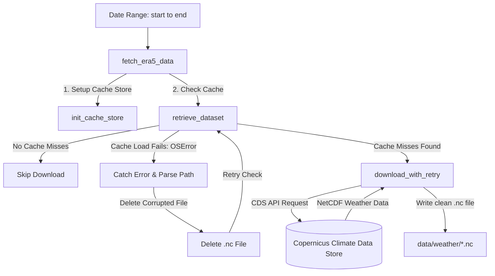

# ERA5 Weather Acquisition Module

This module is responsible for the independent, bulk acquisition of atmospheric reanalysis data required for contrail and aircraft performance modeling.

It operates as **Loop 3a** of the Flight Physics Pipeline. It is decoupled from flight trajectories, allowing you to run bulk weather downloads in parallel to populate a centralized cache that the physics simulation engine (**Loop 3b**) consumes with zero runtime API latency.

---

## 1. Module Structure

```text
src/weather/
├── Weather Module README.md # This documentation file
└── era5_manager.py          # Standalone modular weather downloader
```

---

## 2. Function Analysis Solution Tree (FAST)

```text
Module Objectives
 └── Resiliently download and cache global reanalysis weather data (Loop 3a)
      │
      ├── Sub-objective 1: Initialize local disk cache storage
      │    └── Solution: init_cache_store() in era5_manager.py
      │         ├── Inputs: cache_dir (str)
      │         └── Outputs: DiskCacheStore
      │
      ├── Sub-objective 2: Resiliently download CDS datasets with retry backoff
      │    └── Solution: download_with_retry() in era5_manager.py
      │         ├── Inputs: era5_client (ERA5), max_retries (int)
      │         └── Role: Safely wraps client.download() in a retry loop to handle CDS API drops
      │
      ├── Sub-objective 3: Retrieve reanalysis parameters & reactively self-heal cache
      │    └── Solution: retrieve_dataset() in era5_manager.py
      │         ├── Inputs: time_bounds (tuple), variables (list), pressure_levels (list|int), cache_store (DiskCacheStore)
      │         └── Role: Manages cache checking; catches OSError from corrupt files, deletes them, and retries the check
      │
      └── Sub-objective 4: Orchestrate multi-dataset weather downloading
           └── Solution: fetch_era5_data() in era5_manager.py
                ├── Inputs: start (str), end (str), cache_dir (str)
                └── Role: Coordinates storage initialization and sequence retrieval for 3D levels and 2D surface
```

---

## 3. Data Workflow

> [!NOTE]
> **Mermaid Render Support**: The workflow diagram below uses Mermaid syntax. If you are viewing this markdown file in VS Code and it does not render visually, you will need to install a Mermaid preview extension, such as **Markdown Preview Mermaid Support** (by Matt Bierner) or view it in an environment that supports it natively (like GitHub or Obsidian).



1. **Initialization**: The manager initializes the pycontrails `DiskCacheStore` pointing to `data/weather/` and creates the directory if it does not exist.
2. **Reactive Cache Checking**: The script queries the cache using the Pycontrails `list_timesteps_not_cached()` method.
   - **Normal execution**: Checks file availability on disk. If all files exist and are valid, it completes immediately.
   - **Self-Healing on Corruption**: If `list_timesteps_not_cached()` hits a corrupted NetCDF file, it raises an `OSError`. The script intercepts this exception, parses the file path from the error details using a regular expression, deletes the corrupted file, and retries checking the cache.
3. **Resilient Download**: For any missing hours in the date range, the script requests the weather data from the Copernicus Climate Data Store (CDS). It executes the request through a retry loop to protect against timeouts and queue limits.
4. **Simulation Consumption**: The physics engine (`simulation.py`) loads the downloaded NetCDF files directly from the local cache folder, bypassing the CDS API entirely at simulation runtime.

---

## 4. CLI Usage Guide

### Bash
```bash
# Fetch weather data for a date range (skips already cached hours)
python -m src.weather.era5_manager \
    --start "2025-11-01" \
    --end "2025-12-31"

# Fetch weather data with verbose debugging output
python -m src.weather.era5_manager \
    --start "2025-11-01T00:00:00" \
    --end "2025-11-01T06:00:00" \
    --debug
```

### PowerShell
```powershell
# Fetch weather data for a date range (skips already cached hours)
python -m src.weather.era5_manager `
    --start "2025-11-01" `
    --end "2025-12-31"

# Fetch weather data with verbose debugging output
python -m src.weather.era5_manager `
    --start "2025-11-01T00:00:00" `
    --end "2025-11-01T06:00:00" `
    --debug
```

**Parameters**:
* `--start` / `--end`: ISO timestamps (`YYYY-MM-DD` or `YYYY-MM-DDTHH:MM:SS`).
* `--out-dir`: The target folder to store NetCDF cache files (defaults to `data/weather/`).
* `--debug`: Enables verbose output for tracing cache checks and downloader status.

---

## 5. Prerequisites & Dependencies

### Python Libraries
Ensure `pycontrails` is installed with ECMWF backend extras:
```bash
pip install "pycontrails[ecmwf]"
```

### CDS API Access Setup
The downloader requires access to the ECMWF Copernicus Climate Data Store (CDS). You can configure your credentials in one of two ways:

#### Option A: Configuration File (Recommended)
Create a file named `.cdsapirc` in your home directory (e.g., `C:\Users\YourUsername\.cdsapirc`):
```text
url: https://cds.climate.copernicus.eu/api/v2
key: YOUR_CDS_API_KEY
```

#### Option B: Environment Variables
Define the credentials as system environment variables:
```powershell
$env:CDSAPI_URL="https://cds.climate.copernicus.eu/api/v2"
$env:CDSAPI_KEY="YOUR_CDS_API_KEY"
```

For naming standards and coordinate reference systems, refer to the centralized **[conventions.md](file:///g:/Meine%20Ablage/UNI/SS26/PythonPipeline%20-%20Kopie/src/conventions.md)** standards.